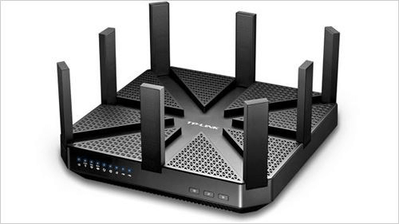

# Millimeter-Wave Communication

With the rapid development of the Internet of Things (IoT), limited spectrum resources are fiercely contested by numerous emerging wireless access technologies, resulting in severe spectrum congestion. The wireless access technologies introduced in previous chapters mostly operate in the two license-free ISM bands—2.4 GHz and 5 GHz—leading to intense competition for scarce spectral resources. In this context, attention has shifted toward higher-frequency carrier bands: the millimeter-wave (mmWave) spectrum. Millimeter waves refer to electromagnetic waves with wavelengths on the order of millimeters—for example, waves with frequencies ranging from above 30 GHz up to 300 GHz fall within the mmWave band. Utilizing mmWave frequencies opens up entirely new, previously untapped spectrum bands.

> What benefits does millimeter-wave communication offer?

Millimeter-wave communication offers numerous advantages.  
For instance, in most countries, the 60 GHz band is license-free; and the available bandwidth is exceptionally wide—up to 5–9 GHz—far exceeding the effective bandwidth of only several hundred MHz offered by technologies such as IEEE 802.11n.

Today, ever-increasing data transmission rates are an inevitable trend. 4K video (with an effective display resolution of 4096 × 3072) has already entered everyday life, and multi-gigabyte 4K video files are becoming increasingly common. Thanks to its significantly wider effective bandwidth, mmWave communication can readily achieve digital signal transmission rates exceeding 1 Gbit/s—giving it a distinct advantage for high-definition video delivery.

In 2006, the WirelessHD Consortium was founded by LG, Panasonic, NEC, Samsung Electronics, Sony, and Toshiba to develop a wireless digital high-definition transmission technology intended to replace HDMI. In 2008, the consortium introduced the WirelessHD standard (also known as UltraGig), a high-speed video transmission technology based on mmWave communication.

In 2007, the WiGig (Wireless Gigabit) Alliance—comprising 15 companies including Intel, Broadcom, Atheros, and Microsoft—began developing mmWave communication technologies.  
In 2009, the IEEE 802.11ad standard—proposed jointly by members of the WiGig Alliance—was officially published.  
IEEE 802.11ad is primarily designed for intra-home wireless transmission of high-definition audio and video signals, delivering a more comprehensive high-definition video solution for home multimedia applications.  
IEEE 802.11ad divides the 60 GHz band into four channels and employs OFDM modulation. Using various modulation schemes, it supports peak data rates up to 7 Gbps—more than ten times faster than IEEE 802.11n.

In 2010, the WiGig Alliance and the WiFi Alliance announced a collaboration to integrate mmWave communication technology with conventional WiFi. IEEE 802.11ad extends and complements the IEEE 802.11 Medium Access Control (MAC) layer, ensuring full backward compatibility with the IEEE 802.11 standard and seamless integration with existing WiFi networks. In March 2013, the WiGig Alliance was formally merged into the WiFi Alliance.

Advances in semiconductor manufacturing have dramatically reduced the cost of mmWave-frequency RF transceivers, making large-scale deployment of mmWave bands feasible. Today, mmWave communication technology has moved beyond the laboratory and entered one of the most competitive domains in the real electronics world—the digital home. Moreover, mmWave communication is widely regarded as one of the most promising technologies for future wireless communications.

# Advantages and Disadvantages of Millimeter-Wave Communication

Compared with many existing wireless communication technologies, mmWave communication has attracted intensive research due to its inherent advantages—advantages that have driven rapid progress in both mmWave technology and its practical applications.

- Abundant spectrum resources:  
Most low-frequency wireless spectrum bands are already heavily occupied—for example, the 2.4 GHz low-frequency ISM band is saturated with IEEE 802.11b/g, Bluetooth, microwave ovens, and other applications.  
In recent years, governments worldwide have allocated ISM bands near mmWave frequencies.  
For instance, China has designated the 59–64 GHz band as an ISM band; the United States and Japan have allocated the 57–64 GHz and 59.4–62.9 GHz bands, respectively; and Europe has allocated a 9 GHz ISM band spanning 57–66 GHz.  
By contrast, the widely deployed IEEE 802.11n standard offers only about 660 MHz of effective bandwidth—far less than the bandwidth available to mmWave wireless communication.  
As wireless spectrum becomes increasingly scarce, mmWave wireless communication can exploit spectrum bands far broader than those accessible to other wireless technologies.

- High transmission rate:  
Data transmission rate scales with bandwidth; thus, the abundant bandwidth of mmWave systems substantially boosts achievable data rates.  
For example, IEEE 802.11ad supports peak data rates up to 7 Gbps.

- High directionality:  
99.9% of the beam energy is concentrated within a 4.7° angular range.

- Low spatial interference:  
Due to the highly directional nature of mmWave communication, concurrently transmitted signals exhibit minimal spatial overlap, thereby reducing mutual interference.

- Enhanced security:  
Obstacles such as walls cause significant attenuation of mmWave signals, effectively confining transmissions to confined physical areas and providing inherent physical-layer isolation—enhancing communication security.

- Short wavelength:  
Because mmWave signals have millimeter-scale wavelengths, associated components are physically small—facilitating high levels of integration and enabling efficient implementation of beamforming techniques.

Although mmWave communication offers many advantages, several critical challenges remain to be addressed before widespread deployment.

- Rapid signal attenuation and short communication range:  
Shorter wavelengths inherently suffer greater attenuation and shorter propagation distances.  
Due to its extremely short wavelength, mmWave signals attenuate rapidly; free-space path loss near mmWave frequencies is approximately 15 dB/km.

- Highly directional beams limit coverage:  
The strong directionality of mmWave signals necessitates precise alignment between transmitter and receiver to establish reliable links. For network-wide coverage, multiple antennas must operate simultaneously to ensure adequate signal coverage across all directions.

- Poor penetration and susceptibility to blockage:  
Owing to high attenuation, mmWave signals cannot penetrate obstacles placed between transmitter and receiver—resulting in immediate link interruption.

Figure. TP-LINK Talon AD7200 Router

<!-- Figure 8. TP-LINK Talon AD7200 Router -->
<!-- 
At CES 2016, TP-LINK unveiled the world’s first IEEE 802.11ad router—the Talon AD7200. IEEE 802.11ad has gradually become the industry’s dominant standard. In the foreseeable future, a growing number of devices supporting IEEE 802.11ad will emerge, transforming the landscape of wireless local area networks and ushering Wi-Fi into the 60 GHz era. With the rise of virtual reality and the rapid advancement of 4K audiovisual content, IEEE 802.11ad holds exceptionally promising prospects. -->

<!-- Numerous current IoT-related research efforts focus on challenges encountered in mmWave communication applications—for example, to mitigate excessive signal attenuation during transmission, directional antennas and beamforming techniques are commonly adopted to concentrate transmitted energy. --> 

<!-- [TODO] Add foundational development demonstrations and latest research results -->

> 1. How can signal strength be enhanced in a fixed direction during transmission?  
> 2. What is beamforming?  
> 3. By employing a multi-antenna array, adjusting the phase of signals transmitted from individual antennas enables directional signal enhancement. Why?