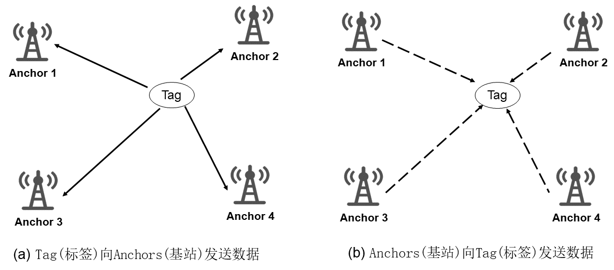

# TDOA Localization Algorithm

The trilateration algorithm requires prior measurement of the distances from a tag to multiple base stations. In practice, however, absolute distance measurements are not necessary to determine the tag’s position. Instead, the core idea is to infer the tag’s location based on the differences in signal arrival times at different base stations—this is known as Time Difference of Arrival (TDOA) localization.

The TDOA localization algorithm—also referred to as time-difference-of-arrival localization—determines the position of a target tag by exploiting the time differences at which a wireless signal arrives at distinct base stations. Let the time difference of signal arrival at two base stations be denoted by $\Delta t$; multiplying this by the signal propagation speed $v$ yields the corresponding difference in propagation distances $\Delta d$. Given two base stations, if the difference in distances from the tag to these two stations is known to be $\Delta d$, then the tag must lie on a hyperbola with those two base stations as its foci. Leveraging geometric properties of hyperbolas, the tag’s position can thus be uniquely determined.

?? Please supplement the localization algorithm under this model.

## Localization Algorithm

Before proceeding further, we first standardize the terminology used. The object to be ranged and localized is referred to as the *tag* ($Tag$), while nodes or devices with known positions are collectively termed *base stations* ($Anchor$).  

As illustrated below, TDOA localization algorithms fall into two primary configurations:

Figure. Principle of TDOA Localization

- **First configuration**: The tag transmits data to the base stations, and each base station stamps the received packet with its local time upon reception. Consequently, the path-length differences from the tag to the base stations correspond directly to the measured time differences.  
- **Second configuration**: All base stations simultaneously transmit signals toward the tag, and the tag records the time differences at which these signals arrive.

TDOA-based systems have found widespread application both in research and in practical deployments. Numerous variants of TDOA localization methods and systems have consequently emerged. Below, we introduce a concurrent-transmission-based TDOA localization method.

## Concurrent-Transmission-Based TDOA Localization Method

From the preceding analysis, it is evident that conventional TDOA relies on precise time synchronization among base stations—either to enable simultaneous signal reception (in the first configuration) or simultaneous transmission (in the second). However, achieving strict time synchronization in real-world deployments is challenging and incurs additional infrastructure overhead. Therefore, developing alternative approaches that relax this requirement is essential. The concurrent-transmission-based TDOA method addresses precisely this limitation.

Figure. Concurrent TDOA

The figure above illustrates the architecture of such a localization system, which introduces a new entity called the *initiator*, whose position is also known. The initiator actively initiates a communication event directed to four base stations. Upon receiving the message, each base station delays its response by a small, predetermined interval (on the order of nanoseconds), effectively approximating simultaneous transmission. When the tag receives signals from these base stations, the inter-signal intervals are typically too short for conventional demodulation and decoding. However, the tag can estimate the corresponding Channel Impulse Response (CIR)—refer to the “Wireless Channel” chapter for background on CIR. As shown in the figure, the measured CIR exhibits four distinct peaks, each corresponding to one of the four base stations. The time interval between successive CIR peaks is known and fixed ($\tau$); therefore, the time difference of arrival at the tag from any two base stations ($\Delta t$) can be computed by measuring the index difference between their respective CIR peaks ($inter\_cir$), followed by applying $\Delta t = inter\_cir \times \tau$.

It should be noted that not all communication signals or hardware platforms support nanosecond-level timing resolution. A prominent example is Ultra-Wideband (UWB) signaling, which inherently provides nanosecond-level resolution. UWB signals possess bandwidths exceeding $500 MHz$. Owing to this large bandwidth, UWB achieves exceptional temporal resolution—enabling highly accurate ranging and localization. In the [“UWB Sensing” chapter](https://iot-book.github.io/20_UWB感知/S1_UWB设备与开发环境/), we will demonstrate, through concrete examples, how UWB devices can be employed to implement the concurrent-transmission-based TDOA localization algorithm.