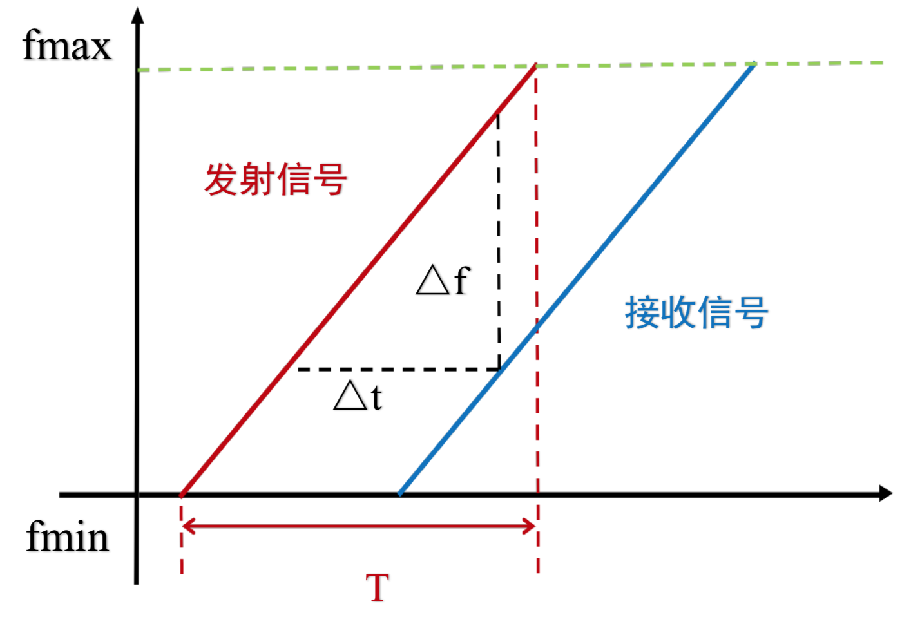

# FMCW-Based Tracking Method

## Introduction to FMCW

Frequency-Modulated Continuous Wave (FMCW) is a classical technique widely employed in high-precision radar ranging. FMCW has a long history of application and is extensively used across numerous traditional domains—especially in radar systems. During study, readers are encouraged to refer frequently to prior work in this field. In recent years, FMCW has been increasingly adopted in IoT-based localization and sensing scenarios; many state-of-the-art research efforts leverage FMCW signals for localization and sensing.

The fundamental principle of FMCW ranging involves transmitting electromagnetic waves whose frequency varies continuously over time. As illustrated below, the transmitted frequency changes periodically—either increasing linearly from $f_{min}$ to $f_{max}$ or decreasing linearly from $f_{max}$ to $f_{min}$. An FMCW signal $R(t)$ with a sweep period $T$ can be expressed as:

$$
R(t) = \cos\left(2\pi\left(f_{min} + \frac{B}{2T}t\right)t\right)
$$

where $B=f_{max}– f_{min}$ denotes the frequency sweep bandwidth.

<center>

</center>


<center>
<div style="color:orange; border-bottom: 1px solid #d9d9d9;
display: inline-block;
color: #999;
padding: 2px;">Figure. FMCW signal</div>
</center>

## FMCW Tracking

### Using Signal Reflection

The most direct application of FMCW is to measure time-of-flight (ToF) by mixing the reflected signal with the transmitted signal and extracting the resulting beat frequency, thereby determining the distance between the signal source and the reflecting object.

An FMCW radar transmits a frequency-swept continuous wave over each sweep period. The transmitted signal reflects off an object, and the resulting echo is received simultaneously with the ongoing transmission. As shown in the figure above, the received signal exhibits a time delay relative to the transmitted signal. Directly measuring this time delay precisely in practice is challenging (although some research attempts this). To overcome this limitation, the time delay is converted into a corresponding frequency difference—the beat frequency—which can then be measured to infer the target’s distance from the radar. This conversion is the primary reason for FMCW’s practical utility.

The beat frequency $\Delta f$ is linearly related to the round-trip propagation time $\Delta t$, enabling ToF measurement to be transformed into frequency-difference measurement. Let $d$ denote the one-way distance between transmitter and receiver; since $\Delta t$ represents the total round-trip time, we obtain:

$$
d = \frac{c\Delta t}{2}
$$

Furthermore, based on the triangular relationship depicted in the figure, we have:

$$
\Delta t = \frac{T}{B}\Delta f
$$

Combining these two equations yields the distance $d$:

$$
d = \frac{cT}{2B}\Delta f
$$

By tracking distance variations relative to multiple base stations, FMCW-based localization and tracking can be realized.

### Using Frequency Difference Between Received and Transmitted Signals

FMCW can also estimate distance changes via the frequency difference between the received and transmitted signals. Here, we generate FMCW signals using acoustic waves and describe how to extract the frequency difference between the received and transmitted signals.

Assume a stationary sound source *S*, and a recording device *D* also stationary relative to *S*. The emitted signal is:

$$
S(t) = cos\bigg(2\pi\big(f_{min} + \frac{B}{2T}t\big)t\bigg)
$$

where $S$ is the transmitted signal, $f_{min}$ is the minimum FMCW frequency, $B = f_{max} - f_{min}$ is the FMCW bandwidth, $T$ is the sweep period, and $t$ is the time variable within one period, i.e., $0 < t < T$. The received signal is therefore:

$$
L(t) = Acos\bigg( 2\pi \big(f_{min} + \frac{B}{2T}(t-t_d) \big) \big(t-t_d \big) \bigg)
$$

where *A* is the attenuation factor and $t_d$ is the propagation delay from transmitter to receiver. Applying the product-to-sum identity ($cosAcosB = \big(cos(A+B) + cos(A-B)\big)/2$), multiplying $S(t)$ and $L(t)$ and filtering out high-frequency components (i.e., retaining only the $cos(A-B)$ term) yields:

$$
V(t)=\frac{A}{2} \cos \left(2 \pi f_{\min } t_{d}+\frac{\pi B\left(2 t t_{d}-t_{d}^{2}\right)}{T}\right)
$$

Let *R* denote the distance between the recording device and the speaker. Then $t_d = \frac{R}{c}$ holds; substituting into $V(t)$ gives:

$$
V(t)=\frac{A}{2} \cos \left(2 \pi f_{\min } \frac{R}{c}+\left(\frac{2 \pi B R t}{c T}-\frac{\pi B R^{2}}{c^{2} T}\right)\right)
$$

At this point, $V(t)$ is a single-frequency signal. Its Fourier transform exhibits a peak at frequency $𝑓=𝐵𝑅/𝑐𝑇$, from which the frequency difference between the received and transmitted signals—and thus the distance $R$ between the sound source and microphone—can be determined.

When using FMCW reflection for distance measurement, the receiving device must suppress the strong transmitted signal during echo reception to avoid interference. Conversely, when estimating distance via the frequency difference between directly received and transmitted signals, precise clock synchronization between transmitter and receiver is required. Both approaches pose significant practical challenges. Instead, we can avoid exact time synchronization by analyzing the received FMCW signal against a *virtual* transmitted signal to track relative distance changes and motion.

## FMCW Tracking Example

This section demonstrates tracking inter-device distance changes using the received FMCW signal and a synthetically generated virtual transmitted signal.

The transmitted signal comprises 88 FMCW chirps, each followed by a silent gap equal in duration to the chirp itself.

```matlab
%% Generate transmitted signal
fs = 48000;
T = 0.04;
f0 = 18000; % start freq
f1 = 20500;  % end freq
t = 0:1/fs:T ;
data = chirp(t, f0, T, f1, 'linear');
output = [];
for i = 1:88
    output = [output,data,zeros(1,1921)];
end
```

Next, the received signal is loaded and filtered to suppress noise.

```matlab
%% Load and filter received signal
[mydata,fs] = audioread('fmcw_receive.wav');
mydata = mydata(:,1);
 
hd = design(fdesign.bandpass('N, F3dB1, F3dB2', 6, 17000, 23000, fs), 'butter');
mydata=filter(hd,mydata);
% figure;
% plot(mydata);
```
> Consider how the filter is applied.

To analyze distance variation, a *pseudo-transmitted* signal—a synthetic replica of the transmitted signal—is generated. Using this signal, the frequency shift between it and the received signal is computed to track distance changes.

The system proceeds as follows:

- 1. Generate the pseudo-transmitted signal.  
- 2. Multiply the pseudo-transmitted signal with the received signal and compute its Fourier transform to obtain the beat frequency.  
- 3. Extract the beat frequency for each received chirp relative to the initial position, thereby deriving distance at each time instant.

```matlab
%% Generate pseudo-transmitted signal
pseudo_T = [];
for i = 1:88
    pseudo_T = [pseudo_T,data,zeros(1,T*fs+1)];
end
 
[n,~]=size(mydata);
 
% Starting index of the first chirp in the received signal
start = 38750; 
pseudo_T = [zeros(1,start),pseudo_T];
[~,m]=size(pseudo_T);
pseudo_T = [pseudo_T,zeros(1,n-m)];
s=pseudo_T.*mydata';
 
len = (T*fs+1)*2; % Total length of one chirp plus its following silence
fftlen = 1024*64; % Zero-padding length for FFT. Padding increases the number of frequency samples and improves frequency resolution. Try different padding lengths to observe their effect on results.
f = fs*(0:fftlen -1)/(fftlen); %% Frequency sampling points after zero-padded FFT

%% Compute beat frequency for each chirp
for i = start:len:start+len*87
   FFT_out = abs(fft(s(i:i+len/2),fftlen));
   [~, idx] = max(abs(FFT_out(1:round(fftlen/10))));
   idxs(round((i-start)/len)+1) = idx;
end

%% Convert beat frequency delta_f to distance change
start_idx = 0;
delta_distance = (idxs - start_idx) * fs / fftlen * 340 * T / (f1-f0);
```

Finally, plot the distance versus time.

```matlab
%% Plot distance vs. time
figure;
plot(delta_distance);
xlabel('time(s)', 'FontSize', 18);
ylabel('distance (m)', 'FontSize', 18);
```


<center>

</center>


<center>
<div style="color:orange; border-bottom: 1px solid #d9d9d9;
display: inline-block;
color: #999;
padding: 2px;">Figure. FMCW ranging</div>
</center>