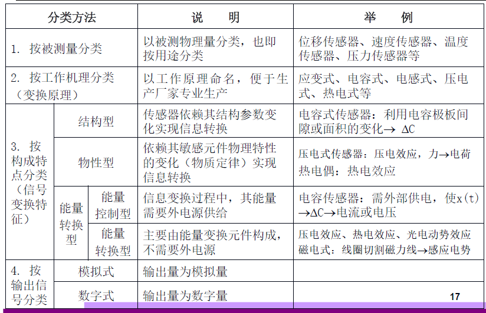
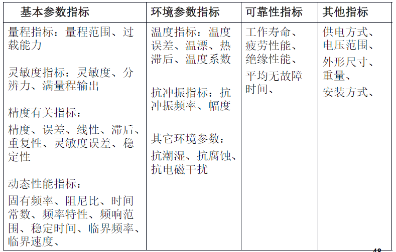

# IoT Sensor Perception Preparation

## 1. Fundamental Concepts of Perception Technology

IoT perception technology refers to techniques that utilize sensor elements to convert external environmental stimuli into information data suitable for storage and transmission.

The core of IoT sensing technology is the sensor. According to the national standard (GB7665-2005), a sensor is defined as: *“a device or apparatus capable of detecting a specified measurand and converting it, according to a defined relationship, into a usable output signal.”* Sensors typically exhibit the following four characteristics:

1. A sensor is a measuring instrument capable of performing detection tasks.
2. Its input is a specific measurand—potentially a physical, chemical, or biological quantity.
3. Its output is a physical quantity suitable for transmission, conversion, processing, display, etc. This output may be pneumatic, optical, or electrical, but is predominantly electrical.
4. A well-defined, precise relationship exists between input and output.

Fundamentally, a sensor detects information about a measurand and transforms that information—according to a defined rule—into an electrical signal or other required form of output, satisfying requirements for transmission, processing, storage, display, recording, and control. For example, mechanical force acting on an object is a typical objective physical quantity; however, it cannot be directly observed or recorded. Therefore, transduction techniques are required to convert it into a measurable and recordable value.

Figure. Conversion of Objective Physical Quantities

As shown in the figure above, mechanical transduction can convert surface pressure on an object into displacement, which can then be easily measured using a scale. Similarly, optical, pneumatic/hydraulic, or electrical transduction can convert pressure into photonic displacement, pneumatic/hydraulic pressure, resistance, or other measurable quantities.

## 2. Sensor Composition

As illustrated below, a typical sensor consists of three main components: a sensitive element, a transducing element, and a signal-conditioning circuit. The sensitive element directly perceives the measurement information and outputs a physical quantity with a deterministic relationship to the measurand. The transducing element takes the output of the sensitive element as its input and converts that input into an electrical signal suitable for circuit processing.

Figure. Sensor Composition

Sensors can be classified in numerous ways. Below are several common classification methods:

- By **input physical quantity**: pressure sensors, temperature/humidity sensors, displacement sensors, acceleration sensors, etc.
- By **operating principle**: resistive, capacitive, inductive, magnetoelectric, piezoelectric, optoelectronic sensors, etc.
- By **output signal nature**: analog sensors and digital sensors.

A detailed classification diagram with examples is shown below:

Figure. Sensor Classification

## 3. Fundamental Sensor Characteristics

Sensor characteristics primarily describe the relationship between output and input:

- When the input is constant or varies extremely slowly, this relationship is termed the **static characteristic**.
- When the input varies rapidly over time, this relationship is termed the **dynamic characteristic**.

This input–output relationship can be mathematically modeled by a differential equation. Theoretically, setting all first-order and higher-order derivative terms in the differential equation to zero yields the static characteristic. Thus, the static characteristic is merely a special case of the dynamic characteristic.

Moreover, depending on influencing factors, sensor characteristics can be further divided into **internal characteristics** and **external characteristics**:
- Internal characteristics mainly manifest as sensor error characteristics—the primary metric for evaluating sensor quality.
- External characteristics reflect the sensor’s sensitivity to external disturbances.

Figure. Sensor Error Sources and External Influences

## 4. Technical Performance Specifications of Sensors

Having now covered the basic functions, structural principles, and fundamental characteristics of sensors, how do we evaluate the performance and quality of a specific sensor?

In general, every sensor possesses fundamental specifications such as range, sensitivity, and accuracy. Sensors with differing parameter values suit distinct application scenarios; users must therefore select appropriate sensor parameters based on their requirements. Beyond these basic parameters, sensors also feature environmental specifications, reliability specifications, and other supplementary specifications—these reflect the degree to which environmental conditions affect sensor operation and its overall operational reliability. A detailed illustration of key technical performance specifications is shown below:

Figure. Technical Performance Specifications of Sensors

## 5. Development Trends in Sensor Technology

**(1) Discovery of New Phenomena and Development of Novel Materials**
Sensor operating principles rely on various physical effects and laws. This inspires continued exploration of novel functional materials exhibiting new effects, enabling development of next-generation physical-property-type sensors based on innovative principles—a critical pathway toward high-performance, multifunctional, low-cost, and miniaturized sensors.

Structural-type sensors were developed earlier and have matured significantly. Typically, they feature complex structures, relatively large volumes, and higher costs. In contrast, physical-property-type sensors generally offer many attractive advantages—including simplicity, compactness, and cost-effectiveness—and historically received less attention. Consequently, researchers worldwide are investing substantial human and material resources into advancing physical-property-type sensors, making this a prominent development trend.

Sensor materials constitute a foundational pillar of sensor technology. Advances in materials science now allow precise compositional control during fabrication, facilitating the design and production of functional materials tailored for diverse sensor applications. Employing advanced composite materials to fabricate higher-performance sensors represents one key future direction. Currently used novel sensor materials include: (1) semiconductor-sensitive materials, (2) ceramic materials, (3) magnetic materials, and (4) smart materials.

**(2) Integration, Miniaturization, and Multifunctionality**
To simultaneously measure multiple distinct parameters, different sensor elements can be integrated into a single composite unit—for instance, a tri-functional ceramic sensor capable of measuring temperature, gas concentration, and humidity has already been successfully developed.

Integrating multiple functionally distinct sensing elements not only enables concurrent multi-parameter measurement but also allows comprehensive processing and evaluation of the resulting measurements—thereby revealing the holistic state of the monitored system.

Parallel integration of identical sensing elements—i.e., arranging multiple identical sensor units on a single plane using integrated-circuit fabrication processes—exemplifies this approach (e.g., CCD image sensors). Functional integration—i.e., integrating the sensor with amplification, computation, and temperature compensation circuits into a single monolithic device—is another important trend.

**(3) Biomimetic Sensors**
Biosensor systems—also known as biochips—represent the next profound technological revolution following large-scale integrated circuits. Biochip efficiency may exceed conventional detection methods by hundreds or even thousands of times.

Biochips can emulate human sensory modalities—including olfaction (e.g., electronic noses), vision (e.g., electronic eyes), audition, gustation, and tactition—as well as certain specialized animal capabilities (e.g., dolphin echolocation-based navigation and ranging, bat ultrasonic localization, canine olfactory acuity, pigeon homing ability, and insect compound-eye vision).

**(4) Smart Sensors**
Smart sensors are sensors endowed with decision-making and learning capabilities. In practice, they are microprocessor-equipped sensors possessing integrated detection, judgment, and information-processing functionality.

**(5) Wireless Networking**
Networked sensors represent a new generation of intelligent sensors incorporating digital sensing elements, network interfaces, and embedded processing units. A typical wireless sensor network (WSN) node operates as follows:

Measured analog quantity → Sensor → Digitization → Microprocessor → Measurement result → Network

The primary constituents of a WSN are individual sensor nodes. Each node functions as a miniature computer capable of rapid computation: it converts raw sensor data into digital signals, encodes them, and transmits them via self-organized wireless links to servers with greater computational capacity.

Through wireless sensor networks, seamless data exchange and resource sharing become possible among sensors, between sensors and actuators, and between sensors and higher-level systems. Sensor replacement no longer requires recalibration or revalidation—achieving true “plug-and-play” interoperability.

## 6. References

1. Zhao Yan. *Principles and Applications of Sensors*. Peking University Press.
2. https://zh.wikipedia.org/wiki/传感器
3. Sensor Types: https://www.te.com.cn/chn-zh/products/sensors.html
4. Zhipeng Song, Zhichao Cao, Zhenjiang Li, Jiliang Wang, Yunhao Liu. *Inertial Motion Tracking on Mobile and Wearable Devices: Recent Advancements and Challenges*. Tsinghua Science and Technology, 2021, 26(5): 692–705.
