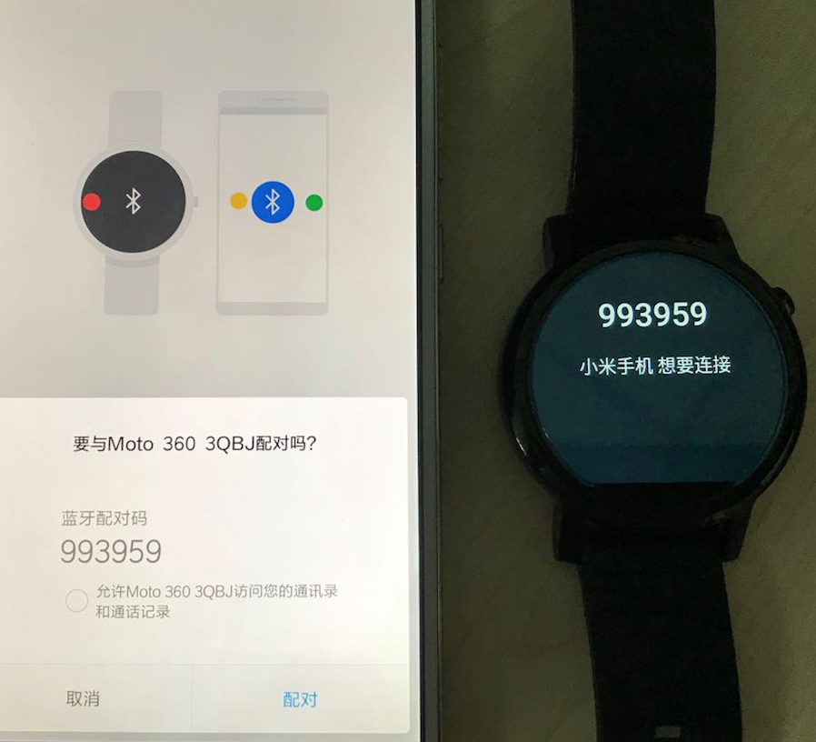
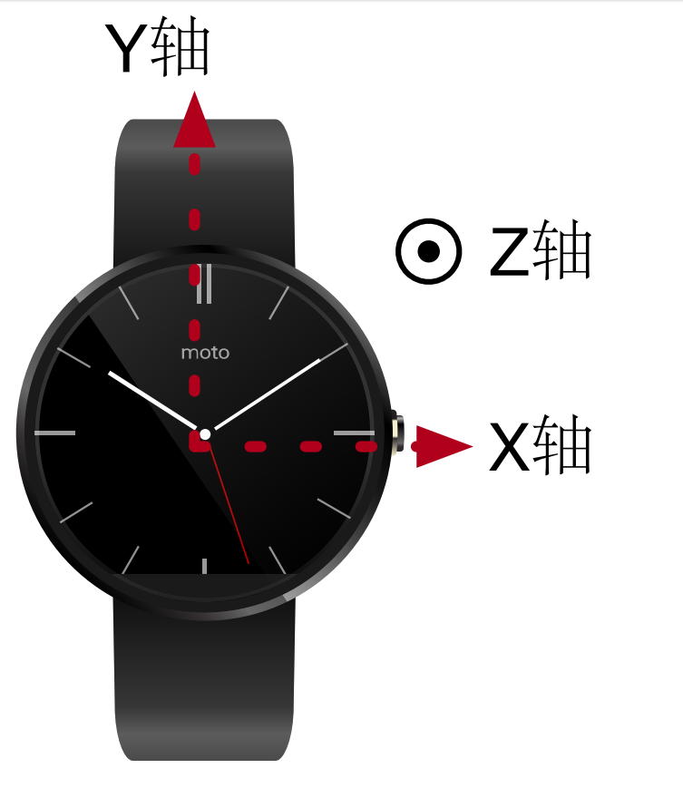
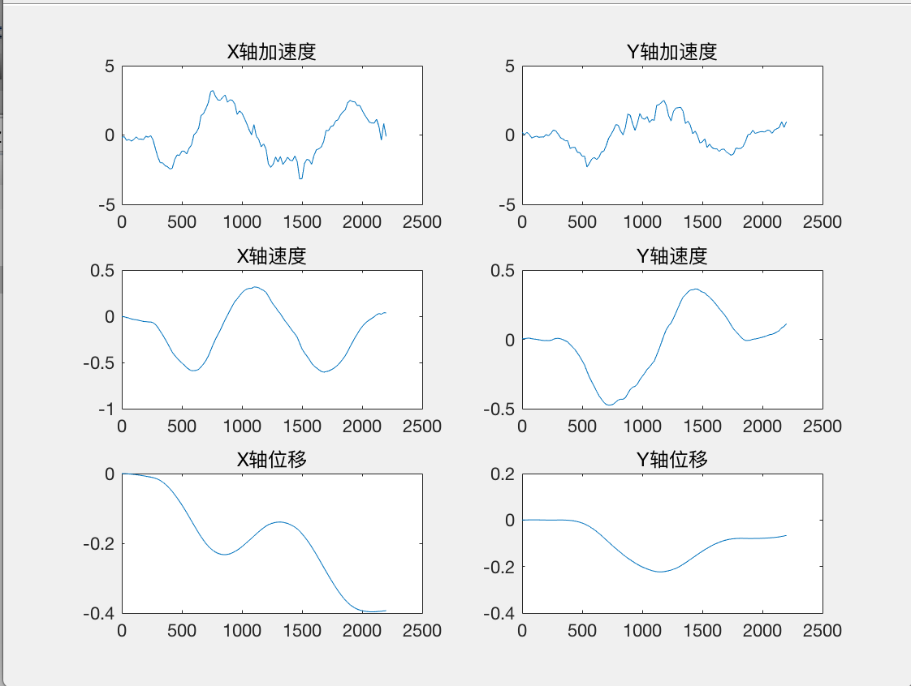
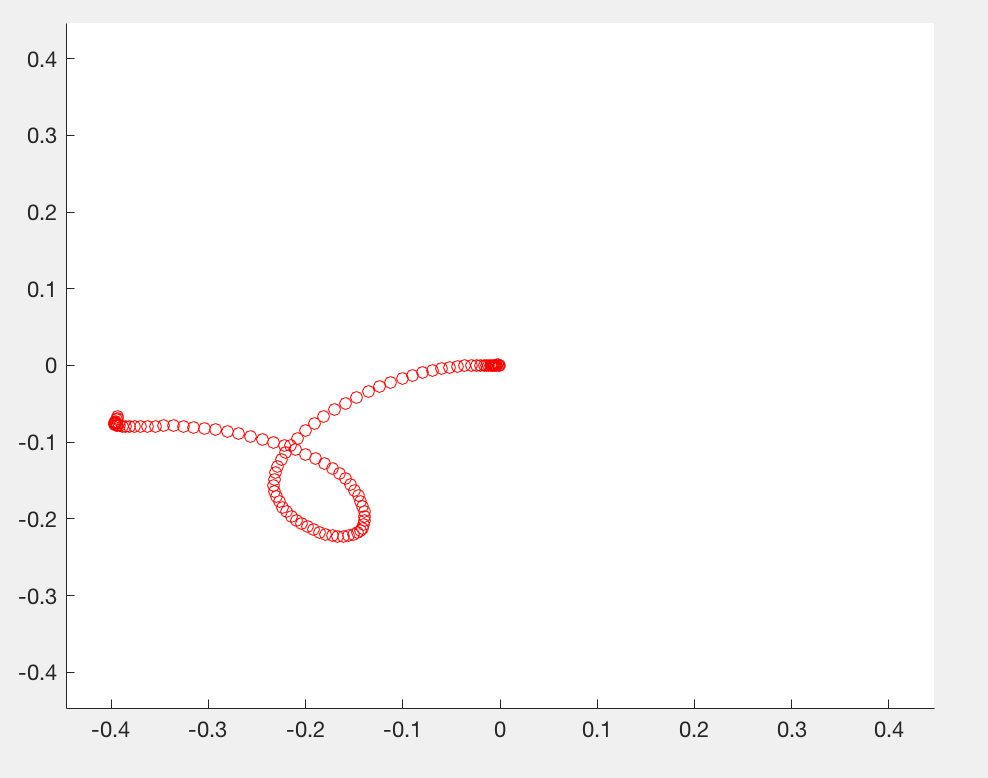

# Smartwatch Sensing

## Smartwatch Connection Tutorial

Connect **non-Apple smartwatches** (e.g., Moto 360, LG Watch Sport, Huawei Watch, etc.) to an **Android smartphone**, and further connect the smartwatch to a **computer** via the **ADB tool** (Android Debug Bridge) to achieve the following two functions:

1. Transfer data from the smartwatch to the computer (via ADB)
2. Install applications onto the smartwatch from the computer (via Android Studio)

**Prerequisites**

1. A non-Apple smartwatch
2. An Android smartphone with the **Wear OS by Google** app installed (searchable in the app store or web browser)
3. The ADB tool, located in the `ADB/` folder:  
   - Windows: `ADB/Win`  
   - macOS/Linux: `ADB/Mac`

**Connecting the Smartwatch to the Smartphone**

> Note: The following tutorial uses pairing a Moto 360 smartwatch with a Xiaomi MI 4LTE smartphone as an example. In general, a smartwatch can be paired with at most one smartphone at a time. To pair it with another smartphone, the existing connection must first be terminated.

1. **Smartwatch**: If the smartwatch was previously paired with another smartphone, disconnect it and perform a factory reset. Navigate to `Settings → System → Disconnect & reset`. After rebooting, the watch enters the phone-pairing screen. If no prior pairing exists, the watch enters the phone-pairing screen directly upon power-on:

<center>

</center>
<center>
<div style="color:orange; border-bottom: 1px solid #d9d9d9; display: inline-block;color: #999;padding: 2px;">Fig. Smartwatch–smartphone pairing</div>
</center>

2. **Smartphone**: Enable Wi-Fi or mobile data to ensure internet connectivity; enable Bluetooth; launch the `Wear OS` app; tap the top-left menu icon and select `Add new watch`; choose the target watch from the displayed list and confirm pairing, as shown below. If pairing fails, try the following remedies: restart the `Wear OS` app; or go to `Settings → Bluetooth → Paired devices`, locate the watch if previously paired, and unpair it:

<center>

</center>
<center>
<div style="color:orange; border-bottom: 1px solid #d9d9d9; display: inline-block;color: #999;padding: 2px;">Fig. Smartphone pairing interface</div>
</center>

3. **Smartwatch**: Navigate to `Settings → System → About`, then tap `Build number` seven times consecutively. This unlocks `Developer options` under `Settings`. Enter `Developer options`, and enable both `ADB debugging` and `Debug over Bluetooth`.

4. **Smartphone**: Launch the `Wear OS` app, scroll down and tap `Advanced settings`, then enable `Debug over Bluetooth`. The status should now read `Host: Not connected; Target: Connected`, as shown in Fig. 3. If `Target` shows `Not connected`, restart the `Wear OS` app and recheck:

<center>

</center>
<center>
<div style="color:orange; border-bottom: 1px solid #d9d9d9; display: inline-block;color: #999;padding: 2px;">Fig. Successful smartphone connection interface</div>
</center>

**Connecting the Smartwatch to the Computer**

1. **Smartphone**: Connect the smartphone to the computer using a USB cable.

2. **Computer**: Open a command-line terminal (Windows Command Prompt/PowerShell or macOS/Linux Terminal), and execute:
   - On Windows: `.\connect.ps1`
   - On macOS/Linux: `./connect`

   At this point, the `Host` status in the smartphone’s `Advanced settings` should change to `Connected`. If any of the following errors occur, apply the corresponding resolution:

    2.1 If `error: more than one device/emulator` appears, run `./adb kill-server` to terminate all existing ADB connections.

    2.2 If `device not found` appears, on the smartphone navigate to `Settings → Developer options → Select USB configuration → Charging only`, then grant USB debugging authorization when prompted. Afterwards, re-execute `.\connect.ps1` (Windows) or `./connect` (macOS/Linux).

    2.3 If `This adb server's $ADB_VENDOR_KEYS is not set`，则找到(Windows)`C：Users/$Name/.android` (Windows) or `~/.android` (macOS/Linux) directory is referenced, delete the `adbkey.pub` and `adbkey` files inside that directory, then re-run `.\connect.ps1` (Windows) or `./connect` (macOS/Linux).

3. **Smartwatch**: Upon successful host connection, a prompt “Allow USB debugging?” will appear on the watch screen—select **Always allow**.

4. **Computer**: Android Studio will now detect the smartwatch and support application installation.

5. **Smartwatch**: Navigate to `Settings → Apps → $(installed app) → Permissions`, and enable required permissions for the installed application.

## Inertial Sensor Data Acquisition

We developed an Android application named **IMU Detector** in Android Studio to record accelerometer and gyroscope sensor data from the smartwatch over a specified duration.

The usage procedure on the smartwatch is as follows:

1. Launch the **IMU Detector** app on the smartwatch. The initial screen is red.

2. Tap the watch face once—the screen turns white, indicating readiness for motion.

3. Tap the watch face again—the screen reverts to red and displays the total data acquisition duration.

4. Follow the instructions in the *Smartwatch Connection Tutorial* to connect the smartwatch to the computer via the smartphone.

5. On the computer, open a command-line terminal and execute:
   - On Windows: `.\pull.ps1 <filename>`
   - On macOS/Linux: `./pull.sh <filename>`

   This transfers the recorded data file from the watch to the computer. Example commands:

   (Windows)
   ```sh
   .\pull.ps1 move
   ```

   (macOS/Linux)
   ```
   ./pull.sh move
   ```

   The result is a file named `move.data` created in the current working directory.

**Data Format**

The acquired data file has the following format:

There are $N$ rows and 7 columns. Each row corresponds to a single timestamped measurement. Column meanings, left to right, are as follows:

Timestamp (unit: $ms$), X-axis acceleration (unit: $m/s^2$), Y-axis acceleration (unit: $m/s^2$), Z-axis acceleration (unit: $m/s^2$), X-axis angular velocity (unit: $rad/s$), Y-axis angular velocity (unit: $rad/s$), Z-axis angular velocity (unit: $rad/s$).

## Data Processing and Visualization

After acquiring inertial sensor data from the smartwatch using the above method, process and visualize the data using **MATLAB**.

The code folder contains two files: `main.m` and `move.data`.  
- `main.m`: MATLAB source script for processing smartwatch sensor data.  
- `move.data`: Raw inertial sensor data file acquired from the smartwatch.

First, load the contents of `move.data` into a matrix using MATLAB’s `load` function:

```matlab
A = load('move.data');
```

Matrix $A$ contains 114 rows and 7 columns. Its content can be inspected either via a text editor or MATLAB’s variable explorer. Each row represents one timestamped measurement; column semantics are summarized in the table below (first two rows of `move.data` shown as examples):

<center>

</center>
<center>
<div style="color:orange; border-bottom: 1px solid #d9d9d9; display: inline-block;color: #999;padding: 2px;">Fig. Meaning of data file columns</div>
</center>

In the table above, the timestamp denotes the total number of milliseconds elapsed since 00:00 on January 1, 1970 (Unix epoch), according to the smartwatch’s system clock. The smartwatch’s three orthogonal axes are illustrated below:

<center>

</center>
<center>
<div style="color:orange; border-bottom: 1px solid #d9d9d9; display: inline-block;color: #999;padding: 2px;">Fig. Smartwatch 3-axis coordinate system</div>
</center>

To simplify subsequent processing, normalize timestamps so the first entry becomes zero, and all others represent relative offsets:

```matlab
A(:, 1) = A(:, 1) - A(1, 1);
```

The sampling rate of the accelerometer and gyroscope used in this smartwatch is $50Hz$. This value may be obtained from the device’s technical documentation or by computing the average interval between successive timestamps. Define the following variables:

```matlab
samplingRate = 50;
samplingTime = 1000 / samplingRate;
```

As evident from both the table and the raw `move.data` file, some timestamps are identical, and inter-sample intervals are not strictly uniform. This behavior stems from the underlying principle of inertial measurement unit (IMU) data acquisition on Android.

In $Android$ application development, accelerometer and gyroscope data are acquired by registering listeners for the `"data changed"` event. For instance, the accelerometer triggers this event whenever its newly measured value differs from the previous one; the event payload can then be used to collect or process data. The time interval between consecutive accelerometer measurements is determined by the sensor’s intrinsic sampling rate—its reciprocal. In theory, identical successive readings would not trigger the event, resulting in missing samples—but due to inherent sensor noise, such exact matches are rare. Additional timing discrepancies arise from software execution latency and minor inaccuracies in the sensor’s nominal sampling rate. Identical timestamps occur when both the accelerometer and gyroscope simultaneously trigger their respective `"data changed"` events—hence two entries share the same timestamp.

Since timestamps are non-uniform, interpolation is required to resample the data onto a uniform time grid—essential for computing velocity and displacement from acceleration. We apply smoothing interpolation as follows:

```matlab
[~, I] = unique(A(:, 1), 'first');
A = A(I, :);

temA = [];
temA(:, 1) = (A(1, 1) : samplingTime : A(end, 1))';
for i = 2 : size(A, 2)
    temA(:, i) = spline(A(:, 1), A(:, i), temA(:, 1));
end
```

The `unique` function extracts all distinct values from a vector (i.e., removes duplicates). The `spline` function performs cubic spline interpolation: `spline(x,y,xx)` fits a cubic spline to points `(x,y)` and returns interpolated values at abscissae `xx`.

This tutorial focuses on 2D motion visualization. The `move.data` file was acquired while moving the watch within the plane of its display. Therefore, the Z-axis acceleration and full 3-axis gyroscope data are irrelevant here; only the X- and Y-axis accelerations are needed:

```matlab
T = temA(:, 1);
A = temA(:, 2 : 3);
```

With uniformly sampled acceleration data, we now compute velocity and displacement. The adopted motion model is **piecewise constant acceleration**, i.e., acceleration remains fixed at its sampled value throughout each sampling interval. Using this model, velocity and displacement are computed as:

```matlab
dt = samplingTime / 1000;
dV = A * dt;
V = cumsum(dV);
dD = V * dt + A * dt ^ 2 / 2;
D = cumsum(dD);
```

The `cumsum` function computes cumulative sums along the first dimension (default) of a vector or matrix, returning all intermediate partial sums.

Next, plot time-series curves for acceleration, velocity, and displacement across both axes. Use `subplot` to arrange all six plots in a 3×2 grid:

```matlab
subplot(3, 2, 1);
plot(T, A(:, 1));
title('X-axis Acceleration');

subplot(3, 2, 2);
plot(T, A(:, 2));
title('Y-axis Acceleration');

subplot(3, 2, 3);
plot(T, V(:, 1));
title('X-axis Velocity');

subplot(3, 2, 4);
plot(T, V(:, 2));
title('Y-axis Velocity');

subplot(3, 2, 5);
plot(T, D(:, 1));
title('X-axis Displacement');

subplot(3, 2, 6);
plot(T, D(:, 2));
title('Y-axis Displacement');
```

The resulting plot is shown below:

<center>

</center>
<center>
<div style="color:orange; border-bottom: 1px solid #d9d9d9; display: inline-block;color: #999;padding: 2px;">Fig. Acceleration, velocity, and displacement curves for X- and Y-axes</div>
</center>

To animate the dynamic motion trajectory, use MATLAB’s `pause` function to sequentially plot points:

```matlab
w = max(max(abs(D))) + 0.05;
figure(2);
axis([-w, w, -w, w]);

for i = 1 : size(D, 1)
    hold on;
    plot(D(i, 1), D(i, 2), 'ro');
    pause(dt);
end
```

The `axis` function sets the display range for the $X$- and $Y$-axes. The resulting motion trace is shown below:

<center>

</center>
<center>
<div style="color:orange; border-bottom: 1px solid #d9d9d9; display: inline-block;color: #999;padding: 2px;">Fig. Smartwatch motion trajectory</div>
</center>

> Discussion Questions

> 1. This tutorial demonstrates only 2D motion. How can it be extended to full 3D? Gyroscope data would be required to estimate orientation changes. Note: Accelerometer measurements are expressed in the watch’s local sensor frame, whereas the reconstructed trajectory must be represented in the world (global) coordinate frame—requiring coordinate transformation.
> 2. Another simplification in the 2D case is neglecting gravity (which acts entirely along the $Z$-axis and is excluded here). In 3D, how can gravity be separated from true motion-induced acceleration? Note: Due to arbitrary orientation changes between the watch frame and world frame, gravity’s projection onto the watch’s axes is time-varying—not constant.
> 3. As noted earlier, both accelerometer and gyroscope measurements contain inherent errors. How significantly do these errors affect trajectory reconstruction accuracy? What effective methods exist to mitigate them?
> 4. Is the **piecewise constant acceleration** model used here physically justified? Are there more accurate motion models better suited to real-world dynamics?
> 5. Gesture recognition in this tutorial proceeds by first reconstructing the trajectory, then classifying gestures based on it. When trajectory reconstruction is inaccurate, how can robust gesture classification still be achieved?

## References

1. Zhipeng Song, Zhichao Cao, Zhenjiang Li, Jiliang Wang, Yunhao Liu. Inertial Motion Tracking on Mobile and Wearable Devices: Recent Advancements and Challenges. *Tsinghua Science and Technology*, 2021, 26(5): 692–705.