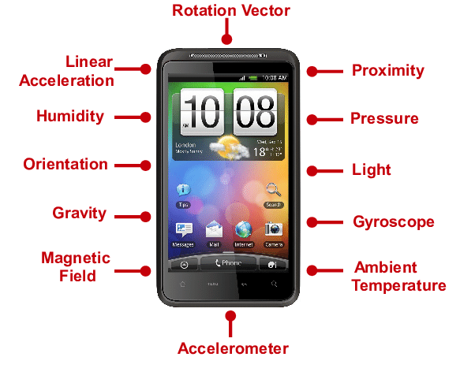

# Preparation for Android Sensor Development Experiments

Sensors constitute the core component of the perception layer in the Internet of Things (IoT). By accessing sensors, we can perceive various types of environmental information. To help readers gain an intuitive understanding of sensor functionality and characteristics, we have designed a series of Android smartphone-based sensor access experiments. These experiments provide students with hands-on experience and lay a foundation for future development.

Overall, abundant reference materials exist for this topic; we recommend consulting multiple sources. The most authoritative and comprehensive resource is the official Android documentation, which provides detailed technical specifications.

For inertial motion tracking using sensors, we have authored a dedicated survey paper summarizing recent advances and challenges in this field. Readers may refer to it as follows:

Zhipeng Song, Zhichao Cao, Zhenjiang Li, Jiliang Wang, Yunhao Liu. Inertial Motion Tracking on Mobile and Wearable Devices: Recent Advancements and Challenges. *Tsinghua Science and Technology*, 2021, 26(5): 692–705.

## 1. Smartphone Sensors

Modern smartphones integrate numerous sensors to support diverse functionalities. This section briefly introduces several commonly used sensors found in smartphones.


<center>
<div style="color:orange; border-bottom: 1px solid #d9d9d9;
display: inline-block;
color: #999;
padding: 2px;">Figure. Common sensors in smartphones</div>
</center>

### 1.1 Ambient Light Sensor

The ambient light sensor adjusts the smartphone screen brightness according to incident ambient light intensity. In bright outdoor environments, the screen automatically maximizes its brightness; conversely, in dark environments, screen brightness decreases accordingly.

### 1.2 Proximity Sensor

The proximity sensor consists of an infrared (IR) LED and an IR radiation detector. Located near the phone’s earpiece, its operating principle is as follows: the IR LED emits infrared light, which reflects off nearby objects and is subsequently detected by the IR radiation detector. The distance between the sensor and the object is calculated based on the time delay between emission and reception.

<!--Practical application: Preventing accidental touch during calls. During a call, when the user’s ear approaches the proximity sensor, the sensor triggers the display to turn off, thereby preventing unintended screen touches that could disrupt the call.-->

### 1.3 Gravity Sensor

The gravity sensor operates based on the piezoelectric effect. Internally, it comprises a mass and a piezoelectric element. When mechanical stress is applied along one axis, voltage is generated across the two orthogonal axes. The magnitude and direction of the applied force can be determined from the measured voltage.

<!--Applications include automatic screen orientation switching (portrait ↔ landscape), and enhanced interactive controls in games such as balance-ball or racing games.-->

### 1.4 Accelerometer

The accelerometer operates on principles similar to those of the gravity sensor. When an object undergoes acceleration-induced velocity changes, inertia causes internal mechanical stress along the direction of motion; the resulting stress is converted into measurable electrical signals, enabling calculation of acceleration magnitude. Accelerometers perform multi-axis measurements and are primarily used to detect transient acceleration or deceleration events.

<!--A typical application is step counting. Accelerometers detect periodic vibrations generated during walking or running. By identifying zero-crossings in the vibration signal, the number of steps can be counted. Combined with appropriate algorithms, displacement and even caloric expenditure can be estimated.-->

### 1.5 Fingerprint Sensor

The primary function of a fingerprint sensor is automated fingerprint acquisition. Commercial fingerprint sensors fall into two main categories: optical and semiconductor-based sensors. Optical sensors utilize principles of light refraction and reflection to reconstruct the ridges and valleys of a fingerprint surface from variations in reflected light intensity. Semiconductor sensors employ capacitive or inductive elements, reconstructing fingerprint patterns by detecting differences in capacitance or inductance values at ridge (convex) versus valley (concave) contact points.

<!--Optical fingerprint sensor: Light emitted from beneath illuminates a prism, which directs the light onto the finger surface. Due to the uneven topography of fingerprint ridges and valleys, the angles of refraction and intensities of reflected light differ. A CMOS or CCD optical sensor captures these intensity variations to generate a fingerprint image.-->

<!--Semiconductor fingerprint sensor: Whether capacitive or inductive, these sensors operate similarly. A silicon “plate” integrates thousands of semiconductor elements. When a finger contacts the plate, it forms the second electrode of a capacitor (or inductor). Because fingerprint ridges and valleys contact the plate at different distances, local capacitance (or inductance) values vary. The device aggregates these spatially varying measurements to reconstruct the fingerprint.-->

### 1.6 Gyroscope Sensor

<!--The gyroscope sensor is a simple, easy-to-use positioning and control system based on free-space movement and gesture recognition. Originally developed for helicopter models, it gained widespread attention with the launch of the iPhone 4—its “killer app.” Modern smartphones typically feature three-axis gyroscopes capable of tracking displacement changes along six degrees of freedom. Gyroscopes are widely used in shooting and racing games, as well as applications such as 3D photography and panoramic navigation.-->

Currently, smartphones commonly use three-axis gyroscopes, capable of tracking displacement changes along six degrees of freedom.

### 1.7 Magnetometer Sensor

The magnetometer measures planar magnetic fields via magnetoresistance, enabling detection of both magnetic field strength and directional orientation. It is commonly employed in digital compasses and map navigation applications to assist users in achieving accurate positioning.

### 1.8 GPS Position Sensor

The GPS module receives satellite coordinate data via an antenna to determine the user’s geographic position.

<!--With the proliferation of 4G networks, GPS has been deployed in broader scenarios—for instance, remote location monitoring in conjunction with smart hardware, or locating lost devices. Note that most smartphones ship with A-GPS (Assisted GPS), which combines satellite navigation signals with mobile network assistance to achieve faster and more reliable positioning than standalone GPS.-->

### 1.9 Barometer Sensor

Barometer sensors detect atmospheric pressure changes by measuring corresponding variations in resistance or capacitance. Based on the sensing element type, barometers are classified as either variable-capacitance or variable-resistance types.

<!--While GPS determines horizontal position, altitude changes require barometric measurement. Smartphones equipped with barometers can estimate floor-level changes (e.g., number of floors climbed) or support indoor positioning. Additionally, internal barometers may assess device enclosure integrity.-->

### 1.10 Temperature Sensor

The temperature sensor commonly integrated into smartphones monitors battery temperature to dynamically adjust operational modes. It also serves as an indicator of overall device thermal behavior.

<!--Extended applications include measuring ambient air temperature or even estimating user body temperature.-->

### 1.11 Hall Effect Sensor

Similar to magnetometers, Hall effect sensors convert varying magnetic fields into output voltages, generating a potential difference across a conductor. Hall sensors are frequently used to implement smart cover functionality: closing the cover triggers automatic screen locking, while opening it initiates automatic unlocking.

## 2. Android Sensor Development

The Android operating system provides built-in support for sensors. Provided the target smartphone includes compatible sensor hardware, developers can programmatically retrieve sensor readings to infer external conditions—such as device orientation, ambient magnetic fields, temperature, and pressure.

Android offers standardized APIs for most commercially available sensors. Consequently, sensor development is straightforward: developers need only register listeners and process callback data. Below, we detail the development procedure using the built-in accelerometer as an example.

### 2.1 Accelerometer Development and Usage

- **Step 1**: Obtain an instance of the `SensorManager`. `SensorManager` serves as the central system service managing all sensors. All sensor interactions in Android must go through `SensorManager`.

```java
private final SensorManager mSensorManager;
// Acquire SensorManager instance in onCreate()
@Override
protected void onCreate(Bundle savedInstanceState) {
    ...
    mSensorManager = (SensorManager) getSystemService(Context.SENSOR_SERVICE);
    ...
}
```

`SensorManager` also enables enumeration of all sensors installed on the device:

```java
List<Sensor> deviceSensors = sensorManager.getSensorList(Sensor.TYPE_ALL);
```

- **Step 2**: Retrieve the target sensor instance from `SensorManager` (in this case, `Sensor.TYPE_ACCELEROMETER` — the accelerometer).

```java
private final Sensor mAccelerometer;
// Acquire accelerometer instance in onCreate()
@Override
protected void onCreate(Bundle savedInstanceState) {
    ...
    mAccelerometer = mSensorManager.getDefaultSensor(Sensor.TYPE_ACCELEROMETER);
    ...
}
```

In addition to accelerometers, other sensor types can be retrieved similarly, including:
> `Sensor.TYPE_ORIENTATION`: Orientation sensor  
> `Sensor.TYPE_GYROSCOPE`: Gyroscope sensor  
> `Sensor.TYPE_MAGNETIC_FIELD`: Magnetometer sensor  
> `Sensor.TYPE_GRAVITY`: Gravity sensor  
> `Sensor.TYPE_LINEAR_ACCELERATION`: Linear acceleration sensor  
> `Sensor.TYPE_AMBIENT_TEMPERATURE`: Ambient temperature sensor  
> `Sensor.TYPE_LIGHT`: Light sensor  
> `Sensor.TYPE_PRESSURE`: Pressure sensor  

- **Step 3**: Register a listener to receive sensor data updates. Registration should occur within the `onResume()` method, because `onResume()` signals that the associated `Activity` has entered the foreground. Premature registration would unnecessarily activate the sensor, wasting battery power and potentially causing resource contention among concurrent sensor users.

```java
private final TestSensorListener mSensorListener;
// Initialize listener in onCreate(); implementation provided in Step 4
@Override
protected void onCreate(Bundle savedInstanceState) {
    ...
    mSensorListener = new TestSensorListener();
    ...
}

// Register listener in onResume()
@Override
protected void onResume() {
    super.onResume();
    mSensorManager.registerListener(mSensorListener, mAccelerometer, SensorManager.SENSOR_DELAY_UI);
}
```

Parameter descriptions for `registerListener(SensorEventListener listener, Sensor sensor, int samplingPeriodUs)`:

- `listener`: The sensor event listener implementing the `SensorEventListener` interface  
- `sensor`: Target sensor object  
- `samplingPeriodUs`: Sampling frequency specification, with the following options:

> `SensorManager.SENSOR_DELAY_FASTEST`: Highest frequency, minimal latency, but most resource-intensive—suitable only for applications critically dependent on sensor data. Not recommended otherwise.  
> `SensorManager.SENSOR_DELAY_GAME`: Optimized for gaming; suitable for real-time applications requiring low latency.  
> `SensorManager.SENSOR_DELAY_NORMAL`: Standard frequency—appropriate for applications with modest real-time requirements.  
> `SensorManager.SENSOR_DELAY_UI`: UI-optimized frequency—power-efficient with low system overhead, but higher latency; suitable for lightweight applications.

Additionally, when an `Activity` is paused or moved to the background (i.e., upon invocation of `onPause()`), previously registered listeners must be unregistered to release sensor resources.

```java
@Override
protected void onPause() {
    super.onPause();
    // Unregister listener
    mSensorManager.unregisterListener(mSensorListener);
}
```

- **Step 4**: Implement the listener and override callback methods to process updated sensor readings. Underlying sensor drivers read register values directly from the sensor chip; thus, the `onSensorChanged()` callback fires whenever register contents change.

```java
class TestSensorListener implements SensorEventListener {
    @Override
    public void onSensorChanged(SensorEvent event) {
        // Read accelerometer values; event.values[0], [1], [2] correspond to x-, y-, and z-axis accelerations respectively
        Log.i(TAG, "onSensorChanged: " + event.values[0] + ", " + event.values[1] + ", " + event.values[2]);
    }

    @Override
    public void onAccuracyChanged(Sensor sensor, int accuracy) {
        Log.i(TAG, "onAccuracyChanged");
    }
}
```

The experimental results of the accelerometer program are shown below. As expected, a constant gravitational acceleration component is consistently observed along the vertical axis (aligned with Earth’s center).


<center>
<div style="color:orange; border-bottom: 1px solid #d9d9d9;
display: inline-block;
color: #999;
padding: 2px;">Figure. Accelerometer experiment output</div>
</center>