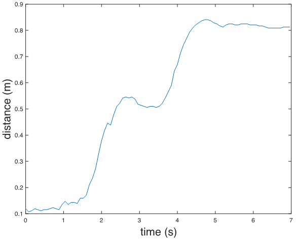
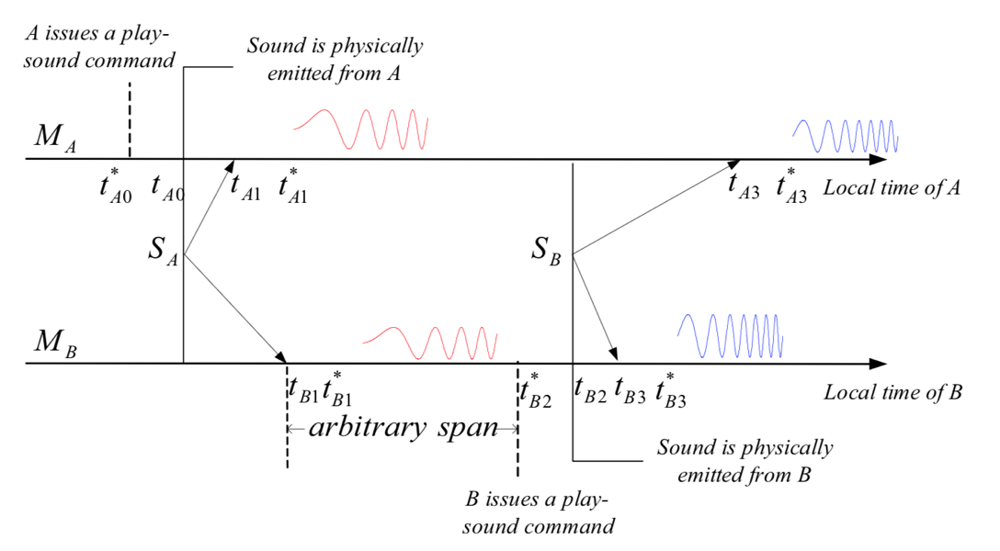

# Acoustic Ranging

In the previous chapter on wireless ranging, we introduced the basic principles of wireless distance measurement. This section presents two case studies using acoustic signals for ranging, both based on Time-of-Flight (ToF). The first method uses reflected signals and employs Frequency-Modulated Continuous Wave (FMCW) for ranging; the second is based on one-way two-way ranging, measuring the distance between two devices.

## FMCW Ranging

We generate an FMCW signal using sound waves and demonstrate how to extract the frequency difference between the received and transmitted signals to achieve ranging.

Assume a stationary sound source S and a recording device D that is also stationary relative to S. The signal emitted by the source is:

$$
S(t) = cos\bigg(2\pi\big(f_{min} + \frac{B}{2T}\big)t\bigg)
$$

where $S$ is the transmitted signal, $f_{min}$ is the minimum frequency of the FMCW, $B = f_{max} - f_{min}$ is the bandwidth of the FMCW frequency, $T$ is the period, and $t$ is the time within one period, i.e., $0 < t < T$. Therefore, the signal received at the receiver is:

$$
L(t) = Acos\bigg( 2\pi \big(f_{min} + \frac{B}{2T}(t-t_d) \big) \big(t-t_d \big) \bigg)
$$

where A is an attenuation factor, and $t_d$ is the time delay required for the signal to travel from transmitter to receiver. Using the product-to-sum identity ($cosAcosB = \big(cos(A+B) + cos(A-B)\big)/2$), multiplying $S(t)$ and $L(t)$, and filtering out the high-frequency components (retaining only terms corresponding to $cos(A-B)$), we obtain:

$$
V(t)=\frac{A}{2} \cos \left(2 \pi f_{\min } t_{d}+\frac{\pi B\left(2 t t_{d}-t_{d}^{2}\right)}{T}\right)
$$

Assuming the distance between the recording device and the speaker is R, then $t_d = \frac{R}{c}$. Substituting into $V(t)$ yields:

$$
V(t)=\frac{A}{2} \cos \left(2 \pi f_{\min } \frac{R}{c}+\left(\frac{2 \pi B R t}{c T}-\frac{\pi B R^{2}}{c^{2} T}\right)\right)
$$

At this point, $V(t)$ becomes a single-frequency signal. Applying a Fourier transform reveals a peak at frequency $𝑓=𝐵𝑅/𝑐𝑇$; the index of this peak allows us to determine the frequency difference between the received and transmitted signals.

> In practice, smartphones can be used to transmit and receive these acoustic signals—essentially playing sounds and recording them.

**Implementation of FMCW Ranging**

Direct use of FMCW signals for ranging requires precise clock synchronization between the transmitting and receiving devices so that the frequency difference between transmitted and received signals can be extracted via signal multiplication at the receiver. In practical systems, this synchronization requirement can be met by using the same device to both send and receive signals. Thus, when measuring the distance from a device to a target object, the device emits an FMCW signal, which reflects off the target and returns to the ranging device. The device captures the reflected signal and compares it with the original transmitted signal to compute the distance. This process requires the ranging device to operate in full-duplex mode—simultaneously transmitting and receiving signals.

FMCW Ranging Implementation:
- Objective: Use FMCW acoustic signals to measure the distance between a device and a target object.
- Transmit Signal: Multiple FMCW chirp signals, each followed by a silent interval equal in duration to the chirp.
- Steps:
  - 1. Generate a pseudo-transmitted signal.
  - 2. Multiply the pseudo-transmitted signal with the received signal and apply Fourier transform to obtain frequency offset.
  - 3. Determine the frequency offset of each received signal relative to its starting position, thereby calculating distance over time.

```matlab
%% Generate transmit signal
fs = 48000;
T = 0.04;
f0 = 18000; % start freq
f1 = 20500;  % end freq
t = 0:1/fs:T ;
data = chirp(t, f0, T, f1, 'linear');
output = [];
for i = 1:88
    output = [output,data,zeros(1,1921)];
end
 
%% Read and filter received signal
[mydata,fs] = audioread('fmcw_receive.wav');
mydata = mydata(:,1);
 
hd = design(fdesign.bandpass('N,F3dB1,F3dB2',6,17000,23000,fs),'butter'); % Apply bandpass filter—consider why
mydata=filter(hd,mydata);
% figure;
% plot(mydata);
 
%% Generate pseudo-transmitted signal
pseudo_T = [];
for i = 1:88
    pseudo_T = [pseudo_T,data,zeros(1,T*fs+1)];
end
 
[n,~]=size(mydata);
 
% Starting position of FMCW signal
start = 38750; 
pseudo_T = [zeros(1,start),pseudo_T];
[~,m]=size(pseudo_T);
pseudo_T = [pseudo_T,zeros(1,n-m)];
s=pseudo_T.*mydata';
 
len = (T*fs+1)*2; % Total length of chirp and following silence
fftlen = 1024*64; % Zero-padding length for FFT. Increasing zero-padding improves frequency resolution. Try different lengths.
f = fs*(0:fftlen -1)/(fftlen); %% Frequency bins after zero-padded FFT

%% Compute frequency offset for each chirp
for i = start:len:start+len*87
   FFT_out = abs(fft(s(i:i+len/2),fftlen));
   [~, idx] = max(abs(FFT_out(1:round(fftlen/10))));
   idxs(round((i-start)/len)+1) = idx;
end

%% Calculate distance from frequency offset (delta f)
start_idx = 0;
delta_distance = (idxs - start_idx) * fs / fftlen * 340 * T / (f1-f0);
 
%% Plot distance
figure;
plot(delta_distance);
xlabel('time(s)', 'FontSize', 18);
ylabel('distance (m)', 'FontSize', 18);
```
<center>

</center>

<center>
<div style="color:orange; border-bottom: 1px solid #d9d9d9;
display: inline-block;
color: #999;
padding: 2px;">Fig. FMCW Ranging</div>
</center>

## Acoustic Round-Trip Time Ranging

Accurate ranging can be achieved using the round-trip time of sound between two devices. Several methods based on acoustic round-trip time have been proposed [1]. Below, we introduce a typical acoustic-based ranging approach. Both devices involved must have speakers and microphones, as shown below:

<center>

</center>

<center>
<div style="color:orange; border-bottom: 1px solid #d9d9d9; display: inline-block;color: #999;padding: 2px;">Fig. BeepBeep Ranging Diagram</div>
</center>

Devices $A$ and $B$ both transmit and receive acoustic signals. Each device receives not only the signal sent by the other device but also the signal emitted by its own speaker. The core ranging principle is illustrated below:

<center>

</center>

<center>
<div style="color:orange; border-bottom: 1px solid #d9d9d9; display: inline-block;color: #999;padding: 2px;">Fig. Ranging Principle</div>
</center>

The two arrows represent timelines for device $A$ ($M_A$) and device $B$ ($M_B$), showing sequential operations from left to right:

1. At time $t^*_{A0}$, device $A$ issues a command in software to play a sound. However, due to software/hardware scheduling delays, the actual playback begins at time $t_{A0}$, introducing a delay relative to $t^*_{A0}$.

2. Device $A$ detects its own played sound through its microphone at time $t_{A1}$. Due to processing delays, the application registers reception at a later time $t^*_{A1}$.

3. Device $B$ also receives the sound from device $A$. Similar to above, the sound physically arrives at device $A$’s microphone at $t_{B1}$, but the application detects it at $t^*_{B1}$.

4. After receiving the sound from device $B$, device $A$ initiates playback at $t^∗_{B2}$. As before, actual emission occurs at $t_{B2}$ due to system latency.

5. The sound from device $t_{B3}$ reaches its own microphone at $B$, but the application registers it at $t^∗_{B3}$.

6. The sound from device B reaches device A’s microphone at $t_{A3}$, and the application detects it at $t^∗_{A3}$.

Using these timestamps, we derive formulas relating device distance and timing. Let the speed of sound be $c$. Define $d_{X,Y}$ as the distance from the speaker of device $X$ to the microphone of device $Y$. For example, $d_{A,B}$ denotes the distance from device $A$'s speaker to device $B$'s microphone, and $d_{A,A}$ represents the internal distance from device A's speaker to its own microphone. Then:

$$
d_{A,A}=c(t_{A1}-t_{A0}), d_{A,B}=c(t_{B1}-t_{A0}), d_{B,A}=c(t_{A3}-t_{B2}), d_{B,B}=c(t_{B3}-t_{B2})
$$

The inter-device distance $D$ between devices $A$ and $B$ is given by:

$$
D = \frac{1}{2}(d_{A,B}+d_{B,A})
$$

Simplifying:

$$
D = \frac{𝑐}{2}[(𝑡_{𝐴3}−𝑡_{𝐴1})-(𝑡_{𝐵3}−𝑡_{𝐵1})]+\frac{𝑑_{𝐴,𝐴}+𝑑_{𝐵,𝐵}}{2}
$$

Here, $𝑑_{𝐴,𝐴}$ and $𝑑_{𝐵,𝐵}$ depend only on device-specific hardware design and can be pre-calibrated before ranging. Hence, the final distance depends solely on two measurable time differences: $𝑡_{𝐴3}−𝑡_{𝐴1}$ and $𝑡_{𝐵3}−𝑡_{𝐵1}$, which can be independently measured on devices $A$ and $B$ without requiring clock synchronization between $A$ and $B$.

For device $A$, during ranging, the microphone remains active. From the received signal, we identify the arrival times of its own transmitted sound $𝑡^*_{𝐴1}$ and the sound from device $B$ $𝑡^*_{𝐴3}$. Then, $t^*_{𝐴3}−𝑡^*_{𝐴1}$ approximates $𝑡_{𝐴3}−𝑡_{𝐴1}$.

Thus, the ranging problem reduces to detecting the onset of received signals.

**Mobile Phone Ranging Based on Acoustic Round-Trip Time**

This implementation uses two computers as ranging devices, programmed in `Matlab`. To transfer the time difference measured on device $B$ back to device $A$ for distance calculation, a TCP connection is established between devices $A$ and $B$ for data transmission over a local network. Here, device $A$ acts as the TCP server, while device $B$ serves as the client.

Device $A$:

```matlab
%%
% TCP connection settings—IP and port can be customized, must match on both devices
IP = '0.0.0.0';
PortN = 20000;

% Device A transmits a linear chirp signal from 4000Hz to 6000Hz, lasting 0.5 seconds
fs = 48000;
T = 0.5;
f1 = 4000; f2 = 6000; f3 = 8000;
t = linspace(0, T, fs * T);
y = chirp(t, f1, T, f2);
%%
% Start TCP server
Server = tcpip(IP, PortN, 'NetworkRole', 'server');
fopen(Server);
%%
Rec = audiorecorder(fs, 16, 1);
fprintf(Server, 'Server Ready');     % Send ready message to client—Device A prepared to emit sound
rdy = fgetl(Server);                % Receive readiness confirmation from client
record(Rec, T * 6);                 % Start recording on Device A
soundsc(y, fs, 16);                 % Emit sound from Device A
pause(T * 6);                       % Wait for recording to complete
%%
recvData = getaudiodata(Rec)';
spectrogram(recvData, 128, 120, 128, fs);

% Detect signal start positions
z1 = chirp(t, f1, T, f2); z1 = z1(end:-1:1);
z2 = chirp(t, f2, T, f3); z2 = z2(end:-1:1);
[~, p1] = max(conv(recvData, z1, 'valid'));
[~, p2] = max(conv(recvData, z2, 'valid'));

% Verify detected positions against spectrogram
p1 = (p1 - 1) / fs;
p2 = (p2 - 1) / fs;
hold on;
plot([0, fs / 1000 / 2], [p1, p1], 'r-');
plot([0, fs / 1000 / 2], [p2, p2], 'b-');

% Receive time difference calculated by Device B (converted from sample count)
psub = fgetl(Server);
psub = str2double(psub) / fs;

% Speed of sound = 343 m/s; self-distance (speaker to mic) = 20 cm
dAA = 0.2;
dBB = 0.2;
fprintf('Result: %f\n', 343 / 2 * (p2 - p1 - psub) + dAA + dBB);

%%
fclose(Server);
```

Device $B$:

```matlab
%%
% TCP connection settings—must match Device A
IP = '0.0.0.0';
PortN = 20000;

% Device B transmits a linear chirp from 6000Hz to 8000Hz, lasting 0.5 seconds
fs = 48000;
T = 0.5;
f1 = 4000; f2 = 6000; f3 = 8000;
t = linspace(0, T, fs * T);
y = chirp(t, f2, T, f3);
%%
% Start TCP client
Client = tcpip(IP, PortN, 'NetworkRole', 'client');
fopen(Client);
%%
Rec = audiorecorder(fs, 16, 1);
rdy = fgetl(Client);                % Receive readiness from server
fprintf(Client, 'Client Ready');    % Notify server—Device B ready to emit sound
record(Rec, T * 6);                 % Start recording on Device B
pause(T * 3);                       % Wait to receive Device A's sound
soundsc(y, fs, 16);                 % Emit sound from Device B
pause(T * 3);                       % Wait for recording to finish
%%
recvData = getaudiodata(Rec)';
spectrogram(recvData, 128, 120, 128, fs);

% Detect signal start positions
z1 = chirp(t, f1, T, f2); z1 = z1(end:-1:1);
z2 = chirp(t, f2, T, f3); z2 = z2(end:-1:1);
[~, p1] = max(conv(recvData, z1, 'valid'));
[~, p2] = max(conv(recvData, z2, 'valid'));

% Send computed time difference (in samples) to server
psub = num2str(p2 - p1);
fprintf(Client, psub);

% Visual verification on spectrogram
p1 = (p1 - 1) / fs;
p2 = (p2 - 1) / fs;
hold on;
plot([0, fs / 1000 / 2], [p1, p1], 'r-');
plot([0, fs / 1000 / 2], [p2, p2], 'b-');
%%
fclose(Client);
```

> **Thought Questions**
> 1. Which software/hardware-induced errors does the above method eliminate? Which remain unaddressed?
> 2. How could the total time per ranging measurement be reduced? Hint: Must device $A$ wait until it fully receives device $B$'s sound before responding?

## References
[1] Peng, Chunyi & Shen, Guobin & Zhang, Yongguang & Li, Yanlin & Tan Kun. (2007). BeepBeep: A high accuracy acoustic ranging system using COTS mobile devices. SenSys. 1-14. 10.1145/1322263.1322265.