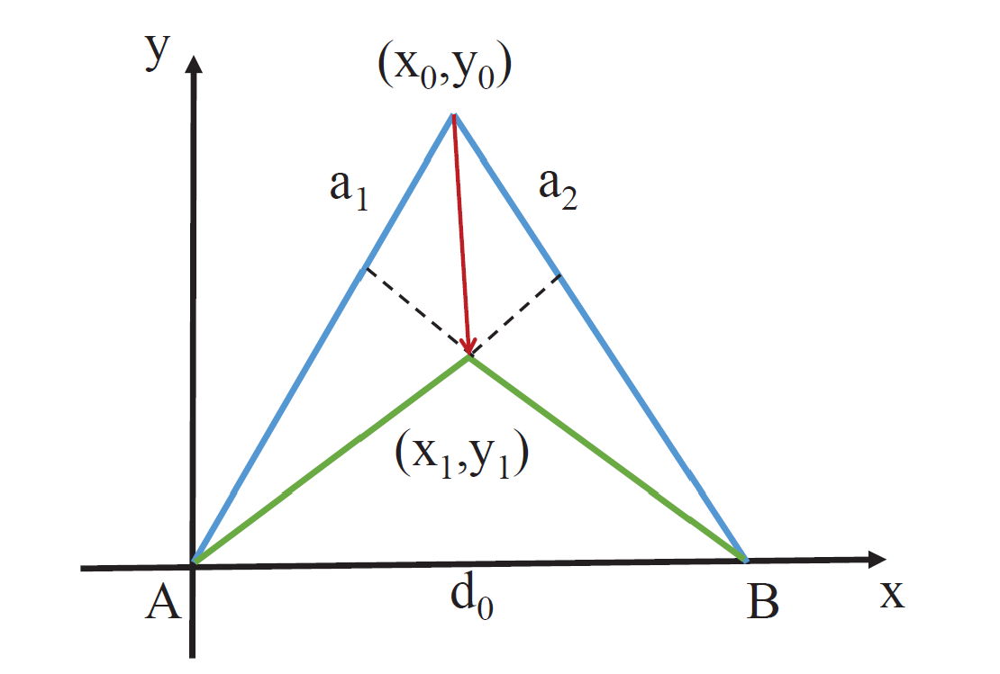

# Acoustic Motion Tracking

Acoustic waves enable high-precision motion tracking of moving sound sources. This section introduces two representative case studies.

## High-Precision Device Tracking Based on Signal Phase

The phase-based tracking method and its associated implementation code were introduced earlier in the “Wireless Tracking” chapter; readers are encouraged to revisit that section. The core of phase-based tracking lies in computing the phase variation of the received signal. Classical methods for estimating phase variation suffer from limited phase resolution, constrained by the signal sampling rate. Moreover, the sampling rate of acoustic signals is subject to both hardware and software limitations. Consequently, improving tracking accuracy solely by increasing the sampling rate is typically impractical.

Here, we introduce a novel phase-based tracking method proposed in our INFOCOM paper *Vernier* [1], which enhances the accuracy of phase-variation-based tracking without increasing the signal sampling rate.

First, consider an analogous example of indirect resolution enhancement—the vernier caliper. A vernier caliper is a precision instrument used to measure linear dimensions. It consists of two main components: a main scale and a movable vernier scale that slides along the main scale. Both scales feature markings, but their respective graduations differ slightly in spacing. Typically, the main scale is marked in integer millimeters, whereas the vernier scale’s graduations differ minutely from those of the main scale.

<center>
    
    <br>
    <div style="color:orange; border-bottom: 1px solid #d9d9d9;
    display: inline-block;
    color: #999;
    padding: 2px;">Figure 1. Schematic diagram of a vernier caliper</div>
</center>

For a typical vernier caliper, the main scale graduation interval is 1 mm, while the vernier scale graduation interval is 0.9 mm. Suppose the length to be measured is $r$; then:

$$
r-r'+0.9x=1.0x
$$

where $r’$ denotes the floor of $r$, and $x$ indicates the index of the vernier scale graduation that aligns precisely with a main scale graduation. Rearranging yields:

$$
r-r'=0.1x
$$

Since each increment of one vernier scale division increases the misalignment relative to the main scale by 0.1 mm, this principle enables finer-length measurements. Notably, the measurement resolution of a vernier caliper is fundamentally determined not by the difference between the two scale intervals, but rather by their greatest common divisor.

### Measuring Signal Phase Variation

Next, we present a phase-variation measurement technique inspired by the vernier caliper principle.

We define two variables:

LMP (Local Max Prefix): Within a signal sampling window, the LMP of the first sample point is defined as 0. Starting from the second sample point, if a sample value (i.e., the signal amplitude at that point) is greater than both its preceding and succeeding values, its LMP equals the LMP of the preceding point plus 1; otherwise, its LMP equals that of the preceding point.

LMPS (Local Max Prefix Sum): LMPS is the sum of all LMP values across all samples within a window.

Assume that an audio recording device captures two equal-duration audio segments, $w_1$ and $w_2$, at times $t_1$ and $t_2$, respectively. Each segment contains exactly $p$ full cycles of the acoustic signal, corresponding to precisely $p$ samples. Let the LMPS values of $w_1$ and $w_2$ be $L_1$ and $L_2$, respectively. Then the phase variation between the two windows is $\Delta \phi = (L_2 - L_1)2\pi /q$, and the corresponding distance variation is $\Delta d = \lambda \Delta \phi/2\pi$, where $c$ denotes the speed of sound in air.

<center>
    
    <br>
    <div style="color:orange; border-bottom: 1px solid #d9d9d9;
    display: inline-block;
    color: #999;
    padding: 2px;">Figure 2. Illustration of LMP and LMPS</div>
</center>

As shown, within a time window, $p = 3$, $q = 13$. The LMP values of the sampled points are illustrated, and the LMPS of the signal is 26.

<center>
    
    <br>
    <div style="color:orange; border-bottom: 1px solid #d9d9d9;
    display: inline-block;
    color: #999;
    padding: 2px;">Figure 3. Vernier-based phase variation measurement schematic</div>
</center>

When the signal phase advances by $2\pi / q$, the LMPS increases by 1.

Thus, when $p = 3$ and $q = 13$, each unit increase in LMPS corresponds to a phase shift of $2\pi / 13$, and a distance change (decrease) of $\lambda / 13$.

This approach enables higher-precision phase-variation-based tracking.

Without altering the sampling rate, the ratio $p$ to $q$ can be tuned by adjusting the transmitted signal frequency. For instance, with a sampling rate $44100 Hz$, selecting a sound frequency $20000 Hz$ yields $p = 200$ and $q = 441$. Under these conditions, the localization accuracy of this method is:

$$
\frac{340}{20000 \times 441} m = 0.0000385 m = 0.0385 mm
$$

The concrete implementation code is provided below (`res/phase_Vernier.m`):

```matlab
% Read audio file
[data,fs] = audioread('record.wav');
% Extract first channel
data=data(:,1);
% Convert data to row vector
data=data.';

% Apply bandpass filter for noise suppression
bp_filter = design(fdesign.bandpass('N,F3dB1,F3dB2',6,20800,21200,fs),'butter');
data = filter(bp_filter,data);

%% Compute LMP and LMPS variations
% fs=48000
f0 = 21000;
c = 340;

% fs:f0=16:7
% Use 16 samples per window, each containing 7 signal cycles
slice_len = 16;
p=7;

slice_num=floor(length(data)/slice_len);
lmps=zeros(1,slice_num);
for i = 0:1:slice_num-1
    lmp=0;
    sum=0;
    for j=2:1:slice_len-1
        if data(i*slice_len+j)>data(i*slice_len+j+1) && data(i*slice_len+j)>data(i*slice_len+j-1)
            lmp=lmp+1;
        end
        sum=sum+lmp;
    end
    sum=sum+lmp;
    lmps(i+1)=sum;
end

%% Repair anomalous data
% Upper and lower bounds for LMPS are 60 and 45, respectively
u_bound=60;
l_bound=45;

for i = 2:length(lmps)
    % Replace out-of-bound values with the previous time-slice value
    if lmps(i)<l_bound
        lmps(i)=lmps(i-1);
    elseif lmps(i)>u_bound
        lmps(i)=lmps(i-1); 
    end
end

%% Compute phase and distance variations
% Compensate for phase jumps
bias=0;
phase=lmps;
for i=2:length(phase)
    if lmps(i-1)>u_bound-4 && lmps(i)<l_bound+4
        bias=bias+1;
    elseif lmps(i-1)<l_bound+4 && lmps(i)>u_bound-4
        bias=bias-1;
    end
    phase(i)=lmps(i)+bias*slice_len;
end
phase = phase*2*pi/slice_len;

% Set initial phase to zero
phase = phase-phase(1);

distance = - phase /(2*pi*f0) *c;

delta_t = slice_len/fs;
time = 1:slice_num;
time = time*delta_t;

plot(time,distance)
title('Phase-Based Tracking (Vernier)');
xlabel('Time (s)');
ylabel('Distance (m)');
```

A sound source emits a 21-kHz acoustic signal. During audio recording, the mobile device first moves 10 cm away from the source, then another 20 cm away, and finally returns to its initial position. The tracking result is shown below:

<center>
    
</center>

The results demonstrate that this method accurately tracks device motion.

### **Two-Dimensional Position Tracking**

As illustrated below, assume the tracked device initially resides at point $C$ ($$x_0$$, $$y_0$$) and moves to point $D$ ($$x_1$$, $$y_1$$) over time. Since the initial coordinates are known, distances $AC$ and $BC$ can be computed directly. Given the distance variations $$a_1$$ and $$a_2$$ relative to two acoustic sources $A$ and $B$, distances $AD$ and $BD$ follow immediately. As the inter-source distance $AB$ is pre-measured, triangle $$\Delta$ABD$ has all three side lengths known; thus, the coordinates of point $D$ ($$x_1$$, $$y_1$$) can be uniquely determined.

<center>

</center>

<center>
<div style="color:orange; border-bottom: 1px solid #d9d9d9;
display: inline-block;
color: #999;
padding: 2px;">Figure. Two-dimensional localization method</div>
</center>

## Two-Dimensional Tracking Based on FMCW

Inspired by the FMCW-based tracking principle introduced in the “Wireless Tracking” chapter, this method computes distance variations by comparing the frequency shift between transmitted and received signals during motion, and performs continuous target localization via simultaneous multi-base-station distance measurements.

Similarly, experiments are conducted using smartphone platforms and loudspeakers.

### System Design

**Signal Design**

Two-dimensional localization requires measuring distance variations from the microphone to at least two loudspeakers. Thus, both hardware and signal design differ from one-dimensional ranging.

On the hardware side, we retain ordinary smartphones as receivers; for transmitters, we employ two loudspeakers.

Regarding signal design, leveraging stereo audio playback capability, we generate distinct left- and right-channel signals played simultaneously on the two loudspeakers.

Our signal design ensures that the two loudspeakers do not emit sound concurrently, thereby avoiding complex filtering and alignment operations during signal processing. Even concurrent emission would be feasible; however, for simplicity, the implementation herein adopts sequential playback.

Specifically, the transmitted signal structure is:

`FMCW for start-point detection + Time-division FMCW on left/right channels`,  
with a 100-ms period for the time-division FMCW on left/right channels structured as follows (`$` denotes an FMCW chirp; blank spaces denote silence):

~~~
+------------------------------------+
| 40ms       |10ms| 40ms        |10ms| <- duration: 100ms
+------------------------------------+
|$$$$$$$$$$$$|    |             |    | <- right channel
+------------------------------------+
|                 |$$$$$$$$$$$$$|    | <- left channel
+------------------------------------+
~~~

**Localization and Tracking Procedure**

- **Start-point detection**: To address the ambiguity in one-dimensional ranging where “approaching then receding” may erroneously yield an initial distance increase followed by decrease, we intentionally shift the start point backward by 100–200 samples. This ensures the initial measured distance is inflated, enabling unambiguous detection of initial distance reduction.
- **Dual-channel distance estimation**: Since left- and right-channel signals are synchronized, we apply the same one-dimensional ranging method—partitioning the recorded signal into time slices—to independently estimate distances to each loudspeaker. Note that within each 100-ms cycle, distance measurements to the two loudspeakers are temporally offset by 50 ms. However, given low-speed motion assumptions, this timing offset is currently neglected. Interested readers may explore improvements to mitigate this error source.
- **Filtering and data processing**: Different filters are applied to the acquired data—a critical step in localization and tracking. Familiarity with various filtering techniques and data-processing methods is essential. In this implementation, Hampel filtering and Kalman filtering are employed to suppress outliers and random disturbances in distance measurements.
- **Two-dimensional coordinate computation**: After subtracting the initial measurement (first value) from all subsequent distance readings, the resulting distance variations are fed into a two-circle intersection algorithm to compute the two-dimensional position, given the known initial position.

### Experiments and Analysis

Two-dimensional localization experiments were conducted under three distinct scenarios, depicted in the figures below:

<center>
    
    <br>
    <div style="color:orange; border-bottom: 1px solid #d9d9d9;
    display: inline-block;
    color: #999;
    padding: 2px;">Figure. Vertical movement experimental setup</div>
</center>

<center>
    
    <br>
    <div style="color:orange; border-bottom: 1px solid #d9d9d9;
    display: inline-block;
    color: #999;
    padding: 2px;">Figure. Diagonal movement experimental setup</div>
</center>

<center>
   
    <br>
    <div style="color:orange; border-bottom: 1px solid #d9d9d9;
    display: inline-block;
    color: #999;
    padding: 2px;">Figure. Horizontal movement experimental setup</div>
</center>

| No. | Initial Position | Loudspeaker Positions     | Movement Pattern |
|-----|------------------|---------------------------|------------------|
| 1   | (0,0)            | (0.40,0), (-0.40,0)       | Vertical         |
| 2   | (0,0)            | (0.40,0), (-0.40,0)       | Vertical         |
| 3   | (0.40, 0.05)     | (0.40,0), (-0.40,0)       | Diagonal         |
| 4   | (0.40, 0.05)     | (0.40,0), (-0.40,0)       | Diagonal         |
| 5   | (0.40, 0.42)     | (0.40,0), (-0.40,0)       | Horizontal       |

### Experimental Results

**Distance Measurements**

<center>
    
    <br>
    <div style="color:orange; border-bottom: 1px solid #d9d9d9;
    display: inline-block;
    color: #999;
    padding: 2px;">Figure. Distance measurement result for Experiment 1</div>
</center>
<center>
    
    <br>
    <div style="color:orange; border-bottom: 1px solid #d9d9d9;
    display: inline-block;
    color: #999;
    padding: 2px;">Figure. Distance measurement result for Experiment 2</div>
</center>
<center>
    
    <br>
    <div style="color:orange; border-bottom: 1px solid #d9d9d9;
    display: inline-block;
    color: #999;
    padding: 2px;">Figure. Distance measurement result for Experiment 3</div>
</center>
<center>
   
    <br>
    <div style="color:orange; border-bottom: 1px solid #d9d9d9;
    display: inline-block;
    color: #999;
    padding: 2px;">Figure. Distance measurement result for Experiment 4</div>
</center>
<center>
    
    <br>
    <div style="color:orange; border-bottom: 1px solid #d9d9d9;
    display: inline-block;
    color: #999;
    padding: 2px;">Figure. Distance measurement result for Experiment 5</div>
</center>

From Experiments 3, 4, and 5, it is evident that applying filters yields smoother distance estimates. Even with large initial errors or prolonged deviations, the filtered outputs recover robustly.

### Localization Results

<center>
    
    <br>
    <div style="color:orange; border-bottom: 1px solid #d9d9d9;
    display: inline-block;
    color: #999;
    padding: 2px;">Figure. Tracking performance for Experiment 1</div>
</center>

<center>
   
    <br>
    <div style="color:orange; border-bottom: 1px solid #d9d9d9;
    display: inline-block;
    color: #999;
    padding: 2px;">Figure. Tracking performance for Experiment 2</div>
</center>

<center>
    
    <br>
    <div style="color:orange; border-bottom: 1px solid #d9d9d9;
    display: inline-block;
    color: #999;
    padding: 2px;">Figure. Tracking performance for Experiment 3</div>
</center>

<center>
    
    <br>
    <div style="color:orange; border-bottom: 1px solid #d9d9d9;
    display: inline-block;
    color: #999;
    padding: 2px;">Figure. Tracking performance for Experiment 4</div>
</center>

<center>
    
    <br>
    <div style="color:orange; border-bottom: 1px solid #d9d9d9;
    display: inline-block;
    color: #999;
    padding: 2px;">Figure. Tracking performance for Experiment 5</div>
</center>

The reconstructed trajectories broadly reflect actual motion patterns, though residual errors remain substantial. First, distance-variation-based localization demands highly accurate reference values; any significant initial offset propagates as cumulative error. Second, manual smartphone manipulation introduces mechanical jitter, contributing further to inaccuracies. Despite these limitations, this implementation serves as a solid foundational codebase for hands-on experimentation.

> Readers are encouraged to consider how to improve tracking performance here—significant enhancements are achievable.

### Experimental Code and Data

**Tracking Experiment Code**

~~~matlab
%% Transmitted signal generation
fs = 44100;
T = 0.04;
chirp_samples = T *fs;
stop06 = 0.06;
stop05 = 0.05;
stop01 = 0.01;
f0 = 16000; % start freq
f1 = 18000;  % end freq

blank06 = zeros(1,stop06*fs);
blank05 = zeros(1,stop05*fs);
blank01 = zeros(1,stop01*fs);
t = (0:1:T*fs-1)/fs;
data = chirp(t, f0, T, f1, 'linear');
output = [];
bf0 = 8000;
bf1 = 9000;
begin = chirp(t, bf0, T, bf1, 'linear');
repeat = 85;
~~~

~~~matlab
%% Received signal loading, filtering, start-point detection, and frequency-offset calculation
filename = '5.wav'; % Modify filename here
[mydata,fs] = audioread(filename);

mydata = mydata(:,1);
[c, lags] = xcorr(mydata, begin); % Many alternative methods exist; consider them.
[~, i] = max(abs(c));
idx = lags(i);

hd = design(fdesign.bandpass('N,F3dB1,F3dB2',6,14000,20000,fs),'butter');
mydata=filter(hd,mydata);

%% Generate pseudo-transmitted signal
pseudo_T = [];
for i = 1:repeat
    pseudo_T = [pseudo_T,data,blank01,data,blank01];
end
 
[n,~]=size(mydata);
 
% Start position of FMCW signal is at 'start'
start = idx+0.1*fs-100; 
pseudo_T = [zeros(1,start),pseudo_T];
[~,m]=size(pseudo_T);
pseudo_T = [pseudo_T,zeros(1,n-m)];
 
s=pseudo_T.*mydata';
 
len = (0.1*fs); % Total length of chirp signal plus trailing silence
fftlen = 1024*64; % Zero-padding length for FFT. Padding increases frequency resolution. Try varying padding lengths to assess impact.
f = fs*(0:fftlen -1)/(fftlen); %% Frequency sampling points after zero-padded FFT
% These parameters are neither fixed nor necessarily optimal; adjust thoughtfully.

%% Compute frequency offset for each chirp segment
deltaf1 = [];
deltaf2 = [];
for i = start:len:start+len*(repeat-1)
   chunk1 = s(i:i+chirp_samples);
   chunk2 = s(i+length(blank05):i+length(blank05)+chirp_samples);
   FFT_out1 = abs(fft(chunk1,fftlen));
   FFT_out2 = abs(fft(chunk2,fftlen));
   [~, index1] = max(FFT_out1);
   [~, index2] = max(FFT_out2);
   deltaf1 = [deltaf1 f(index1)];
   deltaf2 = [deltaf2 f(index2)];
end
 
%% Compute distance variations
D1 =  deltaf1 * 340 /(f1-f0) * T;
D2 =  deltaf2 * 340 /(f1-f0) * T;
figure
plot(D1)
hold on
plot(D2)
legend('Distance1', 'Distance2' )

start = 1 % Discard initial samples to mitigate cumulative error from early inaccuracies
D1 = D1(start:end);
D2 = D2(start:end);
~~~

~~~matlab
%% Filtering, denoising, and trajectory visualization
figure;
plot(D1-D1(1));
hold on;
plot(D2-D2(1));
kd1 = kalman(hampel(D1,15), 5e-4, 0.0068);
kd2 = kalman(hampel(D2,15), 5e-4, 0.0068);
kd1 = kd1 - kd1(1);
kd2 = kd2 - kd2(1);
kd1 = hampel(kd1, 7);
kd2 = hampel(kd2, 7);

%% Visualize distance variations
plot(kd1, 'LineWidth',2);
plot(kd2, 'LineWidth',2);
grid on
legend('Distance1', 'Distance2','Distance1(filter)', 'Distance2(filter)' )
legend('Location','best')
ylabel('m')

%% Compute two-dimensional positions
if strcmp(filename, '1.wav') ||strcmp(filename, '2.wav')
    start = [0, 0];
end
if strcmp(filename, '3.wav') ||strcmp(filename, '4.wav')
   start = [0.40, 0.05];  
end

if  strcmp(filename, '5.wav')
   start = [0.40, 0.42];  
end
speakers = [0.40 0; -0.40 0];
pd1 = pdist([start; speakers(1,:)]);
pd2 = pdist([start; speakers(2,:)]);

kd1 = kd1 + pd1;
kd2 = kd2 + pd2;
xs = zeros(1,length(kd1));
ys = zeros(1,length(kd1));
figure
scatter([0.40 -0.40], [0 0] ,'b*', 'LineWidth',5,'DisplayName','Speaker positions')
xlabel('X/(m)')
grid on

text(0.40,0.05,'Speaker1')
text(-0.40,0.05,'Speaker2')
ylabel('Y/(m)')
title('Coordinate System')
hold on
xs(1) = start(1);
ys(1) = start(2);
for i= 2:length(kd1)
    [xout,yout] = circcirc(speakers(1,1),speakers(1,2),kd1(i),speakers(2,1),speakers(2,2),kd2(i));
    xs(i) = real(xout(2));
    ys(i) = real(yout(2));
    if isnan(xs(i))
       xs(i) = xs(i-1);
       ys(i) = ys(i-1);
    end
    
end
xs_ = kalman(xs,5e-2, 0.05);
ys_ = kalman(ys, 5e-2, 0.05);

plot(xs_,ys_,':r+', 'LineWidth',2, 'DisplayName','Smoothed trajectory');
plot(xs,ys,':g.', 'DisplayName','Raw trajectory');

if strcmp(filename, '1.wav') ||strcmp(filename, '2.wav')
    plot([0 0 -0.40],[0 0.5 0.5], '--b','LineWidth',2, 'DisplayName','True trajectory')
end

if strcmp(filename, '3.wav') ||strcmp(filename, '4.wav')
    plot([0.40  -0.40],[0 0.8], '--b','LineWidth',2, 'DisplayName','True trajectory')
end

if  strcmp(filename, '5.wav')
    plot([0.40 -0.40],[0.42 0.42], '--b','LineWidth',2, 'DisplayName','True trajectory')
end
legend
~~~

~~~matlab
%% Kalman filter implementation
function xhat =  kalman(D, Q, R)
    sz = [1 length(D)];
    xhat = zeros(sz); 
    P= zeros(sz);
    xhatminus = zeros(sz);
    Pminus = zeros(sz);
    K = zeros(sz);
    xhat(1) = D(1); 
    P(1) =0; % Initial estimation error variance
    
    for k = 2:length(D)
        % Time update (prediction)
        % Predict current state using previous optimal estimate
        xhatminus(k) = xhat(k-1);
        % Predicted error variance equals previous optimal estimate variance plus process noise variance
        Pminus(k) = P(k-1)+Q;
        % Measurement update (correction)
        % Compute Kalman gain
        K(k) = Pminus(k)/( Pminus(k)+R );
        % Correct prediction using current measurement to obtain optimal estimate with minimal mean-square error
        xhat(k) = xhatminus(k)+K(k)*(D(k)-xhatminus(k));
        % Compute final estimation error variance
        P(k) = (1-K(k))*Pminus(k);
    end
end
~~~

Note that this code contains rich technical content; careful reading is recommended. Furthermore, many parameters herein are suboptimal and offer room for improvement.

**Data Files**

- [1.wav](./res/1.wav)
- [2.wav](./res/2.wav)
- [3.wav](./res/3.wav)
- [4.wav](./res/4.wav)
- [5.wav](./res/5.wav)

## References

1. Yunting Zhang, Jiliang Wang, Weiyi Wang, Zhao Wang, Yunhao Liu. "Vernier: Accurate and Fast Acoustic Motion Tracking Using Mobile Devices", IEEE INFOCOM 2018.  
2. Linsong Cheng, Zhao Wang, Yunting Zhang, Weiyi Wang, Weimin Xu, Jiliang Wang. "Towards Single Source based Acoustic Localization", IEEE INFOCOM 2020.  
3. Pengjing Xie, Jingchao Feng, Zhichao Cao, Jiliang Wang. "GeneWave: Fast Authentication and Key Agreement on Commodity Mobile Devices", IEEE ICNP 2017