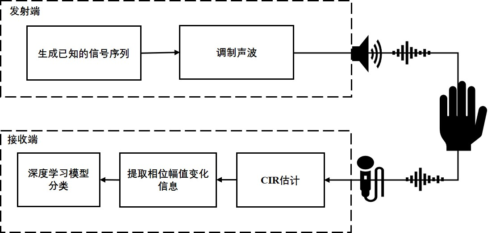

# Acoustic Gesture Recognition?? (This section requires reorganization)

Beyond localization and tracking, sensing more complex activities—such as gestures and motions—using wireless signals is an active research frontier in the IoT domain. The core principle relies on analyzing how a target object perturbs the transmitted signal. By examining the resulting signal variations, one can infer properties of the target—including its position, motion, orientation, and more.

To aid understanding, we illustrate gesture recognition using acoustic (ultrasonic) signals; the underlying methodology generalizes to other sensing scenarios. Grasping this acoustic example significantly facilitates comprehension of gesture recognition based on WiFi Channel State Information (CSI) or other wireless channel features. We encourage you to carefully reflect upon the following process.

The first challenge in acoustic gesture recognition is acquiring signal state information. In WiFi systems, CSI can be directly accessed—its acquisition mechanism need not be reconsidered here (indeed, the fundamental principles of CSI were introduced in the earlier “Signals” chapter).

One intuitive approach involves transmitting Frequency-Modulated Continuous-Wave (FMCW) or OFDM subcarriers and estimating finger displacement via phase shifts in the reflected signal—effectively performing acoustic-based localization and tracking. This technique was detailed in prior chapters and will not be elaborated further here.

However, such approaches face several key challenges:
- Reflections from hand motion are highly complex; the palm cannot be modeled simply as a single reflection point.
- Multipath propagation induces frequency-selective fading in acoustic signals.
- Static environmental objects generate spurious reflections that hinder gesture discrimination.

In this section, we instead leverage acoustic *channel impulse response* (CIR) information for gesture recognition. Specifically, we explore CIR-based gesture classification (if CIR is unfamiliar, please revisit the “Channel Characteristics” chapter). This paradigm closely mirrors numerous existing works using WiFi CSI for sensing—many of which continue to emerge rapidly. Their core conceptual framework is consistent; thus, we recommend using acoustic sensing as an accessible entry point to understand wireless sensing broadly.

The gesture recognition pipeline is illustrated below:

<center>

</center>

<center>
<div style="color:orange; border-bottom: 1px solid #d9d9d9;
display: inline-block;
color: #999;
padding: 2px;">Gesture recognition pipeline</div>
</center>

## Core Principles

1. **Channel Impulse Response (CIR) Extraction**
    $$
    r[n] = s[n] * h[n]
    $$
    A specially designed known acoustic waveform $s[n]$ is transmitted. Gestures in motion reflect this signal, producing a received waveform $r[n]$ at the microphone. Using standard channel estimation techniques, the CIR $h[n]$ is extracted. Fine-grained reflection characteristics—induced by gesture dynamics—are then derived through analysis and processing of $h(n)$.

2. **Mitigation of Environmental Interference**
    Besides gesture-induced reflections, static environmental objects also produce echoes. To suppress their influence:
    - Compute temporal differences (in both amplitude and phase) between consecutive CIRs to isolate dynamic components and attenuate static reflections.
    - Since the CIR’s vertical axis encodes distance, restrict analysis to a predefined range window aligned with typical gesture distances.

3. **Feature Extraction and Classifier Construction**
    Using the above CIR acquisition and preprocessing pipeline, large-scale real-world gesture data can be collected. Paired with corresponding gesture labels, these data train a custom-designed machine learning classifier. During inference, raw acoustic measurements are fed into the trained classifier to output the predicted gesture class (e.g., left–right or forward–backward hand sway relative to the microphone).

## Example Code and Data

### Recording Script
```matlab
fs = 48000;
%% Configuration
T = 0.1; % Chirp duration (seconds)
t = linspace(0,T,fs*T);
startFreq = 18000; % Chirp start frequency (Hz)
endFreq = 22000; % Chirp end frequency (Hz)
interval_T = 0.00; % Inter-chirp interval (set to 0 for contiguous chirps)
sampleCycles = 80; % Number of chirp repetitions
tt = linspace(0,interval_T,fs*interval_T);
intervalSignal = sin(2*pi*endFreq*tt);

warmUpT = 0.5; % Speaker warm-up duration to mitigate mechanical inertia effects
t_warm = linspace(0,warmUpT,fs*warmUpT);
warmUpSignal = sin(2*pi*startFreq*t_warm);

y = chirp(t, startFreq, T, endFreq); % Up-chirp signal
dy = chirp(t, endFreq, T, startFreq); % Down-chirp (ignored)

%% Generate playback waveform
playData = [];

for i = 1:sampleCycles
    playData = [playData, y, intervalSignal];
end
filename = sprintf("fmcw_s%d_e%d_c%d_t%d.wav",startFreq/1000,endFreq/1000,sampleCycles, T*1000);
audiowrite(filename, playData, fs);

%% Select playback device
info = audiodevinfo;
outputDevID = info.output(2).ID; % *Select appropriate device ID!*
playData = [warmUpSignal playData];
player1 = audioplayer([playData; zeros(size(playData))],fs,16,outputDevID);

%% Select recording device
inputDevID = info.input(2).ID; % *Select appropriate device ID!*
rec1 = audiorecorder(fs,16,2,inputDevID);

play(player1);
record(rec1,sampleCycles*T+1);
pause(sampleCycles*T+1+0.2);
ry = getaudiodata(rec1);
figure;
plot(ry);

%% Save recorded data
% save('record_static.mat');
% save('record_dynamic.mat');
```

### Data Processing Script
```matlab
close all;
load('record_static.mat');

%% Constants
chunk = (T+interval_T)*fs;
chirpLen = T*fs;
B = endFreq - startFreq;
maxRange = 2;
c = 343;
fMax = round(B*(maxRange/c)/T);
N = 8;
CIRData = zeros([sampleCycles,fMax*N]);
channel = 2;

%% Chirp alignment
[r, lags] = xcorr(ry(:,channel),y);
figure;
plot(ry(:,channel));

[pk, lk] = findpeaks(r,'MinPeakDistance',0.8*fs*T); % Detect peaks
[~, I] = maxk(pk,sampleCycles); % Retrieve top 'sampleCycles' peaks
figure;
plot(lags,r);
hold on;
plot(lags(lk),pk,'or');
plot(lags(lk(I)),pk(I),'pg');

asc_indexs = sort(I); % Sort indices ascending
indexs = lags(lk(I));
start_index = min(indexs); % Determine earliest alignment offset

%% CIR computation
for i = 1:sampleCycles
    offset = (i-1)*chunk;
    sig_up = ry(offset+start_index:offset+chirpLen+start_index-1,channel);
    sig_up = highpass(sig_up, 10000,fs);
    mixSigUp = sig_up .* y'; % Mix received signal with reference chirp
    fmixSigUp = lowpass(mixSigUp,fMax+100,fs); % Low-pass filter
    fftOut = abs(fft(fmixSigUp,fs*N)); % FFT
    CIRData(i,:) = fftOut(1:fMax*N)/ pk(I(i)); % Amplitude normalization
end

%% Visualization
time = 0:T:T*sampleCycles;
range = (1:1/N:fMax) *T*c/B;

diffCIR = zeros(sampleCycles-1,fMax*N);
for i = 2:sampleCycles-1
    diffCIR(i,:) = abs(CIRData(i,:) - CIRData(i-1,:));
end

figure(100);
subplot(2,2,1);
imagesc(time,range,CIRData');
colormap(linspecer);
colorbar;
title('Static—Reflection Data');
% c1 = caxis;
subplot(2,2,3);
imagesc(time,range,diffCIR');
colormap(linspecer);
colorbar;
c1 = caxis;
title('Static—Processed Data');
% c2 = caxis;
% c3 = [min([c1 c2]), max([c1 c2])];
% caxis(c3);

figure;
plot(CIRData(:,1));
hold on;
plot(pk(I));

load('record_dynamic.mat');

[r, lags] = xcorr(ry(:,channel),y);
figure;
plot(ry(:,channel));

[pk,lk] = findpeaks(abs(r),'MinPeakDistance',0.8*fs*T);
[pv,I] = maxk(pk,sampleCycles);
figure;
plot(lags,r);
hold on;
plot(lags(lk),pk,'or');
plot(lags(lk(I)),pk(I),'pg');

asc_indexs = sort(I);
indexs = lags(lk(I));
start_index = min(indexs);

%% CIR computation (dynamic case)
for i = 1:sampleCycles
    offset = (i-1)*chunk;
    sig_up = ry(offset+start_index:offset+chirpLen+start_index-1,channel);
    sig_up = highpass(sig_up, 10000,fs);
    mixSigUp = sig_up .* y';
    fmixSigUp = lowpass(mixSigUp,fMax+100,fs);
    fftOut = abs(fft(fmixSigUp,fs*N));
    CIRData(i,:) = fftOut(1:fMax*N)/ pk(I(i));
end

%% Visualization (dynamic case)
time = 0:T:T*sampleCycles;
range = (1:1/N:fMax) *T*c/B;

diffCIR = zeros(sampleCycles-1,fMax*N);
for i = 2:sampleCycles - 1
    diffCIR(i,:) = abs(CIRData(i,:) - CIRData(i-1,:));
end

figure(100);
subplot(2,2,2);
imagesc(time,range,CIRData');
colormap(linspecer);
colorbar;
title('Left–Right Sway Gesture—Reflection Data');
subplot(2,2,4);
imagesc(time,range,diffCIR');
colormap(linspecer);
colorbar;
c2 = caxis;
c3 = [min([c1 c2]), max([c1 c2])];
caxis(c3);
title('Left–Right Sway Gesture—Processed Data');
subplot(2,2,3);
caxis(c3);
```

### Sample Data Files
- [record_dynamic.mat](./res/record_dynamic.mat)
- [record_static.mat](./res/record_static.mat)

## Results Visualization

<center>

</center>

<center>
<div style="color:orange; border-bottom: 1px solid #d9d9d9;
display: inline-block;
color: #999;
padding: 2px;">Visualization of CIR-based results</div>
</center>

Once CIR features are extracted, classifiers can be trained on labeled gesture-specific CIR patterns. Numerous classification methodologies exist—each with distinct strengths and trade-offs. We defer detailed discussion of classifier design to future work.

[TODO: To be expanded when time permits. Meanwhile, readers may refer to established classification methods.]

## References
1. Linsong Cheng, Zhao Wang, Yunting Zhang, Weiyi Wang, Weimin Xu, Jiliang Wang. "Towards Single Source based Acoustic Localization", IEEE INFOCOM 2020.
2. Yunting Zhang, Jiliang Wang, Weiyi Wang, Zhao Wang, Yunhao Liu. "Vernier: Accurate and Fast Acoustic Motion Tracking Using Mobile Devices", IEEE INFOCOM 2018.
3. Pengjing Xie, Jingchao Feng, Zhichao Cao, Jiliang Wang. "GeneWave: Fast Authentication and Key Agreement on Commodity Mobile Devices", IEEE ICNP 2017
