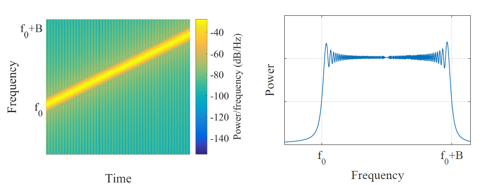
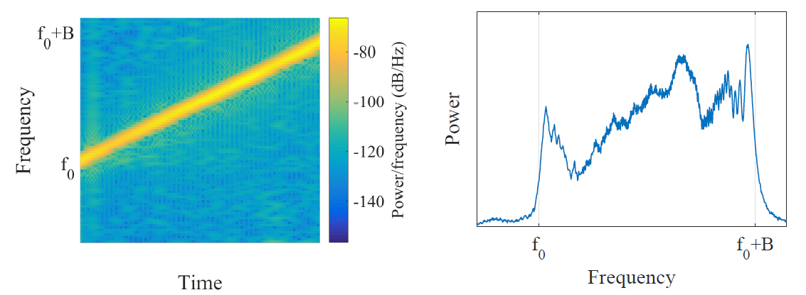
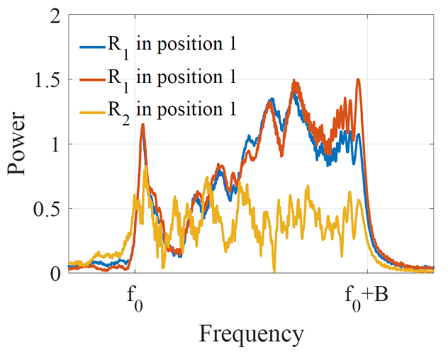

# Acoustic Device Authentication

By collecting and analyzing signals, we can not only achieve motion gesture recognition but also enable more advanced applications—such as authenticating communication between two IoT devices.

With the rapid development of Internet of Things (IoT) technology, the security of inter-device communication has become increasingly critical. The most essential step in securing IoT communications is accurate device identification. When two previously unconnected mobile devices attempt to establish a temporary encrypted session, verifying each other's identity legitimacy becomes a key challenge in ensuring secure IoT communication.

## Hardware-Induced Frequency Selectivity

No two leaves in the world are exactly alike—nor are any two hardware devices. Even devices of the same model and batch inevitably exhibit slight physical differences in their hardware structures.

These structural variations lead to distinct frequency selectivity characteristics during signal transmission and reception. A given hardware device responds differently to signals of varying frequencies, amplifying some while attenuating others. The specific set of amplified or attenuated frequencies varies from device to device due to unique hardware imperfections.

Speakers and microphones used for sound signal transmission and reception also exhibit such hardware-specific frequency selectivity. A standard chirp signal appears as shown below in both the time-frequency and frequency-domain representations. In the time-frequency plot, the chirp signal manifests as a linear frequency sweep; in the frequency-domain plot, it shows approximately uniform energy distribution across its bandwidth.

Figure. Standard chirp signal

When this standard chirp signal passes through an acoustic channel—transmitted by a speaker, propagated through air, and received by a microphone—the resulting time-frequency and frequency-domain plots appear as shown below. While the time-frequency representation still resembles a clean sweep with minimal distortion, the frequency-domain plot reveals significant irregularities in energy levels across the chirp’s bandwidth.

Figure. Chirp signal after passing through the acoustic channel

> Think about what causes these irregularities.

These distortions arise from the frequency-selective nature of the acoustic channel. The acoustic channel consists of the speaker, the propagation medium (air), and the receiving microphone—all of which introduce frequency-dependent responses. Speakers and microphones, due to manufacturing imperfections, inherently amplify or attenuate certain frequencies differently. Meanwhile, the propagation medium introduces multipath effects: signals arriving via multiple paths interfere at the receiver. Some frequencies experience constructive interference (amplification), while others undergo destructive interference (attenuation). This results in a unique frequency response pattern shaped by the entire channel. The figure below illustrates the overall frequency selectivity of an acoustic channel.

Figure. Frequency selectivity of the acoustic channel on sound signals

To investigate whether such frequency selectivity can effectively distinguish between different devices or communication channels, we conducted experiments using a fixed sound source and two different receiving devices placed at the same location. The results shown below illustrate the frequency selectivity observed when the transmitting device and multipath environment remain constant, but different receivers are used. The blue and red lines represent two repeated recordings from Device 1 at Position 1. The yellow line represents a recording from Device 2 at the same position. It is evident that repeated measurements from the same device are highly consistent, whereas the response from a different device differs significantly. This observation suggests that frequency selectivity of acoustic signals can be used to differentiate between hardware devices.

Figure. Different hardware devices exhibit distinct frequency selectivity for acoustic signals

Additionally, we examined how frequency selectivity changes when the device position changes (i.e., when the multipath environment alters). We compare Device 1’s recording at Position 2 (purple line) with its two recordings at Position 1 (blue and red lines). The results show a substantial shift in frequency selectivity when the device is moved. This indicates that a device will no longer pass authentication based on prior frequency characteristics once relocated. This property enhances security by requiring re-authentication before each new session, effectively mitigating man-in-the-middle attacks.

Figure. Different propagation paths result in different frequency selectivity characteristics

Since frequency selectivity can serve as a fingerprint for device authentication, two previously unknown devices can verify each other's legitimacy upon first encounter, enabling secure communication through physical-layer authentication.

## References

1. Linsong Cheng, Zhao Wang, Yunting Zhang, Weiyi Wang, Weimin Xu, Jiliang Wang. "Towards Single Source based Acoustic Localization", IEEE INFOCOM 2020.
2. Yunting Zhang, Jiliang Wang, Weiyi Wang, Zhao Wang, Yunhao Liu. "Vernier: Accurate and Fast Acoustic Motion Tracking Using Mobile Devices", IEEE INFOCOM 2018. 
3. Pengjing Xie, Jingchao Feng, Zhichao Cao, Jiliang Wang. "GeneWave: Fast Authentication and Key Agreement on Commodity Mobile Devices", IEEE ICNP 2017