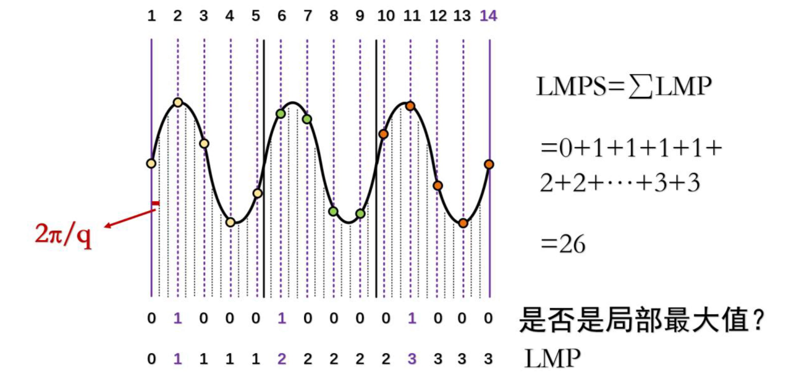
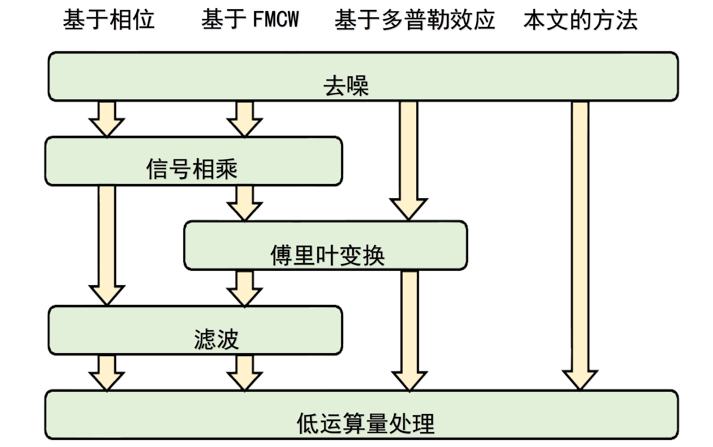
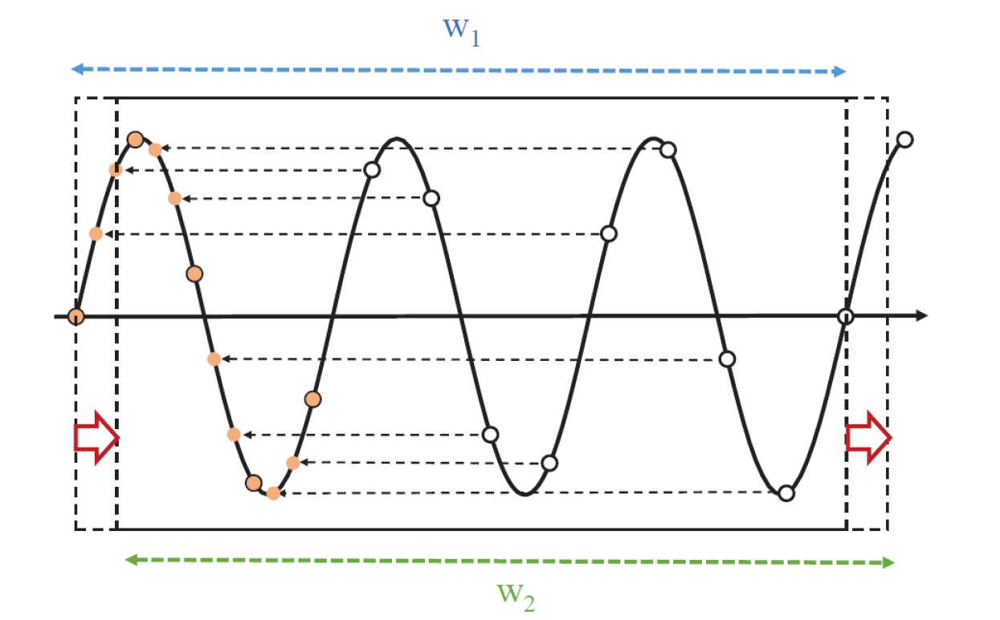

# Active Acoustic Localization Method

Existing acoustic ranging methods are typically phase-based. In such methods, the phase difference $\Delta\phi$ of the acoustic signal before and after the target device moves is first calculated, and then the distance traveled by the target is derived using:

$$
\Delta d = \frac{\lambda}{2\pi} \cdot \Delta\phi,
$$

where $\lambda$ denotes the wavelength of the sound wave.

In this approach, to extract the phase difference between the received signal and the source signal, the received signal is multiplied by the known original transmitted signal, followed by low-pass filtering to recover the phase of the acoustic signal. Vernier [1] proposed a novel method that estimates the phase *without* requiring filtering, thereby enabling phase-based ranging.

Before describing this method, we define several variables to simplify its exposition:

- **LMP (Local Max Prefix)**: In a sampled sequence, the LMP of the first sample point is defined as 0. Starting from the second sample point, if the value (i.e., amplitude) of a given point is greater than both its preceding and succeeding values, then its LMP equals the LMP of the preceding point plus 1; otherwise, its LMP equals that of the preceding point.

- **LMPS (Local Max Prefix Sum)**: The sum of all LMP values within a sliding window.

Figure. Definition of LMP

The ranging method is described as follows:

Assume that at times $t_1$ and $t_2$, the recording device captures two audio data windows of equal duration, denoted as $s_1(t)$ and $s_2(t)$. Each window contains exactly $N$ full periods of the acoustic signal, corresponding precisely to $M$ sampling points. The LMPS values of the two time windows $s_1(t)$ and $s_2(t)$ are denoted as $L_1$ and $L_2$, respectively. Due to the Doppler effect, the phase shift between adjacent windows is $\Delta\phi$, and the displacement of the sound source over the interval $t_2 - t_1$ is $\Delta d$, where $c$ is the speed of sound in air:

$$
\Delta d = \frac{c(t_2 - t_1)}{2\pi} \cdot \Delta\phi.
$$

The figure below illustrates an example of computing the change in source distance via LMP: Within one time window, $L_1 = 5$, $L_2 = 6$. When the signal phase shifts by $\Delta\phi = 2\pi$, the LMPS increases by 1. That is, each increment of LMPS by 1 corresponds to a phase shift of $2\pi$, and thus a distance change of $\lambda$.

Figure. Acoustic ranging method — LMPS variation under phase shift

With a fixed sampling rate, the parameters $N$ and $M$ can be tuned by adjusting the transmission frequency $f$. For instance, at a sampling rate $f_s = 44.1\,\text{kHz}$, selecting a tone frequency $f = 1\,\text{kHz}$ yields $N = 44.1$ and $M = 44100$. Under these conditions, the localization resolution of this method is:

$$
\delta = \frac{c}{2 f}.
$$

As shown in the figure below, compared with other acoustic localization methods, the method proposed herein requires neither Fourier transformation nor low-pass filtering. Consequently, it achieves higher processing speed and consumes fewer computational resources.

Figure. Comparison of various acoustic localization methods

To compute the phase shift experienced by the tracked device during motion, we employ a window-based phase computation method: At time $t_i$, the LMPS $L_i$ is computed over window $w_i$; at time $t_{i+1}$, the LMPS $L_{i+1}$ is computed over window $w_{i+1}$. The phase shift between the two windows is then inferred from the difference $\Delta L = L_{i+1} - L_i$.

The window-based phase computation algorithm is illustrated in the figure below. As derived earlier, each unit increase in LMPS corresponds to a phase shift of $2\pi$.

Figure. Window-based phase computation method

It is worth noting that the phase of a sound signal increases linearly with time at a rate equal to its angular frequency:

$$
\phi(t) = \omega t + \phi_0.
$$

When computing distance, the temporal contribution to phase must first be removed to obtain the initial phase $\phi_0$. From the change in initial phase $\Delta\phi_0$, the displacement $\Delta d$ of the tracked device is obtained as:

$$
\Delta d = \frac{\lambda}{2\pi} \cdot \Delta\phi_0.
$$

Assuming the initial position of the tracked device is $x_0$, its current position is expressed as:

$$
x = x_0 + \Delta d.
$$

**Two-Dimensional Acoustic Localization Method**

As illustrated in the figure below, suppose the tracked device initially resides at point $C(x_0, y_0)$ and moves to point $D(x_1, y_1)$ over time. Since the initial coordinates are known, distances $AC$ and $BC$ can be directly computed. Given the changes in distances from the device to two acoustic sources $A$ and $B$, denoted as $\Delta d_A$ and $\Delta d_B$, lengths $AD$ and $BD$ follow immediately. As the baseline distance $AB$ is pre-measured, all three side lengths of triangle $\triangle ABD$ are known; therefore, the coordinates $(x_1, y_1)$ of point $D$ can be uniquely determined.

Figure. Two-dimensional localization method

