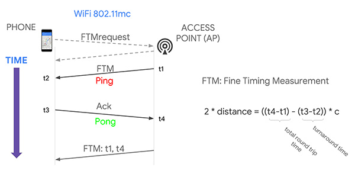

# WiFi ToF Ranging Method

This section applies the previously discussed [wireless ranging](https://iot-book.github.io/12_无线测距/S2_基于传播时间测距/) techniques directly to WiFi scenarios. The fundamental idea is bilateral two-way ranging, enabling accurate Time-of-Flight (ToF) measurement between two WiFi devices.

Modern WiFi standards support ToF-based ranging. WiFi ToF estimates distance by measuring the round-trip time of signals between a wireless Access Point (`Responder`) and a station (`Initiator`). In IEEE 802.11mc, the WiFi Fine Timing Measurement (WiFi FTM) protocol was introduced to enable high-precision localization.

## Protocol Principle

Due to the lack of nanosecond-level clock synchronization between the `Initiator` and the `Responder`, the difference in timestamps at the transmitter and receiver cannot accurately reflect the true signal propagation time. However, using the principle of two-way ranging, the round-trip time between the `Initiator` and `Responder` can be measured effectively.

The specific measurement process is as follows: First, the `Initiator` sends an FTM request to the `Responder`. The `Responder` then replies with an acknowledgment and transmits a formal FTM frame. The transmission time of this FTM frame at the antenna of the `Responder` is $t_1$, and its reception time at the `Initiator` is $t_2$. Upon receiving the FTM frame, the `Initiator` immediately replies and records its own transmission time $t_3$. This reply is received by the `Responder` at time $t_4$.

<center>
    
    <br>
    <div style="color:orange; border-bottom: 1px solid #d9d9d9;
    display: inline-block;
    color: #999;
    padding: 2px;">FTM Ranging Principle 1. Image source: <a href="#refer-1">[1]</a></div>
</center>

Based on the two-way ranging principle, the distance $D$ can be calculated using the following formula, where $c$ represents the speed of light:

$$
2*D = ((t_4-t_1)-(t_3-t_2))*c
$$

<center>
    
    <br>
    <div style="color:orange; border-bottom: 1px solid #d9d9d9;
    display: inline-block;
    color: #999;
    padding: 2px;">FTM Ranging Principle 2. Image source: <a href="#refer-1">[1]</a></div>
</center>

In practice, the FTM frames are transmitted repeatedly within a `burst` period. By averaging multiple measurements, the ranging error can be reduced.

In the FTM protocol, only the `Initiator` can compute the final distance. This is because during a `burst` request, the (N+1)-th FTM frame (sent from the `Responder` to the `Initiator`) carries the timestamp information $t_1$ and $t_4$ from the previous FTM response. As a result, the (N+1)-th response allows calculation of only N distance values, and only the `Initiator` has access to the complete set of timestamps from $t_1$ to $t_4$.

> Think: Why does multiple measurement reduce error? How much can the error be reduced?

## Performing FTM Measurements

Currently, many routers and devices support FTM. On Android systems with newer Linux kernels (>9.0), support for the FTM protocol is well established.

**FTM Measurement on Android**

1. FTM protocol requires specific hardware support. Refer to Google's [developer documentation](https://developer.android.com/guide/topics/connectivity/wifi-rtt#supported-phones) for a list of supported devices.
2. The following permissions must be granted:
~~~xml
<uses-permission android:name="android.permission.ACCESS_WIFI_STATE" />
<uses-permission android:name="android.permission.CHANGE_WIFI_STATE" />
<uses-permission android:name="android.permission.ACCESS_FINE_LOCATION" />
~~~
3. Ranging requests must be constructed from a pre-scanned list of WiFi networks.

Sample code:
~~~java
/*
* Check if the device supports WIFI RTT
*/
if (getPackageManager().hasSystemFeature(PackageManager.FEATURE_WIFI_RTT)) {
    // Device supports WIFI RTT
} else {
    // Device does not support WIFI RTT
}
// Build ranging request
RangingRequest.Builder builder = new RangingRequest.Builder();
builder.addAccessPoints(ftmAPs);
RangingRequest req = builder.build();
Executor executor = new DirectExecutor();
wifiRttManager.startRanging(req, executor, new RangingResultCallback() {
    @Override
    public void onRangingFailure(int code) {
        Log.d("onRangingFailure", "Fail in ranging:" + Integer.toString(code));
        runOnUiThread(() -> {
            Toast.makeText(MainActivity.this, "Ranging request failed", Toast.LENGTH_SHORT).show();
        });

    }

    @Override
    public void onRangingResults(List<RangingResult> results) {
        Log.d("onRangingResults", "Success in ranging:");
        // Process data

    }
});
~~~

**FTM Measurement on Linux**

For Linux Kernel versions 5.4 and above, install the latest `iw` and `hostapd` tools along with a modern Intel wireless adapter (e.g., AX200, AX201) to set up a ranging testbed.

To perform ranging, configure one device as the `Responder` (AP) and another as the `Initiator` (e.g., phone). Instructions are provided below.

**`Responder` Side**

First, create a configuration file `hostapd.conf`.

```bash
# Replace with your network interface name
interface=wlp2s0
driver=nl80211
# Replace with your NIC's MAC address
bssid=c8:58:c0:a6:67:bf
# Choose a suitable SSID
ssid=FTM-TEST
hw_mode=g
ieee80211n=1
ht_capab=[HT40+][SHORT-GI-40]
channel=2
wmm_enabled=1
wme_enabled=1
ctrl_interface=/var/run/hostapd
ctrl_interface_group=0
ftm_Responder=1
ftm_Initiator=1
```

Start the AP:

```bash
sudo hostapd <path_to_config_file>
```

If startup fails, try resetting the wireless interface:

```bash
sudo nmcli radio wifi off
sudo rfkill unblock wlan
sudo ifconfig wlp2s0 up # Replace with actual interface name
```

**`Initiator` Side**

Use the `iw` tool to scan for APs supporting FTM:

```bash
sudo iw dev <interface> scan > scan.txt # Output to file
```

Search for `FTM` in the scan output to identify compatible WiFi networks. Note down the `MAC address` and center frequency `freq`. Example (partial info shown):

```
BSS 20:16:b9:70:8a:91(on wlp4s0)
	freq: 2417
	SSID: FTM-TEST-2
	Extended capabilities:
		 * FTM Responder
		 * FTM Initiator
```

Create a configuration file where each line represents one `Responder`, formatted as:

```
<addr> bw=<[20|40|80|80+80|160]> cf=<center_freq> [cf1=<center_freq1>] [cf2=<center_freq2>] [ftms_per_burst=<samples per burst>] [asap] [bursts_exp=<num of bursts exponent>] [burst_period=<burst period>] [retries=<num of retries>] [burst_duration=<burst duration>] [tb]
```

Perform ranging:

```bash
sudo iw <interface> measurement ftm_request <config_file_path>
```

In practice, FTM measurement is still evolving. Current implementations typically provide only raw FTM results—the direct outcome of the bilateral two-way measurement described above. If lower-level timing data were accessible, further optimization of ranging accuracy would be possible.

## References
1. [How To Achieve 1 Meter Accuracy In Android](http://gpsworld.com/how-to-achieve-1-meter-accuracy-in-android) <div id="refer-1"></div>