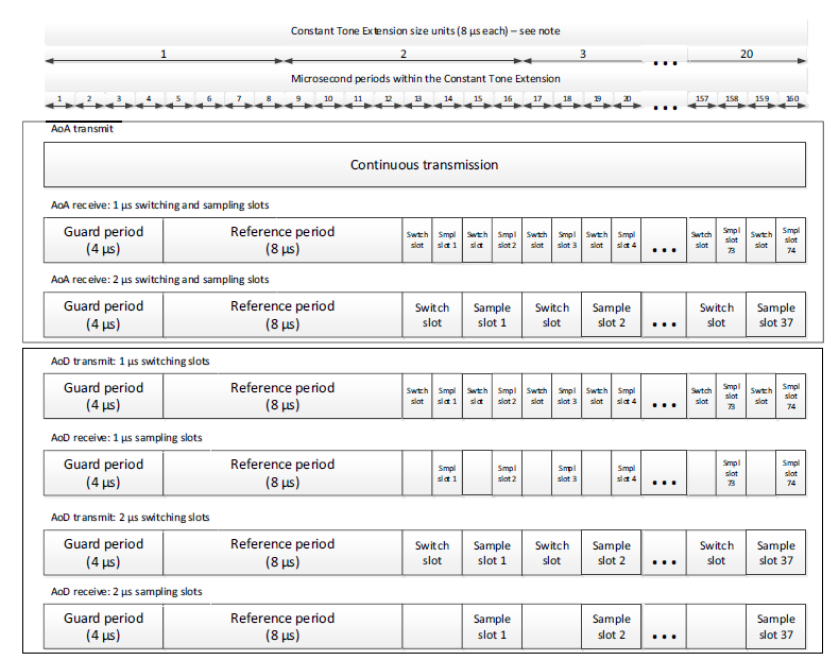
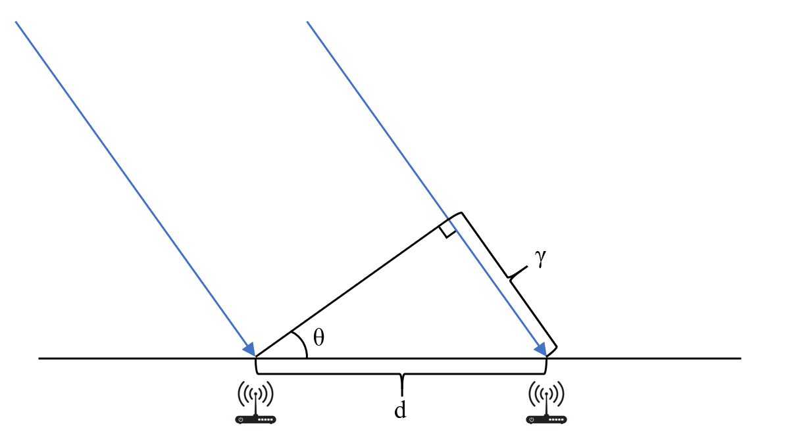

# Basic Principles of Bluetooth Direction Finding

In early 2019, the Bluetooth 5.1 specification introduced direction-finding capabilities, enabling detection of the direction from which a Bluetooth signal arrives—thereby theoretically improving the accuracy of Bluetooth-based positioning.

Bluetooth 5.1 direction finding relies on phase differences in time caused by the spatial separation among antennas in an antenna array. Depending on whether the device under localization operates in uplink or downlink mode, direction finding is categorized into two methods: Angle of Arrival (AoA) and Angle of Departure (AoD).

In an AoA localization scenario, the device under localization—such as a portable Bluetooth tag affixed to the target object—broadcasts packets using a single antenna. The receiver, equipped with an antenna array, captures this single packet. Because the distances from each antenna in the array to the transmitting device differ, these distance differences induce corresponding phase differences: i.e., the phases of the received signals at different antennas exhibit measurable discrepancies at the same instant. The receiver rapidly polls each antenna in sequence, and each antenna records several I/Q sample points (see Figure 2.2). These I/Q values allow computation of the signal phase at each sampling instant; thus, the incident angle (AoA) can be derived from the inter-antenna phase differences.

Figure. Basic AoA/AoD Modes

Figure. Relationship Between I/Q Values and Phase

The AoD localization scenario is the inverse of AoA: the device under localization must broadcast positioning packets simultaneously via an antenna array, while the receiver employs a single antenna. Similarly, due to differing path lengths, the receiver observes distinct phases across signals transmitted from different antennas in the array. The transmitter alternates between antennas in its transmit array; upon each antenna switch, the receiver detects a corresponding phase jump. From these phase jumps, the relative path-length differences are inferred, enabling position estimation. AoA localization requires only two fixed anchor nodes, whereas AoD—when the precise orientation of the antenna array is unknown—requires three anchor nodes for full localization. Moreover, in AoD, the device under localization must integrate an antenna array, which imposes constraints related to physical space and power consumption. A key advantage of AoD is its ability to provide orientation information; consequently, it is commonly deployed in Indoor Positioning Systems (IPS), delivering accurate and convenient navigation for users in complex indoor environments such as stadiums and shopping malls—environments where acoustic reflections and metallic objects frequently disrupt smartphone compass functionality.

Alongside the introduction of AoA and AoD in Bluetooth 5.1, the specification defines the Constant Tone Extension (CTE): a sequence of repeated 0s or 1s appended to the end of a packet. Within the Bluetooth protocol stack, this bit sequence is translated into a frequency-stable sinusoidal waveform for transmission. Bluetooth 5.1 stipulates that either master or slave devices may initiate an `LL_CTE_REQ` PDU to request transmission of a CTE signal from the peer device. The `CTETypeReq` field within this PDU specifies whether the requested direction-finding mode is AoA or AoD, and also indicates the antenna switching interval during transmission. Furthermore, Bluetooth 5.1 explicitly defines timing schedules for antenna array reception/transmission, as illustrated below.

Figure. Bluetooth 5.1–Specified AoA/AoD Timing Schedule

Below, we describe the fundamental principle of Bluetooth positioning using AoA as an example.

The specific principle underlying AoA computation in Bluetooth positioning is as follows:  
In AoA localization, the transmitter emits a sinusoidal waveform via a single antenna, and the receiver captures this signal using an antenna array to compute the angle of arrival. First, assume the antenna array can receive the signal simultaneously across all elements. The figure below illustrates the receiver-side configuration.

Figure. AoA Localization Principle Diagram

A transmitting antenna sends a Bluetooth signal (indicated by the blue arrows in the figure) toward two receiving antennas in the array separated by distance $d$. Due to the differing distances from the transmitter to each receiving antenna, a constant phase difference arises between the signals received at the two antennas. Because the distance from the transmitter to the antenna array is much greater than $d$, the propagation paths to the two receiving antennas may be approximated as parallel. Under this assumption, dropping a perpendicular from one antenna to the line of propagation through the other yields a right triangle, whose leg length equals the path-length difference. Clearly, in this right triangle:

$$ r = d\sin{\theta} $$

where $\theta$ denotes the AoA. Meanwhile, the relationship between phase difference and path-length difference is given by:

$$ \Delta\phi = \frac{2\pi}{\lambda} r $$

where $\Delta\phi$ represents the phase difference and $\lambda$ denotes the Bluetooth wavelength. Combining the above equations yields the AoA:

$$ \theta = arc\sin{\frac{\lambda\Delta\phi}{2\pi d}}$$

Once the directional angle is computed, the exact location of the device under localization can be determined by intersecting directional lines derived from multiple anchor nodes.

In AoA scenarios, knowing the positions and orientations of just two receiving antenna arrays suffices for localization. Each anchor node constrains the device’s location to a straight line—the intersection point of two such lines yields the precise position, as shown below:

Figure. Two-Anchor AoA Localization

In contrast, AoD localization requires three receiving anchors if the precise orientation of the transmitting antenna array is unknown. This is because the unknown orientation introduces an additional degree of freedom. Equivalently, the angular separation observed between two receiving anchors confines the target to a circular locus; two such angular measurements (from three anchors) yield two circles, whose intersection determines the target position.

Figure. Three-Anchor AoD Localization

With three antennas, not only is localization achievable, but the current orientation of the transmitting antenna array can also be estimated—a capability unavailable in AoA. This orientation estimation is critical in navigation systems and similar applications. In two-antenna configurations, external means—e.g., a digital compass—may supplement orientation acquisition to enable localization. Once the orientation is known, the azimuth of the receiving antenna array in the Earth-fixed coordinate system can be deduced, making the underlying localization principle identical to AoA. However, in such cases, localization accuracy becomes highly sensitive to orientation errors. In indoor environments, compasses often suffer significant inaccuracies, resulting in notably degraded localization performance when only two receiving antennas are available.

[TODO: Hardware implementation details and direction-finding algorithm development materials will be added once finalized.]