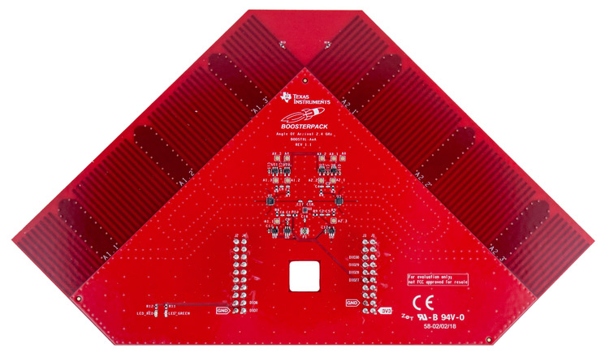
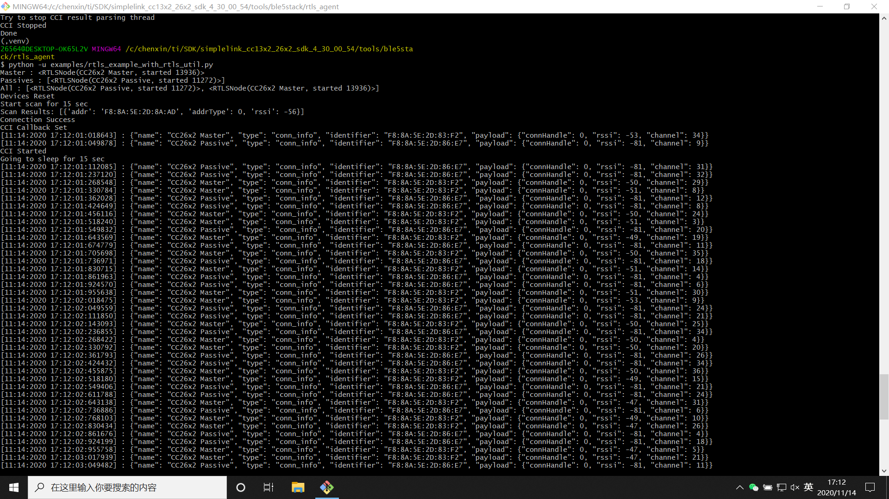
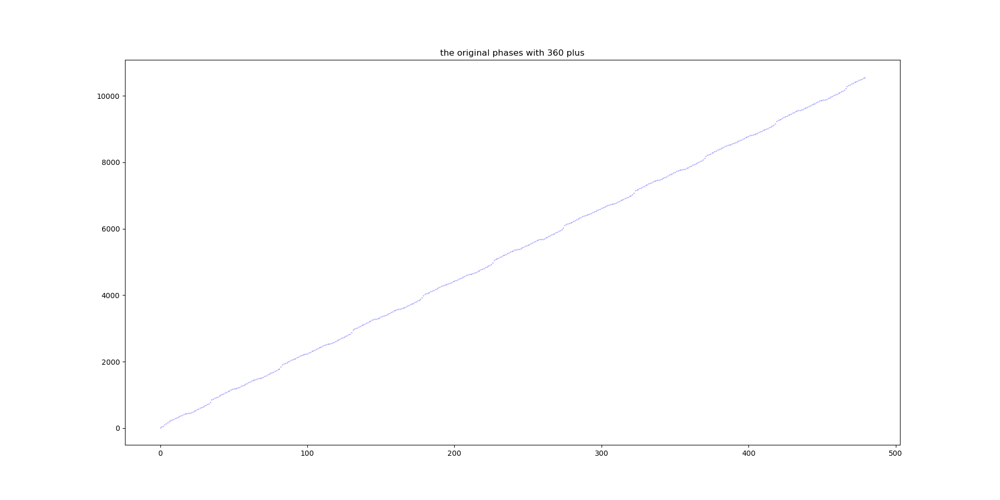

# Implementation and Challenges of Localization Algorithms

## Device Overview
This section introduces the hardware and software components of Texas Instruments’ latest Angle-of-Arrival (AoA) localization module.

The hardware of the AoA localization module consists of the SimpleLink CC26X2R LaunchPad development board and the BOOSTXL-AoA Bluetooth antenna array module. The former is a rectangular programmable development board; the latter is a triangular printed circuit board equipped with three antennas on each side, which can be soldered onto the development board to receive Bluetooth signals and compute the angle of arrival (AoA). A complete Bluetooth AoA localization setup requires at least three SimpleLink CC26X2R LaunchPad devices and at least two BOOSTXL-AoA modules.

Figure. SimpleLink CC26X2R LaunchPad Development Board

Figure. BOOSTXL-AoA Bluetooth Antenna Array

The software component comprises control code running on a host PC and firmware flashed onto the LaunchPad development boards. There are three distinct firmware images—each configured to operate as either a *Master*, a *Passive*, or a *Slave* node in the Bluetooth communication stack. Each localization scenario requires exactly one Master node, one Slave node, and at least one Passive node. The Slave node is physically mounted on the object to be localized (its position is unknown), whereas the Master and Passive nodes are fixed at known locations and connected via USB to the same host PC. The Master sends control commands to the Slave, instructing it to broadcast localization packets containing Constant Tone Extension (CTE) information. These packets are received by both the Master and Passive nodes, which independently compute AoA estimates. Using two or more such AoA measurements, the position of the Slave can be triangulated. Only the Master and Passive nodes require the BOOSTXL-AoA module for AoA computation; the Slave node needs only to transmit and receive Bluetooth signals and therefore operates using its onboard single antenna—no BOOSTXL-AoA module is required.

## Configuration and Setup of the Experimental Environment
(1) **SDK Installation**: Download and install the SimpleLink CC13X2–CC26X2 SDK from the official TI website. The installation directory contains all necessary software components—including the host-side control code and the three firmware images (Master, Passive, Slave) to be flashed onto the LaunchPad boards.

The host-side control code resides in the following path:  
`<SimpleLink CC13X2 / CC26X2 SDK> → tools → ble5stack → rtls_agent`.  
It requires a Python 3 environment. Before execution, follow the instructions in the `README` file located in the `rtls_agent` folder: run  

        pip.exe install -r requirements.txt  

to install required Python packages, then execute  

        package.bat -c -b -u -i  

to install the `rtls_agent` library dependencies. Note that `package.bat` hardcodes the Python executable path; prior to use, edit the first eight lines of this script to set the `PYTHON3` and `PIP3` variables to the correct paths of `python.exe` and `pip.exe`, respectively.

(2) **Firmware Flashing**: The firmware images reside in:  
`<SimpleLink CC13X2 / CC26X2 SDK> → examples → rtos → CC26X2R1_LAUNCHXL → ble5stack`,  
within subfolders named `rtls_master`, `rtls_slave`, and `rtls_passive`, corresponding to the Master, Slave, and Passive roles, respectively. Here, “rtls” stands for *Real-Time Localization System*. Each firmware image is a Code Composer Studio (CCS) project. To flash them, install CCS, open the respective `.project` files, build the projects, and deploy the binaries to the target LaunchPad boards using CCS’s debug interface. Alternatively, if CCS deployment fails, precompiled binary files may be flashed directly into the device’s flash memory using other compatible tools.

(3) **Hardware Assembly**: Figures 4.1 and 4.2 illustrate the standard development board and the Bluetooth antenna array. Each development board is equipped with a built-in antenna for general data transmission/reception. However, AoA computation requires an antenna *array* to capture phase differences across multiple spatially separated elements. Therefore, the BOOSTXL-AoA module must be physically connected to the CC26X2R1 board to utilize its integrated antenna array. During operation, BOOSTXL-AoA modules may be installed on both Master and Passive boards to enable AoA computation. Since external antennas are used after installation, the default CC26X2R1 board must be modified accordingly. Detailed modification instructions are available at:  
https://dev.ti.com/tirex/explore/node?node=AHYhhuDNTaRXzkOlahOlvA__pTTHBmu__LATEST

## Data Acquisition and Localization Principle
In a localization experiment, Master and Passive boards are deployed within the target environment, with their antenna arrays horizontally aligned at fixed, precisely measured positions—including the coordinates of each array’s geometric center and its physical orientation. Due to the inherent limitation of AoA estimation using a linear antenna array, only a 180° angular field of view is supported; the algorithm cannot distinguish whether the target lies to the left or right of the array axis. For optimal accuracy, antenna arrays should be placed near the boundaries of the operational area. Both Master and Passive nodes connect to the same host PC via USB to relay computed AoA values and other telemetry.

Once the experimental setup is complete, the Slave node’s location can be determined. The Slave merely broadcasts Bluetooth signals omnidirectionally and thus does not require an antenna array. Its behavior is remotely controlled over Bluetooth by the Master node; consequently, it need not be connected to the host PC. A portable power source (e.g., a power bank) supplying power via the Slave’s USB port suffices.

After deploying the hardware, connect the Master and Passive boards to the host PC and launch the control software. A graphical user interface (GUI) tool is provided under:  
`<SimpleLink CC13X2 / CC26X2 SDK> → tools → ble5stack → rtls_agent → rtls_ui`.  
Double-click `rtls_ui.exe`; upon completion of initialization, TI’s visualization dashboard will automatically open in the default web browser. Once the application detects connected SimpleLink development boards via USB serial ports, select and connect the Master and Passive devices as prompted, then click *Auto Play* to initiate the full localization workflow. AoA results are displayed in real time. Should connection loss or missing readings occur, click *Restart* to reinitialize the devices, then resume with *Auto Play*. Click *Configurations* to adjust runtime parameters. Of particular importance is `connect_interval_mSec`, whose default value is `100`. While this yields high localization update rates, it compromises connection stability. Setting `connect_interval_mSec = 300` reduces update frequency but significantly improves robustness—sufficient for sustained long-term tracking.

Figure. rtls_ui GUI Interface

Although the GUI offers ease of use and comprehensive logging, its configurability and extensibility are limited. As an alternative, TI provides a Python-based API via the `rtls_util` library. Example scripts are located in:  
`<SimpleLink CC13X2 / CC26X2 SDK> → tools → ble5stack → rtls_agent → examples`.  
Three Python files demonstrate various usage patterns:  
- `rtls_example_with_rtls_util.py`: Minimal working example for basic AoA localization.  
- `rtls_aoa_multi_conn_example.py`: Demonstrates simultaneous multi-target localization by connecting to multiple Slave nodes.  
- `rtls_aoa_iq_with_rtls_util_export_into_csv.py`: Generates a folder named `rtls_example_with_rtls_util_log`, storing both `.log` and `.csv` files. The CSV file records I/Q samples for each measurement point, enabling post-processing analysis.

All scripts are executable out-of-the-box, but they hardcode the COM port names of the Master and Passive devices instead of dynamically enumerating USB serial interfaces. Users must manually identify the correct COM ports for these devices in Windows Device Manager and update the Python source accordingly before execution.

Figure. Python Script Execution Flow

The underlying logic and execution sequence of the Python scripts and the GUI tool are identical:

1) Acquire serial port identifiers for the Master and Passive devices—either by scanning USB interfaces or via hardcoded strings—and register them using `rtlsUtil.set_devices()`.

2) Initialize all devices via `rtlsUtil.reset_devices()`.

3) Execute `rtlsUtil.scan()` using the Master node to discover nearby Slave devices and retrieve their Bluetooth addresses and advertising data.

4) Based on the scan results, establish BLE connections to selected Slave devices using `rtlsUtil.ble_connect()`. The parameter `connect_interval_mSec` controls connection interval; as noted earlier, `100` maximizes responsiveness but risks instability, whereas `300` trades lower update rate for improved reliability.

5) Configure AoA-specific parameters—including sampling rate, antenna switching frequency, and switching pattern—using `rtlsUtil.aoa_set_params()`, then invoke `rtlsUtil.aoa_start()` to begin localization. Thereafter, the Master continuously transmits control messages to the Slave, commanding it to broadcast CTE-containing Bluetooth packets. Each Master and Passive node computes one AoA estimate per received packet, streaming results back to the host PC for real-time localization.

Upon acquiring real-time AoA measurements from all nodes, triangulation is applied using the pre-measured positions and orientations of the Master and Passive nodes to compute the Slave’s Cartesian coordinates. This system also supports multi-target localization: the Master can maintain concurrent BLE connections to multiple Slaves, each identified uniquely by its MAC address. Both Master and Passive nodes can simultaneously receive and process packets from all connected Slaves, computing independent AoA estimates for each—enabling parallel localization of all targets.

## 4. Data Processing
In conventional AoA systems employing antenna arrays, all antennas receive signals concurrently. At any given instant, the phase difference between two antennas multiplied by the signal wavelength yields the path-length difference from the source to those antennas; applying trigonometry then yields the angle of arrival. In contrast, TI’s SimpleLink platform implements sequential antenna polling: antennas are activated one at a time in a fixed cyclic order (e.g., 1→2→3→1→2→3). When antenna 2 receives a signal, the phase that antenna 1 *would have measured* at that same instant is inferred from previously acquired samples collected by antenna 1. The procedure is as follows:

1) Compute the average phase difference between consecutive samples acquired by the *same* antenna during uninterrupted reception (i.e., excluding intervals where antenna switching occurs).

2) If each antenna collects 16 samples, compute the phase difference between sample `i+16` and sample `i` across the entire sequence. Since samples spaced 16 apart originate from *different* antennas, at least one antenna switch necessarily occurs between them.

3) Estimate the expected phase at sample `i+16` for the *same* antenna as sample `i` by adding `16 × avg_phase_diff` to the phase at sample `i`. Comparing this estimate against the actual phase at sample `i+16` yields an effective inter-antenna phase difference at synchronized time instants.

4) Subtract `16 × avg_phase_diff` from the raw phase difference `(phase[i+16] − phase[i])` to obtain the true instantaneous phase offset between two antennas.

5) Because antennas are polled in the repeating sequence `1→2→3→1→2→3`, the computed phase differences for pairs `(1,2)` and `(2,3)` should be similar, whereas the `(3,1)` difference should be approximately the negative of the others and twice their magnitude. Thus, apply a correction factor of `−0.5` to all `(3,1)`-associated differences before averaging. Pseudocode:

        phase_diff =  [phase[i+1]-phase[i] for i in range(length - 1) if i%16 != 0 ] 
        avg_phase_diff = average(phase_diff)
        antenna_diff = [phase[i+16]-phase[i]-avg_phase_diff*16 for i in range(length - 16) ]
        antenna_diff_fixed = [ i if floor(i/16)%3 != 2 else -0.5*i for i in antenna_diff ]
        avg_diff = average(antenna_diff_fixed)
        avg_distance = avg_diff / 2 / pi * wavelength
        angle = arcsin(avg_distance / antenna_distance)

Note: Phase values wrap within the range `[−180°, +180°]`; crossing ±180° causes discontinuous jumps rather than monotonic progression. The figure below shows the phase evolution across 512 samples from a single Bluetooth packet. Red boxes highlight antenna-switching transitions (`3→1`, `1→2`, `2→3`) and associated changes in slope.

Figure. Phase Evolution Across One Bluetooth Packet

As shown, phase increases monotonically across samples, exhibiting two decelerations and one acceleration per 48-sample cycle—corresponding to antenna switches. To visualize trends more clearly, phase unwrapping (adding/subtracting multiples of 360°) eliminates discontinuities, yielding the smoothed curve below.

Figure. Unwrapped Phase Evolution Across One Bluetooth Packet

Figure. Unwrapped Phase Evolution (Detail)

Direct subtraction of `16 × avg_phase_diff` without phase unwrapping may introduce bias. However, since antenna spacing is less than half a wavelength, inter-antenna phase differences remain bounded within `±180°`; values exceeding this range can be corrected by adding or subtracting `360°`.

The above algorithm is embedded within the firmware flashed onto Master and Passive nodes by TI. Importantly, TI’s evaluation kit supports both exporting raw I/Q samples to the host PC via USB *and* performing on-chip AoA computation autonomously.

<!-- However, this algorithm is relatively simplistic and leaves room for improvement to enhance localization accuracy. Below we describe phenomena observed during experimentation and corresponding enhancements:

(1) Experimentally, antenna switching induces gradual, continuous phase transitions—not ideal stepwise jumps. This arises because the switching schedule allocates dedicated time slots: *sample slots* (for stable data acquisition using one antenna) and *switch slots* (for hardware reconfiguration). Phase samples captured during switch slots are unreliable. Hence, we retain only the central 8 of the 16 samples per antenna, discarding the outer 8 potentially corrupted by switching transients—thereby improving the fidelity of the mean phase-difference estimate.

(2) Furthermore, we replace the global average of adjacent-sample phase differences with a linear fit over the selected 8 stable samples. Empirically, these 8 points lie nearly collinearly per antenna, yet the slope of this line varies slightly across the 512-sample packet. A single global average thus misrepresents local dynamics. By fitting a line to each group of 8 points individually, we achieve locally optimal phase prediction—yielding more accurate estimates of the phase that a given antenna *would have measured* immediately after switching, thereby improving phase-difference computation.

(3) We observe that the raw phase difference `(phase[i+16] − phase[i])` ideally forms a staircase waveform—constant over each 16-sample block. In practice, however, significant intra-block variation occurs, trending linearly across each 16-point segment. This suggests a systematic accumulating error that grows monotonically across samples 1–16 of each antenna. Moreover, each antenna exhibits its own characteristic accumulation slope—indicating antenna-specific error sources. See Figure 4.7.

Figure. Inter-Antenna Phase Difference vs. Sample Index

Given that the Bluetooth carrier is a stable sinusoid, the root cause must reside in sampling timing inaccuracies—i.e., jitter or drift in the sampling clock. Leveraging known channel parameters and carrier frequency, we reconstruct the ideal phase-vs.-time relationship and infer the instantaneous sampling rate. Applying smoothing filters to estimated sampling rates and incorporating corrections into subsequent processing mitigates accumulated errors. -->

<!-- ### 5. Future Work
Key directions for further investigation include:

(1) Identifying the fundamental origin and physical mechanism behind the antenna-specific cumulative phase error described in Section 4.4(3), to devise appropriate compensation strategies. Given its highly deterministic nature, repeated measurements in controlled environments—or precise angular calibration against ground-truth references—may reveal statistical patterns suitable for model-based correction.

(2) Optimizing sampling parameters: reducing antenna switching frequency while increasing per-antenna sample count (e.g., 128 samples per antenna) preserves total packet length (512 samples) but improves data density and reduces the relative duration of switching transients—facilitating more robust error rejection.

(3) Comprehensive performance characterization of the entire AoA system. After eliminating dominant systematic errors, quantify angular accuracy across the full 180° field of view to validate or refute the empirical observation that accuracy peaks when the target lies directly in front of the antenna array. Results will inform subsequent research priorities and application-specific design choices. -->