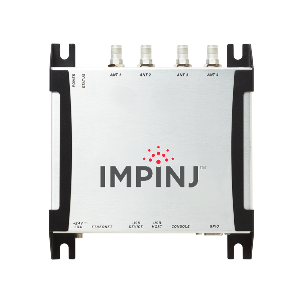
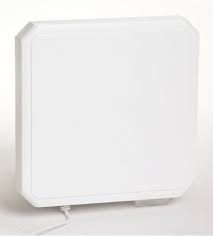
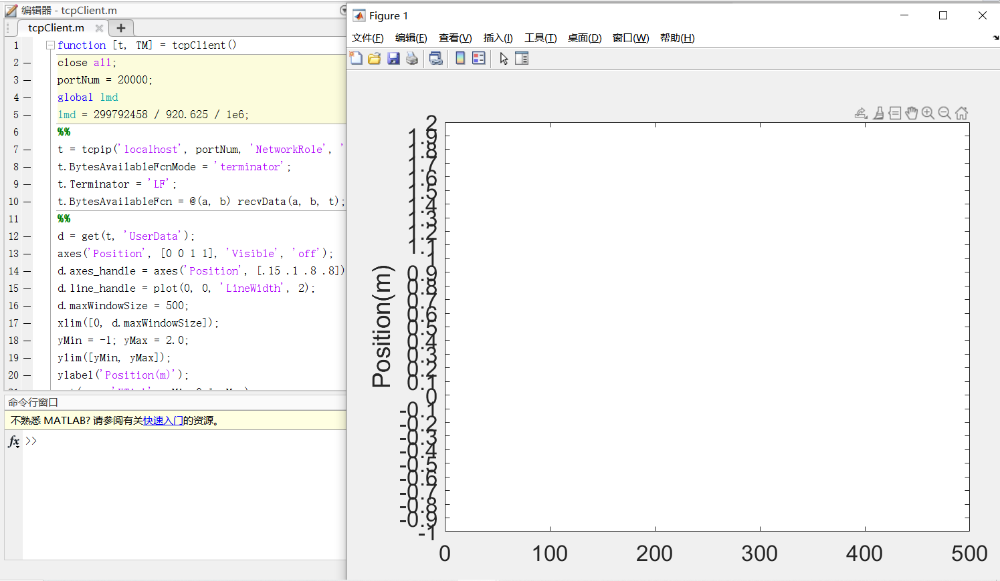

# Backscatter Sensing

Previously, various backscatter technologies were introduced. Based on backscatter signals, we can also achieve diverse sensing capabilities. ?? (Insert reference to my article published in CCCF here.)

## RFID Tracking

As an example of backscatter-based sensing, this section presents a one-dimensional tracking system using RFID technology. The system captures the phase information of RFID tags through an RFID reader and displays the tracking results in real time on a graphical interface.

### Experimental Equipment

**ImpinJ Speedway R420 Reader:** ([Official Website](https://www.impinj.com/products/readers/impinj-speedway))

Figure. RFID Reader

**Antenna:**

Figure. RFID Antenna

**RFID Tags:**

Figure. RFID Tag

## Programming Environment and IDE

- IntelliJ IDEA Education Edition
- openjdk-15 (java version "15.0.1")
- MATLAB R2020b

## Project Directory Structure

The project files are located in the `./code` directory.

- `./code/Octane_SDK_Java_3_0_0`: Contains the Java code for controlling the RFID reader. Open this folder using IntelliJ IDEA, as shown below:

Figure. Java-side Program Interface

After connecting the RFID reader to the computer, running `main.java` will retrieve data from the reader and transmit it via a TCP connection (the specific implementation is in `SingleTagReader.java`) to a local MATLAB program.

- `./code/tcpClient.m`: MATLAB script that receives and visualizes the tracking results. Open this file in MATLAB. After starting the Java program, run `tcpClient.m` to display the real-time tracking results, as illustrated below:

Figure. MATLAB-side Program and Result Visualization Interface

## LoRa Backscatter Sensing  
?? (To be completed by Jin-Yan Jiang)