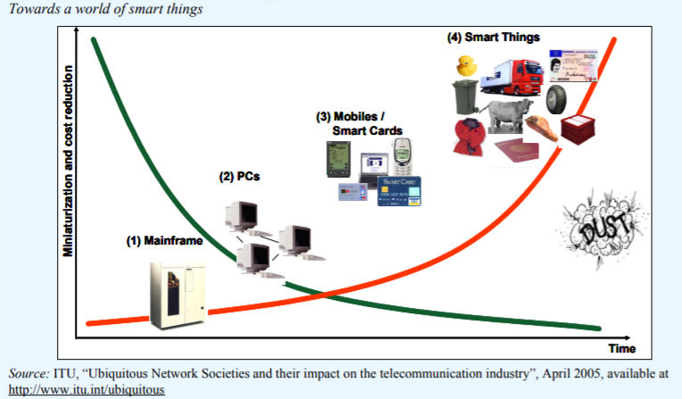

# History of IoT Development

There is, in fact, no precise definition of the Internet of Things (IoT) to date. Generally speaking, IoT is regarded as an extension of the traditional Internet into the physical world—connecting the physical world so that networks can better serve humanity. According to Wikipedia:

> “The Internet of things (IoT) is the extension of Internet connectivity into physical devices and everyday objects. Embedded with electronics, Internet connectivity, and other forms of hardware (such as sensors), these devices can communicate and interact with others over the Internet, and they can be remotely monitored and controlled.”

In simple terms, IoT enables diverse devices to interconnect; these devices can sense the physical world, communicate and interact with one another, and collectively deliver various services. IoT finds broad application across production and daily life, giving rise to numerous application scenarios such as smart homes, smart cities, smart agriculture, smart medical and healthcare systems, and environmental monitoring.

While exploring the historical development of IoT, we find that many underlying technologies trace back much further. Sensing technology constitutes a critical component of IoT. The earliest devices for perceiving the physical world were sensors—nearly all sensors precisely capture external physical phenomena by converting physical signals (typically voltage signals) into electrical ones. For instance, a temperature sensor detects temperature variations by converting thermal signals into voltage signals (note: as of the time of this book’s publication, all commercially available temperature sensors measure temperature indirectly). Similarly, gas sensors (e.g., for PM2.5 or formaldehyde) employ photochemical or electrochemical methods to convert gas concentrations into voltage signals, where signal amplitude reflects gas concentration. The emergence of sensors enabled digitization of the physical world, dramatically improving efficiency in processing physical-world information during production and daily life—thus establishing sensors as the foundational element of IoT.

However, sensors alone do not constitute a complete IoT system. Initially, sensors emerged without any concept of networking—they served merely as tools for digitizing the physical world. In 1991, Mark Weiser of Xerox Palo Alto Research Center introduced the concept of *Ubiquitous Computing*: systems that enhance computing availability anytime and anywhere while reducing its visibility—delivering services seamlessly and unobtrusively.

> “the most profound technologies are those that disappear. They weave themselves into the fabric of everyday life until they are indistinguishable from it.” —Mark Weiser

To realize such invisible, ubiquitous service delivery, device control and information interconnection are indispensable. Sensing, control, and interconnection collectively outline the fundamental blueprint of IoT.

Figure. Ubiquitous Computing and IoT

The development of wireless sensor networks (WSNs) represents a pivotal milestone in IoT history. At the time, a research group from UC Berkeley conducted ecological monitoring experiments on a remote island lacking basic network infrastructure. To collect experimental data, the team deployed multiple small-scale, wireless sensor network nodes. Each node was equipped with sensors to monitor environmental conditions and could communicate with other nodes—self-organizing into a network capable of communication, data processing, and task distribution. This marked the birth of the earliest wireless sensor network. WSNs extended the application scope of conventional sensors into the physical world and simultaneously expanded the traditional notion of networking—eliminating reliance on dedicated infrastructure in favor of ad-hoc, self-organized node-to-node communication.

The emergence of WSNs attracted widespread attention and significant investment, with expectations for deployment in forest monitoring, urban surveillance, and environmental monitoring. WSNs became a major research focus, spawning extensive academic work and producing numerous outstanding researchers. Although direct large-scale applications of WSNs remained limited, key enabling technologies developed during this period—including low-power design and ad-hoc networking—have since become foundational to modern IoT implementations.

Another important application domain is Radio Frequency Identification (RFID). Researchers envisioned an alternative IoT trajectory: evolving toward a logistics-oriented network, leveraging RFID to improve supply-chain efficiency. Based on contemporary Internet infrastructure, wireless communications, RFID technology, and the EPC standard, this vision aimed to establish a globally shared, real-time information network for physical goods.

Owing to the convergence of these technologies—and the compelling vision they inspired—IoT emerged in 2003 as a highly promising field, even ranking among the “Top Ten Technologies Expected to Transform Human Life” in the near future.

In 2005, the International Telecommunication Union (ITU) published its *Internet Reports 2005*, titled *The Internet of Things*—likely the first official ITU report to formally introduce the IoT concept. This comprehensive report remains highly recommended reading. Though written in 2005, much of its content remains relevant today. It posits that, with IoT advancement, every grain and speck of dust could eventually be uniquely identified and connected—enabling dynamic intelligence in seemingly static objects; allowing the virtual world to mirror the physical world; assigning unique addresses to all objects; and facilitating communication between people and things, as well as between things themselves.

> In this way, the “virtual world” would “map” the “real world”, given that everything in our physical environment would have its own identity (a passport of sorts) in virtual cyberspace. This will enable communication and interaction between people and things, and between things, on a staggering scale.

This 2005 report established IoT’s foundational definition and articulated its visionary potential.

Figure. Three Dimensions of Network Connectivity

IoT introduces a new dimension to traditional networking—extending beyond “anytime, anywhere connectivity” to enable “connectivity of everything.”

 

Figure. Toward Connectivity of Everything

> ITU Internet Report: https://www.itu.int/net/wsis/tunis/newsroom/stats/The-Internet-of-Things-2005.pdf

The ITU report illustrates its IoT vision through a concrete, narrative-driven scenario—a technically grounded yet romantic story blending technology, love, and human emotion.

> But what does it all mean in a concrete sense for a citizen of the future? Let us imagine for a moment a day in the life of Rosa, a 23-year-old student from Spain, in the year 2020. Rosa has just quarrelled with her boyfriend and needs a little time to herself. She decides to drive secretly to the French Alps in her smart Toyota to spend a weekend at a ski resort. Before her trip, Rosa plans to go shopping. But it seems she must have her car checked – the RFID sensor system in the car has alerted her of possible tyre failure caused by under-inflation. The RFID sensor system is required by road safety legislation adopted many years back. Rosa drives to the nearest Toyota maintenance centre. As she passes through the gates, a diagnostic tool using sensors and radio technology conducts a comprehensive check of her car and asks her to proceed to a specialized maintenance terminal. The terminal is equipped with fully automated robotic arms and Rosa confidently leaves her beloved car behind in order to get some coffee. The “Orange Wall” beverage machine knows all about Rosa’s love of ice coffee and pours it out after Rosa waves her internet watch for a secure payment.

> When she gets back, a brand new pair of rear tyres has already been installed. RFID tags integrated in the new tyres store such information as each tyre’s unique identification, manufacturer, date and place of replacement, and information about the car. In addition, like all tyres, they come equipped with sensors to monitor pressure, temperature and deformation. Any discrepancies will be reported to the intelligent dashboard control system. As a complimentary service, the garage offers to cover Rosa’s Toyota with a special coat of nano glazing for corrosion protection and dirt resistance. The robotic guide then prompts Rosa on the privacy-related options associated with the new tyres. The information stored in her car's control system is intended for maintenance purposes but can be read at different points of the car journey where RFID readers are available. However, since Rosa does not want anyone to know (especially her boyfriend) where she is heading, such information is too sensitive to be left unprotected. She therefore chooses to have the privacy option turned on to prevent unauthorized tracking. Finally, Rosa is able to attend to her shopping. She drives to the nearest mall. She wants to buy a new snowboard jacket with embedded media player. She is particularly concerned about catching a cold (since her exams are coming up) and luckily, the new multimedia jacket also comes equipped with weather-adjusting features. The resort she is heading towards also uses network of wireless sensors to monitor the possibility of avalanches, so she feels both healthy and safe. At the French-Spanish border, there is no need to stop, as Rosa’s car contains information on her driver’s licence and passport, which is automatically transmitted to the minimal border control installations. Suddenly, Rosa gets a video-call on her sunglasses. She pulls over and sees her boyfriend who begs to be forgiven and asks if she wants to spend the weekend together. Her spirits rise and, on impulse, she gives a speech command to the navigation system to disable the privacy protection, so that her boyfriend’s car might find her location and aim directly for it. Even in a world that is full of smart interconnected things, it is human feelings that continue to rule.

We strongly recommend reading this story to appreciate a technologist’s imaginative vision of IoT. Today, this narrative appears less like science fiction and more like a plausible forecast—precisely demonstrating how many technologies outlined in this nearly two-decade-old report are gradually becoming reality.

In 2009, U.S. President Barack Obama convened a roundtable discussion with American business leaders. During this meeting, IBM first proposed the concept of *Smarter Planet*: embedding computing capabilities across industries and integrating sensing functions throughout industrial production. IBM’s former CEO Louis Gerstner asserted a key observation—that computing paradigms undergo transformative shifts approximately every 15 years. This observation, as accurate as Moore’s Law, is now known as the “15-Year Cycle Law.” The main paradigm shift around 1965 was marked by mainframes; that around 1980, by the proliferation of personal computers; and that around 1995, by the Internet revolution. Each such technological transformation has profoundly reshaped competitive landscapes among enterprises, industries, and even nations. Also in 2009, Premier Wen Jiabao, during an inspection tour in Wuxi, China, proposed the *Perceiving China* initiative. IoT was officially designated as one of China’s five strategic emerging industries and incorporated into the government work report—triggering unprecedented national attention and investment.

In recent years, IoT integration with industrial production has given rise to concepts such as Industrial IoT (IIoT) or Industrial Internet—highlighting IoT’s immense potential. Many sectors have significantly improved production efficiency by combining IoT with industrial processes. Simultaneously, the convergence of IoT and Artificial Intelligence (AI+IoT) has become a major industrial development goal, with numerous companies adopting AI+IoT as their core strategic direction.

Behind this vibrant landscape, however, let us move beyond the dazzling array of application scenarios to examine IoT’s essence and understand its underlying technologies.

We consider IoT architecture to generally comprise four layers: the Perception Layer, the Connection Layer, the Network Layer, and the Application Layer.  
- The **Perception Layer** focuses on sensing the physical world—using dedicated sensor devices, or, increasingly, exploiting novel approaches such as analyzing how object positions and human motion perturb wireless signals to infer object locations and human activities.  
- The **Connection Layer** addresses how to connect massive numbers of physical devices to networks. This requires integrating conventional networking technologies (e.g., Wi-Fi, Bluetooth) while solving new challenges specific to IoT—such as supporting ultra-low-power, long-range, and massively concurrent connections for resource-constrained devices.  
- The **Network Layer** governs how IoT data and commands are routed to their destinations. While building upon traditional Internet architecture, this layer exhibits new characteristics arising from massive device interconnection—such as crowd-sensing applications.  
- The **Application Layer** implements end-user IoT services atop the lower three layers. Building on IoT data, applications integrate multidimensional information and advanced technologies—including AI algorithms and big-data analytics.

Take the smart home as an illustrative example: Upon waking, motorized curtains automatically detect the user’s rising and open accordingly; based on weather forecasts and outdoor conditions, windows may open to optimize comfort. Simultaneously, coordinated communication between windows and air-conditioning units determines optimal AC operating mode and temperature settings. Concurrently, the user’s smart electricity meter—alongside millions of others—transmits consumption data to the utility grid for billing. After the user departs, remote AC control remains available via smartphone app.

This scenario raises numerous technical questions: How to accurately infer human states? How to safeguard privacy? How to efficiently interconnect heterogeneous devices? How to achieve scalable, long-distance, low-power connectivity? How to implement self-organizing networks? How to transmit, store, and process massive volumes of collected data? And how to leverage AI to realize intelligent, context-aware applications? These questions will be systematically addressed as you progress through this book—and we welcome your continued engagement and discussion.

> “What is learned from books is superficial after all; to thoroughly understand something, one must practice it personally.”  
> —Lu You (Song Dynasty poet)

Mastering IoT demands both theoretical understanding and hands-on experience. Beyond foundational conceptual knowledge, this book provides diverse experimental case studies reflecting practical IoT learning. We encourage you to think critically *and* act deliberately—to integrate theory with practice—and thereby achieve meaningful mastery!