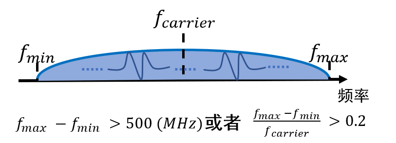
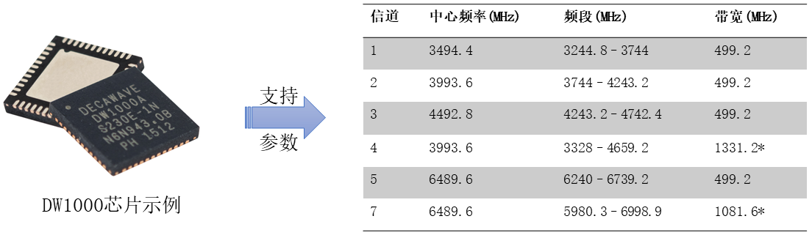
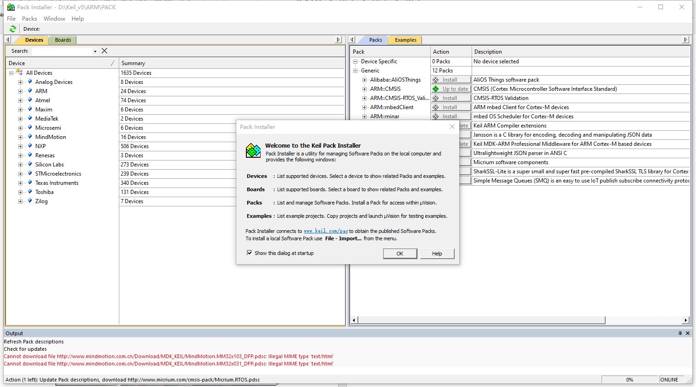

# UWB Positioning

Ultra-Wideband (UWB) technology refers to wireless communication technologies with a bandwidth greater than $Ultra Wide Band，UWB$ or a fractional bandwidth greater than $0.2$. Benefiting from its large bandwidth, UWB achieves nanosecond-level time resolution, enabling extremely high ranging and positioning accuracy ($\approx 10cm$). Consequently, it is widely applied in indoor positioning scenarios.

Below, we introduce how to develop and deploy positioning systems using existing UWB development kits.

Figure. Definition of UWB

With continuous optimization of UWB chip fabrication processes and decreasing costs, an increasing number of enterprises and vendors have begun researching UWB and developing positioning systems. Representative companies include Decawave and Ubisense. Taking the DW1000 chip developed by Decawave as an example: during signal transmission and reception, the chip embeds nanosecond-precision timestamps, enabling the use of prior ranging or positioning algorithms—such as Time-of-Arrival (TOA) or Time-Difference-of-Arrival (TDOA)—to perform distance measurement or localization.

Figure. UWB Chip

# Environment Setup and Kit Development

Based on the above hardware, we proceed with environment installation, configuration, and kit development in the following three steps:

1. Download and install the Keil IDE. Keil is a widely used integrated development environment (IDE) for embedded hardware development, debugging, and firmware programming.
2. Install the ST Virtual COM Port (VCP) driver. Our kit provides a USB interface, requiring appropriate driver installation.
3. Flash the UWB firmware. After environment setup, we use the ST-Link tool to download and program the firmware.
Detailed instructions follow.
4. Acquire serial port data.

## 1. Keil IDE Download and Installation

Visit the Keil official website, search for and download Keil µVision 5 (mdk520.exe), then install Keil5. Alternatively, install via other methods. The Keil5 installation process is straightforward (“wizard-style”); simply click Next throughout.

Figure. Keil5 Installation Step 1

Here, select the installation paths for the software core and pack components. Choose a simple, space-sufficient directory.

Figure. Keil5 Installation Step 2

After installation completes, launch Keil; the package installation interface appears. Note the progress indicator in the lower-right corner.

Figure. Keil5 Installation Step 3

Typically, after loading completes, locate the hardware support package matching your target board—for example, “STM32F0xxxx”—and click Download.

Figure. Keil5 Package Installation

If network issues cause slow loading or downloading, users may repeat the loading process multiple times, or manually download required packages (e.g., “Keil.STM32F1xx_DFP.2.3.0.pack”) from the web and import them via File → Import.

### 2. ST Virtual COM Port Driver Installation

The virtual COM port driver is provided by STMicroelectronics; select the version compatible with your operating system. Installation follows standard procedures. We provide two executable files: `VCP_V1.4.0_Setup.exe` and `dpinst_amd64.exe`. Simply double-click either file and follow the prompts (click OK or Next) to complete the virtual COM port driver installation.

After installation, connect the UWB node to the PC and check **This PC → Properties → Device Manager**. Under the *Ports (COM & LPT)* section, verify that a COMx port (where x is a number) appears—indicating successful ST virtual COM port driver installation. You may now proceed to flash the UWB node firmware. Example shown below:

Figure. ST Driver Installation

### 3. UWB Firmware Flashing

First, connect the UWB node to the ST-Link programmer. Ideally, connect both the ST-Link programmer and the UWB node to the PC simultaneously. The connection diagram between the ST-Link and UWB node is shown below:

Figure. ST-Link and UWB Node Connection

Four wires are required: GND, 5V, DIO, and CLK. Connect corresponding pins between the node and ST-Link.

Next, open the corresponding node project in Keil—typically by double-clicking the `.uvprojx` file.

Figure. Keil5 Project Code

Once opened, first click **Project → Build Target** from the top menu bar to compile the project. After compilation completes, click **Flash → Erase** to erase the microcontroller’s flash memory. Then click **Flash → Download** to begin firmware flashing. **Important:** Do not disconnect the hardware until flashing completes.

### 4. Serial Port Data Acquisition

After identifying the correct COM port and successfully flashing the firmware, you can acquire and analyze serial output from the UWB hardware for debugging and application processing. We currently use the XCOM serial terminal tool. After connecting the UWB kit to the PC, launch XCOM, select the correct COM port, and click Open to view real-time serial output from the hardware.

Figure. XCOM Serial Terminal Example

At this point, the UWB kit development environment is essentially complete. The next task is to implement positioning or tracking algorithms by writing UWB hardware firmware (using Keil IDE).