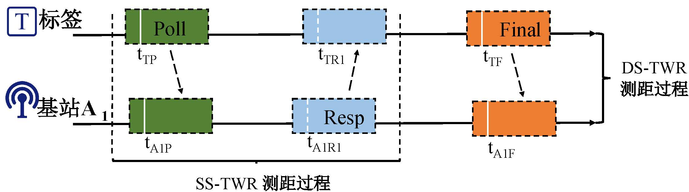
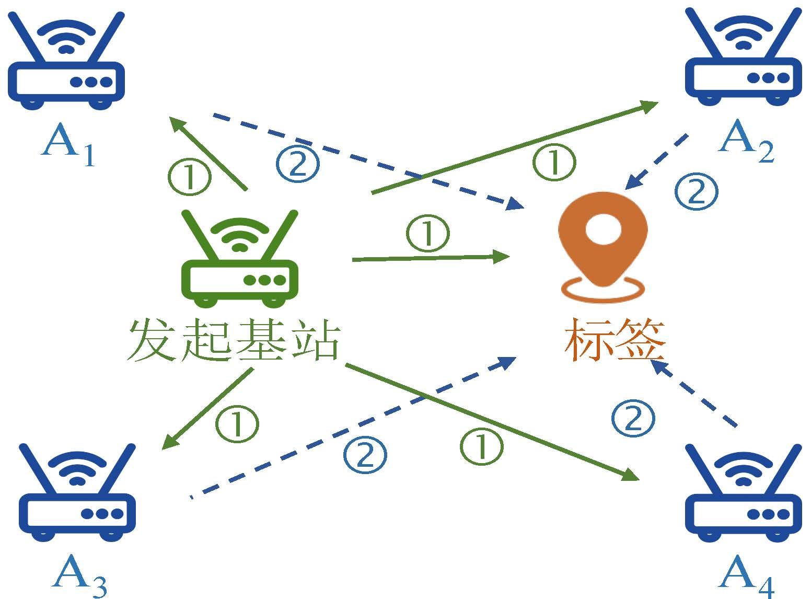
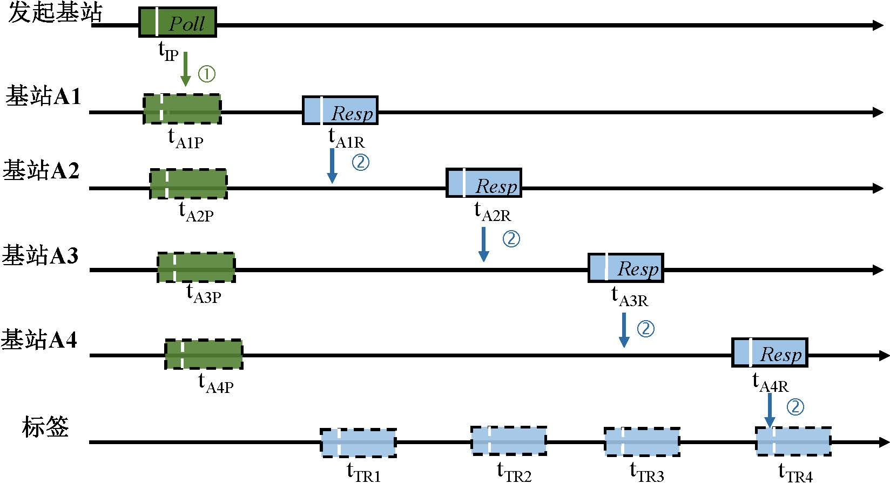
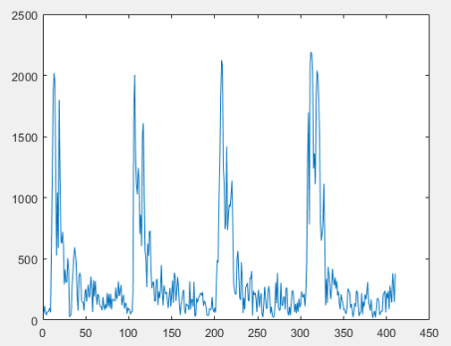

# UWB Ranging and Localization Algorithms  
Common UWB ranging and localization algorithms include Two-Way Ranging (TWR), Time Difference of Arrival (TDOA) and concurrent transmission algorithms, and Angle of Arrival (AoA) algorithms. We introduce each of these in turn below.

## Two-Way Ranging (TWR) Algorithm  
Based on signal time-of-arrival measurements, the IEEE 802.15.4 standard recommends a two-way ranging method for ultra-wideband ranging.  
The figure below illustrates two TWR variants: Single-Sided Two-Way Ranging (SS-TWR) and Double-Sided Two-Way Ranging (DS-TWR).  
<center>  
  
</center>  

In SS-TWR, one round-trip data exchange occurs between a tag and an anchor (e.g., $A_1$), enabling estimation of the inter-device flight time using the following formula:  

$$ T_f = \frac{1}{2}((t_{TR1}-t_{TP}) - (t_{A1R1}-t_{A1P})) $$  

DS-TWR extends SS-TWR by adding a second data exchange, forming a “Poll”–“Resp”–“Final” packet exchange sequence, thereby achieving higher ranging accuracy.  
The inter-device flight time is computed as follows:  

$$ T_f = \frac{(t_{TR1}-t_{TP})(t_{A1F}-t_{A1R1}) - (t_{TF} - t_{TR2})(t_{A1R1} - t_{A1P})}{(t_{TF} - t_{TP}) + (t_{A1F} - t_{A1P})} $$  

Two questions naturally arise:  
1. Why is DS-TWR more accurate than SS-TWR?  
2. Why does DS-TWR adopt the above formula instead of a simpler approach—e.g., computing two separate flight times and averaging them?  

These questions can be answered by analyzing the ranging error characteristics of each method; see [2] for details.

## TDOA and Concurrent Transmission Algorithms  
As illustrated in the figure, a typical TDOA procedure proceeds as follows: First, an initiator anchor (commonly termed the reference anchor; this nomenclature is adopted here for consistency with our methodology) broadcasts a reference packet to all other anchors, enabling global time synchronization across the anchor network. Subsequently, anchors $A_1$ through $A_4$ sequentially transmit packets to the tag. Upon receiving these packets, the tag computes the differences in its distances to the respective anchors.  
<center>  
<figure>  
  
  
</figure>  
</center>  

The right-hand subfigure schematically depicts the entire communication process. Using anchors $A_1$ and $A_2$ as examples, we explain the computation.  

For the initiator anchor, anchor $A_1$, and the tag, the timestamp $t_{TR1}$ recorded by the tag equals the sum of: the initiator’s transmission time $t_{IP}$, the flight time $\frac{d_{IA1}}{c}$ from the initiator to anchor $A_1$, the processing interval $t_{A1R}$–$t_{A1P}$ between reception and retransmission at anchor $A_1$, and the flight time $\frac{d_{A1T}}{c}$ from anchor $A_1$ to the tag:  

$$ t_{TR1} = t_{IP} + \frac{d_{IA1}}{c} + t_{A1R} - t_{A1P} + \frac{d_{A1T}}{c}$$  

where $c$ denotes the electromagnetic wave propagation speed.  

Similarly, for the initiator anchor, anchor $A_2$, and the tag:  

$$ t_{TR2} = t_{IP} + \frac{d_{IA2}}{c} + t_{A2R} - t_{A2P} + \frac{d_{A2T}}{c}$$  

Subtracting Eq. (3) from Eq. (2) and rearranging yields:  

$$ \frac{d_{A2T}}{c} - \frac{d_{A1T}}{c} = t_{TR2} - t_{TR1} + \frac{d_{IA1}}{c} - \frac{d_{IA2}}{c} + t_{A1R} - t_{A2R} - t_{A1P} + t_{A2P}$$  

It is evident that the left-hand side represents the difference in flight times from the tag to the two anchors, while all terms on the right-hand side are known or measurable. This yields the TDOA information, which can then be used in localization solvers. A code example implementing the classical Chan algorithm is provided below.

### Chan Algorithm Example  
Below is a simplified implementation of the Chan algorithm. We assume TDOA measurements have already been obtained via UWB, and apply the classic Chan algorithm to estimate the tag’s position:  

```matlab  
clc;  
clear;  

% Number of anchors  
BSN = 4;  
% Anchor coordinates: 2×BSN matrix, each column is an (x,y) coordinate  
BS = [0 , sqrt(3) , 0.5*sqrt(3) , -0.5*sqrt(3);  
      0 ,       0 ,         1.5 ,         1.5];  
% True tag position (unknown in practice)  
MS = [2 3];  
% R0: noise-free distances from each anchor to the tag  
for i = 1:BSN  
    R0(i) = sqrt((BS(1,i)-MS(1))^2 + (BS(2,i)-MS(2))^2);  
end  
% R(i): distance difference between anchor i+1 and anchor 1 (computed as TDOA × c in practice)  
for i = 1:BSN-1  
    R(i) = R0(i+1) - R0(1);  
end  

% First weighted least-squares estimation  
for i = 1:BSN  
    k(i) = BS(1,i)^2 + BS(2,i)^2;  
end  
for i = 1:BSN-1  
    h(i) = 0.5*(R(i)^2 - k(i+1) + k(1));  
end  
for i = 1:BSN-1  
    Ga(i,1) = -BS(1,i+1);  
    Ga(i,2) = -BS(2,i+1);  
    Ga(i,3) = -R(i);  
end  
Za = inv(Ga' * Ga) * Ga' * h';  
X(1,1) = abs(Za(1,1));  
X(2,1) = abs(Za(2,1));  

% Second weighted least-squares estimation  
X1 = BS(1,1);  
Y1 = BS(2,1);  
h2 = [(Za(1,1) - X1)^2;	(Za(2,1) - Y1)^2; Za(3,1)^2];  
Ga2 = [1,0;   0,1;   1,1];  
B2 = [Za(1,1)-X1,  0,           0;  
      0,           Za(2,1)-Y1,  0;  
      0,           0,           Za(3,1)];  
Za2 = inv(Ga2' * inv(B2) * Ga' * Ga * inv(B2) * Ga2) * (Ga2' * inv(B2) * Ga' * Ga * inv(B2)) * h2;  

X(1,1) = abs(Za2(1,1))^0.5 + X1;  
X(2,1) = abs(Za2(2,1))^0.5 + Y1;  
disp(X)  
```  

Note: Here, TDOA values are directly synthesized from the true tag position $MS$ (in practice, they must be measured via UWB). Consequently, the final estimated position `X` must exactly match $MS$.

### Concurrent Transmission Algorithm  
To accelerate localization, the inter-anchor packet transmission intervals in the above TDOA scheme are shortened so that packets arrive at the tag nearly simultaneously. The core design principle leverages UWB’s exceptional temporal and spatial resolution—specifically, its ability to reliably resolve distinct packets separated by nanosecond-scale intervals. The left subfigure below illustrates the concurrent transmission protocol, while the right subfigure shows a channel impulse response (CIR) observed at the tag receiver.  
<center>  
<figure>  
  
  
</figure>  
</center>  

Although the closely spaced packets arrive almost simultaneously and interfere at the receiver, the signal capture effect ensures that the tag successfully receives and resolves all arriving signals. In the CIR plot, the horizontal axis denotes sampling points (each point corresponds to 1 ns), and the vertical axis represents CIR amplitude. From this CIR, the time differences among packet arrivals can be extracted. Combining these time differences with the TDOA derivation process described earlier yields the TDOA measurements between the tag and multiple anchors, enabling subsequent localization via the Chan algorithm. For further details, see [3][4].

## AoA Algorithm  
The UWB AoA measurement model is shown in the left subfigure below. When a far-field wireless signal impinges upon an antenna array, the path-length difference $(P)$ between the signal paths to two antennas relates to the antenna spacing $(d)$ and the angle of arrival $(\theta)$ as follows:  

$$ P = dsin(\theta) $$  

Let the carrier frequency be $f$ and the speed of light be $c$. Then the phase difference (PDOA) $\alpha$ between the two antennas is given by:  

$$ \alpha = \frac{2\pi f}{c}P $$  

From $\lambda = \frac{c}{f}$, the AoA can be estimated as:  

$$ \theta = arcsin(\frac{\alpha \lambda}{2\pi d})  $$  

This equation indicates that the AoA can be derived from the measured PDOA $\alpha$ between the antennas. For clarity, directions yielding PDOA ≤ 0 (i.e., $\alpha \leq 0$) are defined as negative, and those yielding PDOA ≥ 0 (i.e., $\alpha \geq 0$) as positive.  

<center>  
<figure>  
  
  
</figure>  
</center>  

Upon receiving a UWB signal, the receiver first estimates the channel impulse response (CIR). It then applies the Leading Edge Detection (LED) algorithm to identify the signal arrival instant. LED operates simply: it estimates the noise floor from the CIR, locates the first CIR sample exceeding this threshold, and marks it as the arrival point. For commercial dual-antenna UWB devices, two CIRs—one per antenna—are acquired per reception event.  

The right subfigure above shows exemplary CIRs from two antennas, where arrival points $p1$ and $p2$ denote the LED-determined arrival instants for each antenna. The PDOA $\alpha$ is then computed as:  

$$\alpha = angle(p1) - angle(p2)$$  

To improve PDOA accuracy, the native PDOA value $\alpha$ is corrected by subtracting the phase offset introduced by the Start-of-Frame Delimiter (SFD), thereby mitigating hardware-induced noise. Once the refined PDOA is obtained, the AoA is computed using the derivation above [5]. After estimating AoA relative to multiple anchors, the tag’s position is determined by intersecting the corresponding directional lines.

## V-TWR Algorithm  
We propose V-TWR [??], a high-accuracy, scalable localization algorithm. V-TWR draws inspiration from both TWR and TDOA methods, aiming to achieve TWR-level positioning accuracy while supporting massive (even unbounded) numbers of tags—matching the scalability of TDOA-based systems.  
<!--  
## AoA Localization Optimization Algorithm  
Limited by commercial dual-antenna hardware, existing AoA methods yield coarse angular estimates. What causes this low angular resolution? Can the angle estimation accuracy of commercial UWB devices be further improved? These questions are addressed in the AoA Localization Optimization Algorithm section, including detailed design explanations.  

## UWB Link Classification Algorithm  
UWB’s excellent multipath resilience enables high ranging and localization accuracy in indoor environments. However, like other wireless technologies, UWB remains susceptible to non-line-of-sight (NLOS) conditions: when the direct path is obstructed, ranging and localization accuracy degrade significantly. The UWB Link Classification Algorithm section explores this challenge and presents our designed link classification algorithm.  
-->  

## References  
1. Jiang Y, Leung V C, "An asymmetric double sided two-way ranging for crystal offset", IEEE International Symposium on Signals, Systems and Electronics 2007.  
2. Neirynck D, Luk E, McLaughlin M, "An alternative double-sided two-way ranging method", IEEE WPN 2016.  
3. Corbalán P, Picco G P, Palipana S, "Chorus: UWB concurrent transmissions for GPS-like passive localization of countless targets", IEEE IPSN 2019.  
4. Großwindhager B, Stocker M, Rath M, et al, "SnapLoc: An ultrafast UWB-based indoor localization system for an unlimited number of tags", IEEE IPSN 2019.  
5. Dotlic I, Connell A, Ma H, et al, "Angle of arrival estimation using DecaWave DW1000 integrated circuits", IEEE WPNC 2017.