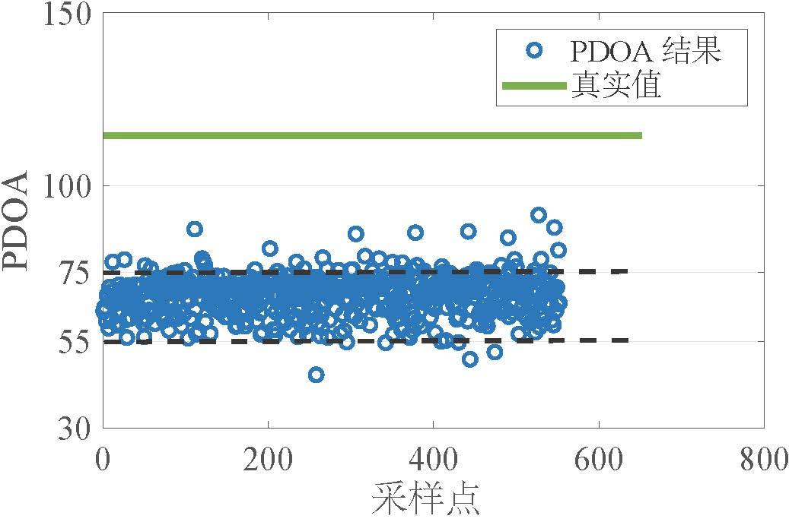
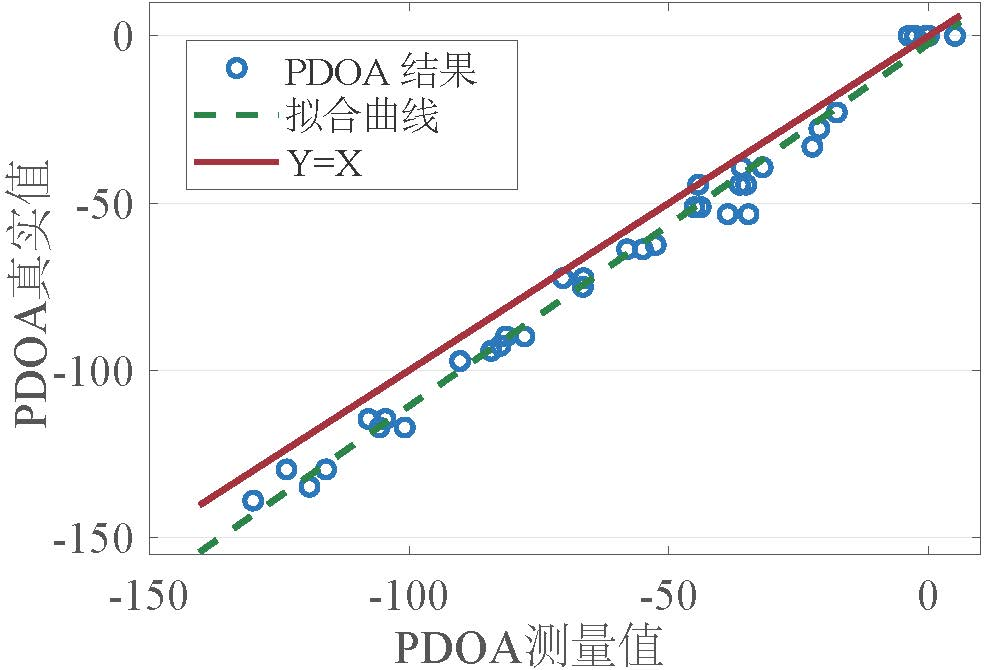
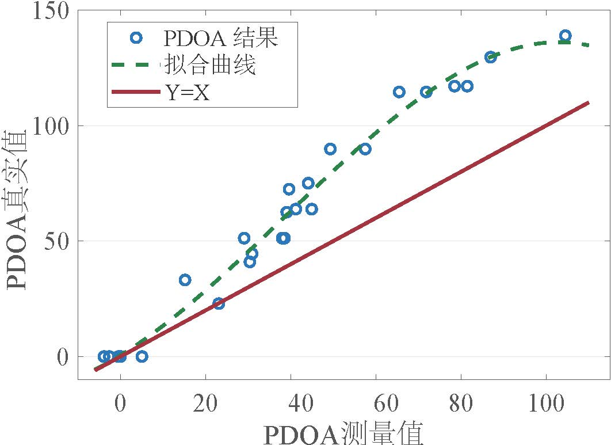
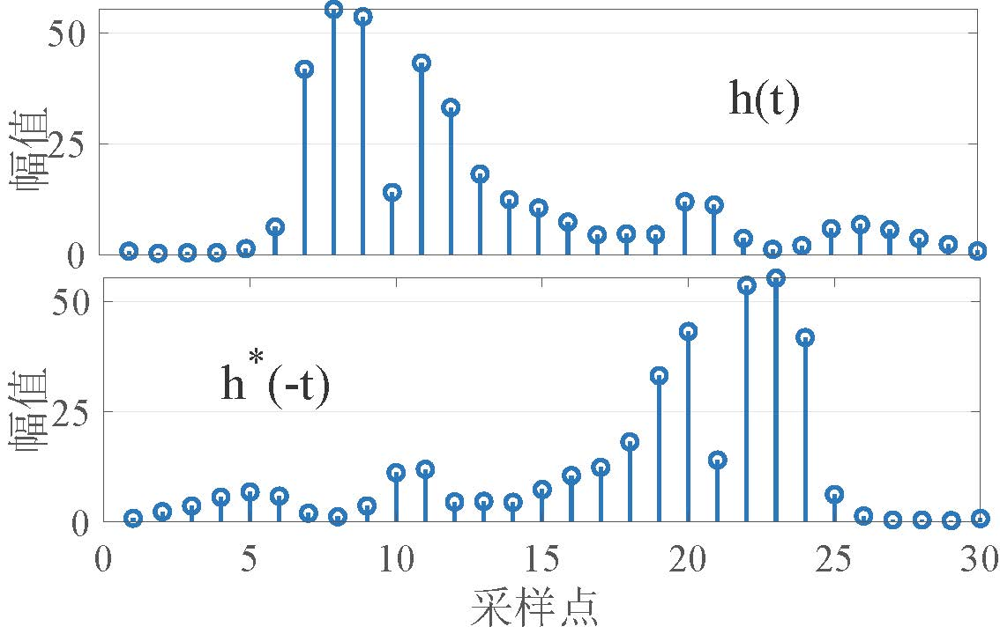
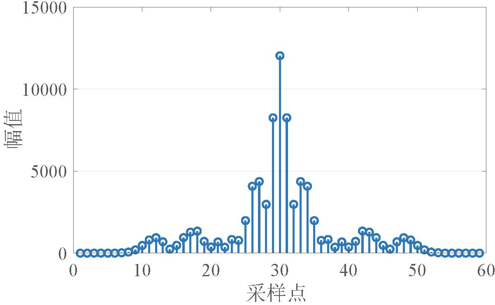
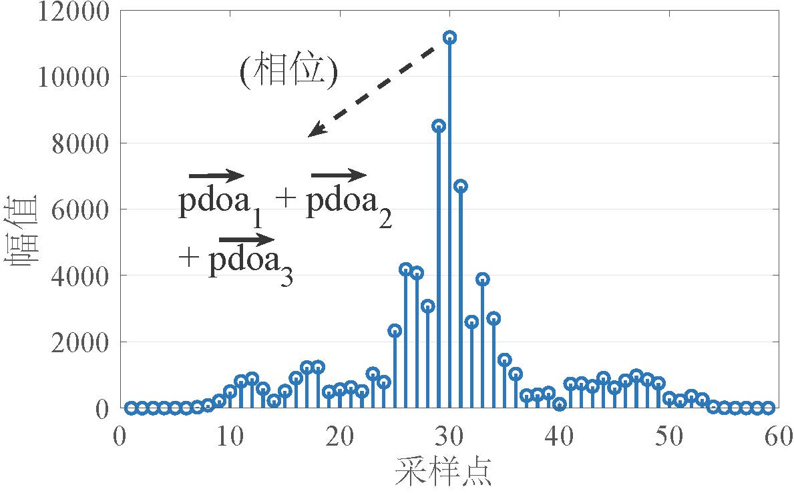

# AoA Localization Optimization Algorithm

We first demonstrate the performance and limitations of existing angle-of-arrival (AoA) estimation methods, then present our own design.

## Performance and Limitations of Existing AoA Estimation Methods  
We adopt a phase-difference-of-arrival (PDOA)-based AoA estimation method, one of the most widely used ultra-wideband (UWB) AoA techniques today. A detailed description of this method is provided in the UWB ranging and localization algorithm chapter.  

The figure below shows PDOA measurement results for both positive and negative directions. The green line represents the ground-truth values, while the blue dots denote the measured values. It is evident that even at the same spatial direction, the PDOA measurements exhibit significant deviations: for instance, the fluctuation between the two black dashed lines in the left plot approaches $AoA(PDOA=75) - AoA(PDOA=55) = 20 \degree$, corresponding to an AoA estimation error of $7.73\degree$. Furthermore, we observe spatial asymmetry in the PDOA measurements—namely, the PDOA estimation error in the positive direction is substantially larger than that in the negative direction.

<figure>

</figure>

To further validate this phenomenon, we collected numerous PDOA measurements across various directions and plotted them as shown below. Blue dots represent the average PDOA measurement at each direction, obtained from multiple repeated measurements at the same location; the red line indicates the ideal relationship between true PDOA values and measured PDOA values. As clearly visible, the measured PDOA values indeed exhibit spatial asymmetry: they approximate a linear relationship with the true values in the negative direction, but display pronounced nonlinearity in the positive direction. Moreover, the measurement error remains small in the negative direction but grows rapidly in the positive direction. This asymmetric error is substantial—for example, the AoA estimation error in the positive direction can exceed $30\degree$. Such errors must be eliminated to obtain accurate PDOA estimates. This deviation between measured and true values arises from inter-antenna coupling effects. Similar issues have been reported in other works using commercial dual-antenna devices, e.g., References 1 and 2.

<figure>

</figure>

In summary, the measurement accuracy of existing UWB AoA methods on commercial dual-antenna devices falls far short of expectations. This section identifies two primary issues: (1) existing methods yield inaccurate and unstable AoA estimates; (2) antenna coupling effects cause severe deviations between measured and true AoA values.

## Time-Reversal-Based AoA Estimation Method

### Time-Reversal (TR) Effect  
The time-reversal (TR) effect refers to the phenomenon where signal energy concentrates simultaneously in time and space when a signal is convolved with its time-reversed and complex-conjugated version. First proposed in the 1950s, TR has since been applied in optics, ultrasound, and WiFi systems. For further details, refer to References 3–5.

We illustrate the TR effect using channel impulse response (CIR) data from UWB signals. As shown in the figure below, the two left subplots depict a CIR sequence $h(t)$ and its time-reversed version $h^*(-t)$, respectively. Here, $h^*(-t)$ denotes the time-reversed and complex-conjugated version of the sequence $h(t)$. Convolution of these two CIR sequences yields a symmetric output sequence featuring a prominent peak, as shown in the right subplot. When the two CIR sequences are perfectly aligned, their corresponding sample-phase terms cancel exactly during convolution, enabling coherent summation and producing the dominant peak shown. It follows directly that the phase of this peak equals $0$.

In summary, convolving a received CIR sequence $h1$ with its time-reversed and complex-conjugated version produces a clear energy concentration effect. According to convolution theory, perfect alignment of the two sequences leads to coherent summation and generates a dominant peak with zero phase. The TR effect has many applications—for instance, RIM (Reference 3) exploits it to estimate the velocity of moving antenna arrays. Specifically, RIM determines the instant when a moving antenna aligns with the preceding antenna by monitoring the strength of the energy concentration effect, then computes the array’s velocity based on the elapsed movement time. Next, we demonstrate how the TR effect can improve PDOA estimation accuracy on commercial multi-antenna devices.

<figure>

</figure>

### Time-Reversal (TR)-Based AoA Estimation Method  
As introduced earlier, applying the TR effect to two identical CIR sequences yields a distinct energy concentration phenomenon. However, when applying TR to CIR sequences captured by two separate antennas, two key differences arise:  
First, a phase difference exists between the two CIR sequences.  
Second, due to UWB’s fine-grained multipath resolution, multiple distinct phase differences may coexist between the two CIR sequences.  
These two characteristics constitute precisely why the TR effect can be leveraged to compute the inter-antenna phase difference (i.e., PDOA).

For clarity, we first assume a single phase difference $p_1$ exists between the two CIR sequences. Let the CIR sequence be denoted as $h(t)$; we express $h1$ as a set of $K$ samples of $h(t)$. Denote $h2$ as the time-reversed and complex-conjugated version of $h1$, i.e., $h2[i]=h1^*[K-1-i]$, where $i=0, \ldots, K-1$. Then, we introduce the phase difference $p_1$ into $h1$ to obtain $h1 = h1 \times e^{jp_1}$. Intuitively, if we could accurately remove the phase difference $p_1$ from $h1$ before applying the TR effect, energy concentration would occur, yielding a sequence with a prominent peak. However, such removal requires a tedious and computationally expensive search process. Instead, we directly apply the TR effect to the two CIR sequences $h1$ and $h2$ and compute the result. From convolution theory, it follows readily that $max(|h1 * h2|) = \sum_{i=0}^{K-1} |h1[i]|^2 \times e^{jp_1}$, meaning a dominant peak still emerges, whose phase equals exactly $p_1$. In summary, the TR effect can be directly applied to two CIR sequences exhibiting a phase difference, and the phase of the resulting dominant peak equals the phase difference between the two CIR sequences.

Given UWB’s fine-grained spatial resolution, the CIRs measured by two antennas likely contain multiple reflection paths. The left subplot below shows two CIR sequences—$h_1(t)$ and $h_2(t)$—each containing three reflection paths. When the AoA differs across these paths, their corresponding phase differences also differ. Denote the PDOAs associated with the three paths in $h_1(t)$ and $h_2(t)$ as $pdoa_1$, $pdoa_2$, and $pdoa_3$, respectively. Applying the TR effect to $h_1(t)$ and $h_2(t)$ involves convolving $h_1(t)$ with the time-reversed and complex-conjugated version of $h_2(t)$. When sequence pairs sharing identical phase differences align, they undergo coherent summation, producing the dominant peak shown in the right subplot. The phase of this peak equals the vector sum of all constituent phase differences. In practice, only the phase difference corresponding to the first path—i.e., $pdoa_1$—is required, as it corresponds to the line-of-sight (LoS) path between tag and base station. Thus, we must extract the LoS-path components from the two CIR sequences and apply the TR effect exclusively to those segments to infer the corresponding PDOA. In summary, the LoS-path components can be extracted from the CIRs of two antennas, and the TR effect applied to them to obtain the LoS-path PDOA.

<figure>

</figure>

We compare the TR-based PDOA method against the conventional method to highlight its improvement in PDOA estimation accuracy. The figure below shows one measurement result for each method in both negative and positive directions. The green line indicates the ground-truth value; blue dots represent PDOA measurements from the conventional method; red dots denote measurements from the TR-based method. Clearly, compared to the conventional method, the TR-based method yields more stable and accurate results in both directions. Nevertheless, noticeable deviations persist between measurements and ground truth—i.e., measured PDOA values significantly differ from geometrically derived true values. This discrepancy stems from antenna coupling effects, arising when the spacing between adjacent antennas is less than several wavelengths. AnguLoc (Reference 6) found this relationship to be nonlinear and employed a polynomial function to fit and correct the AoA bias. However, we observed that the PDOA bias induced by antenna coupling strongly depends on the physical antenna spacing, as measurements from commercial low-cost devices deviate markedly from AnguLoc’s conclusions.

<figure>

</figure>

As previously discussed, antenna coupling introduces spatial asymmetry in PDOA measurements from commercial dual-antenna devices: large, nonlinear errors occur in the positive direction, whereas smaller, approximately linear errors occur in the negative direction. This spatial diversity renders simple polynomial correction functions inadequate for modeling the measurement bias. To address this, we partition the data according to specific patterns and derive distinct correction relationships. For the negative direction, we fit the data using a linear curve; for the positive direction, we employ a polynomial curve. Once fitted curves are obtained, we select the appropriate correction model based on the measured PDOA value to eliminate antenna-coupling-induced bias and thereby infer accurate PDOA estimates.

## References  
1. Dotlic I, Connell A, Ma H, et al, "Angle of arrival estimation using decawave dw1000 integrated circuits", IEEE WPNC 2017.  
2. Diagne S, Val T, Farota A K, et al, "Performances analysis of a system of localization by angle of arrival uwb radio", International journal of communications, network and system sciences 2020.  
3. Wu C, Zhang F, Fan Y, et al, "Rf-based inertial measurements", ACM Sigcomm 2019.  
4. Zhang F, Chen C, Wang B, et al, "Wiball: A time-reversal focusing ball method for decimeter-accuracy indoor tracking", IEEE Internet of Things Journal 2018.  
5. Wu Z H, Han Y, Chen Y, et al, "A time-reversal paradigm for indoor positioning system", IEEE Transactions on Vehicular Technology 2015.  
6. Heydariaan M, Dabirian H, Gnawali O, "Anguloc: Concurrent angle of arrival estimation for indoor localization with uwb radios", IEEE DCOSS 2020.