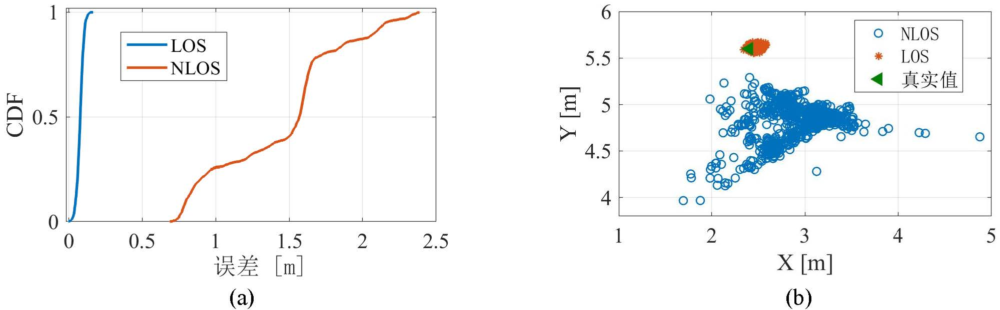
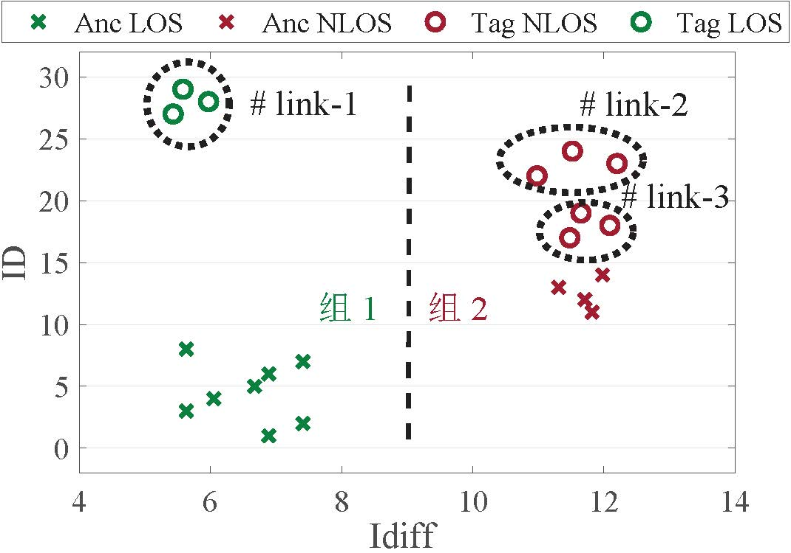
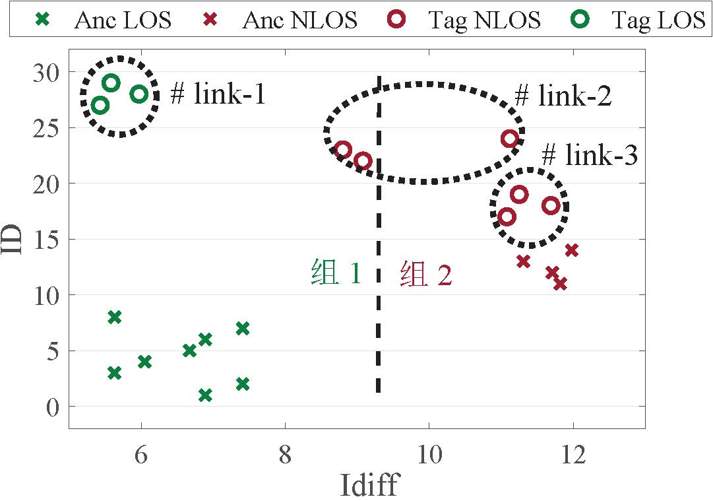
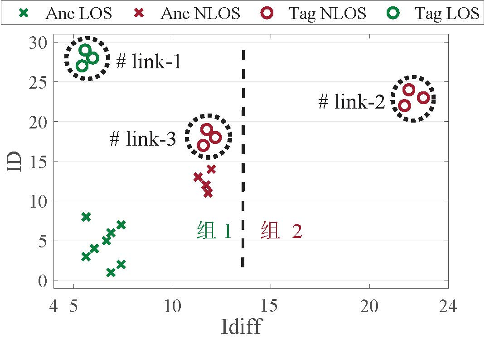
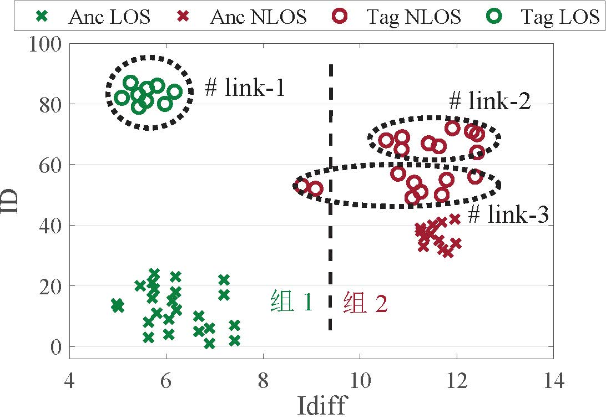
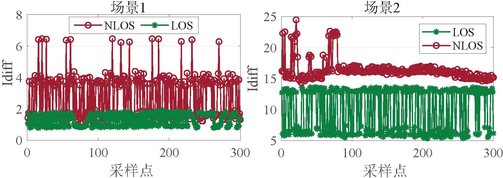

# UWB Link Classification Algorithm

## Impact of NLOS on UWB Ranging and Localization
In wireless networks, the Channel Impulse Response (CIR) effectively characterizes signal attenuation and delay through the wireless channel.  
Assuming there are $L$ propagation paths, with the signal from path $i$ having a delay of $\tau_i$ and amplitude of $\alpha_i$, the CIR can be expressed as:  
$$
    h(t) =  \sum_{i=1}^{L} \alpha_i e^{-j2 \pi f_{c}\tau_i}\delta(t-\tau_i)
$$  
where $\delta(t-\tau_i)$ is the Dirac delta function.

To obtain accurate signal reception timing, an ultra-wideband (UWB) receiver records the CIR at nanosecond-level resolution upon receiving a packet. Specialized algorithms such as the Leading Edge Detection (LDE) algorithm are then used to identify the first arriving path (i.e., the line-of-sight, LOS path) in the CIR and compute its Time of Arrival (ToA). The left side of the figure below shows CIR data under LOS conditions. As shown, the LOS path can be easily identified, enabling accurate ToA estimation. Based on the ToA, ranging techniques such as Two-Way Ranging (TWR) can be applied to estimate distances between UWB devices, followed by localization using methods like TDOA or AoA introduced earlier. The right side of the figure illustrates CIR data under Non-Line-of-Sight (NLOS) conditions. It can be observed that the amplitude of the LOS path is severely attenuated—possibly even below the noise floor—leading to incorrect identification of the first path by the UWB receiver. This results in large errors in ToA estimation, thereby degrading ranging and localization accuracy.

<figure>

</figure>

We conducted experiments in the indoor environment shown below to study the impact of NLOS on UWB-based ranging and localization.  
As shown in the left image, we mounted UWB devices on tripods as anchors and used encapsulated UWB badges as tags.  
The anchor positions were fixed, while volunteers wore the UWB badges and stood at various locations, as illustrated in the right image.  
This setup primarily investigates the effect of human body obstruction on signal propagation, one of the most common NLOS scenarios.

<figure>

</figure>

The ranging and localization performance under NLOS conditions is shown below.  
From Figure (a), it can be seen that under LOS conditions, UWB achieves ranging accuracy close to 10 cm.  
However, under NLOS conditions, the ranging error rapidly increases beyond 2 m.  
Figure (b) shows that the UWB localization result closely matches the ground truth under LOS, whereas under NLOS, the localization error becomes significant—reaching several meters.  
This demonstrates that NLOS has a severe impact on UWB ranging and localization, necessitating effective mitigation strategies to achieve reliable results. Therefore, handling environmental effects and achieving accurate localization under NLOS conditions remain critical challenges in UWB applications.

<figure>

</figure>

## Link Classification Based on Link Features
A commonly used UWB link classification approach involves extracting distinguishing features from different link states and deriving thresholds to classify links as either LOS or NLOS.  
For example, References [1] and [2] use a channel feature called PW for link classification, where PW represents the difference between total signal energy and the energy of the LOS path.  
By collecting PW values from both LOS and NLOS links in a given environment, a threshold is inferred to distinguish between the two. For instance, if the PW value of a link exceeds 6 dB, it is classified as NLOS; otherwise, it is considered LOS.

Due to the high temporal and spatial resolution of UWB, the granularity of CIR measurements is typically 1 ns. Consequently, the features extracted from these signals should exhibit strong discriminative power.  
Thus, feature-and-threshold-based methods can achieve good link classification performance.  
However, their main drawback lies in the need for prior data collection and processing to determine environment-specific thresholds before deployment, leading to high system overhead in terms of time and labor costs.  
Hence, we pose the following question: Can we design an adaptive link classification algorithm that operates without requiring prior data collection? To address this, we propose a base station-assisted link classification algorithm.

## Base Station-Assisted Link Classification Algorithm

### Key Observations
The algorithm design is motivated by the following three observations:

**Observation 1: Anchor-to-anchor links are easier to classify than tag-to-anchor links.**

In a ranging and localization system, NLOS directly affects ranging and positioning accuracy. Thus, the most intuitive way to classify a link is based on its ranging error—the larger the error, the more likely the link is NLOS.  
However, since the tag’s position is unknown in a localization system, this method cannot be applied directly to tag links.  
In contrast, anchor positions are known a priori due to pre-deployment. Hence, this approach can be effectively used for classifying anchor-to-anchor links.  
In summary, the known positions of anchors allow us to easily determine the state (LOS/NLOS) of inter-anchor links.

**Observation 2: Within the same environment, although NLOS links may vary significantly, LOS links in UWB systems exhibit highly similar characteristics.**

Ranging errors vary depending on obstacle types and the relative distance between the tag and obstacles, resulting in diverse NLOS link behaviors.  
However, a key advantage of UWB technology is its high tolerance to multipath effects.  
That is, as long as LOS exists, UWB can consistently achieve high-precision ranging regardless of location within the environment.  
To validate this, we evaluated ranging performance under four configurations: devices mounted on poles (weak multipath, LOS), placed on the ground (strong multipath, LOS), near corners (strong multipath, LOS), and manually obstructed (weak multipath, NLOS).  
As shown in the left figure below, even under strong multipath, the ranging error in LOS scenarios remains below 0.3 m, while in NLOS scenarios it rises sharply to 1.23 m.  
We further collected CIR data from various LOS and NLOS links across different lab locations with fixed anchors.  
The results are shown in the right figure, with the top four traces representing LOS links and the bottom four representing NLOS links. The dashed black boxes highlight the LOS paths identified by the UWB receiver.  
It is evident that the LOS paths in LOS links are clear and highly consistent in shape and features across different links. We attribute this to two reasons.  
First, the LOS path is the shortest propagation path, so its accumulated power typically dominates the entire CIR.  
Second, UWB technology effectively separates the LOS path from other multipath components—even in rich multipath environments, it accurately estimates the LOS path.  
In contrast, for NLOS links, the LOS path is much weaker and often not the strongest peak. Its estimation is thus highly susceptible to noise, leading to large errors.  
In summary, our experiments confirm the observation: thanks to UWB's excellent multipath resilience, LOS links exhibit highly consistent features within the same environment, despite variations among NLOS links.

<figure>

</figure>

**Observation 3: LOS links between anchors share highly similar characteristics with LOS links between tags and anchors.**

Current UWB anchors and tags have identical hardware; the only potential differences lie in transmit/receive power settings.  
Therefore, we infer that LOS links between anchors are highly similar to LOS links between tags and anchors.  
Based on this, we propose leveraging anchor-to-anchor LOS links to assist in classifying tag-to-anchor links.  
To verify feasibility, we categorized UWB links into four groups: anchor-to-anchor LOS and NLOS (denoted Anc LOS and Anc NLOS), and tag-to-anchor LOS and NLOS (denoted Tag LOS and Tag NLOS).  
We used a widely adopted UWB channel feature, $Idiff$, to characterize link states.  
$Idiff$ computes the index difference between the highest peak in the CIR and the index corresponding to the LOS path.  
For LOS links, $Idiff$ is close to zero because the highest peak aligns well with the LOS path.  
For NLOS links, $Idiff$ tends to be large due to significant separation between the LOS path and the dominant peak.

The figure below shows the distribution of $Idiff$ for the four link types in two environments (Env1 and Env2).  
It can be seen that Anc LOS and Tag LOS links both have small $Idiff$ values, while Anc NLOS and Tag NLOS links have large $Idiff$ values.  
Moreover, the $Idiff$ values of anchor LOS links are very close to those of tag LOS links in the same environment, confirming our hypothesis.  
Additionally, threshold-based classification struggles across different environments.  
For example, a predefined threshold successfully separates LOS and NLOS in Env2 but fails in Env1.  
In conclusion, anchor-to-anchor LOS links are highly similar to tag-to-anchor LOS links, enabling us to leverage anchor links to aid in tag link classification.

<figure>

</figure>

Using anchor links to assist in tag link classification offers two major advantages:

**(1) High adaptability across different environments.**

We demonstrate this using two typical environments: an indoor laboratory and an outdoor parking lot.  
The lab contains many obstacles, resulting in rich multipath, while the parking lot is open with excellent link quality.  
Due to vastly different link qualities, empirical threshold methods struggle to generalize across environments.  
In contrast, the anchor-assisted method dynamically assesses anchor link states in real time and uses them to infer tag link states, making it highly adaptable to varying environments.

**(2) Minimal system overhead without requiring prior data collection or training.**

The anchor-based method leverages real-time anchor link states for tag link classification, eliminating the need for calibration or training data collection, thus minimizing system overhead.  
Furthermore, our system design avoids introducing additional costs—for example, we designed the anchor link classification without extra ranging steps and employed a fast-converging localization algorithm to balance accuracy and computational cost.

### Design and Implementation
We now introduce the three core components of the method: anchor link classification, feature quality evaluation and selection, and tag link classification.

**Anchor Link Classification Method**

Since anchor positions are known, we can classify anchor-to-anchor links by comparing measured distances with actual geometric distances.  
For NLOS links, due to errors in ToA estimation, the measured distance $r$ significantly deviates from the true distance $\widehat{r}$.  
Thus, we compute the ranging error $e = |r - \widehat{r}|$ to determine the link state.  
If the error exceeds a threshold $e \geq thr$, the link is classified as NLOS; otherwise, it is considered LOS.  
The value of $thr$ depends on the deviation between measured and true distances. Given UWB’s robustness against multipath, this deviation is relatively consistent indoors.  
Our experiments confirmed this, and based on results, we set $thr$ to 0.3 m.

**Feature Quality Evaluation and Selection**

Instead of using raw CIR data, we extract features for link classification to reduce data processing overhead.  
Commonly extracted features include amplitude, Root Mean Square (RMS) delay, and signal energy.  
However, not all features are equally effective for UWB link classification.  
Thus, we must answer: How do we evaluate feature importance, and how do we fuse the most representative ones?

Prior works often select a fixed feature combination with equal weights.  
In contrast, we aim to derive confidence scores for each feature to enable better feature selection and fusion for improved classification accuracy.  
To this end, we adopt the Chi-Squared (CS) test—a widely used feature selection method.  
We first collect 10 common features from LOS and NLOS links.  
As shown in the table below, the left column lists feature names and the right column describes their computation.  
All features are derived from a CIR of length $T$ ($r(t)$), where $FP\_ind$ and $FP\_pw$ denote the index and energy of the LOS path, respectively.  
We then use a Support Vector Machine (SVM) for classification.  
For each feature $i$, SVM produces two clusters, from which we compute a confusion matrix with four metrics: True Positive ($TP_i$), True Negative ($TN_i$), False Positive ($FP_i$), and False Negative ($FN_i$).  
Feature quality is computed as:

$$
    \chi^2(i) = \frac{TP_i \times TN_i - FN_i \times FP_i}{(TP_i + FN_i)(FP_i+TN_i)} 
$$

The resulting $\chi^2(i)$ represents the quality of the $i$-th feature.  
For a good feature, $FN$ and $FP$ should be zero, so $\chi^2(i)$ approaches 1.

| Feature Name | Computation Method |
|--------------|--------------------|
| Energy       | $\epsilon = \sum_1^T r(t)^2$        |
| Maximum amplitude | $r_{max} = $ max$|r(t)|$ |
| Kurtosis     | $\mu = \frac{1}{T} \sum_1^T r(t)$         |
|              | $ \sigma^2 = \frac{1}{T} \sum_1^T (r(t) - \mu)^2 $         |
|              | $ k= \sigma^4T\sum_1^T (r(t) - \mu)^4 $         |
| Mean excess delay | $\tau_{MED} = \sum_1^T t\frac{r(t)^2}{\epsilon} $      |
| RMS delay spread | $\tau_{MED} = \sum_1^T t\frac{r(t)^2}{\epsilon} $       |
| Rise time    | $t_{rise} = t_H - t_L$ where $t_L = FP\_ind$ |
|              | $t_H = $ min ${t: abs(r(t)) \geq 0.6*r_{max}}$ |
| Mc           | $r_{FP\_ind} - r_{max}$         |
| Idiff        | $abs(FP\_ind - Peak\_ind)$ where $r(Peak\_ind) = r_{max}$ |
| Pw           | $\epsilon - FP\_pw$         |
| The standard noise | Provided by UWB chip |

The left figure below shows SVM classification results using feature $Pw$, where $Pw$ is the difference between total signal energy and LOS path energy.  
It shows that $Pw$ is a strong discriminator, clearly separating the two link types.  
Using the CS test on SVM outputs, we compute quality scores for all features, shown in the right figure.  
Features $Mc$, $Idiff$, $Pw$, and $The\,standard\,noise$ have high quality (close to 1), while others are low.  
This indicates that features highly correlated with multipath information perform poorly—consistent with UWB’s high multipath tolerance.  
Conversely, the four high-quality features are weakly related to multipath but strongly tied to the LOS path, making them effective for classification—aligning with our earlier analysis.

Based on feature quality, we selected four features: $Mc$, $Idiff$, $Pw$, and $The\,standard\,noise$, for subsequent tag link classification.  
After normalizing their quality scores, we derive confidence scores for each feature. Let the quality scores be $m$, $i$, $p$, and $t$, and let $sm = m+i+p+t$. Then the confidence scores are calculated as $\frac{m}{sm}$, $\frac{i}{sm}$, $\frac{p}{sm}$, and $\frac{t}{sm}$.  
With these confidence scores, we perform feature fusion to improve classification.  
We further propose an adaptive weighting scheme that dynamically adjusts weights to accommodate different environments, detailed next.

<figure>

</figure>

**Tag Link Classification Algorithm**

So far, we have determined anchor link states and selected four high-confidence features for UWB link classification.  
We can now extract these features from both anchor and tag link CIRs.  
The goal is to use known anchor link feature values to classify tag link features and infer their states.

As shown in Figure a below, due to fundamental differences between LOS and NLOS links, we cluster the feature values into two groups: Group 1 (containing anchor LOS links) and Group 2 (containing anchor NLOS links).  
In the figure, '×' marks anchor link data and 'o' marks tag link data; black dashed circles enclose data from individual tag links.  
Here, $link$–$1$ fall into Group 1 and are classified as LOS, while others in Group 2 are classified as NLOS.

<figure>
 a
 b
 c
 d
</figure>

However, two issues hinder robust clustering.  
**First**, the amount of data available per link is very limited—e.g., only three packets (and thus three CIRs) are exchanged during a single DS-TWR process.  
Making classification decisions from just three samples is highly sensitive to random fluctuations.  
For example, in Figure b, although $link$–$2$ are NLOS links, measurement errors cause most of their data to fall into Group 1, leading to misclassification as LOS.  
**Second**, feature values among NLOS links can vary widely due to differences in obstacle type and tag-obstacle distance.  
Large intra-NLOS variance can distort clustering.  
As shown in Figure c, $link$–$2$ form the only members of Group 2 because $link$–$2$ (also NLOS) differ significantly from $link$–$3$, causing $link$–$3$ to be incorrectly classified as LOS.

To address these issues, we propose an iterative elimination clustering method based on multi-dimensional information fusion.  
Specifically, given $N$ consecutive measurements, we obtain $3N$ data points for classification.  
Figure d shows clustering results using three consecutive measurements.  
Even though $link$–$3$ contain some outliers, most of their data fall into Group 2, allowing correct classification as NLOS.  
This demonstrates that multiple measurements increase robustness to anomalies.  
Empirically, we set $N = 5$, meaning a full classification cycle takes only about 100 ms.

We further enhance accuracy via multi-feature fusion.  
Suppose there are $m$ tag links. For the $j$-th feature, we obtain a classification result $R_j = (r_1, r_2, \ldots, r_m)$, where $r_i = 1$ or $0$ ($i = 1,2, \ldots, m$) indicates whether the $i$-th link is NLOS.  
We combine results across features using weighted fusion to produce the final decision $R$:

$$
    R = \frac{\sum  W_j \cdot R_j}{\sum W_j}
$$

where $W_j$ is the weight of the $j$-th feature. A result close to 1 indicates a likely NLOS link; close to 0 indicates LOS.

Since feature effectiveness varies across environments, we use dynamic weights $W_j$ instead of static ones for better accuracy.  
For example, Figure a below shows two features, $Idiff$ and $Pw$, in two environments.  
$Idiff$ partially overlaps in Scene 1 but separates completely in Scene 2, while $Pw$ separates well in Scene 1 but overlaps in Scene 2.  
This shows that feature discriminability varies by scene.  
Hence, we propose an adaptive feature fusion method that assigns higher weights to features with better separability in the current environment.  
First, all feature values are normalized to the range $[0, 1]$.  
Then, we compute feature weights using anchor link classification results.  
Let the $j$-th feature values for anchor LOS and NLOS links be $los_j$ and $nlos_j$, respectively. The weight is computed as $W_j = \frac{|\sum_1^N (los_j - nlos_j)|}{N } \cdot Qua_j$, where $N$ is the number of feature samples, and $Qua_j$ is the confidence score of the $j$-th feature derived earlier.  
By using real-time anchor link data, the weights adapt automatically to the current environment.

<figure>
 a
 b
</figure>

After obtaining the initial classification result $R$, we apply an iterative elimination process to handle large feature deviations.  
Taking the idiff classification in Figure c as an example, since $link$–$2$ yield results closest to 1, they are first classified as NLOS and filtered out.  
The process repeats on the remaining links until all NLOS links—including anchor NLOS links—are identified, concluding the classification.

## References
1. Kim D H, Kwon G R, Pyun J Y, et al, "Nlos identification in uwb channel for indoor positioning", IEEE CCNC 2018.
2. Gururaj K, Rajendra A K, Song Y, et al, "Real-time identification of nlos range measurements for enhanced uwb localization", IEEE IPIN 2017.