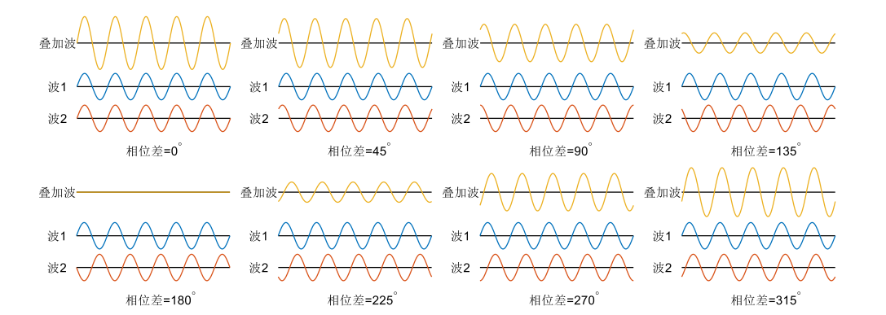
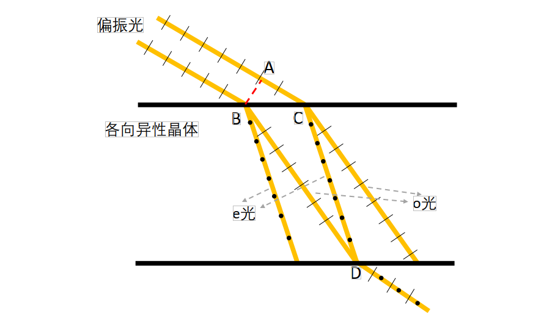
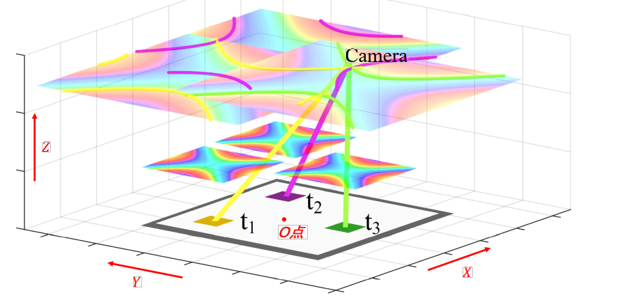

# Active Device Localization Using Visible Light Signals

## Introduction

The rapid development of Internet of Things (IoT) technologies has significantly enhanced the intelligence of human life and production. An increasing number of smart devices are being deployed in factories, airports, homes, and other environments—leveraging their communication and sensing capabilities to provide extensive support for application scenarios. Indoor localization techniques enable mobile devices to determine their spatial positions, allowing intelligent mobile devices or robots to perform navigation and operational tasks within physical space—greatly expanding the functional capabilities of smart devices in IoT applications. Many smart devices and robots are equipped with cameras or photodiode modules capable of capturing and analyzing ambient visible light. Localization methods based on visible light signals offer substantial advantages across numerous application scenarios, owing to the ubiquity and accessibility of visible light in everyday environments. In recent years, a large body of research has emerged that exploits ambient visible light signals for mobile device localization.

Existing visible-light-based mobile device localization techniques provide convenient positioning services for IoT application scenarios and have played a positive guiding role for subsequent visible-light localization work. However, these existing approaches still suffer from multiple limitations, restricting their practical applicability. Methods requiring hardware modification of light sources can deliver convenient and precise localization in specific scenarios; however, due to the high cost associated with modifying large numbers of light fixtures at the circuit level, such approaches cannot be widely deployed in general-purpose settings. Similarly, methods relying on pre-acquisition of original light source characteristics only support localization within limited scopes. As deployment scale increases and the number of light sources grows substantially, not only does the storage cost for light source features escalate, but also the distinguishability among different light sources’ features deteriorates—degrading overall system localization performance. Geometric-constraint-based localization methods utilizing camera imaging models depend critically on accurate calibration of intrinsic camera parameters, hindering large-scale deployment.

In this section, we introduce an active visible-light device localization system that requires neither circuit-level modifications to light sources nor pre-acquisition of features from all light sources, and is fully independent of any camera intrinsic parameters. The birefringence phenomenon exhibited by anisotropic materials introduces an optical path difference for incident light. When the resulting rays exit the birefringent material and pass through a polarizer, interference occurs—producing wavelength-dependent constructive and destructive interference patterns. This alters the spectral composition of the incident light, causing white light to display colors—a phenomenon known as *photoelastic coloration* (or *stress-induced birefringent coloration*). By analyzing the angular constraint relationship between interference outcomes and incident light direction within the photoelastic system, we derive a frequency-selective channel model characterizing how the visible-light channel filters signal frequencies.

We quantitatively analyze how the interference outcome in photoelastic systems depends on the incident light angle, thereby establishing a mathematical model linking the frequency-selective characteristics of photoelasticity to the incident angle. Leveraging this model, we estimate the incident angle from the observed coloration produced by a photoelastic film, and deduce an angular constraint on the line connecting the photoelastic film and the camera. Combining angular constraints derived from multiple photoelastic films, we determine the camera’s 3D spatial position.

In this section, we present a localization algorithm based on virtual intersection points of spatial straight lines, resolving the issue where angular constraints—derived from color measurement errors in captured images—fail to yield a common physical intersection point among multiple photoelastic films. This enables robust camera localization in real-world environments. We further introduce an optical tag identity encoding method, enabling more accurate localization in large-scale deployments by deploying multiple optical tags. Based on the methodology described herein, inexpensive transparent tape can be combined with polarizers to fabricate low-cost, transparent optical tags capable of providing localization services to cameras.

The active visible-light localization method introduced in this section requires no light-source hardware modifications and imposes no dependency on camera intrinsic parameters—enabling active camera localization purely via visible-light signals. Compared to prior visible-light sensing approaches, its deployment cost is dramatically reduced.

## Photoelastic Coloration

When visible light propagates through a channel, interference phenomena arise due to refraction, scattering, and reflection induced by the intervening medium. Under identical optical path differences, visible light of different wavelengths exhibits distinct constructive and destructive interference behaviors—causing some wavelengths to intensify while others attenuate. Such interference effects on polychromatic light resemble the frequency-selective behavior of filters, altering the spectral distribution of visible-light signals. Spectral changes in a light beam manifest directly as perceived color shifts—making interference outcomes readily observable by human eyes or imaging devices. The photoelastic coloration phenomenon exhibited by anisotropic materials is a direct manifestation of such visible-light frequency selectivity rooted in interference. Specifically, two refracted beams generated by birefringence in anisotropic materials undergo polarization-direction–selective interference upon passing through a polarizer, resulting in altered incident-light coloration—hence the term “photoelastic coloration.” The incident angle onto the anisotropic material affects the optical path difference between the two refracted beams, thereby modulating the resulting coloration—and endowing the visible-light channel with angle-dependent frequency selectivity. This section explains the underlying principles and observable phenomena of such frequency-selective channel behavior.

### Optical Interference and Frequency Selectivity

Interference refers to the superposition phenomenon occurring when two waves overlap in space. The vibrations of the two interfering waves add directly to produce a resultant wave. For two waves to interfere coherently, three conditions must hold: (1) identical frequency, (2) identical vibration direction (i.e., polarization orientation), and (3) constant phase difference. When the constant phase difference equals zero, the amplitudes of the two waves add constructively—termed *constructive interference*. When the constant phase difference equals $\pi$, the amplitudes subtract destructively—termed *destructive interference*. For arbitrary constant phase differences, intermediate degrees of constructive or destructive interference occur.

Figure. Interference outcomes corresponding to different phase differences between two interfering waves.

The figure above illustrates interference results under varying phase differences, demonstrating that constructive and destructive interference depend explicitly on the relative phase difference. The intensity of the interference pattern is governed jointly by the intensities of the two coherent waves and their phase difference.

Light, as an electromagnetic wave exhibiting wave-particle duality, manifests interference in its wave nature. In the classic Thomas Young double-slit experiment, a monochromatic light beam passing through two narrow slits generates two coherent sources. Light emanating from these two coherent sources accumulates fixed optical path differences when arriving at the same location on a viewing screen. Because the sources share identical frequency, fixed path differences correspond to fixed phase differences. Since path differences vary across screen locations, the phase difference—and thus the interference condition—also varies spatially. At certain locations, the two beams interfere constructively, forming bright fringes; at others, they interfere destructively, forming dark fringes.

When the monochromatic source in the double-slit setup is replaced by broadband (polychromatic) light, the optical path difference at any given screen location remains unchanged. Yet now, this fixed path difference translates into different phase differences for different constituent wavelengths—leading to wavelength-dependent constructive/destructive interference at each location. Consequently, the spectrum of the incident polychromatic light is reshaped: wavelengths undergoing constructive interference are enhanced, whereas those undergoing destructive interference are suppressed. Under fixed path difference, this effect on broadband light resembles frequency-selective filtering. If the incident light is white light—containing roughly equal intensities across the visible spectrum—it appears white before interference. After interference, intensities at certain wavelengths increase while others decrease; dominant wavelengths (with highest post-interference intensity) exert the strongest influence on the perceived color. Spectral redistribution due to interference causes the emergent light to exhibit distinct colors. Because path differences vary across screen positions, interference outcomes differ spatially—yielding the colorful fringe pattern shown below.

Figure. Double-slit interference fringes using white light as the source.

### Birefringence in Anisotropic Materials and Photoelastic Coloration

When light enters an anisotropic crystal, it splits into two refracted rays—a phenomenon termed *birefringence*. Common naturally occurring birefringent crystals include quartz, calcite, and ruby. Beyond natural crystals, many polymeric materials—including plastics—exhibit optical anisotropy due to molecular alignment induced during manufacturing processes (e.g., stretching or extrusion), thereby producing birefringent effects. As illustrated below, the birefringence of a calcite crystal causes both grid lines and a pencil drawn on paper to appear doubled.

Figure. Birefringence phenomenon in a calcite crystal.

When light propagates along a particular direction inside a crystal—called the *optical axis*—no birefringence occurs. Note that the optical axis denotes a direction, not a physical line within the crystal. Upon oblique incidence (i.e., non-coaxial with the optical axis), a linearly polarized incident beam splits into two orthogonally polarized refracted beams, as shown below. One beam vibrates perpendicular to the optical axis and is termed the *ordinary ray* (*o-ray*); the other vibrates parallel to the optical axis and is termed the *extraordinary ray* (*e-ray*). Both rays obey Snell’s law: for an incident angle $\theta$, the refraction angles $\theta_o$ and $\theta_e$ of the o-ray and e-ray satisfy:

$$
n_{air}sin\theta = n_o sin\theta_o = n_e sin\theta_e
$$

where $n_{air}=1$ is the refractive index of air, and $\theta_o$ and $\theta_e$ denote the refraction angles of the o-ray and e-ray, respectively. When the incident direction aligns with the optical axis, $n_o\neq n_e$; thus, birefringence arises whenever the incident ray deviates from the optical axis, due to differing refractive indices for the o- and e-rays. The o-ray’s refractive index remains constant regardless of incident angle: $n_o=N_o$. In contrast, the e-ray’s refractive index varies with the angle between the e-ray propagation direction and the optical axis: $n_e=N_e$ when perpendicular, $n_e=N_o$ when parallel, and $n_e$ assumes values between $N_o$ and $N_e$ for intermediate orientations. The e-ray’s refractive index depends on both the incident angle $\theta$ and the angle $\gamma$ between the projection of the incident ray onto the plane of incidence and the optical axis.

Figure. Polarized light splitting into two orthogonally polarized refracted rays inside an anisotropic crystal.

When two suitably spaced parallel polarized beams enter an anisotropic material, their respective o- and e-rays may coalesce upon exiting. As shown in the side-view diagram below, the o-ray from one incident beam and the e-ray from the other coincide spatially upon exiting the anisotropic crystal. However, these coincident rays retain orthogonal polarization directions. Although sharing identical frequency and constant phase difference, their mutually perpendicular polarizations violate the interference condition.

Figure. Side view of birefringence: ordinary and extraordinary rays from two parallel incident polarized beams converge upon exiting.

To induce interference between the two orthogonally polarized rays emerging from point D in the above figure, they must first pass through a linear polarizer—a thin optical film transmitting only light whose vibration direction aligns with its transmission axis (hereafter referred to simply as a *polarizer*). For incident light whose vibration direction differs from the transmission axis, only the component projected onto that axis passes through. After traversing the polarizer, both orthogonally polarized rays generate components aligned with the polarizer’s transmission axis. These components share identical vibration direction, frequency, and constant phase difference—thus satisfying all three interference conditions and producing interference. The net result is spectral modification of the incident white light, yielding visible coloration—the photoelastic coloration effect, illustrated below. Here, a sheet of white paper illuminated by a desk lamp serves as the light source; a polarizer generates polarized light, which passes through transparent tape (acting as the birefringent material) and then a second polarizer—producing interference-based coloration. Distinct colored bands arise from variations in tape thickness; color gradients along individual bands reflect angular variations between the observer’s viewpoint and different positions on the tape. We observe that both birefringent-material thickness and observation angle influence the resulting photoelastic coloration.

Figure. Photoelastic coloration using transparent tape as the birefringent material.

## Camera Localization Algorithm Based on Optical Tag Coloration Results

To localize a camera using optical tags exhibiting the aforementioned birefringent properties, one must first sample the photoelastic coloration characteristics of each tag’s film, then infer angular constraints from the colors observed in the camera-captured image, and finally compute the camera’s 3D spatial position by combining angular constraints from multiple tags.

### Sampling and Interpolation-Based Acquisition of Optical Tag Coloration Characteristics

Acquiring fine-grained photoelastic coloration characteristics solely via exhaustive sampling would incur prohibitive labor costs. We observe that photoelastic coloration varies continuously with incident angle; hence, our approach employs coarse sampling followed by interpolation to reconstruct high-resolution color-angle mappings. Specifically, we fix the photoelastic optical film and place a point light source on one side. A camera captures images of the film from the opposite side while recording its pose relative to the film. Because infinite spatial directions exist, exhaustive directional sampling is infeasible; instead, we sample at a finite set of representative directions. Given the continuity of coloration across neighboring directions, interpolation of coarse samples yields high-fidelity color-to-angle correspondence.

### Camera Position Estimation via Spatial Line Intersection

Camera position estimation within the optical tag coordinate system begins by defining a reference frame centered on the tag. Let the tag’s geometric center serve as origin *O*, the axis normal to the tag surface define the *Z*-axis, the *X*-axis point rightward, and the *Y*-axis upward. For clarity, the figure below depicts only three optical films—used here to illustrate the proposed localization algorithm.

Figure. Determining camera position using angular constraints from multiple optical films.

As shown above, $t_1$, $t_2$, and $t_3$ denote three optical films at known positions $p_1,p_2,p_3$. A camera located at $p_{cam}$ simultaneously images all three films. Analyzing the captured image yields hue values $h_1,h_2,h_3$ for the three films’ coloration. Leveraging the established mapping between film coloration and viewing angle, along with the films’ known coordinates $p_1,p_2,p_3$, we obtain candidate spatial ray sets $G_1,G_2,G_3$ originating from each film. Every point on ray set $G_i$ observes hue $h_i$ at film $t_i$. Among the ray sets $G_1,G_2,G_3$, at least one ray must pass through the true camera location $p_{cam}$. A point simultaneously intersected by three rays—one from each of $G_1,G_2,G_3$—is defined in this work as the *common intersection point* of ray group $G_1,G_2,G_3$. Solving for the common intersection point of the three ray sets $G_1,G_2,G_3$ thus yields the camera’s position $p_{cam}$.

Thus, the camera’s 3D coordinates can be fully reconstructed from color measurements acquired via optical film imaging.

## References

1. Lingkun Li, Pengjin Xie, Jiliang Wang. "RainbowLight: Towards Low Cost Ambient Light Positioning with Mobile Phones", ACM MOBICOM 2018.  
2. Pengjin Xie, Lingkun Li, Jiliang Wang, Yunhao Liu. "LiTag: localization and posture estimation with passive visible light tags", ACM SenSys 2020.