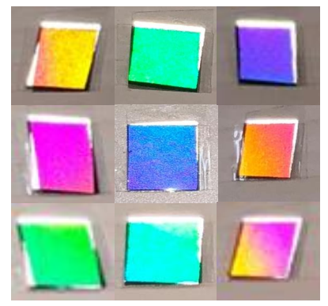
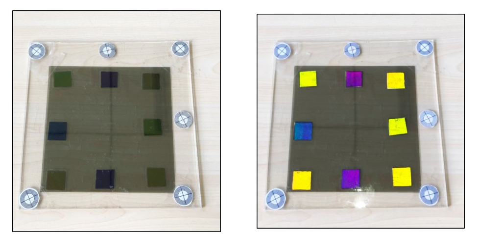

# Passive Tag Localization and Pose Estimation Using Visible-Light Signals

## Introduction  
This section introduces a passive optical tag based on the chromatic polarization effect of anisotropic optical materials. It enables position sensing and pose estimation for ordinary objects without requiring specialized readers—only commodity cameras and surveillance cameras are needed. The tag consists of a polarizer, an anisotropic optical material, and a retroreflective layer, operating entirely without power consumption. The retroreflective layer of the passive optical tag returns incident light from the camera direction back along its original path, enabling the camera to capture the chromatic appearance of the tag.

Using the localization principle of the chromatic polarization optical tag described in the previous section, only the camera’s position relative to the tag’s coordinate system can be determined; the camera’s pose (i.e., the orientation of each axis of the camera coordinate system) remains unknown. The work presented in this section leverages the camera’s position in the tag’s coordinate system—derived from the tag’s observed color—and integrates it with the projective geometric relationships inherent in the camera imaging model. This establishes a projection model linking 3D world points to their 2D image projections. By exploiting the projection relationship between the tag’s image points on the camera’s “image plane” and its corresponding 3D “object points” in the tag’s coordinate system, a spatial correspondence is established between the camera and tag coordinate systems. From this transformation relationship, the tag’s position and pose within the camera coordinate system are computed via coordinate transformation.

The passive localization tag introduced here is fabricated using low-cost transparent tape, polarizers, and retroreflective material—resulting in a tag that is inexpensive to produce and easy to deploy across diverse application scenarios. A smartphone camera captures images of the optical tag to estimate its position and pose. This system provides simple, accessible localization and pose estimation services for ordinary objects, enabling numerous devices lacking computational or communication capabilities to join the Internet of Things (IoT).  
1. A novel localization and pose estimation method is proposed, combining the camera-localization capability of chromatic polarization optical tags with camera imaging principles—requiring no knowledge of intrinsic camera parameters.

## Passive Optical Tag Design  

Figure. Passive chromatic polarization optical film.

The passive optical localization tag incorporates a retroreflective material capable of returning light precisely toward its source direction. Integrating this retroreflective layer with a chromatic polarization film yields a fully passive optical film, as illustrated above. The retroreflection mechanism resembles that of bicycle reflectors and traffic safety materials, directing incident light back parallel to its incoming path. White light emitted by the camera-integrated light source first passes through the chromatic polarization layer, where two outgoing beams interfere to generate color. The resulting colored light propagates to the retroreflective layer, which reflects it back along the incident path. Upon passing again through the chromatic polarization layer, the light undergoes a second interference event, altering its spectrum once more before reaching and being captured by the camera.

The passive chromatic polarization film is fabricated using the materials shown in the figure below: transparent tape, polarizer, and retroreflective material. No electronic circuitry or power supply is required—achieving true passivity. Because the chromatic polarization effect exhibits frequency-selective behavior dependent on the incident light angle—and because the reflected light from the passive chromatic polarization film travels parallel to the incident direction—the observed color depends on the incident light direction, i.e., on the relative orientations of the light source and camera with respect to the chromatic film.

Figure. Materials used to fabricate the passive chromatic polarization film: transparent tape, polarizer, and retroreflective material.

The figure below shows images captured by a camera-integrated light source from different viewing angles. It demonstrates that the chromatic appearance of the passive chromatic polarization film varies with the camera’s viewing direction relative to the film.

Figure. Chromatic appearance of the passive chromatic polarization film under different viewing orientations.

Multiple chromatic polarization films are integrated onto a single planar substrate to form the passive optical tag shown below. In the absence of illumination, the individual optical films appear relatively dim, as shown in the left image. When the camera’s light source is activated, incident light reaches the retroreflective layer and returns directly to the camera, causing each optical film on the passive tag to display a bright chromatic appearance, as shown in the right image.

Figure. Multiple passive chromatic polarization films assembled into a passive optical tag: (left) passive optical tag with camera light source off; (right) passive optical tag with camera light source on.

Based on this principle, by acquiring the colors and relative positions of the reflected light from the passive optical tag, we can compute the tag’s position and pose relative to the camera.

## References  

1. Lingkun Li, Pengjin Xie, Jiliang Wang. "RainbowLight: Towards Low Cost Ambient Light Positioning with Mobile Phones", ACM MOBICOM 2018.  
2. Pengjin Xie, Lingkun Li, Jiliang Wang, Yunhao Liu. "LiTag: localization and posture estimation with passive visible light tags", ACM SenSys 2020.