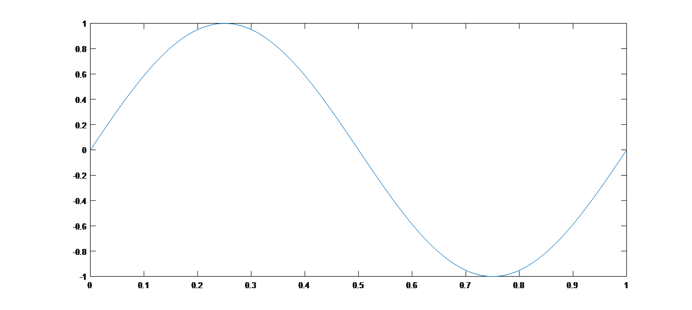

# Signal Sampling and the Sampling Theorem

There are two fundamental questions regarding sampling:  
1. How is sampling actually implemented?  
2. After sampling, does the resulting signal differ from the original? In other words, can we perfectly reconstruct the original continuous signal from its sampled version?

Let us first examine how sampling is practically carried out.

To illustrate this more intuitively, we begin with a simple simulation experiment to demonstrate the sampling process, followed by real-world signal examples to deepen understanding. Suppose we have a sinusoidal acoustic wave with frequency $5Hz$. Assume a sampling rate of $200Hz$, meaning 200 samples per second. The sampled points of this sine wave signal can be generated and plotted in MATLAB using the following code:

```matlab
%% Signal generation process
%% Generate a 5Hz signal with duration of 1s;
t = 0:1/200:1;            % 200 samples in 1 second
f = 5;                    % Frequency f = 5Hz
y = sin(2*pi*f*t);
plot(t, y);
```

<center>

</center>
<center>
<div style="color:orange; border-bottom: 1px solid #d9d9d9; display: inline-block;color: #999;padding: 2px;">Fig. Time-domain plot of a 5Hz signal</div>
</center>

In the above figure, the sampling points are relatively dense, so the waveform appears as a continuous curve. However, it is actually composed of discrete sample points. In the code, the **signal frequency** is $5Hz$, while the **sampling frequency** is $200Hz$. Under these conditions, the observed signal behaves normally and exhibits typical sinusoidal characteristics.

Now let's try another set of parameters. When we slightly increase the signal frequency, the time-domain representation becomes as shown below:

```matlab
%% Signal generation process
%% Generate a 100Hz signal with duration of 1s;
t = 0:1/200:1;            % 200 samples in 1 second
f = 100;                  % Frequency f = 100Hz
y = sin(2*pi*f*t);
plot(t, y);
```

<center>

</center>
<center>
<div style="color:orange; border-bottom: 1px solid #d9d9d9; display: inline-block;color: #999;padding: 2px;">Fig. Time-domain plot of a 100Hz signal</div>
</center>

Note: Despite being a sinusoidal signal, the result in the above figure no longer resembles the expected sine wave—it appears chaotic and irregular. Think about why this happens.

By comparing these two time-domain plots, we may wonder: Why do such different results occur for sinusoidal signals with different frequencies when sampled at the same rate (200 samples per second)?

This leads to several deeper questions: For a given continuous signal, can we fully reconstruct the original signal through sampling? If so, what sampling rate should we use?

We now formalize this problem. Suppose the signal contains frequency components up to $f$ (a signal may consist of multiple frequencies), then what sampling frequency $fs$ should we choose to sample the signal properly? Here, "properly" means that from the sampled discrete signal, we can completely recover the original continuous signal (for example, reconstructing a mathematical expression of the original continuous signal from a sequence of data points). Clearly, we cannot use an infinitely high sampling frequency, as this would be impractical for digital processing. Higher sampling rates also incur additional costs—such as excessive storage requirements—and are economically inefficient. Thus, the question reduces to: If the maximum frequency in the signal is $f$, what is the minimum required sampling frequency $fs$?

The **Nyquist Sampling Theorem** provides the answer. It states that to sample a signal properly and ensure that the sampled data can fully represent and allow perfect reconstruction of the original signal—preserving all its features—the sampling frequency must satisfy $fs\ge 2*f$, where $f$ is the highest frequency present in the given continuous signal. This principle, also known as the sampling theorem or Nyquist criterion, describes the relationship between the sampling frequency and the signal spectrum, forming the foundational basis for converting continuous signals into discrete ones.

What happens if the sampling rate is less than twice the maximum signal frequency? Let’s consider a more intriguing example:

```matlab
%% Signal generation process
%% Generate a 401Hz signal with duration of 1s;
t = 0:1/10000:1;    % 10000 samples in 1 second
f = 401;            % Frequency f = 401Hz
y = sin(2*pi*f*t);
plot(t, y);
```

In this case, the signal has frequency $401Hz$. We sample it at a rate $10KHz$, which is much greater than twice $401Hz$. The resulting signal looks like this:

<center>

</center>
<center>
<div style="color:orange; border-bottom: 1px solid #d9d9d9; display: inline-block;color: #999;padding: 2px;">Fig. Time-domain plot of a 401Hz signal, sampling rate 10000Hz</div>
</center>

Since the signal completes 401 cycles per second, the plot appears very dense. You can use MATLAB's zoom function to inspect finer time scales and verify that each cycle corresponds to an ideal sine wave.

Now suppose we reduce the sampling rate to just slightly above $401Hz$, specifically $402Hz$, using the following code:

```matlab
%% Signal generation process
%% Generate a 401Hz signal with duration of 1s;
t = 0:1/402:1;      % 402 samples in 1 second
f = 401;            % Frequency f = 401Hz
y = sin(2*pi*f*t);
plot(t, y);
```

<center>

</center>
<center>
<div style="color:orange; border-bottom: 1px solid #d9d9d9; display: inline-block;color: #999;padding: 2px;">Fig. Time-domain plot of a 401Hz signal, sampling rate 402Hz</div>
</center>

The result appears similar—an apparently smooth sinusoidal waveform—but clearly differs from the original 401Hz signal. A close inspection of the time axis reveals that this is actually a sine wave with frequency $1Hz$.

When the sampling rate fails to meet the requirement of the sampling theorem, **aliasing** occurs. Why does the final perceived frequency become 1Hz? Consider how this observed frequency relates to the original signal frequency $401Hz$ and the sampling rate $402Hz$. A classic example illustrating aliasing is the so-called "wagon-wheel effect": in movies, as a horse-drawn carriage accelerates, its wheels may appear to slow down and eventually rotate backward. This occurs because the camera’s frame rate (e.g., ~20 frames per second, i.e., a sampling rate of 20Hz) is insufficient relative to the wheel's rotation speed, leading to aliasing.

> **Thought Questions**
> 
> 1. To convert an audio signal with a maximum frequency of 8 kHz into a digital signal, what is the minimum required sampling rate?
> 2. Why does sampling a $401Hz$ signal at a rate of $402Hz$ yield a reconstructed signal resembling a $1Hz$ sine wave?
> 3. Generally, if the original signal frequency is $f$ and the sampling frequency $fs$ satisfies $f < fs < 2f$, what will be the frequency of the aliased (apparent) signal after sampling? What implications does this have for communication systems?

## References

1. *Mathematical Thought from Ancient to Modern Times (Volume 3)*, Chapter 28  
2. *Signals and Systems (2nd Edition)*, Chapters 3, 4, 5  
3. *Discrete-Time Signal Processing (3rd Edition)*, Chapter 7