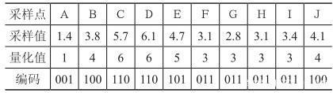

# Signal Quantization

According to the sampling theorem, we can sample a continuous signal in such a way that the original signal can be perfectly reconstructed from the samples. After sampling, however, a second issue arises: for each sampled value, the underlying physical quantity is continuous (e.g., temperature ranging continuously from 0 °C to 40 °C), and theoretically admits infinite precision (e.g., 39.00000000001 °C, with arbitrarily many decimal places). Storing such values would require infinite storage space — clearly infeasible in practical systems.

How then should these data be stored? This leads to a critical step in signal processing: **quantization**. Signals routinely handled—such as wireless I/Q data or digitized audio—are already quantized.

In signal processing, quantization refers to the process of mapping a continuous range of signal amplitudes (or a large set of possible discrete values) onto a finite (and typically smaller) set of discrete amplitude levels. Quantization is primarily employed during the conversion from analog (continuous-time, continuous-amplitude) signals to digital (discrete-time, discrete-amplitude) signals. A continuous signal first becomes discrete in time via sampling; the resulting discrete-time signal then undergoes quantization to become a digital signal. Note that “discrete-time” means the signal is defined only at a finite number of time instants—not over a continuous interval—but its amplitude may still be continuous (i.e., unquantized). Thus, quantization is required to discretize the amplitude domain. Sampling and quantization are typically jointly implemented by an Analog-to-Digital Converter (ADC). Recall that converting a continuous signal into processable digital data requires two essential steps: discretization in time and discretization in amplitude—corresponding precisely to sampling and quantization, respectively.

The figure below illustrates the fundamental principle of quantization: it maps a continuous input signal onto a discrete output signal. The dashed line represents the ideal case where no transformation is applied—i.e., input and output would be identical. Due to quantization, however, a continuous interval of input values maps to a single discrete output level. The solid “staircase” curve reflects this behavior: all input values within a small continuous interval are mapped to the same output value.

Figure. Principle of Quantization

The number of “steps” (i.e., the total number of distinct discrete output levels) is determined by the **quantization bit depth**. For example, an 8-bit ADC produces digital outputs with $2^8=256$ possible amplitude levels. To further clarify the quantization process, consider the following illustration using a 3-bit (3-bit) ADC:

Figure. Quantization Illustration

In the above figure, the input is an analog signal sampled at points A through L, with amplitude ranging continuously from 0 to 9. The sampling values, corresponding quantized values, and binary encodings are summarized in the table below:

Table. Sampled Values, Quantized Values, and Encodings

We approximate the real-valued sampled signal using a rounding method (here, “round-to-nearest integer”) to obtain quantized values (which may themselves be integers or real numbers), and then map each quantized value to its corresponding 3-bit binary representation—a process known as **encoding**. This enables storage of the signal in a computer.

Clearly, the quantized output differs from the original signal; this difference is termed **quantization noise**. Increasing the number of quantization bits reduces quantization noise, making the output closer to the original. High-fidelity (Hi-Fi) audio reproduction relies heavily on sufficient bit depth to keep quantization noise imperceptibly low—though at the cost of increased storage and computational overhead. For instance, high-fidelity music available via paid streaming subscriptions occupies significantly more storage space than standard-quality audio files.

Depending on how quantization levels are spaced, quantization schemes fall into two categories: **uniform quantization** and **non-uniform quantization**. In the “Principle of Quantization” figure above, if each “step” (i.e., each discrete output level) is equally spaced, the scheme is uniform; otherwise, it is non-uniform. For an *n*-bit uniform quantizer, the ADC’s input dynamic range is divided uniformly into $2^n$ intervals. In contrast, for an *n*-bit non-uniform quantizer, the dynamic range is partitioned non-uniformly—often following an exponential or logarithmic law. These two approaches serve different practical needs: non-uniform quantization was developed specifically to address limitations of uniform quantization. For example, in typical speech signals, most energy resides in low-amplitude regions, and human auditory perception follows an approximately logarithmic (exponential) response. To preserve perceptually relevant details, more quantization levels should be allocated to small-amplitude signal components.

At this point, physical signals have been fully converted into digital signals suitable for computer processing—forming the foundation of modern communications. For acoustic waves, we have successfully digitized and stored sound; similarly, other wireless signals (commonly represented as I/Q data—explained later) can also be digitized and stored using analogous methods.

> Reflection Questions  
> 1. Suppose a musical signal with maximum frequency 8 kHz is digitized using 8-bit quantization. What is the minimum required bit rate (i.e., data volume per second, expressed in bytes B or kilobytes KB)? What is the total size of a 1-minute segment?  
> 2. Wi-Fi signals commonly operate near frequency $2.4GHz$. Does this imply that sampling must occur at $4.8GHz$ to satisfy the Nyquist–Shannon sampling criterion? Assuming an 8-bit quantizer operating at sampling rate $4.8GHz$, what is the data volume generated per second?

## References and Further Reading

1. [In-Depth Explanation of Audio Signal Quantization](https://baijiahao.baidu.com/s?id=1614627981206121506&wfr=spider&for=pc)