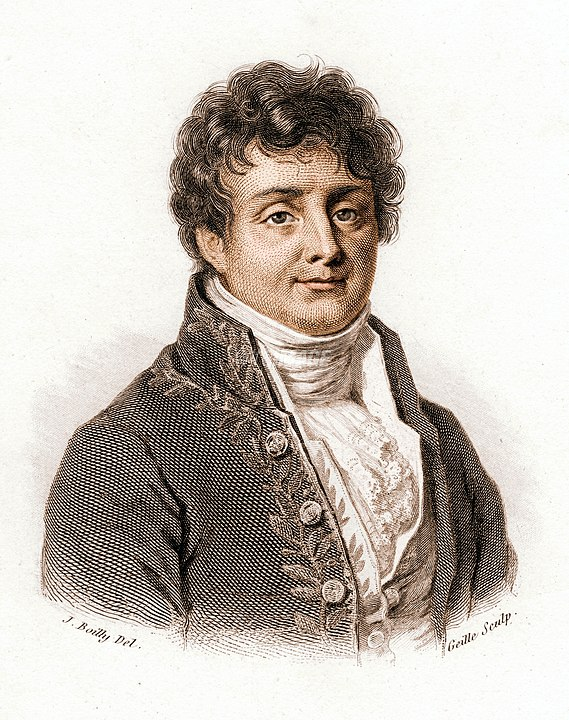

# History of Fourier Analysis

Fourier analysis is one of the most fundamental and central topics in signal processing. This analytical method is named after the French mathematician and physicist Baron Jean Baptiste Joseph Fourier (March 21, 1768 – May 16, 1830). In fact, Fourier analysis is not limited to signal processing alone. As an important branch of mathematical analysis, it finds extensive applications across numerous engineering disciplines—including image processing, econometrics, vibration analysis, acoustics, and optics.

Fourier analysis originated from the study of trigonometric functions. Even before Fourier, people had long recognized that complex periodic signals could be represented using trigonometric functions. As early as in ancient Babylonian and Egyptian times, such methods were employed to predict astronomical events. In modern scientific history, the great 18th-century mathematician Leonhard Euler revived this approach. While investigating wave propagation in sound, he discovered that a propagation function could be decomposed into a sum of multiple sine functions. His contemporary, the eminent mathematician Joseph-Louis Lagrange, extended Euler’s idea to the observation and prediction of celestial orbits. For Lagrange, such trigonometric decomposition served primarily as an interpolation technique—namely, determining interpolation coefficients from $N$ observed orbital positions of celestial bodies, then using the resulting formula to predict the entire orbit. However, all these mathematicians faced a common question: *Can such a decomposition still hold for discontinuous signals?* Due to the limitations of the era, even Lagrange believed that an infinite sum of sine functions must necessarily yield a smooth function; thus, non-smooth (e.g., discontinuous) signals could not be represented this way. This led nearly all mathematicians of the time to lose interest in the method—except one: our protagonist, Fourier.

Fig. Baron Joseph Fourier

Joseph Fourier was born on March 21, 1768, in Auxerre—a town on the banks of the Yonne River in central France—into a tailor’s family. Owing to his large family and poor circumstances, he lost both parents at age eight and became an orphan, subsequently taken in by the local church. At age twelve, a bishop enrolled him in a regional military school. From an early age, Fourier displayed exceptional mathematical talent and a strong desire to study mathematics. At that time, however, only military academies offered formal mathematics instruction—and in France, admission to such institutions required noble or wealthy lineage, placing Fourier out of reach. Historical records indicate that Fourier was denied entry into the artillery corps due to his humble origins; his application bore the annotation: “Fourier’s lineage is insufficiently noble for admission to the artillery—though he may well be a second Newton.” Upon learning that becoming a monk would provide access to education, he毅然 entered a monastery, where he devoted every available moment to rigorous mathematical study.

In 1789, the French bourgeois revolution broke out, dismantling the elitist educational system that had restricted university enrollment to the wealthy and aristocratic. Fourier finally gained access to read mathematical papers at the Paris Academy of Sciences. During the Revolution, he gained recognition for his active involvement in local affairs and was imprisoned after defending victims of the Reign of Terror. Following the Revolution’s conclusion, he enrolled at the prestigious École Normale Supérieure in Paris, studying mathematics under Lagrange and Laplace. He later became a mathematics professor at the École Polytechnique, quickly establishing himself in mathematical education. During the subsequent Napoleonic era, Fourier joined Napoleon’s Egyptian expeditionary force and oversaw archaeological work in Cairo.

In 1807, Fourier submitted a paper to the journal of the Paris Academy of Sciences, describing his discovery—made during heat conduction research—of representing signals via trigonometric expansions, now known as Fourier series. The paper was unceremoniously rejected. Among the reviewers were his own mentors, the renowned Lagrange and Laplace. Lagrange’s objection again centered on signal discontinuity. In response, Fourier wrote an entire book specifically addressing Lagrange’s concerns. Regrettably, even this book failed to provide a rigorous mathematical proof for the case of discontinuous functions.

Calculus teaches us to “view motion from rest, infinity from finitude, precision from approximation, and qualitative change from quantitative change.” Today, we might take for granted that the limit of a sum of smooth trigonometric functions can itself be discontinuous—after all, isn’t qualitative change arising from quantitative accumulation entirely natural? Yet Fourier’s paper was rejected. To empathize, recall that until the early 19th century, calculus had yet to be rigorously formalized; mathematicians remained perplexed by the very nature of infinitesimals. Thus, expecting contemporaries to accept the idea that *any* function could be expanded into a trigonometric series was indeed overly demanding.

Fifteen years later—after Lagrange’s death, in 1822—Fourier finally published his seminal work, *Théorie analytique de la chaleur* (*The Analytical Theory of Heat*), in the journal of the French Academy of Sciences. This publication cemented Fourier’s immortal reputation. Physically, the treatise derived the famous heat conduction equation and made significant contributions to dimensional analysis. Mathematically, Fourier asserted that *any* function could be expanded into a trigonometric series and introduced the concept of the Fourier transform. It was precisely this mathematical contribution that secured Fourier’s widespread fame—and forms the core subject of our subsequent discussion. A complete mathematical proof for the case of discontinuous signals was later provided by mathematicians including Dirichlet; the conditions under which Fourier series converge are now known as the *Dirichlet conditions*.

Although pre-Fourier mathematicians stood at the threshold of recognizing the significance of Fourier series, they failed to identify what lay before them. Fourier’s genius manifested in his use of concepts that had not yet been formally established. While others debated continuous functions, he investigated discontinuous ones; before convergence had even been rigorously defined, he discussed convergence of functional series. Fourier’s work marked a major advance in the theory of partial differential equations.

Fourier analysis holds particular importance in signal processing because it opens a gateway to the *frequency domain*. It reveals that, when analyzing a signal, we need not restrict ourselves to the time domain—we may also examine it in the frequency domain. Often, the frequency-domain perspective reveals underlying structure more clearly and facilitates processing more effectively.

To honor Fourier’s contributions, the scientific community has named this mathematical analytical method *Fourier analysis*. Its application to periodic signals is termed *Fourier series* (FS); its application to non-periodic signals is termed *Fourier transform* (FT).  
A signal—that is, a function of time—will, where ambiguity does not arise, be interchangeably referred to below as either a “signal” or a “function.”

## References

1. Morris Kline, *Mathematical Thought from Ancient to Modern Times*, translated by Zhu Xuexian et al., Shanghai Scientific and Technical Publishers, 2003, Chapters 20, 22, and 28.  
2. Wu Na. *The Origin and Development of Fourier Series* [D]. Hebei Normal University, 2008.  
3. https://zh.wikipedia.org/wiki/%E7%BA%A6%E7%91%9F%E5%A4%AB%C2%B7%E5%82%85%E9%87%8C%E5%8F%B6