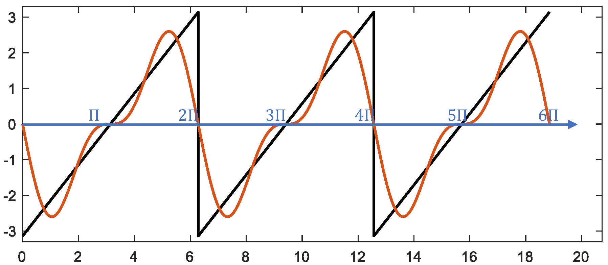

# Fourier Series

To understand Fourier series, let us imagine traveling back two centuries to the nineteenth century and observing how Fourier discovered them. Like his contemporaries, Fourier studied heat flow. As a practical problem, this involved metal processing in industry; as a scientific problem, it aimed to determine Earth’s internal temperature. In his seminal work *The Analytical Theory of Heat*, Fourier first considered the temperature $u$ within a uniform and isotropic body—a function of both space and time. Based on Newton’s law of cooling, Fourier derived the partial differential equation that $u$ must satisfy—the famous heat conduction equation:

$$
\frac{\partial u}{\partial t} = \alpha \nabla^2 u
$$

where $\alpha$ is a constant dependent on the material properties of the body.

Fourier solved specific heat conduction problems. Consider a typical case: a rod with ends held at zero degrees and insulated laterally so that no heat flows across its sides. The temperature distribution is then one-dimensional: $u(x,t)$. For simplicity, we set $\alpha = 1$, yielding:

$$
\frac{\partial u}{\partial t} = \frac{\partial^2 u}{\partial x^2}
$$

Assume the rod has length $L$ (chosen for notational simplicity), giving boundary conditions:

$$
u(0,t) = 0,\quad u(L,t) = 0
$$

At the initial time, the rod exhibits a temperature distribution:

$$
u(x,0) = f(x)
$$

To solve the above equation, we apply the method of separation of variables, assuming:

$$
u(x,t) = X(x)T(t)
$$

Substituting into the PDE yields:

$$
\frac{1}{T}\frac{dT}{dt} = \frac{1}{X}\frac{d^2X}{dx^2}
$$

The left-hand side depends only on $t$, while the right-hand side depends only on $x$; thus their common value must be a constant, denoted $-\lambda$. Hence:

$$
\frac{1}{T}\frac{dT}{dt} = -\lambda,\quad \frac{1}{X}\frac{d^2X}{dx^2} = -\lambda
$$

It is straightforward to verify that the general solutions to these ordinary differential equations are:

$$
T(t) = Ce^{-\lambda t},\quad X(x) = A\cos(\sqrt{\lambda}x) + B\sin(\sqrt{\lambda}x)
$$

The boundary conditions imply $X(0) = 0$ and $X(L) = 0$. From $X(0) = 0$, we obtain $A = 0$. Then $X(L) = 0$ requires $B\sin(\sqrt{\lambda}L) = 0$, leading to $\sqrt{\lambda}L = n\pi$, i.e., $\lambda_n = \left(\frac{n\pi}{L}\right)^2$, where $n$ is a positive integer. Thus, Fourier obtained $X_n(x) = B_n \sin\left(\frac{n\pi x}{L}\right)$, where $B_n$ is a constant. Since the heat equation is linear, sums of such solutions remain solutions. Therefore, Fourier asserted:

$$
u(x,t) = \sum_{n=1}^\infty B_n e^{-(n\pi/L)^2 t}\sin\left(\frac{n\pi x}{L}\right)
$$

To satisfy the initial condition, we require:

$$
u(x,0) = \sum_{n=1}^\infty B_n \sin\left(\frac{n\pi x}{L}\right) = f(x)
$$

Fourier faced the following question: $f(x)$ is an arbitrary function representing the initial temperature distribution—can *any* such $f(x)$ be expressed as a trigonometric series? In particular, can the coefficients $B_n$ be determined?

Fourier proceeded to answer these questions. He expanded both sides into power series, equated coefficients, and solved an infinite-dimensional linear system to determine $B_n$, ultimately obtaining an expression involving infinite products and infinite sums. Finding this expression impractical, Fourier employed bolder, more creative—though often vague—steps to arrive at coefficient formulas resembling those familiar today:

$$
B_n = \frac{2}{L}\int_0^L f(x)\sin\left(\frac{n\pi x}{L}\right)\,dx
$$

Strictly speaking, this conclusion was not entirely novel: Euler and others had previously discussed expanding certain functions into trigonometric series and derived similar formulas. Compared to those earlier derivations, Fourier’s derivation relied on many unnecessary assumptions and employed a more complicated method.

At this point, Fourier made some notable observations. He noted that each $B_n$ could be interpreted as the area under the curve $f(x)\sin\left(\frac{n\pi x}{L}\right)$ over the interval $[0,L]$. Such an area remains meaningful even for highly irregular functions—functions need not be continuous, nor do they even need explicit analytical expressions; graphical knowledge suffices. Thus, Fourier concluded that *every* function can be expanded into a Fourier series.

Although Fourier did not fully specify the conditions under which Fourier series expansions are valid, his paper conveyed the idea that *any* function can be represented by a trigonometric series and provided numerous examples. Let us examine the approximation quality of Fourier series using a sawtooth wave as an example. As shown below, for a sawtooth wave of period $2\pi$, progressively superimposing trigonometric functions with different periods enables the sum to approach the original sawtooth waveform increasingly closely (the selection criteria for fitting functions will be explained later). We use MATLAB simulation to visualize this process more intuitively:

```matlab
%% Original signal: sawtooth wave with period 2pi
fs = 1e3;
t = 0:1/fs:6*pi;
y = -pi + mod(t,2*pi);
figure;
plot(t,y,'color','black','linewidth',1.5);
```

<center>

</center>
<center>
<div style="color:orange; border-bottom: 1px solid #d9d9d9;
display: inline-block;
color: #999;
padding: 2px;">Figure. Sawtooth wave with period $2\pi$ generated in MATLAB</div>
</center>

```matlab
%% First-order fit using fundamental sine wave $\sin(x)$ with minimal period $2\pi$
z = -2*sin(t);
hold on
plot(t,z,'linewidth',1.5);
plot([0,6.5*pi],[0 0],'color','blue','linewidth',1.5);
xlim([0,6.6*pi]);
ylim([-3.3 3.3]);
box on
```

<center>

</center>
<center>
<div style="color:orange; border-bottom: 1px solid #d9d9d9;
display: inline-block;
color: #999;
padding: 2px;">Figure. First-order fit result</div>
</center>

```matlab
%% Second-order fit adding fundamental sine wave $\sin(2x)$ with minimal period $\pi$
z = -2*sin(t) - sin(2*t);
hold on
plot(t,z,'linewidth',1.5);
plot([0,6.5*pi],[0 0],'color','blue','linewidth',1.5);
xlim([0,6.6*pi]);
ylim([-3.3 3.3]);
box on
```

<center>

</center>
<center>
<div style="color:orange; border-bottom: 1px solid #d9d9d9;
display: inline-block;
color: #999;
padding: 2px;">Figure. Second-order fit result</div>
</center>

Continuing to superimpose trigonometric functions sharing the same period as the sawtooth wave progressively improves the approximation:

```matlab
%% Illustration of superposition results using trigonometric functions of varying orders
figure;
z = -2*sin(t) - sin(2*t) - 2/3*sin(3*t);
subplot(2,2,1);fplot(t,y,z);
title('Third-order fit');

z = -2*sin(t) - sin(2*t) - 2/3*sin(3*t) - 1/2*sin(4*t);
subplot(2,2,2);fplot(t,y,z);
title('Fourth-order fit');

z = -2*sin(t) - sin(2*t) - 2/3*sin(3*t) - 1/2*sin(4*t) - 2/5*sin(5*t);
subplot(2,2,3);fplot(t,y,z);
title('Fifth-order fit');

z = -2*sin(t) - sin(2*t) - 2/3*sin(3*t) - 1/2*sin(4*t) - 2/5*sin(5*t) - 1/3*sin(6*t);
subplot(2,2,4);fplot(t,y,z);
title('Sixth-order fit');

function fplot(t,y,z)
hold on;
plot(t,y,'color','black','linewidth',1.5);
plot(t,z,'linewidth',1.5);
plot([0,6.5*pi],[0 0],'color','b','linewidth',1.5);
xlim([0,6.6*pi]);
ylim([-3.3 3.3]);
box on;
end
```


<center>
<div style="color:orange; border-bottom: 1px solid #d9d9d9;
display: inline-block;
color: #999;
padding: 2px;">Figure. Third- through sixth-order fits of the sawtooth wave</div>
</center>

We observe that the sum of fitted trigonometric functions gradually approaches the original sawtooth function. At discontinuities (the sawtooth peaks), the Fourier series converges to the midpoint of the jump—in this example, at $y = 0$.

So far, we have considered function representations only on intervals such as $[0,L]$ or $[-\pi,\pi]$, using only sine functions for Fourier expansion; consequently, the resulting Fourier series represents an odd function. For even functions defined over the entire real line, cosine functions and constant terms must be included in the series expansion. For functions that are neither odd nor even, sine, cosine, and constant terms suffice, because any function $f(x)$ can be decomposed into the sum of an odd function and an even function:

$$
f(x) = f_{\text{odd}}(x) + f_{\text{even}}(x)
$$

where $f_{\text{odd}}(x) = \frac{f(x)-f(-x)}{2}$ is odd, and $f_{\text{even}}(x) = \frac{f(x)+f(-x)}{2}$ is even.

There are requirements for a function to admit a Fourier series expansion. The German mathematician Dirichlet proved that certain periodic functions cannot be represented by Fourier series and was the first to provide sufficient (but not necessary) conditions for expandability—now known as the Dirichlet conditions:

1. The function must be bounded: for all $x$, $|f(x)| < M$, where $M$ is a positive real number.
2. Over any finite interval, $f(x)$ must be continuous except at finitely many points.
3. Over any finite interval, $f(x)$ must possess only finitely many extrema.
4. Over one period, the integral of $|f(x)|$ must converge.

When these conditions hold, a periodic function $f(x)$ with period $2L$ admits the expansion:

$$
f(x) = \frac{a_0}{2} + \sum_{n=1}^\infty \left[a_n \cos\left(\frac{n\pi x}{L}\right) + b_n \sin\left(\frac{n\pi x}{L}\right)\right]
$$

If $f(x)$ has period $2\pi$, a simple change of variable converts it to a function with period $2L$ ($2\pi$ corresponds to $2L$). Most signals encountered in practice satisfy the Dirichlet conditions.

The formula written above is the *real-valued* form of the Fourier series. Using Euler’s formula $e^{j\theta} = \cos\theta + j\sin\theta$, where $j$ denotes the imaginary unit, this expression transforms into the *complex-valued* form:

$$
f(x) = \sum_{n=-\infty}^{\infty} c_n e^{jn\pi x / L}
$$

Here, beginners often face a major conceptual hurdle: why introduce complex numbers into Fourier series when trigonometric functions worked perfectly well? Later studies in signal processing also reveal extensive use of complex notation—why is this so?

First, we must acknowledge that all physical quantities are real-valued; all measurable quantities are real numbers. Practitioners familiar with signal processing have certainly encountered complex numbers, widely used across software platforms and applications to represent signals. Complex numbers constitute a convenient representation—not altering physical meaning, but serving as a more practical *notation*. At least two reasons justify adopting complex notation:

1. Mathematically, complex analysis is often simpler and more elegant than real analysis.  
For example, regarding quadratic equations: from a real-number perspective, we say there are two real roots, one real root, or no real roots; from a complex-number perspective, we assert there are always two (possibly repeated) complex roots. As my calculus professor once remarked, “Whenever a problem we study ultimately relates to complex numbers, the underlying theory tends to be beautiful; if restricted solely to real numbers, the result is usually far less elegant.” This holds for Fourier series: compare the real and complex forms:

$$
f(x) = \frac{a_0}{2} + \sum_{n=1}^\infty \left[a_n \cos\left(\frac{n\pi x}{L}\right) + b_n \sin\left(\frac{n\pi x}{L}\right)\right],\quad
f(x) = \sum_{n=-\infty}^{\infty} c_n e^{jn\pi x / L}
$$

Which formula would you prefer to learn? Most likely the shorter, more concise complex form. I recommend deriving formulas starting from trigonometric functions—they are more intuitive and easier to grasp. Indeed, in my lectures, I begin with trigonometric functions. However, once proficient, practitioners find the complex form more convenient in practice. In fact, Fourier analysis abounds with summation symbols, integrals, and numerous variable symbols, making formulas appear cumbersome and intimidating—so much so that even after studying them, one may recall only fragments. To better grasp the essence of Fourier analysis, why not memorize just the compact complex-formula?

2. A complex number simultaneously encodes both amplitude and phase information—information a single real number cannot convey. Phase information is crucial in signal processing; the ability to naturally express phase constitutes a key advantage of complex notation.

Therefore, in subsequent discussions, we typically adopt the complex form, yielding clearer and more concise expressions. Next arises the question: how do we determine the expansion coefficients $c_n$? Unlike Fourier’s intricate original reasoning, let us consider an alternative perspective—temporarily stepping away from Fourier series to explore other concepts.

## An Alternative Interpretation of Fourier Series

Recall the familiar vector space. Consider a vector $\mathbf{v}$ in an $N$-dimensional Euclidean space. It can be decomposed into a linear combination of $N$ basis vectors. For instance, the first basis vector is $\mathbf{e}_1 = (1,0,\dots,0)$, the second is $\mathbf{e}_2 = (0,1,0,\dots,0)$, …, and the $N$th is $\mathbf{e}_N = (0,\dots,0,1)$. Then $\mathbf{v}$ can be written as:

$$
\mathbf{v} = \sum_{i=1}^N v_i \mathbf{e}_i
$$

This expression strongly resembles the Fourier series. Analogously, we apply the method for computing $v_i$ to compute $c_n$. Observing our chosen basis vectors $\mathbf{e}_i$, we note two properties: they are unit vectors and mutually orthogonal. Here, we need to introduce the concept of inner product to formalize these properties. In an $N$-dimensional Euclidean space, define the inner product of two vectors $\mathbf{u} = (u_1,\dots,u_N)$ and $\mathbf{v} = (v_1,\dots,v_N)$ as:

$$
\langle \mathbf{u}, \mathbf{v} \rangle = \sum_{i=1}^N u_i v_i
$$

Thus, the squared norm of $\mathbf{e}_i$ satisfies $\|\mathbf{e}_i\|^2 = \langle \mathbf{e}_i, \mathbf{e}_i \rangle = 1$, confirming they are unit vectors. When $i \neq j$, $\langle \mathbf{e}_i, \mathbf{e}_j \rangle = 0$, indicating mutual orthogonality. When basis vectors are orthonormal, it follows directly that $v_i = \langle \mathbf{v}, \mathbf{e}_i \rangle$—the projection of $\mathbf{v}$ onto $\mathbf{e}_i$:

$$
v_i = \langle \mathbf{v}, \mathbf{e}_i \rangle
$$

If we treat exponential-form trigonometric functions as basis vectors, interpret the Fourier series as a vector in some abstract space, and define an appropriate inner product rendering these basis vectors orthonormal, then Fourier coefficients assume the analogous form:

$$
c_n = \langle f, \phi_n \rangle
$$

Indeed, this is precisely what we can do—thereby defining an infinite-dimensional Hilbert space.

On a vector space $V$ over a scalar field $\mathbb{F}$, an inner product $\langle \cdot, \cdot \rangle : V \times V \to \mathbb{F}$ must satisfy:

1. Conjugate symmetry: swapping vector arguments yields the complex conjugate, i.e., $\langle \mathbf{u}, \mathbf{v} \rangle = \overline{\langle \mathbf{v}, \mathbf{u} \rangle}$.
2. Linearity in the first argument: $\langle a\mathbf{u} + b\mathbf{v}, \mathbf{w} \rangle = a\langle \mathbf{u}, \mathbf{w} \rangle + b\langle \mathbf{v}, \mathbf{w} \rangle$.
3. Positive definiteness: $\langle \mathbf{v}, \mathbf{v} \rangle \geq 0$, with equality iff $\mathbf{v} = \mathbf{0}$.

Let $f$ be a periodic function with period $2L$. Define the inner product of two such functions as:

$$
\langle f, g \rangle = \frac{1}{2L}\int_{-L}^{L} f(x)\overline{g(x)}\,dx
$$

One can verify this definition satisfies all three inner-product axioms. Choosing basis functions $\phi_n(x) = e^{jn\pi x / L}$, it follows that they form an orthonormal set under this inner product. Consequently:

$$
c_n = \langle f, \phi_n \rangle = \frac{1}{2L}\int_{-L}^{L} f(x)e^{-jn\pi x / L}\,dx
$$

The coefficient $c_n$ can alternatively be interpreted as a measure of similarity between $f$ and the basis function $\phi_n$, e.g., via the cosine similarity:

$$
\text{similarity}(f,\phi_n) = \frac{|\langle f, \phi_n \rangle|}{\|f\|\,\|\phi_n\|}
$$

Clearly, larger $|c_n|$ indicates greater similarity between $f$ and $\phi_n$, implying stronger presence of the corresponding frequency component.

Next, we illustrate the computational process of Fourier series with a concrete example: a square wave of period $2\pi$:

$$
f(x) =
\begin{cases}
1, & 0 < x < \pi \\
-1, & -\pi < x < 0
\end{cases}
$$

First, construct the square wave of period $2\pi$ in MATLAB:

```matlab
%% Fourier series expansion of a square wave
% Construct square wave with period 2pi
fs = 1e3;
t = 0:1/fs:6*pi;
y = square(t,50);
figure;
plot(t,y,'color','black','linewidth',1.5);
ylim([-2 2]);
```


<center>
<div style="color:orange; border-bottom: 1px solid #d9d9d9;
display: inline-block;
color: #999;
padding: 2px;">Figure. Square wave with period $2\pi$ constructed in MATLAB</div>
</center>

Now expand it into an infinite trigonometric series. Using the Fourier coefficient formulas, we compute coefficients for each harmonic:

$$
c_n = \frac{1}{2\pi}\int_{-\pi}^{\pi} f(x)e^{-jnx}\,dx
$$

We observe $c_n = 0$ for even $n$, and nonzero only for odd $n$. Based on this result, we examine successive approximations using increasing numbers of terms. The MATLAB code below implements Fourier-series fitting of the square wave; as more terms are included, the approximation converges toward the target square wave.

```matlab
% Compute Fourier coefficients
z = zeros(1,length(y));
for n = 1:2:11
    % Fourier coefficients for $e^{jnt}$ and $e^{-jnt}$
    cn1 = 2/(1j*n*pi);
    cn2 = -2/(1j*n*pi);

    z = z + cn1*exp(1j*n*t) + cn2*exp(-1j*n*t);
    % Plot
    subplot(3,2,ceil(n/2)); hold on
    plot(t,y,'color','black','linewidth',1.5);
    plot(t,z,'color','b','linewidth',1.5);
    ylim([-2 2]);
end
```


<center>
<div style="color:orange; border-bottom: 1px solid #d9d9d9;
display: inline-block;
color: #999;
padding: 2px;">Figure. Fourier series expansion of a square wave</div>
</center>

## References

1. Morris Kline, *Mathematical Thought from Ancient to Modern Times*, translated by Zhu Xuexian et al., Shanghai Scientific and Technical Publishers, 2003, Chapter 28.