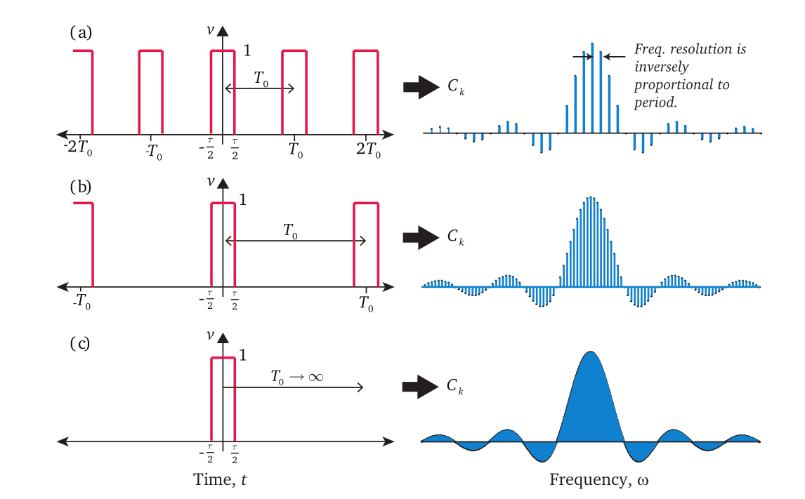
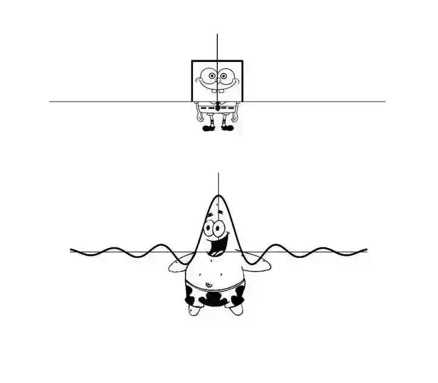
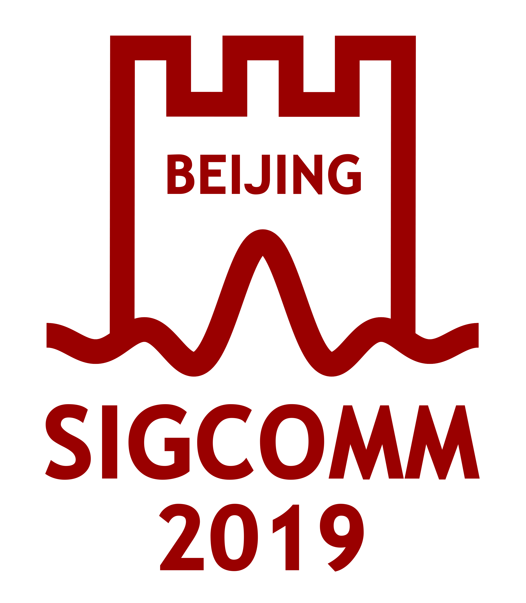

# Fourier Transform

We can expand any periodic function satisfying the Dirichlet conditions into a Fourier series. Since each term in the expansion contains only a single frequency, we can extract the amplitude (strength) of each frequency component—i.e., the signal’s spectrum. Thus, using the Fourier series, we achieve the transformation of a signal from the time domain to the frequency domain.

Fig. Fourier series enabling time-domain-to-frequency-domain transformation

However, the Fourier series applies only to periodic functions satisfying the Dirichlet conditions. How, then, do we transform a more general *aperiodic* function from the time domain to the frequency domain?

In fact, the period $T$ of a time-domain signal determines the spacing between adjacent outputs in the frequency domain—i.e., the frequency resolution $\Delta f = 1/T$. The spectrum of a periodic signal is therefore discrete. As the input signal’s period increases, the spacing between frequency-domain outputs decreases correspondingly. When the period $T$ grows indefinitely and approaches infinity ($T \to \infty$), the frequency spacing becomes infinitesimally small. At this limit, the periodic signal degenerates into a general aperiodic time-domain signal, and the corresponding frequency-domain output spacing approaches zero ($\Delta f \to 0$), yielding a *continuous* frequency-domain representation. Intuitively, an aperiodic signal corresponds to a continuous spectrum.

Fig. From Fourier series to Fourier integral

An aperiodic signal can be viewed as the limit of a periodic signal with period $T \to \infty$.

We first write the Fourier series for a function $f_T(t)$ with period $T$:
$$
f_T(t) = \sum_{n=-\infty}^{\infty} c_n e^{j n \omega_0 t}, \quad \text{where } \omega_0 = \frac{2\pi}{T}, \quad c_n = \frac{1}{T} \int_{-T/2}^{T/2} f_T(t) e^{-j n \omega_0 t}\, dt.
$$

Note that $f_T(t)$ is periodic, so the integration interval may be chosen as $[-T/2,\, T/2]$ or $[0,\, T]$ without affecting the value of $c_n$. The spectral frequencies are clearly $n \omega_0$, and the frequency resolution is $\Delta f = \omega_0 / 2\pi = 1/T$. Rearranging the Fourier series expression yields:

$$
f_T(t) = \sum_{n=-\infty}^{\infty} \left[ \frac{1}{T} \int_{-T/2}^{T/2} f_T(\tau) e^{-j n \omega_0 \tau}\, d\tau \right] e^{j n \omega_0 t}
= \sum_{n=-\infty}^{\infty} \left[ \frac{\omega_0}{2\pi} \int_{-T/2}^{T/2} f_T(\tau) e^{-j n \omega_0 \tau}\, d\tau \right] e^{j n \omega_0 t}.
$$

Next, let $T \to \infty$, so $\omega_0 \to 0$; the summation then becomes an integral, yielding:

$$
f(t) = \frac{1}{2\pi} \int_{-\infty}^{\infty} \left[ \int_{-\infty}^{\infty} f(\tau) e^{-j \omega \tau}\, d\tau \right] e^{j \omega t}\, d\omega.
$$

This expression is called the **Fourier integral representation** of $f(t)$. Whereas the Fourier series expands a function using an infinite sum over discrete frequencies, the Fourier integral expands $f(t)$ using a continuum of frequencies $\omega$. Specifically, the discrete spectral component $c_n$ corresponds, in the continuous case, to the spectral density:

$$
F(\omega) = \int_{-\infty}^{\infty} f(t) e^{-j \omega t}\, dt.
$$

We call $F(\omega)$ the **Fourier Transform (FT)** of $f(t)$. From the Fourier integral expression, we also observe the **Inverse Fourier Transform (IFT)**, which recovers $f(t)$ from $F(\omega)$:

$$
f(t) = \frac{1}{2\pi} \int_{-\infty}^{\infty} F(\omega) e^{j \omega t}\, d\omega.
$$

Readers may encounter Fourier transform definitions differing slightly from those above—for instance, differing by a constant factor such as $1/\sqrt{2\pi}$, or using angular frequency $\omega$ instead of ordinary frequency $f$. These variations reflect merely different notational conventions and do not affect the fundamental nature of the FT.

Next, we compute a classic Fourier transform—the Fourier transform of the rectangular function. Understanding this transform is essential for grasping many signal-processing concepts; conversely, mastering the rectangular function’s transform greatly simplifies understanding numerous related topics. The rectangular function is defined as:

$$
\operatorname{rect}(t) =
\begin{cases}
1, & |t| < \frac{1}{2}, \\
\frac{1}{2}, & |t| = \frac{1}{2}, \\
0, & |t| > \frac{1}{2}.
\end{cases}
$$

Then its Fourier transform is:

$$
\mathcal{F}\{\operatorname{rect}(t)\} = \int_{-\infty}^{\infty} \operatorname{rect}(t) e^{-j \omega t}\, dt = \int_{-1/2}^{1/2} e^{-j \omega t}\, dt = \frac{\sin(\omega/2)}{\omega/2} = \operatorname{sinc}\left(\frac{\omega}{2\pi}\right).
$$

This result is known as the **sinc function**, whose graph is shown below. It exhibits a main lobe centered at $\omega = 0$, with side lobes diminishing in amplitude as $|\omega|$ increases.

Fig. Graph of the sinc function

> Memorize this function’s shape—it appears frequently later and is crucial for understanding many subsequent concepts.

Because the rectangular function and the sinc function resemble the cartoon characters SpongeBob SquarePants and Patrick Star, respectively, some jokingly refer to them as “a Fourier-transform pair.”

Fig. SpongeBob SquarePants’ Fourier transform is Patrick Star

This iconic Fourier-transform pair appears widely—for example, the 2019 SIGCOMM conference (a top-tier networking conference) adopted these shapes as design elements in its logo. The square waveform simultaneously evokes the Great Wall, harmonizing symbolically with Beijing—the host city—and its cultural heritage—a truly elegant design.

Fig. SIGCOMM 2019 logo

Generally, the Fourier transform applies to aperiodic signals; under conventional definitions, the Fourier transform of a periodic signal does not exist (since the integral diverges). However, by introducing generalized functions (distributions), we *can* define the Fourier transform of signals such as $\cos(\omega_0 t)$, yielding the well-known Dirac delta function $\delta(\omega)$. From this perspective, the Fourier transform subsumes the Fourier series; further discussion is omitted here, but interested readers may explore this topic independently.

Beyond revealing the signal’s spectrum, the Fourier transform also introduces a broader class of mathematical tools—namely, *integral transforms*. In our exposition above, we described the Fourier transform as mapping a time-domain signal to its frequency-domain representation. Equivalently, it maps one function to another (i.e., a functional mapping), achieved by multiplying the original function by a *kernel function* and integrating. Substituting alternative kernel functions yields other integral transforms—e.g., the Laplace transform, Hilbert transform, and Mellin transform—each playing vital roles, such as solving partial differential equations. The author recalls his mathematical physics professor humorously remarking: “Years from now, you may forget much of what you learned in this course. So how will you prove to others that you studied mathematical physics? Simply remember two things: you can solve the wave equation using separation of variables, and you can solve the heat equation using the Fourier transform!”