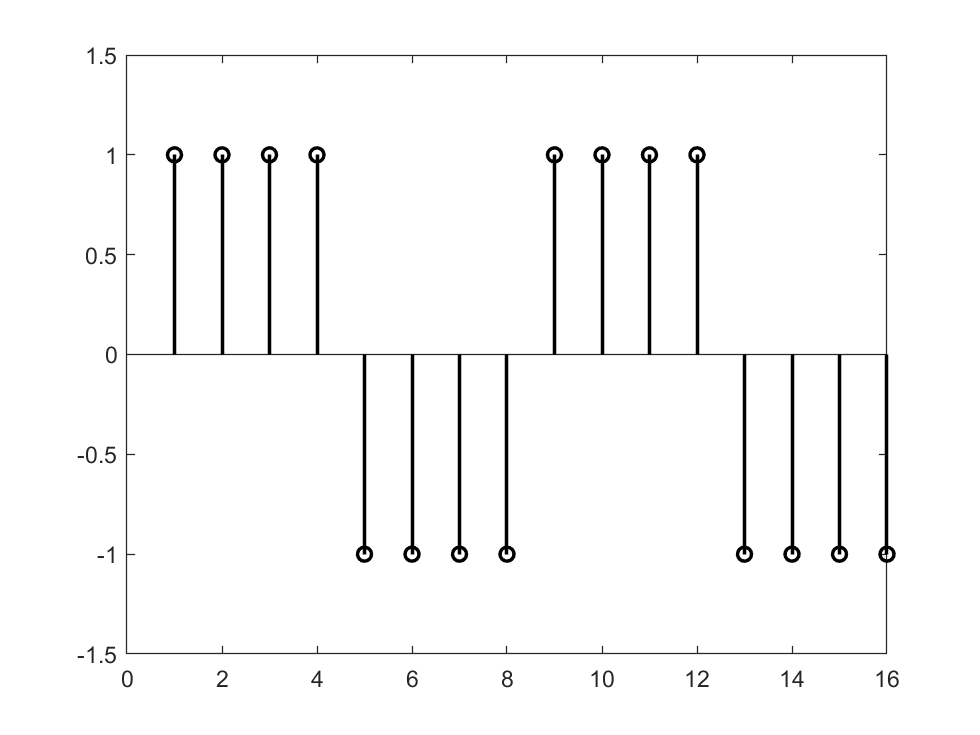
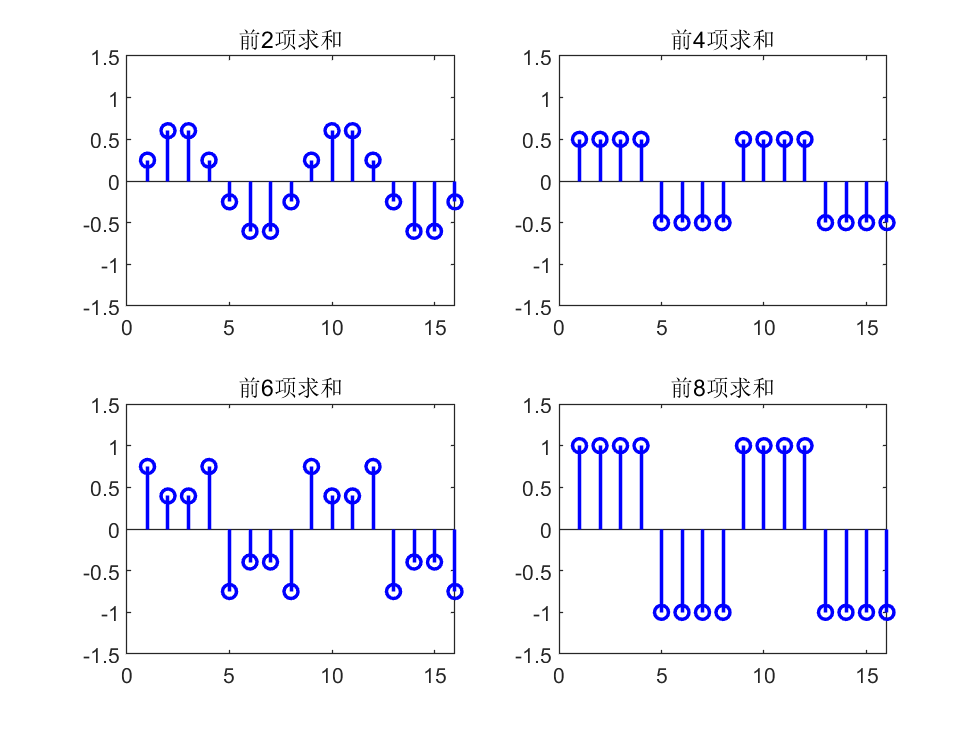
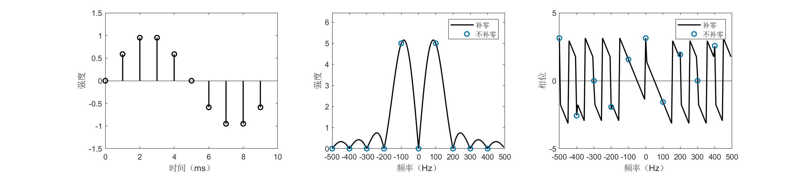
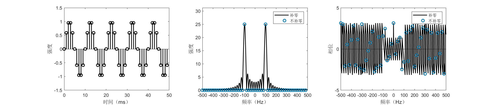
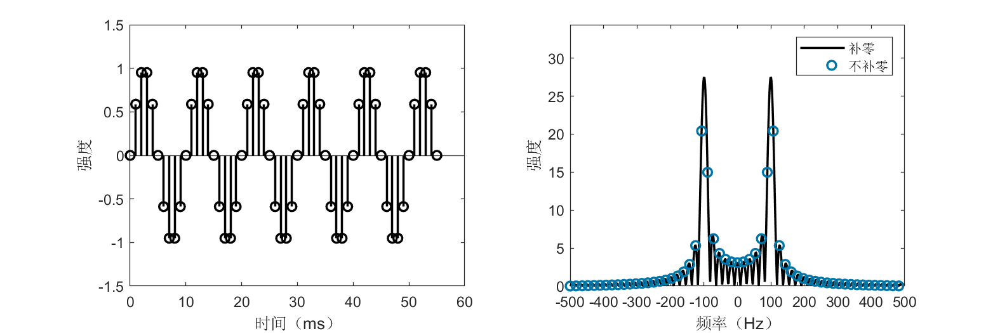
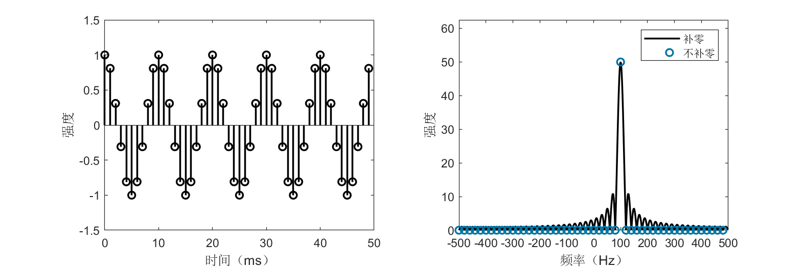

# Discrete Fourier Analysis

## Discrete Fourier Series

From Fourier series to Fourier transform, we transitioned from a discrete frequency domain to a continuous frequency domain; however, both treat continuous-time signals. In practical signal processing, we do not handle continuous signals—instead, we face signals that are discretized in time due to sampling. We remain equally interested in the spectra of such signals. Therefore, following the same approach as before, we begin by analyzing discrete periodic sequences and derive the discrete Fourier series (DFS). That is, we assume we can sample a periodic signal and aim to analyze it based on the sampled data.

Let there be a discrete periodic sequence $x[n]$ (square brackets indicate discrete variables), with period $N$. Following Fourier’s idea, we expand it as a sum of sinusoidal components. In the earlier Fourier series expansion, the selected frequencies were integer multiples (0×, 1×, 2×, …) of the fundamental frequency. For a sequence of period $N$, the fundamental frequency is $2\pi/N$; thus, the appropriate sinusoids are $e^{j2\pi kn/N}$. However, upon closer inspection, unlike the continuous case where infinitely many distinct frequencies appear, only $N$ distinct sinusoids exist in the discrete case because $e^{j2\pi(k+N)n/N} = e^{j2\pi kn/N}$. Only frequencies of the form $2\pi k/N$ exist in the discrete setting; therefore, the discrete Fourier series can be expressed as:

$$
x[n] = \sum_{k=0}^{N-1} c_k e^{j2\pi kn/N}
$$

Observe that this expression closely resembles the expansion of a vector in a finite-dimensional Euclidean space. As in the continuous Fourier series, we determine coefficients $c_k$ and $d_k$ using an inner product. First, define the inner product for two infinite-length periodic discrete sequences $x[n]$ and $y[n]$ with period $N$ as:

$$
\langle x[n], y[n] \rangle = \frac{1}{N}\sum_{n=0}^{N-1} x[n] y^*[n]
$$

It can be verified that this definition satisfies the three axioms of an inner product (the scaling factor $1/N$ on the right-hand side is chosen solely to align notation with later chapters; it may be arbitrarily set, e.g., to 1). We select orthonormal basis vectors $\phi_k[n] = e^{j2\pi kn/N}$. Then we obtain the **Discrete Fourier Series (DFS)** expansion:

$$
x[n] = \sum_{k=0}^{N-1} a_k \phi_k[n]
$$

The coefficients $a_k$ are determined as follows:

$$
a_k = \langle x[n], \phi_k[n] \rangle = \frac{1}{N}\sum_{n=0}^{N-1} x[n] e^{-j2\pi kn/N}
$$

Readers may encounter DFS formulas elsewhere that appear similar but differ slightly in notation. We reiterate: such differences reflect only notational conventions and do not affect the essence of the DFS—for instance, the factor $1/N$ may be split into two factors $1/\sqrt{N}$ placed separately in both the forward and inverse formulas.

We again use a rectangular wave as an example to compute its DFS expansion. Let the rectangular wave be defined as:

$$
x[n] =
\begin{cases}
1, & 0 \leq n < N/2 \\
-1, & N/2 \leq n < N
\end{cases}
$$

Then:

$$
a_k = \frac{1}{N}\sum_{n=0}^{N-1} x[n] e^{-j2\pi kn/N}
= \frac{1}{N}\left( \sum_{n=0}^{N/2-1} e^{-j2\pi kn/N} - \sum_{n=N/2}^{N-1} e^{-j2\pi kn/N} \right)
$$

We demonstrate the rectangular wave’s DFS expansion using MATLAB, as follows:

```matlab
%% Discrete Fourier Series Expansion of a Rectangular Wave
% Construct a discrete rectangular wave with period 8
N = 8;
xn = [ones(N/2, 1); -1*ones(N/2,1)];
figure;
stem(repmat(xn,2,1),'color','black','linewidth',1.5);
ylim([-1.5 1.5]);
```
<center>

</center>

<center>
<div style="color:orange; border-bottom: 1px solid #d9d9d9;
display: inline-block;
color: #999;
padding: 2px;">Figure. Rectangular wave with period 8</div>
</center>

```matlab
% Compute discrete Fourier coefficients
figure;
z = zeros(length(xn), 1);
for k = 0:N-1
    % Coefficients of vector e_k
    ek = zeros(length(xn), 1);
    for ii = 1:8
        ek(ii) = exp(1j*2*pi*ii*k/N)/N;
    end
    ck = N * sum(xn .* conj(ek));

    z = z + ck*ek;
    if mod(k, N/4) == 1
        % Plot
        subplot(2,2,ceil(k/(N/4)));
        % Plot real part of the sequence
        stem(real(repmat(z,2,1)),'color','b','linewidth',1.5);
        title(strcat(['Sum of first ' num2str(k+1) ' terms']));
        ylim([-1.5 1.5]);
    end
end
```
<center>

</center>

<center>
<div style="color:orange; border-bottom: 1px solid #d9d9d9;
display: inline-block;
color: #999;
padding: 2px;">Figure. Discrete Fourier Series expansion of a rectangular wave</div>
</center>

## Discrete-Time Fourier Transform

The preceding section discussed the discrete Fourier series for periodic sequences. Following prior logic, when extending a periodic signal toward a non-periodic one, the discrete frequency domain becomes continuous, and the discrete Fourier series should evolve into a “discrete Fourier transform.” However, for various reasons, the resulting transform is termed the **discrete-time Fourier transform (DTFT)**. The transform later referred to as the “discrete Fourier transform (DFT)” is discrete in both time and frequency domains.

For a non-periodic sequence $x[n]$, consider extracting a segment of length $N$ from $n = 0$ to $n = N-1$, then periodically extending it to obtain a periodic sequence $\tilde{x}[n]$ with period $N$:

$$
\tilde{x}[n] = \sum_{r=-\infty}^{\infty} x[n - rN]
$$

$\tilde{x}[n]$ admits a discrete Fourier series:

$$
\tilde{x}[n] = \sum_{k=0}^{N-1} \tilde{a}_k e^{j2\pi kn/N}
$$

The DFS coefficients $\tilde{a}_k$ are:

$$
\tilde{a}_k = \frac{1}{N}\sum_{n=0}^{N-1} \tilde{x}[n] e^{-j2\pi kn/N}
= \frac{1}{N}\sum_{n=0}^{N-1} x[n] e^{-j2\pi kn/N}
$$

Let $\omega_k = 2\pi k/N$ and $X(e^{j\omega_k}) = N \tilde{a}_k$, then $\tilde{a}_k$ becomes $X(e^{j\omega_k})/N$. If the summation converges, then:

$$
X(e^{j\omega_k}) = \sum_{n=0}^{N-1} x[n] e^{-j\omega_k n}
$$

Let $\omega = \lim_{N \to \infty} \omega_k$. As $N \to \infty$, $\omega_k$ becomes a continuous frequency variable. Replace $\omega_k$ with $\omega$, yielding:

$$
X(e^{j\omega}) = \sum_{n=-\infty}^{\infty} x[n] e^{-j\omega n}
$$

We call $X(e^{j\omega})$ the **discrete-time Fourier transform (DTFT)** of $x[n]$. For its inverse, examine the expression for $\tilde{x}[n]$: as $N \to \infty$, $\omega_k$ becomes infinitesimally spaced, and the summation over $k$ transforms into an integral over $\omega$, giving:

$$
x[n] = \frac{1}{2\pi} \int_{-\pi}^{\pi} X(e^{j\omega}) e^{j\omega n} d\omega
$$

This is called the **inverse discrete-time Fourier transform (IDTFT)**.

As before, we compute the DTFT of a rectangular wave. Let:

$$
x[n] =
\begin{cases}
1, & |n| \leq M \\
0, & |n| > M
\end{cases}
$$

Then:

$$
X(e^{j\omega}) = \sum_{n=-M}^{M} e^{-j\omega n}
= \frac{\sin\left(\omega(M + \tfrac{1}{2})\right)}{\sin(\omega/2)}
$$

The above result is the well-known **Dirichlet kernel**, whose shape closely resembles that of the sinc function, except that the Dirichlet kernel is periodic.

<center>

</center>

<center>
<div style="color:orange; border-bottom: 1px solid #d9d9d9;
display: inline-block;
color: #999;
padding: 2px;">Figure. Dirichlet kernel</div>
</center>

From another perspective, discrete sampling of a continuous signal aims to recover the continuous signal’s spectrum from the samples; hence, the similarity between the Dirichlet kernel and the sinc function is natural. When the sampling rate tends to infinity, the DTFT coincides with the Fourier transform (FT). Under theoretical conditions described by the sampling theorem, the original continuous signal can be fully reconstructed from its DTFT.

## Discrete Fourier Transform

Fourier analysis was originally developed not for signal processing but for solving partial differential equations. Today, however, its most widespread application lies in signal processing. Classifying signals by continuity and periodicity, we have derived the Fourier series (FS), Fourier transform (FT), discrete Fourier series (DFS), and discrete-time Fourier transform (DTFT), as summarized below:

Continuous periodic signal   $\leftrightarrow$ Fourier series (FS)  
Continuous non-periodic signal $\leftrightarrow$ Fourier transform (FT)  
Discrete periodic signal       $\leftrightarrow$ Discrete Fourier series (DFS)  
Discrete non-periodic signal   $\leftrightarrow$ Discrete-time Fourier transform (DTFT)

Yet the most commonly used method in signal processing is the **discrete Fourier transform (DFT)**—how does it arise? Note that FS, FT, DFS, and DTFT all analyze infinitely long signals. In practice, however, we typically acquire only finite-length discrete signals—how do we analyze their spectra?

First, what constitutes the spectrum of a finite-length discrete signal? Discreteness and finiteness are merely physical constraints imposed upon us; we desire this “spectrum” to reflect the true signal’s spectrum. Suppose a finite-length discrete signal $x[n]$ has length $N$, i.e., $x[n] = 0$ for $n < 0$ or $n \geq N$. Three cases arise:

1. The underlying signal is periodic, and the finite-length segment captures an integer number of periods;  
2. The underlying signal is periodic, but the finite-length segment does not capture an integer number of periods;  
3. The underlying signal is non-periodic.

### Case 1  
For Case 1, the solution is straightforward: replicate the segment periodically to construct a discrete periodic signal. Its spectrum is then given directly by the DFS coefficients $a_k$. Denoting $a_k$ instead by $X[k]$, we obtain:

$$
X[k] = \sum_{n=0}^{N-1} x[n] e^{-j2\pi kn/N}, \quad k = 0,1,\dots,N-1
$$

We call $X[k]$ the **discrete Fourier transform (DFT)** of $x[n]$. From the DFS expansion, we also obtain the **inverse discrete Fourier transform (IDFT)**:

$$
x[n] = \frac{1}{N}\sum_{k=0}^{N-1} X[k] e^{j2\pi kn/N}, \quad n = 0,1,\dots,N-1
$$

Again, the normalization constants preceding the summations in DFT and IDFT are unimportant. In the above definition, the DFT carries coefficient 1 and the IDFT carries $1/N$; alternatively, both may be assigned $1/\sqrt{N}$.

Thus, the DFT corresponds precisely to the DFS coefficient formula, and the IDFT corresponds to the DFS expansion—equivalently, it represents a reinterpretation of discrete periodic signals from another viewpoint. Consequently, our classification may be revised as:

Continuous periodic signal   $\leftrightarrow$ Fourier series (FS)  
Continuous non-periodic signal $\leftrightarrow$ Fourier transform (FT)  
Discrete periodic signal       $\leftrightarrow$ Discrete Fourier series (DFS) & Discrete Fourier transform (DFT)  
Discrete non-periodic signal   $\leftrightarrow$ Discrete-time Fourier transform (DTFT)

At this point, readers may ask: what about Cases 2 and 3?

### Cases 2 and 3  
Consider Case 2 first: how can we know whether the segment captures an integer number of periods? All we possess is the finite-length sequence itself—without additional evidence, we cannot speculate about the underlying signal. Hence, Case 2 has no definitive solution; we must assume the segment captures an integer number of periods. However, in practice, exact integer-period truncation is rare, causing discrepancies between the DFT-computed spectrum and the true continuous signal’s spectrum—a phenomenon known as **spectral leakage**.

Case 3 presents a similar issue: if the signal is non-periodic, how can we know its behavior for $n < 0$ or $n > N-1$? A reasonable assumption is that our sampling duration is sufficiently long—the $N$-point sequence contains all essential signal information, while values outside this range are zero. This yields an infinite-length non-periodic discrete sequence, naturally amenable to DTFT analysis, producing the spectrum:

$$
X(e^{j\omega}) = \sum_{n=0}^{N-1} x[n] e^{-j\omega n}
$$

Careful readers will notice the resemblance between the DFT expression and the above. Indeed, the DFT corresponds to sampling $X(e^{j\omega})$ at discrete frequencies $\omega_k = 2\pi k/N$. Equivalently, for a finite-length signal, the DFT is a sampling of the DTFT over its principal frequency interval. In digital signal processing, for efficient digital circuit implementation, we require both time and frequency domains to be discrete. Thus, even for non-periodic signals, we must sample the continuous DTFT spectrum for storage. Since sampling is inevitable, and the DFT inherently provides such sampling, why not employ the DFT for Case 3?

Thoughtful readers may object: although the DFT performs sampling, its frequency resolution is fixed at $2\pi/N$—what if finer spectral resolution is desired? Not to worry: the DFT supports a powerful auxiliary operation—**zero padding** in the time domain. For instance, append a zero sequence of length $L$ to $x[n]$, denoted $x_{\text{zp}}[n]$, i.e.:

$$
x_{\text{zp}}[n] =
\begin{cases}
x[n], & 0 \leq n < N \\
0, & N \leq n < N+L
\end{cases}
$$

Then the DFT of $x_{\text{zp}}[n]$ is:

$$
X_{\text{zp}}[k] = \sum_{n=0}^{N+L-1} x_{\text{zp}}[n] e^{-j2\pi kn/(N+L)}, \quad k = 0,1,\dots,N+L-1
$$

Compared with:

$$
X[k] = \sum_{n=0}^{N-1} x[n] e^{-j2\pi kn/N}, \quad k = 0,1,\dots,N-1
$$

The resulting spectrum $X_{\text{zp}}[k]$ matches $X[k]$ at corresponding indices but achieves resolution $2\pi/(N+L)$, doubling the original resolution. Higher resolution is attainable by adding more zeros. Crucially, regardless of zero-padding extent, the DFT always yields samples of the DTFT; thus, infinite zero-padding recovers the full DTFT spectrum.

In summary, for discrete finite-length signals, the DFT—augmented by zero padding—is sufficient to obtain the required spectrum.

## Fast Fourier Transform

Although the DFT computes spectra over finite durations, its computational complexity is $O(N^2)$, rendering it impractical for large-scale applications. In the mid-1960s, the **fast Fourier transform (FFT)** algorithm was introduced—a highly efficient method for computing the DFT or IDFT of a sequence. Independently discovered by Cooley and Tukey in 1965, the FFT has a long history; its significance stems from its suitability for efficient digital implementation, reducing computation time by several orders of magnitude. With this algorithm, numerous intriguing yet previously impractical ideas relying on the DFT suddenly became feasible, accelerating advances in discrete-time signal and system analysis. In 1994, mathematician Gilbert Strang described the FFT as “the most important numerical algorithm of our lifetime,” and it was listed by the IEEE journal *Computing in Science & Engineering* among the top ten algorithms of the 20th century.

We explain the FFT principle using a sequence of length $N = 2^m$ (FFT algorithms for non-power-of-two lengths also exist; interested readers may explore them independently). The core idea is divide-and-conquer: decompose computation of an $N$-point DFT into two $N/2$-point DFTs, thereby reducing computational load. Rewriting the DFT formula:

$$
X[k] = \sum_{n=0}^{N-1} x[n] e^{-j2\pi kn/N}
$$

For convenience, denote $W_N = e^{-j2\pi/N}$. Then the DFT becomes:

$$
X[k] = \sum_{n=0}^{N-1} x[n] W_N^{kn}
$$

Partition $x[n]$ into even- and odd-indexed subsequences $x_e[n] = x[2n]$ and $x_o[n] = x[2n+1]$ ($n = 0,1,\dots,N/2-1$), yielding:

$$
X[k] = \sum_{n=0}^{N/2-1} x[2n] W_N^{2kn} + \sum_{n=0}^{N/2-1} x[2n+1] W_N^{k(2n+1)}
= \sum_{n=0}^{N/2-1} x_e[n] W_{N/2}^{kn} + W_N^k \sum_{n=0}^{N/2-1} x_o[n] W_{N/2}^{kn}
$$

Simple algebra shows $W_N^{2kn} = W_{N/2}^{kn}$, so:

$$
X[k] = X_e[k] + W_N^k X_o[k]
$$

When $k < N/2$, $X_e[k]$ and $X_o[k]$ are the DFTs of $x_e[n]$ and $x_o[n]$, respectively; when $k \geq N/2$, $W_N^{k+N/2} = -W_N^k$, allowing reuse of $X_e[k]$ and $X_o[k]$ results.

Thus, we successfully reduce computation of one $N$-point DFT to two $N/2$-point DFTs. Let $T(N)$ denote the FFT’s time complexity. Since merging results consumes $O(N)$ time, we obtain:

$$
T(N) = 2T(N/2) + O(N)
$$

Solving this recurrence yields $T(N) = O(N \log_2 N)$. Students should recall material from algorithms courses and verify this complexity themselves. Analogously, for the IDFT, we have the **inverse fast Fourier transform (IFFT)**.

The above describes a recursive FFT algorithm. In practice, recursive implementations are often converted to iterative ones. Especially for hardware implementation, common FFT algorithms incorporate a **butterfly computation structure**. Further optimizations enhance computational performance—details are omitted here.


<center>
<div style="color:orange; border-bottom: 1px solid #d9d9d9;
display: inline-block;
color: #999;
padding: 2px;">Figure. FT vs. FS vs. DTFT vs. DFT</div>
</center>

### Large-Integer Multiplication and Convolution via FFT

We now present two examples illustrating efficient algorithm design using the FFT—large-integer multiplication and convolution. Though seemingly unrelated, both rely on the same core idea.

In programming courses, students implement large-integer multiplication by simulating manual column-wise multiplication, achieving $O(n^2)$ complexity. Using the FFT, this complexity reduces to $O(n \log n)$.

Let $A$ and $B$ be two large integers, each with $n$ digits. Express them as polynomials (padding sufficient leading zeros so their product fits within $2n$ digits):

$$
A(x) = \sum_{i=0}^{n-1} a_i x^i, \quad B(x) = \sum_{i=0}^{n-1} b_i x^i
$$

where $a_i$ and $b_i$ denote the $i$-th digit (least-significant digit first) of $A$ and $B$, respectively. Thus, vector $\mathbf{a} = [a_0, a_1, \dots, a_{n-1}]^T$ represents $A$, and $\mathbf{b} = [b_0, b_1, \dots, b_{n-1}]^T$ represents $B$. This representation is called the **coefficient representation**, and choosing $x = 10$ yields standard decimal notation.

Polynomials admit not only coefficient representations but also **point-value representations** (Lagrange interpolation): $n$ points uniquely determine a degree-$(n-1)$ polynomial. For example, knowing values at points $x_0, x_1, \dots, x_{n-1}$ determines $A(x)$ completely.

Consider the following computational strategy:

1. Convert coefficient representations of $A(x)$ and $B(x)$ to point-value representations.  
2. Multiply point-value representations: $C(x_i) = A(x_i) B(x_i)$.  
3. Convert point-value representation of $C(x)$ back to coefficient representation—yielding the product integer.

Step 2 requires $O(n)$ operations, but naive implementations of Steps 1 and 3 cost $O(n^2)$, offering no overall improvement. Yet this framework enables optimization.

Observe that polynomial evaluation is a summation, identical in form to the DFT. If the evaluation points $x_i$ are chosen as the $N$-th roots of unity (arbitrary points suffice for point-value representation; we select $N$ points on the complex plane), then “converting coefficient representation to point-value representation” becomes equivalent to computing the DFT of $\mathbf{a}$, and the reverse conversion corresponds to the IDFT. With FFT and IFFT available, Steps 1 and 3 reduce to $O(n \log n)$, making total large-integer multiplication complexity $O(n \log n)$.

In signal processing, we inevitably encounter **convolution**. The discrete convolution is defined as follows: let $x[n]$ and $h[n]$ be infinite-length discrete sequences; their convolution is:

$$
y[n] = (x * h)[n] = \sum_{k=-\infty}^{\infty} x[k] h[n-k]
$$

Real-world sequences are finite—we know only $N$ and $M$ points of $x[n]$ and $h[n]$, respectively. Two approaches exist: (i) periodic extension, or (ii) zero-padding. Approach (i) yields **circular convolution**, denoted $x[n] \circledast h[n]$; approach (ii) yields **linear convolution**, denoted $x[n] * h[n]$. Consider linear convolution: $x[n] = 0$ for $n < 0$ or $n \geq N$, and $h[n] = 0$ for $n < 0$ or $n \geq M$. Then $y[n]$ is:

$$
y[n] = \sum_{k=0}^{N-1} x[k] h[n-k], \quad n = 0,1,\dots,N+M-2
$$

Computing $y[n]$ naively incurs $O(NM)$ complexity. However, careful observation reveals that $y[n]$’s expression matches manual column-wise multiplication of large integers! Thus, FFT similarly reduces convolution complexity to $O((N+M)\log(N+M))$. Specifically, compute FFTs of $x[n]$ and $h[n]$, then $y[n]$ equals the IFFT of their product:

$$
y[n] = \text{IFFT}\big\{ \text{FFT}\{x[n]\} \cdot \text{FFT}\{h[n]\} \big\}
$$

Or equivalently:

$$
x[n] * h[n] = \text{IFFT}\big\{ \text{FFT}\{x[n]\} \cdot \text{FFT}\{h[n]\} \big\}
$$

This embodies the famous property of the Fourier transform: convolution in the time domain equals multiplication in the frequency domain. More precisely, for FFT-based computation, circular convolution applies:

$$
x[n] \circledast h[n] = \text{IFFT}\big\{ \text{FFT}\{x[n]\} \cdot \text{FFT}\{h[n]\} \big\}
$$

Note this property is critically important—remember it always!

Why is circular convolution correct? (Hint: recall the implicit assumption that $x[n]$ and $h[n]$ are zero-padded.)

### Example: Signal Spectrum Analysis Using FFT

Next, we demonstrate FFT-based signal spectrum analysis via MATLAB code. Four signals are analyzed:

1. Sine wave truncated over an integer number of periods  
2. Sine wave truncated over a non-integer number of periods  
3. Complex exponential (complex sinusoid)  
4. Square wave  

**Sine wave truncated over an integer number of periods**

```matlab
fs = 1e3; % Sampling rate: 1000 Hz

% Construct a 100-Hz sine wave
f0 = 100;
t = (0:1/fs:1/f0-1/fs)'; % Sample one period
% t = (0:1/fs:5/f0-1/fs)'; % Sample five periods
xn = sin(2*pi*f0*t);
N = length(xn);
figure('Position', [400 400 1400 300]);
subplot(131);
stem((0:N-1)',real(xn),'color','black','linewidth',1.5);
ylim([-1.5 1.5]);
xlabel('Time (ms)');
ylabel('Amplitude');

% FFT without zero-padding
yn = fft(xn);
% Shift negative frequencies to left
yn = [yn(N/2+1:end); yn(1:N/2)];

% FFT with zero-padding
r = 16; % Zero-padding factor
yn2 = fft(xn, r*N);
% Shift negative frequencies to left
yn2 = [yn2(N*r/2+1:end); yn2(1:N*r/2)];

subplot(132);
f1 = (-r*N/2:r*N/2-1)'/(r*N)*fs;
f2 = (-N/2:N/2-1)'/N*fs;
plot(f1, abs(yn2),'color','black','linewidth',1.5); hold on
stem(f2, abs(yn),'color',[0,118,168]/255,'linewidth',1.5,'linestyle','none');
xlabel('Frequency (Hz)');
xticks(-500:100:500);
ylabel('Magnitude');
ylim([0 1.25*max(abs(yn2))]);
legend('Zero-padded', 'No zero-padding', 'Location', 'NorthEast');

subplot(133);
f1 = (-r*N/2:r*N/2-1)'/(r*N)*fs;
f2 = (-N/2:N/2-1)'/N*fs;
plot(f1, angle(yn2),'color','black','linewidth',1.5); hold on
stem(f2, angle(yn),'color',[0,118,168]/255,'linewidth',1.5,'linestyle','none');
xlabel('Frequency (Hz)');
xticks(-500:100:500);
ylabel('Phase');
ylim([-5 5]);
legend('Zero-padded', 'No zero-padding', 'Location', 'NorthEast');
```

<center>

</center>
<center>
<div style="color:orange; border-bottom: 1px solid #d9d9d9;
display: inline-block;
color: #999;
padding: 2px;">Figure. 100-Hz sine wave sampled over one period (left: time-domain waveform; center: FFT magnitude spectrum; right: FFT phase spectrum)</div>
</center>

<center>

</center>

<center>
<div style="color:orange; border-bottom: 1px solid #d9d9d9;
display: inline-block;
color: #999;
padding: 2px;">Figure. 100-Hz sine wave sampled over five periods (left: time-domain waveform; center: FFT magnitude spectrum; right: FFT phase spectrum)</div>
</center>

The figures above display time- and frequency-domain representations of a 100-Hz sine wave sampled over one and five periods, respectively. Negative frequencies are plotted—this is natural, as any real-valued signal decomposes into conjugate complex exponentials, possessing both positive and corresponding negative frequencies. Real signals exhibit symmetric spectra; typically, only half is examined. FFT outputs complex values, carrying both magnitude and phase information. Besides magnitude spectra, the figures also show phase spectra. Magnitude spectra are more commonly used, revealing the relative strength of each frequency component; phase spectra are equally vital—for instance, in OFDM modulation, FFT phase is critically monitored.

A curious phenomenon appears: when sampling exactly one period, the unpadded spectrum indicates a pure 100-Hz component, whereas the 16× zero-padded, higher-resolution spectrum shows the dominant peak deviating from 100 Hz (blue circles misaligned with black curve maxima). Why? Because a real sine wave comprises two frequency components: $+100$ Hz and $-100$ Hz. Due to signal finiteness, these generate sidelobes that interfere, perturbing the ideal 100-Hz peak. This effect diminishes as sidelobes shrink.

Sidelobe suppression is crucial in practical signal processing. Two common methods exist: (i) multiplying the signal by a window function (“windowing”). Windowing is often omitted or glossed over in many works—including research papers—yet proper window selection frequently simplifies signal processing significantly and may decisively impact performance. (ii) Extending the sampling duration (rendering the signal effectively “non-finite”). As shown, increasing sampling to five periods aligns the black curve’s peak closely with the blue dot, correctly identifying the 100-Hz component.

> Reflection: Why do these two operations improve frequency estimation accuracy?

**Sine wave truncated over a non-integer number of periods**

```matlab
fs = 1e3; % Sampling rate: 1000 Hz

% Construct a 100-Hz sine wave
f0 = 100;
t = (0:1/fs:1.6/f0-1/fs)'; % Sample 1.5 periods
% t = (0:1/fs:5.6/f0-1/fs)'; % Sample 5.5 periods
xn = sin(2*pi*f0*t);
N = length(xn);
figure('Position', [400 400 900 300]);
subplot(121);
stem((0:N-1)',real(xn),'color','black','linewidth',1.5);
ylim([-1.5 1.5]);
xlabel('Time (ms)');
ylabel('Amplitude');

% FFT without zero-padding
yn = fft(xn);
% Shift negative frequencies to left
yn = [yn(N/2+1:end); yn(1:N/2)];

% FFT with zero-padding
r = 16; % Zero-padding factor
yn2 = fft(xn, r*N);
% Shift negative frequencies to left
yn2 = [yn2(N*r/2+1:end); yn2(1:N*r/2)];

subplot(122);
f1 = (-r*N/2:r*N/2-1)'/(r*N)*fs;
f2 = (-N/2:N/2-1)'/N*fs;
plot(f1, abs(yn2),'color','black','linewidth',1.5); hold on
stem(f2, abs(yn),'color',[0,118,168]/255,'linewidth',1.5,'linestyle','none');
xlabel('Frequency (Hz)');
xticks(-500:100:500);
ylabel('Magnitude');
ylim([0 1.25*max(abs(yn2))]);
legend('Zero-padded', 'No zero-padding', 'Location', 'NorthEast');
```

<center>

</center>

<center>
<div style="color:orange; border-bottom: 1px solid #d9d9d9;
display: inline-block;
color: #999;
padding: 2px;">Figure. 100-Hz sine wave sampled over 1.5 periods (left: time-domain waveform; right: FFT magnitude spectrum)</div>
</center>

<center>

</center>

<center>
<div style="color:orange; border-bottom: 1px solid #d9d9d9;
display: inline-block;
color: #999;
padding: 2px;">Figure. 100-Hz sine wave sampled over 5.5 periods (left: time-domain waveform; right: FFT magnitude spectrum)</div>
</center>

Unlike integer-period truncation, non-integer-period truncation causes **spectral leakage** or distortion. As shown, blue circles no longer align with spectral peaks. Regardless of sampling duration increase, the unpadded spectrum persistently indicates multiple significant frequency components besides 100 Hz. In such cases, zero-padding to enhance spectral resolution becomes essential.

This simple example illustrates both the power and subtlety of FFT usage. Even for such a basic signal, improper application yields markedly inferior results. Many students encounter unsatisfactory outcomes in practical signal processing or research experiments—often, root causes lie in foundational choices. This is precisely why extensive exposition of Fourier analysis is warranted.

**Complex exponential (complex sinusoid)**

```matlab
fs = 1e3; % Sampling rate: 1000 Hz

% Construct a 100-Hz complex exponential
f0 = 100;
t = (0:1/fs:5/f0-1/fs)'; % Sample five periods
xn = exp(1j*2*pi*f0*t);
N = length(xn);
figure('Position', [400 400 900 300]);
subplot(121);
stem((0:N-1)',real(xn),'color','black','linewidth',1.5);
ylim([-1.5 1.5]);
xlabel('Time (ms)');
ylabel('Amplitude');

% FFT without zero-padding
yn = fft(xn);
% Shift negative frequencies to left
yn = [yn(N/2+1:end); yn(1:N/2)];

% FFT with zero-padding
r = 16; % Zero-padding factor
yn2 = fft(xn, r*N);
% Shift negative frequencies to left
yn2 = [yn2(N*r/2+1:end); yn2(1:N*r/2)];

subplot(122);
f1 = (-r*N/2:r*N/2-1)'/(r*N)*fs;
f2 = (-N/2:N/2-1)'/N*fs;
plot(f1, abs(yn2),'color','black','linewidth',1.5); hold on
stem(f2, abs(yn),'color',[0,118,168]/255,'linewidth',1.5,'linestyle','none');
xlabel('Frequency (Hz)');
xticks(-500:100:500);
ylabel('Magnitude');
ylim([0 1.25*max(abs(yn2))]);
legend('Zero-padded', 'No zero-padding', 'Location', 'NorthEast');
```

<center>

</center>

<center>
<div style="color:orange; border-bottom: 1px solid #d9d9d9;
display: inline-block;
color: #999;
padding: 2px;">Figure. 100-Hz complex exponential sampled over five periods (left: real part of time-domain waveform; right: FFT magnitude spectrum)</div>
</center>

The figure displays time- and frequency-domain representations of the complex signal $x[n] = e^{j2\pi 100 n / f_s}$, which—unlike its real-valued counterpart—exhibits a single frequency component at 100 Hz.

**Square wave**

```matlab
fs = 1e3; % Sampling rate: 1000 Hz

% Construct a square wave with period 10 ms
T = 10e-3;
num = 4; % Sample four periods
N = num * fs * T;
xn = repmat([ones(fs*T/2, 1); -1*ones(fs*T/2,1)], num, 1);
figure('Position', [400 400 900 300]);
subplot(121);
stem(xn,'color','black','linewidth',1.5);
ylim([-1.5 1.5]);
xlabel('Time (ms)');
ylabel('Amplitude');

% FFT without zero-padding
yn = fft(xn);
% Shift negative frequencies to left
yn = [yn(N/2+1:end); yn(1:N/2)];

% FFT with zero-padding
r = 32; % Zero-padding factor
yn2 = fft(xn, r*N);
% Shift negative frequencies to left
yn2 = [yn2(N*r/2+1:end); yn2(1:N*r/2)];

subplot(122);
f1 = (-r*N/2:r*N/2-1)'/(r*N)*fs;
f2 = (-N/2:N/2-1)'/N*fs;
plot(f1, abs(yn2),'color','black','linewidth',1.5); hold on
stem(f2, abs(yn),'color',[0,118,168]/255,'linewidth',1.5,'linestyle','none');
xlabel('Frequency (Hz)');
xticks(-500:100:500);
ylabel('Magnitude');
ylim([0 1.25*max(abs(yn2))]);
legend('Zero-padded', 'No zero-padding', 'Location', 'NorthEast');
```
<center>

</center>

<center>
<div style="color:orange; border-bottom: 1px solid #d9d9d9;
display: inline-block;
color: #999;
padding: 2px;">Figure. Square wave with period 10 ms (left: time-domain waveform; right: magnitude spectrum)</div>
</center>

The figure shows a square wave with period 10 ms and its spectrum. The dominant frequency component is 100 Hz, consistent with the 10-ms period. Readers will also observe additional frequency components beyond 100 Hz—consider why this occurs.

## References

1. Oppenheim, Alan V and Buck, John R and Schafer, Ronald W. *Discrete-time signal processing*. Vol. 2[M]. Upper Saddle River, NJ: Prentice Hall, 2001.  
2. Cormen, Thomas H and Leiserson, Charles E and Rivest, Ronald L and Stein, Clifford. *Introduction to algorithms*[M]. MIT press, 2009.