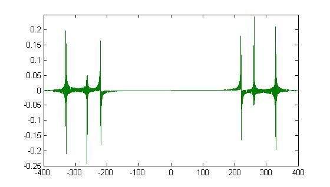
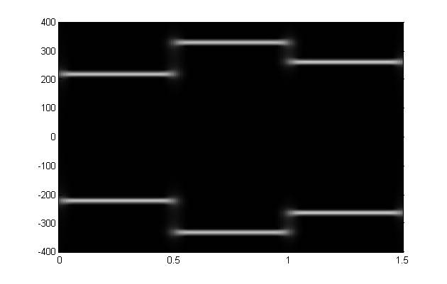
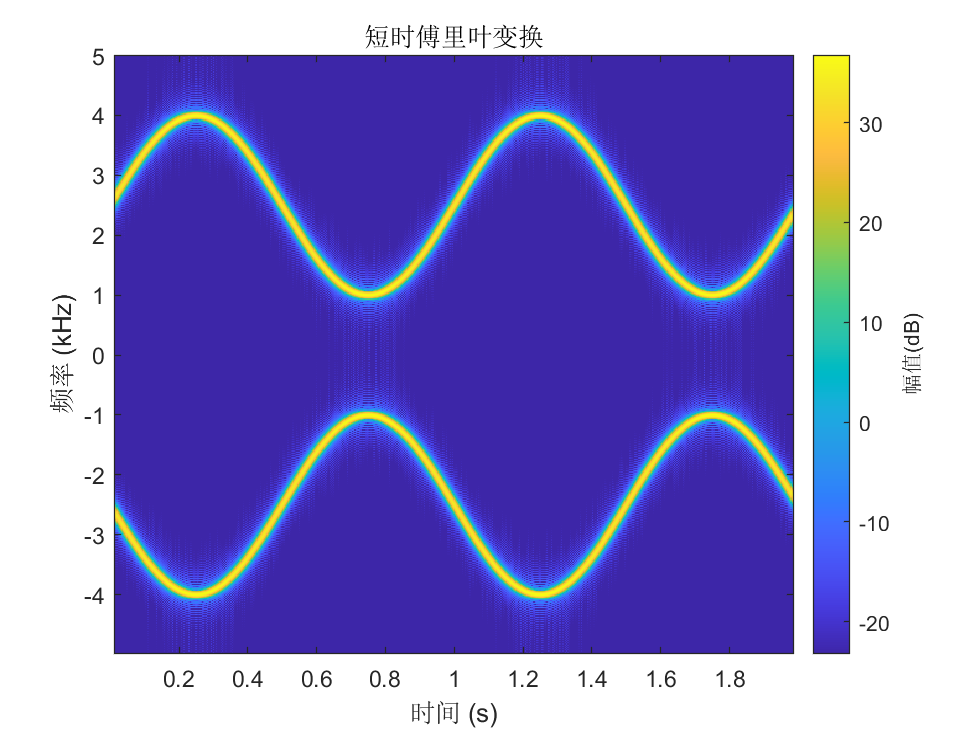
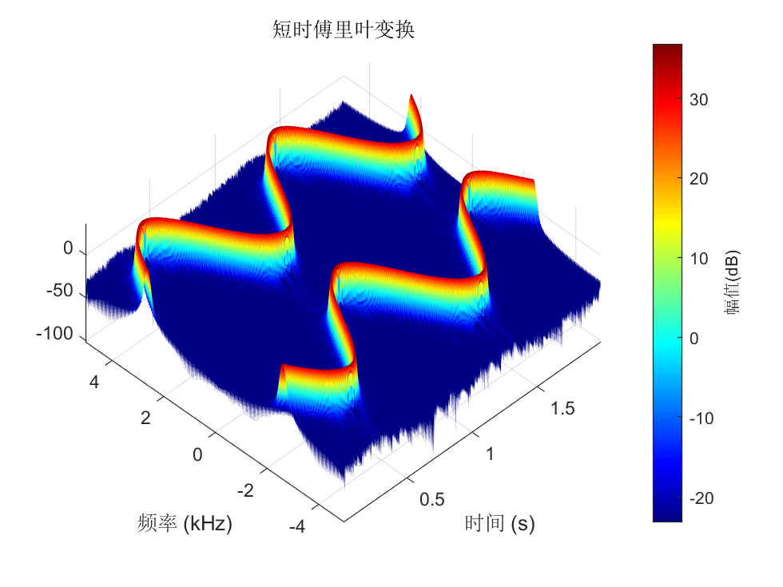

# Short-Time Fourier Transform

The result obtained by applying the Fourier transform to a signal does not provide any information about how the signal's frequency content changes over time. Therefore, a variation of the Fourier transform—the Short-Time Fourier Transform (STFT)—was developed to determine the frequency and phase content of localized portions of a time-varying signal. In practice, computing the STFT involves dividing a long-duration signal into several shorter, equal-length segments and then computing the Fourier transform of each segment separately. The STFT is commonly used to depict changes in the frequency domain over time and is an essential tool in time-frequency analysis.

Consider the following example:

$$
x(t)=\left\{
\begin{aligned}
\cos (440\pi t), &\quad t < 0.5 \\
\cos(660\pi t), &\quad 0.5 \leq t < 1 \\
\cos(524\pi t), &\quad t \geq 1.
\end{aligned}
\right.
$$

The spectrum after Fourier transform and the result after short-time Fourier transform are shown below:

<center>

</center>
<center>
<div style="color:orange; border-bottom: 1px solid #d9d9d9;
display: inline-block;
color: #999;
padding: 2px;">Figure. Fourier Transform, horizontal axis represents frequency (Hz)</div>
</center>

<center>

</center>
<center>
<div style="color:orange; border-bottom: 1px solid #d9d9d9;
display: inline-block;
color: #999;
padding: 2px;">Figure. Short-Time Fourier Transform, horizontal axis represents time (s), vertical axis represents frequency (Hz)</div>
</center>

In the STFT process:

- The window length determines the time resolution and frequency resolution of the spectrogram.
- A longer window captures a longer segment of the signal.
- The longer the signal segment, the higher the frequency resolution after the Fourier transform, but the poorer the time resolution.
- Conversely, a shorter window captures a shorter signal segment, resulting in lower frequency resolution but better time resolution.

There is a trade-off between time resolution and frequency resolution in the STFT; one cannot achieve both simultaneously. The choice should be made according to specific application requirements.

Simply put, the short-time Fourier transform multiplies a signal by a window function and then performs a one-dimensional Fourier transform on the product. By sliding the window across the signal, a sequence of Fourier transform results is obtained. Arranging these results vertically yields a two-dimensional representation.

The formula for the Short-Time Fourier Transform (STFT) is given by:

$$
X(t, f) = \int_{-\infty}^{\infty}w(t-\tau)x(\tau)e^{-j2\pi f\tau}d\tau.
$$

Let us illustrate the use of STFT using MATLAB. First, we generate two signals whose frequencies sinusoidally oscillate over time using the voltage-controlled oscillator function `vco`. Then, we compute the STFT of the signal. For the STFT parameters, we use a Kaiser window of length 256 with a shape parameter $\beta = 5$, an overlap length of 220 samples, and an FFT length of 512.

```matlab
fs = 10e3;
t = 0:1/fs:2;
x = vco(sin(2*pi*t),[0.1 0.4]*fs,fs);
stft(x,fs,'Window',kaiser(256,5),'OverlapLength',220,'FFTLength',512);
```

We can also visualize the transformation result from a three-dimensional perspective:
```matlab
view(-45,65)
colormap jet
```

<center>

</center>
<center>
<div style="color:orange; border-bottom: 1px solid #d9d9d9;
display: inline-block;
color: #999;
padding: 2px;">Figure. Result of Short-Time Fourier Transform</div>
</center>

<center>

</center>
<center>
<div style="color:orange; border-bottom: 1px solid #d9d9d9;
display: inline-block;
color: #999;
padding: 2px;">Figure. 3D View of Short-Time Fourier Transform Result</div>
</center>