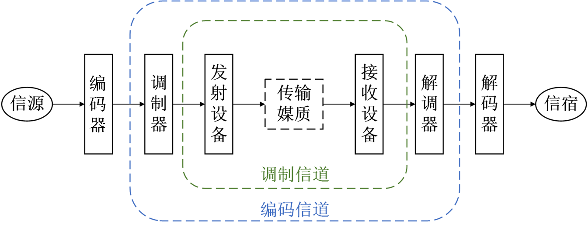
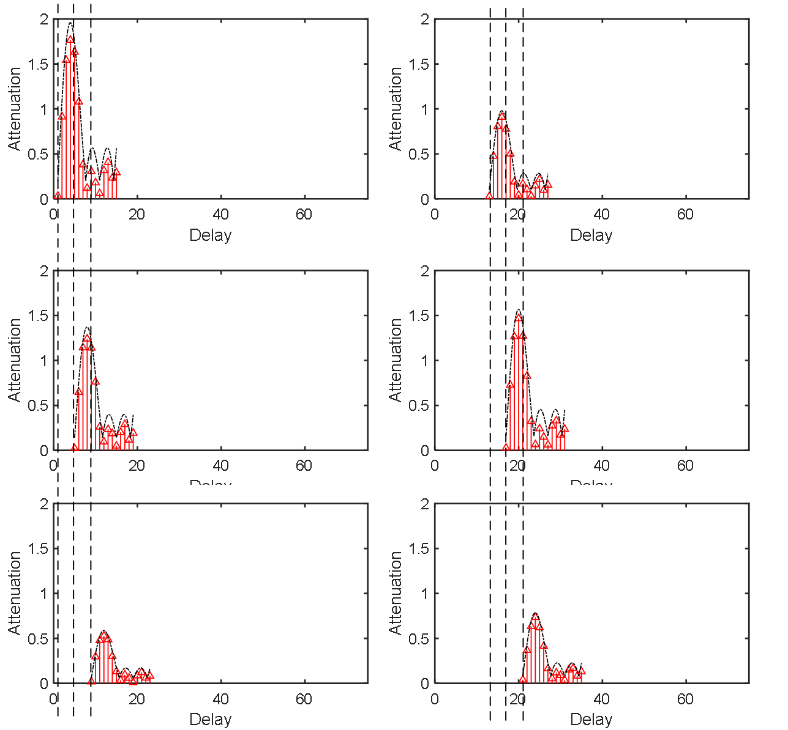
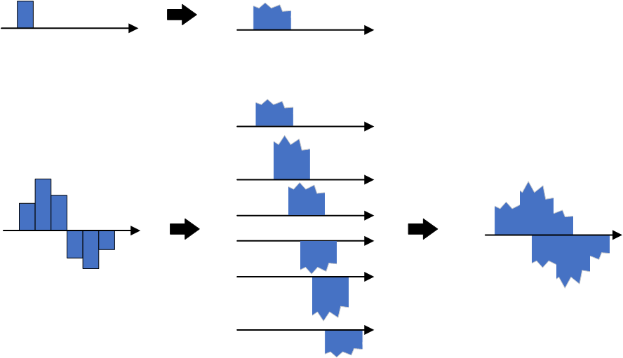
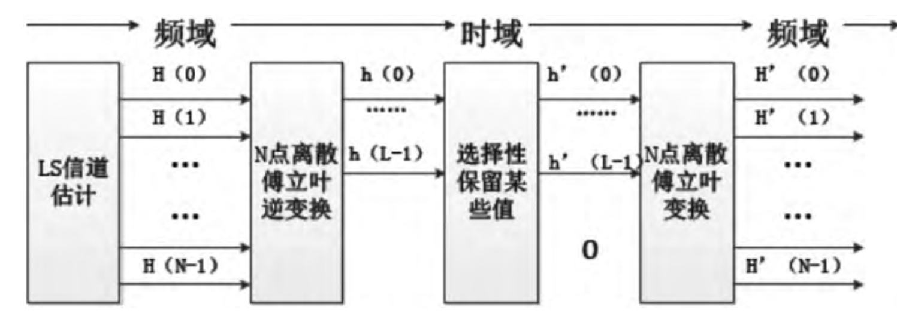

# Wireless Channels

## Channel Definition  
Just as vehicles require roads for transportation, signals require channels for transmission. According to Wikipedia, a *channel*—also referred to as a *path*, *band*, or *wave channel*—is the medium through which signals propagate in a communication system. It comprises all physical transmission media traversed by a signal from transmitter to receiver; broadly defined, it may also include associated equipment involved in signal transmission. Understanding channels forms a foundational prerequisite for comprehending data transmission. Indeed, cutting-edge research in the Internet of Things (IoT)—ranging from IoT communications to IoT sensing—is fundamentally grounded in channel characteristics: such work either addresses challenges introduced by the channel or exploits its inherent properties.

Throughout this section, we shall consistently focus on the following questions:

- What is a channel?  
- How is a channel mathematically represented?

We first recall that the fundamental objective of transmission is to reconstruct the transmitted signal based on the received signal. To achieve this, we must first understand how to represent signals (*modulation*) and how to model the channel (*characterizing its effect on signal propagation*). Suppose the transmitted signal is denoted by $s$; then the received signal after passing through the channel is $f(s)$, where the function $f$ captures the channel’s effect on the signal. The goal of transmission is thus to estimate $s$ from the observed $f(s)$. Ideally, one would hope the channel introduces no distortion whatsoever, yielding $f(s) = s$. In practice, however, such an ideal scenario is unattainable.

Intuitively, a channel represents the physical medium through which a signal propagates from transmitter to receiver—a canonical communication process comprising three components: transmitter, channel, and receiver. For example, consider homework you write at night and submit to your teacher the next day: you are the transmitter; the homework constitutes the data; the notebook and the act of submission collectively form the channel; and your teacher is the receiver. To ensure your teacher reads your homework correctly, you first ensure your writing is accurate—you may enlarge your handwriting to improve legibility, write your name clearly to identify authorship, and highlight key points—all strategies employed at the transmitter to enhance transmission reliability. Simultaneously, you strive to deliver the notebook reliably to your teacher—for instance, protecting it carefully during rain—to mitigate channel-induced impairments. Only upon successful delivery can your teacher interpret your original content accurately.

Channels can be classified into two categories:

**Narrowband (or Physical) Channel**: Classified according to transmission medium, narrowband channels fall into three types: wired channels, wireless channels, and storage channels. Notably, magnetic tapes, hard disks, and other data storage media can also be regarded as communication channels. Writing data onto such media is analogous to a transmitter sending signals into a channel; reading data from them corresponds to a receiver retrieving signals from the channel.

**Broadband (or Functional) Channel**: Classified according to functional role, broadband channels comprise *modulation channels* and *coding channels*. A modulation channel spans from the output of the modulator to the input of the demodulator. Within this domain, both transmission media and intervening hardware apply transformations to the signal; the modulator/demodulator only concerns itself with the input–output relationship induced by these transformations—not their underlying physical implementation. A coding channel extends from the output of the encoder to the input of the decoder. For coding/decoding researchers, the digital sequence emitted by the encoder undergoes various transformations across the coding channel before arriving at the decoder input as another digital sequence; only the mapping between these two sequences matters.

<center>

</center>

<center>
<div style="color:orange; border-bottom: 1px solid #d9d9d9;
display: inline-block;
color: #999;
padding: 2px;">Figure. Schematic illustration of a channel</div>
</center>

Understanding channels underpins both IoT communication and sensing. Many communication processing and sensing techniques either compensate for or exploit channel effects. Thus, grasping channel behavior begins with understanding its fundamental impacts on signals—such as attenuation and multipath propagation—and how these effects can be rigorously modeled. This chapter covers precisely those topics. Once mastered, most practical communication problems become significantly clearer and more tractable. As previously noted, channel understanding also serves as the foundation for IoT sensing—particularly for wireless localization and environmental sensing.

## Channel Impulse Response (CIR)

<!-- Begin with unit impulse response, describe how it transforms through the channel, then generalize this effect and introduce channel parameters such as H. -->
The first step in channel analysis is constructing a mathematical description—that is, determining the output signal resulting from an arbitrary input signal passing through the channel. However, infinitely many possible input waveforms exist; exhaustively measuring the channel’s response to each waveform is infeasible. Hence, we must identify a fundamental “unit basis” capable of synthesizing any arbitrary waveform.

Fortunately, the *unit impulse signal* serves as an ideal candidate for this purpose: any signal can be decomposed into a linear superposition of time-shifted unit impulses. Consequently, by characterizing the channel’s response to a unit impulse, we can compute the response to any arbitrary input via linear superposition. For instance, if the input is a scaled impulse—e.g., twice the amplitude—the output will likewise scale proportionally, assuming linearity. Here, we assume the channel behaves linearly; nonlinear channels are excluded from consideration in this material, as linear models suffice for most analytical purposes and constitute the standard assumption in virtually all technical literature and textbooks. Unless otherwise specified, all subsequent discussions assume linear channels.

We illustrate how the *Channel Impulse Response (CIR)* enables representation of the channel output for arbitrary inputs, using discrete-time notation for clarity. A discrete-time unit impulse signal is defined as:

$$
\delta[n]=\left\{\begin{array}{ll}
1, & n=0 \\
0, & n \neq 0
\end{array}\right.
$$

That is, it equals “1” only at time index zero and “0” elsewhere. Through sampling, any continuous-time signal can be expressed in discrete form, as shown below.

<center>

</center>

<center>
<div style="color:orange; border-bottom: 1px solid #d9d9d9;
display: inline-block;
color: #999;
padding: 2px;">Figure. Any signal can be represented as a weighted sum of time-shifted unit impulses via sampling.</div>
</center>

Each sampled value corresponds to a unit impulse scaled in amplitude and delayed in time. For example, a sample of amplitude 0.9 at time index 1 is expressed as $0.9 \delta[n-1]$. Similarly, the entire signal consisting of $N$ samples can be written as the sum of $N$ scaled and delayed unit impulses:

$$
x[n] = \sum_{k=0}^{N-1} Ampl[k]\times \delta[n-k]
$$

This expression appears frequently in technical documentation, textbooks, and research papers. It provides a powerful representation method: converting a sequence into a summation form greatly simplifies numerous computational tasks. Its elegance becomes increasingly apparent with experience.

For a linear channel, if we know the response $\delta'[n]$ to the unit impulse $\delta[n]$, then the response $x[n]$ to any arbitrary input $x[n]$ is given by:

$$
x'[n]  = \sum_{k=0}^{N-1} Ampl[k]\times \delta'[n-k]
$$


<!-- We typically use the Channel Impulse Response (CIR) to characterize channel behavior. Given a channel, its CIR is defined as the output signal observed when a unit impulse is applied at the input. -->

<!-- To analyze channel characteristics, we commonly employ the Channel Impulse Response (CIR), i.e., the output signal measured at the channel’s output when a unit impulse is injected at its input. During communication, the channel modifies propagating signals—altering their amplitude, frequency, and phase. Different channels produce distinct distortions; the CIR provides a precise means to quantify and differentiate these effects. -->

In the continuous-time domain, the unit impulse signal δ(t) satisfies: δ(t) = 0 for all t ≠ 0, and its integral over the entire real line equals unity:

$$
\delta(t) = 0, t\neq 0 
$$

and

$$
\int_{-\infty}^{\infty}\delta(t)dt = 1
$$

In signal analysis, we handle both discrete and continuous representations, carefully distinguishing notation: discrete-time signals use square brackets [·], while continuous-time signals use parentheses (·). From an engineering perspective, focusing primarily on the discrete-time interpretation suffices.

Next, we examine how the unit impulse transforms upon passage through a realistic channel. Two dominant phenomena shape the CIR: *attenuation* and *multipath propagation*. Attenuation arises from path loss and shadow fading, reducing signal energy. Multipath results from multiple propagation paths, causing the receiver to observe several delayed replicas of the same pulse.

<center>

</center>

<center>
<div style="color:orange; border-bottom: 1px solid #d9d9d9;
display: inline-block;
color: #999;
padding: 2px;">Figure. Illustration of channel response: arrows denote delayed and attenuated replicas of the unit impulse generated by the channel.</div>
</center>

The figure above visually depicts how a unit impulse evolves through the channel: due to diverse propagation paths, the receiver observes multiple delayed copies of the input pulse. Each copy exhibits distinct attenuation, phase shift, and spectral distortion. The net received signal—the CIR—is therefore the superposition of these delayed replicas.

<!-- In fact, we can view the channel as a filter whose parameters (commonly denoted $h$) are illustrated above. -->

<!-- > Exercise: Given knowledge of a channel’s unit impulse response, how would you compute the output for an arbitrary input signal? -->

<center>

</center>

<center>
<div style="color:orange; border-bottom: 1px solid #d9d9d9;
display: inline-block;
color: #999;
padding: 2px;">Figure. CIR representation with varying delays and attenuations.</div>
</center>

<center>

</center>

<center>
<div style="color:orange; border-bottom: 1px solid #d9d9d9;
display: inline-block;
color: #999;
padding: 2px;">Figure. Linear superposition of delayed/attenuated CIR components reconstructs the channel response to any input signal $x[n]$.</div>
</center>

As shown, linear superposition of delayed and attenuated impulse responses fully characterizes the channel output for any input $x[n]$.

Now, how do we formalize this process mathematically? This leads directly to the mathematical definition of the CIR.

From prior discussion, the CIR represents the superposition of multiple delayed, attenuated, and phase-shifted replicas of the unit impulse. Denote the CIR as $h[n]$; each element $h[n]$ encodes the complex gain (attenuation and phase shift) corresponding to delay l. For example, $h[1]=0.9e^{j\varphi}$ signifies a replica arriving at time index 1 with amplitude 0.9 and phase shift $\varphi$.

In discrete-time systems, the impulse response $h[n]$ fully characterizes the system when the input is $\delta[n]$. Thus, for any input $x[]$, the output $y[]$ is obtained via discrete-time convolution (summation):

$x[]$ equals $x[n] = x[k]\delta[n-k], k = 0, 1, \ldots, +\infty$. Since the channel response to $\delta[n]$ is $h[n]$, linearity implies the response to $\delta[n-k]$ is $h[n-k]$, and the response to $x[k]\delta[n-k]$ is <<MATH_44>. Therefore, the output for input $x[n]$ is:

$$
y[n]=\sum_{k=0}^{\infty} x[k] h[n-k]
$$

Assume the maximum propagation delay introduced by the channel is $M$—i.e., a signal transmitted at time $0$ arrives at the receiver no later than time $M$. This quantity is termed the **channel delay spread**. Equivalently, the received signal at any instant reflects the superposition of the previous $M$ transmitted symbols:

$$
y[n] = x[n]\times h[0] + x[n-1] \times h[1] + \cdots + x[n-M]\times h[M]
$$

This expression is equivalently written in convolution form:

$$
y[n] = \sum_{k=0}^{M}x[n-k]h[k] = x * h
$$

Thus, given the channel’s unit impulse response $h$ and an arbitrary input $x$, the output is simply the convolution of the two. Note that **\*** denotes convolution—not ordinary multiplication. This formula appears ubiquitously in textbooks and research literature.

In the continuous-time domain, under the linear time-invariant (LTI) assumption, the response to a unit impulse $\delta(t)$ is:

$$
y(t)=\int_{-\infty}^{\infty} \delta(\tau) h(t-\tau) d \tau= h(t)
$$

For an arbitrary input $x(t)$, the output $y(t)$ is computed via continuous-time convolution:

$$
y(t)=\int_{-\infty}^{\infty} x(\tau) h(t-\tau) d \tau=x(t) * h(t)
$$

> Why convolution?  
Convolution inherently captures a key channel property: the received signal at any moment depends on contributions from past transmitted symbols. Analogously, a single punch (impulse input) causes prolonged pain (system memory); multiple punches produce cumulative, overlapping discomfort—intuitively illustrating how channels smear temporal information.

> - Given a channel with direct path and two reflected paths having attenuations 0.9, 0.5, and 0.8, delays 15$\mu s$ and $40\mu s$, and phase shifts $35rad$ and $70rad$, how is the CIR $h$ expressed?  
> - If a sinusoidal signal $x(t)=sin(t)$ is transmitted over this channel, what is the received signal? What if an arbitrary signal $s(t)$ is transmitted?  
> - How does additive noise $N(t)$ affect the received signal?

In practice, a critical task is estimating the transmitted signal $x$ from the received signal $y$ and measured channel response $h$. This raises another essential question: how do we measure the CIR $h$?

Ideally, one could inject a perfect unit impulse at the transmitter and record the corresponding output as the CIR $h$. However, generating an ideal impulse is physically impossible. Hence, practical systems transmit known reference signals—such as preambles or pilot tones—to estimate the CIR.

## Channel Frequency Response (CFR)

Multipath propagation manifests in the time domain as delay spread; the CIR directly captures this phenomenon. In the frequency domain, the same physical mechanisms cause *frequency-selective fading*: signals traversing different paths interfere constructively or destructively at the receiver, leading to frequency-dependent attenuation. For instance, if two multipath components arrive with a time difference equal to half the period of a particular frequency, that frequency component suffers severe cancellation; if the delay equals an integer number of periods, constructive addition occurs.

Accordingly, the *Channel Frequency Response (CFR)* is widely used to characterize channel impact via its magnitude and phase responses. Under infinite bandwidth assumptions, CFR and CIR are Fourier transform pairs—mathematically equivalent representations related by the Fourier transform and its inverse. The figure below illustrates the frequency response of a frequency-selective fading channel.

<center>

</center>

<center>
<div style="color:orange; border-bottom: 1px solid #d9d9d9;
display: inline-block;
color: #999;
padding: 2px;">Figure. Frequency-domain channel response: arrows indicate frequency-dependent attenuation and phase shift induced by the channel.</div>
</center>

In real communication systems, the time-domain CIR can be transformed into the frequency domain. By comparing the spectral characteristics of input and output signals, one computes the frequency-domain channel response and subsequently recovers time-domain parameters. Crucially, CFR and CIR are equivalent representations—one in time, the other in frequency—interconvertible via Fourier analysis. Moreover, CFR serves as a vital information source for many modern IoT localization and sensing techniques: by analyzing CFR features of specially designed probing signals, one extracts multipath propagation characteristics useful for positioning and environmental inference.

<!-- A unit impulse passing through a channel yields a combination of attenuated and delayed replicas of itself. This output is termed the unit impulse response, which completely characterizes the channel—i.e., -->

## Channel State Information (CSI)

Having understood CIR and CFR, the concept of *Channel State Information (CSI)* follows naturally. Like CFR, CSI describes channel impact in the frequency domain. Their distinction lies in scope: CFR is a general parameter applicable to any frequency, whereas CSI specifically refers—in OFDM systems—to the channel gain matrix $H$ (also called the channel matrix or fading matrix), whose elements represent per-subcarrier complex gains. Assuming $M$ transmit antennas, $N$ receive antennas, and $K$ subcarriers, each CSI sample yields $M\times N\times K$ complex-valued elements $a_ie^{-j\theta_i}$, encoding amplitude and phase per subcarrier. For single-input single-output (SISO) systems, CSI reduces to amplitude and phase per subcarrier. Effectively, CSI is a discrete-frequency sampling of the CFR, evaluated at the OFDM subcarrier frequencies.

> If OFDM remains unfamiliar, no concern—detailed explanations and implementations follow later.

CSI is categorized as *instantaneous CSI* or *statistical CSI*. Instantaneous CSI reflects the current channel realization. Statistical CSI captures long-term channel statistics—e.g., fading distribution type, average channel gain, spatial correlation. In fast-fading systems, the channel state changes rapidly even within a symbol duration. In slow-fading scenarios, instantaneous CSI estimates remain valid for sufficiently long intervals, enabling adaptive transmission strategies.

<!-- As introduced earlier, the CIR expresses the time-domain superposition of delayed signal replicas, i.e., the convolution of the input signal with the impulse response matrix $h$: $y(t) = \sum_i s(t-\tau_i)\times A_ie^{j\phi_i}=s(t)\otimes h$. -->

If each time-domain CIR tap is treated as a scalar coefficient, and $h = [h_1, h_2, \ldots, h_k]$ denotes the complex gain (delay + attenuation) imparted by the channel to a unit impulse, then for arbitrary input $x$, the output becomes:

Including additive noise, the typical observation model is: $y = x*h + noise$.

## Channel Estimation

As discussed previously, the highly dynamic wireless environment drastically alters signal amplitude, phase, and frequency en route to the receiver. To recover the original transmitted signal as faithfully as possible, channel estimation and equalization are indispensable. High-quality estimation and equalization algorithms critically determine receiver performance—dictating whether the signal can ultimately be decoded.

Based on reliance on pilot symbols, channel estimation methods fall into three classes: *blind*, *semi-blind*, and *pilot-assisted (non-blind)* estimation. Blind estimation requires no pilot symbols and consumes no spectrum resources—it exploits only intrinsic statistical properties of the received signal. However, blind methods suffer from high computational complexity and slow convergence, rendering them unsuitable for real-time interactive communication systems. Semi-blind estimation mitigates these drawbacks by embedding a small number of pilot symbols within the transmitted signal. Leveraging these pilots, semi-blind estimators achieve superior accuracy compared to blind approaches. Yet they often assume pilots impose negligible interference on data transmission, face constraints on training sequence length, and may exhibit phase ambiguity (subspace-based methods), error propagation (decision-feedback methods), slow convergence, or local minima trapping—limiting practical utility. Pilot-assisted (non-blind) estimation employs specially designed pilot sequences to aid estimation. Such methods consist of two stages: (i) estimation at pilot locations, and (ii) interpolation at non-pilot locations. Pilot-assisted estimation is the de facto standard in modern communication systems.

**1. Least Squares (LS) Algorithm**

We now present a pilot-assisted non-blind channel estimation technique based on the *Least Squares (LS)* criterion. Fundamentally, channel estimation aims to recover the CIR. Per earlier definitions, the ideal—but impractical—approach would inject a unit impulse and observe the output. Realistically, we transmit a known training sequence $x(t)$ and measure the received signal $y(t)$. Theoretically, $y(t) = x(t)*h(t)$. Solving this equation yields $h(t)$, thereby estimating the channel. In actual packet transmissions, $x(t)$ may correspond to the preamble—a fixed, known field embedded in every packet. Receivers thus infer $h$ by comparing received and transmitted preambles. This explains why preambles serve dual roles: synchronization and channel estimation.

> Exercise: Given known $y(t) = x(t)*h(t)$, $x(t)$ (transmitted), and $y(t)$ (received), how do we reconstruct the CIR $h(t)$? Recall $*$ denotes convolution.

Since time-domain convolution corresponds to frequency-domain multiplication, applying the Fourier transform yields the relation:  
Let X denote the Fourier transform of the transmitted pilot, Y the transform of the received pilot, H the channel frequency response, and N the noise transform. Then:

$$
Y=XH+N
$$

The LS principle minimizes the squared error between the received signal and the noise-free prediction:

$$
\begin{aligned}
\widetilde{H} &= argmin|Y-XH|^2\\
&=argmin [(Y-XH)(Y-XH)^T]
\end{aligned}
$$

Setting the derivative of $\widetilde{H}$ with respect to H to zero—i.e., solving ∂$\widetilde{H}$/∂H = 0 when $argmin|Y-XH|^2$ = $0$—yields:

$$
[(Y-XH)(Y-XH)^T] = 0
$$

Differentiating $H$ gives:

$$
(X^TX)^{-1}X^TY = X^{-1}Y = H + N/X
$$

Hence, the LS estimate of the channel response is:

$$
\widetilde{H} = \bigg[\frac{Y(0)}{X(0)}\quad\frac{Y(1)}{X(1)}\quad \cdots\quad \frac{Y(N-1)}{X(N-1)}\bigg]^T
$$

As evident, LS leverages pilot symbols for straightforward, low-complexity channel matrix estimation. However, it ignores noise and inter-carrier interference, limiting accuracy. LS performs well under high SNR but degrades severely in noisy conditions.

The MATLAB code below demonstrates LS-based CFR estimation $H$:

```matlab
%% Rx_data1: received signal
%% pilot_seq: known preamble sequence

%% Extract preamble portion
Rx_data2 = Rx_data1(N_cp+1:end,:);

%% Perform FFT
Rx_pilot = fft(Rx_data2);
pilot_fft = fft(pilot_seq);
    
%% LS channel estimation
h = Rx_pilot ./ pilot_fft; 
% Linear interpolation:
%   Values at interpolation points are estimated via linear functions connecting nearest neighbors.
%   Extrapolation beyond known points uses specified interpolation method.
H = interp1(1:numel(h), h, 1:0.1:numel(h), 'linear', 'extrap');
```

**2. Linear Minimum Mean Square Error (LMMSE) Algorithm**

When higher estimation accuracy is required, LS may prove insufficient. The *Linear Minimum Mean Square Error (LMMSE)* algorithm improves upon LS by minimizing the mean-squared error rather than just the squared error. LMMSE explicitly accounts for noise statistics to suppress estimation variance. Its main drawback is high computational cost—particularly the matrix inversion operation—which poses challenges for real-time implementation.

Derivation of the MMSE estimator via calculus proceeds as follows:

<center>

</center>

**3. DFT-Based LS Algorithm**

This variant combines computational efficiency with partial noise suppression. Signal energy in the CIR is typically concentrated within a short time window; weaker sidelobes can be safely truncated. By selectively retaining only dominant CIR taps and setting others to zero, DFT-based LS effectively mitigates noise corruption inherent in conventional LS.

<center>

</center>

<center>
<div style="color:orange; border-bottom: 1px solid #d9d9d9;
display: inline-block;
color: #999;
padding: 2px;">Figure. DFT-based LS algorithm workflow</div>
</center>

## References

1. Zheng Yang, Zimu Zhou, and Yunhao Liu. 2013. From RSSI to CSI: Indoor localization via channel response. *ACM Comput. Surv.* 46, 2, Article 25 (December 2013), 32 pages. DOI: https://doi.org/10.1145/2543581.2543592  
2. Xie Y, Li Z, Li M. Precise power delay profiling with commodity Wi-Fi[J]. IEEE Transactions on Mobile Computing, 2018, 18(6): 1342-1355.  
3. [Wikipedia/Communication_channel](https://zh.wikipedia.org/wiki/Communication_channel)  
4. [Wikipedia/Multipath](https://en.wikipedia.org/wiki/Multipath_propagation)  
5. [Wikipedia/Fading](https://zh.wikipedia.org/wiki/Fading)  
6. [Wikipedia/Channel_state_information](https://en.wikipedia.org/wiki/Channel_state_information)