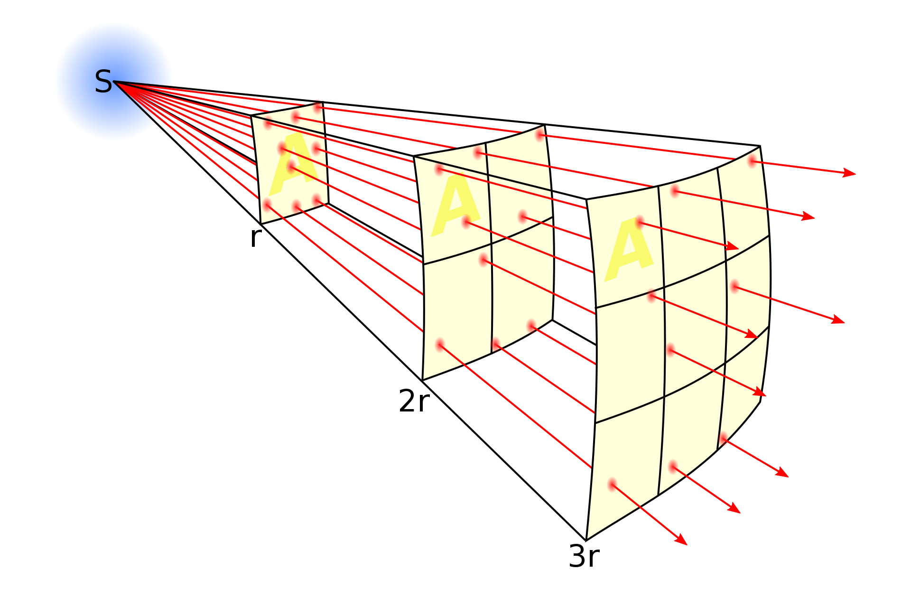
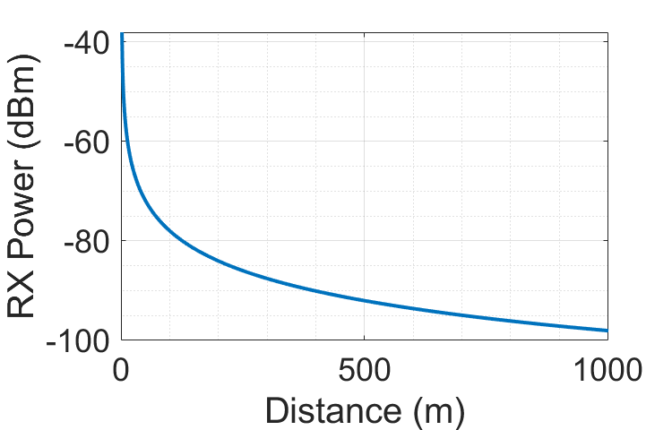

# Path Loss and Shadow Fading

This chapter introduces the distance-dependent behavior of received signals caused by path loss and shadowing effects. Path loss arises from the radiation propagation characteristics of electromagnetic signals in space and is generally considered to be directly related to propagation distance; under identical propagation conditions, the path loss incurred over an identical propagation distance remains the same. Shadowing is caused by obstacles located between the transmitter and receiver, which attenuate signal power via absorption, reflection, scattering, and diffraction—potentially even blocking the signal entirely. This chapter first introduces the most fundamental signal propagation model—the free-space path loss model; then presents the log-normal shadow fading model based on environments with numerous obstacles; finally, it introduces the signal quality estimation metric most commonly used—the signal-to-noise ratio (SNR).

## Path Loss Model

Path loss—or propagation loss—refers to the attenuation experienced by radio waves propagating through space, resulting from both radiation spreading of the transmitted power and channel propagation characteristics. It reflects the variation of the mean received signal power over macroscopic distances. As illustrated below, in free space, the intensity of electromagnetic radiation decreases with distance according to the inverse-square law, because the same energy spreads over an area proportional to the square of the distance from the source.

Figure. Propagation behavior of electromagnetic waves in space

Path loss exhibits the following characteristics:
- It results from radiation spreading of the transmitted power and channel propagation characteristics.
- For a given transmitter–receiver separation distance, path loss is assumed identical.
- It causes power variations over long distances (100 m to 1000 m).

Assume a signal propagates through free space to a receiver located at distance $d$, with no obstacles between transmitter and receiver, and travels along a straight-line path. Such a channel is termed a line-of-sight (LOS) channel, and the corresponding received signal is called an LOS signal. Free-space path loss introduces a complex factor into the received signal relative to the transmitted signal, yielding the received signal:

$$
r(t) = Re\bigg\{\frac{\lambda \sqrt{G_l}e^{-j2\pi d/\lambda}}{4\pi d}\cdot u(t)e^{j2\pi f_ct}\bigg\}
$$

Here, $\sqrt{G_l}$ denotes the product of the gains of the transmitting and receiving antennas in the LOS direction, and $e^{-j2\pi d/\lambda}$ represents the phase shift induced by the propagation distance $d$.

Let the transmitted signal $s(t)$ have power $P_t$. From the expression for the received signal $r(t)$, the ratio of received power to transmitted power is:

$$
\frac{P_r}{P_t} = \bigg(\frac{\sqrt{G_l}\lambda}{4\pi d}\bigg)^2
$$

Thus, the received power is inversely proportional to the square of the transmitter–receiver distance $d$ and directly proportional to the square of the signal wavelength $\lambda^2$. Consequently, higher carrier frequencies—and correspondingly shorter wavelengths—result in lower received power. The dependence of received power on wavelength $\lambda$ arises because the effective aperture area of the receiving antenna depends on wavelength.

The corresponding path loss can be expressed as:

$$
P_{L} \mathrm{~dB}=10 \log _{10} \frac{P_{t}}{P_{r}}=-10 \log _{10} \frac{G_{l} \lambda^{2}}{(4 \pi d)^{2}}
$$

Under free-space propagation, the received power expressed in dBm is:

$$
P_{r} \mathrm{dBm}=P_{t} \mathrm{dBm}+10 \log _{10}\left(G_{l}\right)+20 \log _{10}(\lambda)-20 \log _{10}(4 \pi)-20 \log _{10}(d)
$$

Correspondingly, the free-space path gain is:

$$
P_{G}=-P_{L}=10 \log _{10} \frac{G_{l} \lambda^{2}}{(4 \pi d)^{2}}
$$

Figure. Attenuation curve of electromagnetic wave energy versus distance in free space

> **Exercise**: Consider an indoor wireless LAN operating at carrier frequency $f_c= 900MHz$ and using omnidirectional antennas. Under the free-space path loss model, what transmit power is required so that all terminals within $10$ meters achieve a minimum received power of $10\mu W$? If the operating frequency changes to $5GHz$, what transmit power is then required?

## Shadow Fading

Shadow fading arises from obstacles situated between the transmitter and receiver, which attenuate signal power via absorption, reflection, scattering, and diffraction—potentially even blocking the signal—and cause power variations over obstacle-scale distances (10 m to 100 m outdoors; smaller indoors). In mobile communication propagation environments, electromagnetic waves encountering undulating terrain features such as hills, buildings, or trees along their propagation path form radio “shadows,” leading to slow variations in the median signal field strength and thus causing fading. This phenomenon is commonly referred to as the shadowing effect, and the resulting fading is termed shadow (or slow) fading. Additionally, gradual temporal variations in atmospheric refraction coefficients due to changing meteorological conditions cause slow temporal variations in the median received field strength at a fixed location. However, in terrestrial mobile communications, such temporal variations are typically much slower than those induced by terrain variations; therefore, engineering designs often neglect temporal variations and consider only terrain-induced variations. This type of loss originates from the shadowing effect produced when radio waves encounter obstructions such as buildings or hills along their propagation path. It reflects the loss associated with median received signal level variations over medium-scale ranges—on the order of hundreds of wavelengths—and generally follows a log-normal distribution.

Shadow fading causes random fluctuations in the signal during wireless channel propagation. Reflective surfaces and scatterers along the propagation path also vary randomly, resulting in randomness in the received signal power at any given distance. To accurately characterize the channel’s impact on the signal, we must construct a statistical model describing this random attenuation.

Factors causing random signal attenuation generally include obstacle locations, obstacle dimensions, dielectric properties of obstacle materials, and variations in reflective and scattering surfaces. In practical transmission scenarios, these factors are usually unknown; hence, only statistical models can characterize such random attenuation. The most widely used model is the log-normal shadowing model, which has been validated by empirical measurements and successfully applied to model received power variations in both outdoor and indoor wireless propagation environments.

The log-normal shadowing model assumes the ratio of transmitted to received power $\psi=P_t/P_r$ is a log-normally distributed random variable, i.e.,

$$
p(\psi)=\frac{\xi}{\sqrt{2 \pi} \sigma_{\psi_{\mathrm{dB}}} \psi} \exp \left[-\frac{\left(10 \log _{10} \psi-\mu_{\psi_{\mathrm{dB}}}\right)^{2}}{2 \sigma_{\psi_{\mathrm{dB}}}^{2}}\right], \quad \psi>0
$$

where $\xi=10 / \ln 10$ and $\mu_{\psi_{d B}}$ denote the mean and standard deviation, respectively, of $\psi_{\mathrm{dB}}=10 \log _{10} \psi$ expressed in dB, and $\sigma_{\psi_{\mathrm{dB}}}$ and $\psi_{dB}$ denote the mean and standard deviation, respectively, of $\mu_{\psi_{dB}}$ expressed in dB. The mean $\mu_{\psi_{dB}}$ may be determined either analytically or empirically. In empirical measurements, since measured path loss already averages over shadow fading, $\mu_{\psi_{dB}}$ equals the path loss. In analytical models, $\mu_{\psi_{dB}}$ must jointly account for average attenuation caused by obstacles and path loss (e.g., derived from the free-space model). Alternatively, path loss may be separated from shadow fading and treated independently. A random variable obeying a log-normal distribution is termed a log-normal random variable. If $\psi$ is log-normally distributed, then both the received power and the received SNR are also log-normally distributed, since each is simply $\psi$ multiplied by a constant coefficient. The mean and standard deviation of a log-normally distributed received SNR are expressed in dB, whereas those of a log-normally distributed received power carry power units (dBm or dBW), not dB. The true path loss $\psi$ thus has mean:

$$
\mu_{\psi}=\mathbf{E}[\psi]=\exp \left[\frac{\mu_{\psi_{\mathrm{dB}}}}{\xi}+\frac{\sigma_{\psi_{\mathrm{dB}}}^{2}}{2 \xi^{2}}\right]
$$

A log-normal distribution is fully specified by two parameters, $\mu_{\psi_{dB}}$ and $\sigma_{\psi_{dB}}$. Since $\psi=P_t/P_r$ is always greater than $1$, $\mu_{\psi_{dB}}$ is always non-negative.

When determining the mean and standard deviation of the shadow fading model from empirical data, one faces the question of whether to compute the arithmetic mean of linear-scale values or the mean of decibel-scale values. The same issue arises for variance computation. In practice, the mean and variance are typically computed from the decibel-scale measurements. Reasons include: (i) mathematical analysis of the log-normal model is naturally formulated in terms of decibel measurements; (ii) literature indicates that averaging in decibels yields smaller estimation errors; and (iii) power-vs.-distance models are generally constructed via piecewise-linear approximations of decibel-scale power measurements versus logarithmic distance.

Extensive outdoor channel measurements indicate that the standard deviation $\sigma_{\psi_{dB}}$ typically lies in the range $4dB$–$13dB$, while the mean $\mu_{\psi_{dB}}$ depends on both path loss and building characteristics of the local environment. $\mu_{\psi_{dB}}$ varies with distance—both due to distance-dependent path loss and because increased distance implies more obstacles, thereby increasing average attenuation.

When shadow fading is dominated by obstruction-induced attenuation, the Gaussian model for the decibel-mean received power can be analyzed using the following attenuation model. When a signal traverses an obstacle of width $d$, its attenuation is approximately:

$$
s(d)=e^{-\alpha d t}
$$

where $\alpha$ is an attenuation constant dependent on the obstacle’s material and dielectric properties. If the $i$-th obstacle has attenuation constant $\alpha_i$ and random width $d_i$, then the total attenuation across that region is:

$$
s\left(d_{t}\right)=e^{-\alpha \sum_{i} d_{i}}=e^{-\alpha d_{t}}
$$

If multiple obstacles exist between transmitter and receiver, the central limit theorem implies that $d_{t}=\sum_{i} d_{i}$ can be approximated as a Gaussian random variable—i.e., $\log s\left(d_{t}\right)=\alpha d_{t}$ is a Gaussian random variable with mean $\mu$ and variance $\sigma$ (where $\sigma$ is determined by the propagation environment).

## Signal-to-Noise Ratio (SNR)

From the preceding discussion, it is evident that—if the channel could be perfectly characterized—we could fully reconstruct the transmitted signal at the receiver. However, real-world communication is far less ideal: perfect channel measurement is extremely difficult (consider why), and even if achievable, the receiver still suffers interference from external noise. To quantify noise impact, a key metric is the signal-to-noise ratio (SNR or S/N), which measures the relative strength of the desired signal versus background noise, defined as the ratio of signal power to noise power:

$$
SNR = \frac{P_{signal}}{P_{noise}} = \frac{A^2_{signal}}{A^2_{noise}}
$$

Because signal strengths often span many orders of magnitude, SNR is commonly expressed in decibels (dB):

$$
SNR(dB) = 10\log_{10} \left(\frac{P_{signal}}{P_{noise}}\right) = 20\log_{10} \left(\frac{A_{signal}}{A_{noise}}\right)
$$

where $P_{signal}$ denotes signal power, $P_{noise}$ denotes noise power, $A_{signal}$ denotes signal amplitude, and $A_{noise}$ denotes noise amplitude.

Clearly, a higher SNR implies stronger signal reception and easier decoding. In experiments, performance is frequently evaluated across various SNR values, or datasets generated at specific SNRs. MATLAB provides the `awgn` function to add additive white Gaussian noise (AWGN) to a target signal at a specified SNR. Example usage:

~~~matlab
fs = 100; % sampling frequency
t = 0:1/fs:1;
x = sin(2*pi*4*t);
% Add white Gaussian noise to signal
% SNR = 10dB
y = awgn(x, 10, 'measured');
plot(t, [x, y]);
legend('Original Signal', 'Signal with AWGN');
~~~

Figure. Illustration of MATLAB’s `awgn` function effect

<!-- > Exercise: What is the mathematical expectation of `mean(abs(wgn(1e6, 1, 5, 50, 'dBm', 'complex')))`?  
> Answer: $\sqrt{\frac{\pi}{2}\cdot 10^{0.1\cdot (5-30)}\cdot 50\cdot \frac{1}{2}}$ (You may need to understand the relevant MATLAB functions and the Rayleigh distribution.) -->

> **Hands-on Exercise**: Generate acoustic signals at different SNRs and examine their differences in both time and frequency domains. Listen to them to perceive how audible quality varies with SNR.

## References

1. [Wikipedia/Fading](https://zh.wikipedia.org/wiki/Fading)  
2. [Wikipedia/Shadowing](https://zh.wikipedia.org/wiki/Shadowing)  
3. Goldsmith, Andrea. *Wireless Communications*. Cambridge University Press, 2005.