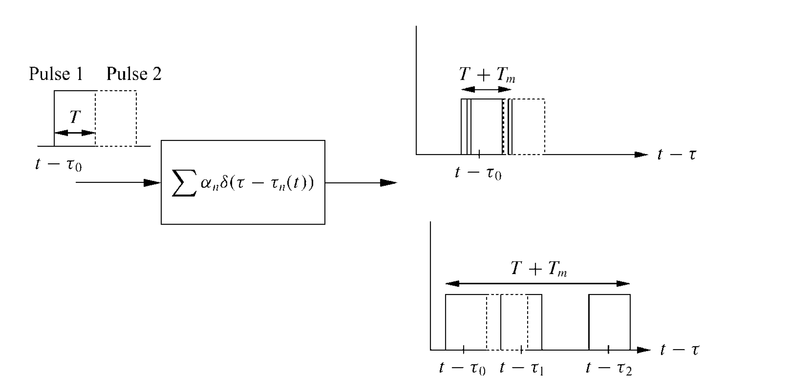
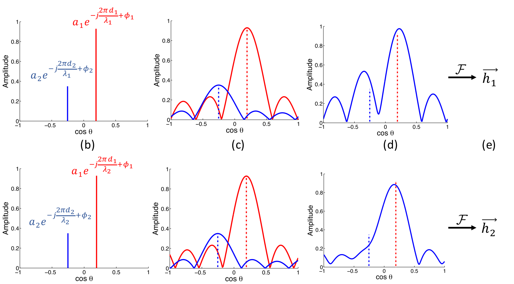

# Multipath Channel Model

## Multipath Effect

When electromagnetic waves propagate in complex communication environments, the receiver may receive multiple copies of the transmitted signal arriving via different paths. Generally, these signal copies can be categorized into two types: line-of-sight (LOS) paths and non-line-of-sight (NLOS) paths. As illustrated in the figure below, signal copies arriving via different propagation paths exhibit distinct delays and energy attenuations. If the time difference between the first-arriving and last-arriving signals—the multipath delay spread—is very small, all signal copies effectively superimpose constructively (i.e., peak aligns with peak, trough with trough), and thus the multipath superposition has negligible impact on signal decoding. However, when the multipath delay spread is large, destructive interference may occur (i.e., peaks align with troughs), causing signal distortion and rendering the received signal undecodable.

Figure. Illustration of the multipath effect

The signal fading induced by the multipath effect occurs on a timescale comparable to the signal period and on a spatial scale comparable to the signal wavelength. Since the wavelength is much smaller than typical human movement distances, multipath-induced fading is classified as *fast fading*, also known as *small-scale fading*. In contrast, shadowing and path loss constitute *slow fading*, also referred to as *large-scale fading*.

The mathematical representation of the multipath effect is introduced next. Suppose the baseband signal to be transmitted is $u(t)$. The final transmitted signal is obtained by multiplying the baseband signal with a high-frequency carrier and taking the real part of the result. This carrier multiplication process is expressed as:

$$
\begin{aligned}
s(t) &=\operatorname{\Re}\left\{u(t) \mathrm{e}^{\mathrm{j} 2 \pi f_{\mathrm{c}} t}\right\} \\
&=\Re\{(\Re\{u(t)\}-j\Im\{u(t)\}) \times (\cos( 2 \pi f_{\mathrm{c}} t)-j\sin(2\pi f_c t)\}\\
&=\operatorname{\Re}\{u(t)\} \cos \left(2 \pi f_{\mathrm{c}} t\right)+\operatorname{\Im}\{u(t)\} \sin \left(2 \pi f_{c} t\right)
\end{aligned}
$$

Multiple copies of this signal arrive at the receiver via different propagation paths and superimpose to form the received signal:

$$
r(t)=\operatorname{Re}\left\{\sum_{n=0}^{N(t)} \alpha_{n}(t) u\left(t-\tau_{n}(t)\right) \mathrm{e}^{\mathrm{j}\left(2 \pi f_{c}\left(t-\tau_{n}(t)\right)+\phi_{D_{n}}(t)\right)}\right\}
$$

From this expression, $a_n(t)$ represents the time-varying amplitude attenuation of the $l$-th path, determined by path loss and shadow fading; $\tau_n(t)$ denotes the propagation delay $\tau_n(t)=r_n(t)/c$ of the $l$-th path; and $\phi_{D_n}(t)$ denotes the Doppler phase shift of the $l$-th path. Compared to the original signal, the total phase change of the $l$-th multipath component is:

$$
\phi_n(t)=2 \pi f_{c} \tau_{n}(t)-\phi_{D_{n}}(t)
$$

Substituting $\phi_n(t)$ into $r(t)$ yields:

$$
r(t)=\operatorname{Re}\left\{\left[\sum_{n=0}^{N(t)} \alpha_{n}(t) \mathrm{e}^{-\mathrm{j} \phi_{n}(t)} u\left(t-\tau_{n}(t)\right)\right] \mathrm{e}^{\mathrm{j} 2 \pi f_{c} t}\right\}
$$

This expression can be reformulated as a convolution between the input signal and the channel impulse response:

$$
\begin{aligned}
r(t) &=\operatorname{Re}\left\{\left[\sum_{n=0}^{N(t)} \alpha_{n}(t) \mathrm{e}^{-j \phi_{n}(t)} u\left(t-\tau_{n}(t)\right)\right] \mathrm{e}^{\mathrm{j} 2 \pi f_{\mathrm{c}} t}\right\}\\
&=\operatorname{Re}\left\{\left[\sum_{n=0}^{N(t)} \alpha_{n}(t) \mathrm{e}^{-j \phi_{n}(t)}\left(\int_{-\infty}^{\infty} \delta\left(\tau-\tau_{n}(t)\right) u(t-\tau) \mathrm{d} \tau\right)\right] \mathrm{e}^{j 2 \pi f_{c} t}\right\} \\
&=\operatorname{Re}\left\{\left[\int_{-\infty}^{\infty} \sum_{n=0}^{N(t)} \alpha_{n}(t) \mathrm{e}^{-j \phi_{n}(t)} \delta\left(\tau-\tau_{n}(t)\right) u(t-\tau) \mathrm{d} \tau\right] \mathrm{e}^{\mathrm{j} 2 \pi f_{c} t}\right\} \\
&=\operatorname{Re}\left\{\left[\int_{-\infty}^{\infty} c(\tau, t) u(t-\tau) \mathrm{d} \tau\right] \mathrm{e}^{\mathrm{j} 2 \pi f_{c}(t)}\right\} 
\end{aligned}
$$

Intuitively, the convolution-form received signal implies that a transmitted signal at any arbitrary time $(t-\tau)$ may contribute to the received signal at time $t$. Which specific transmission times contribute—and how they contribute—is determined by $c(\tau,t)$: convolution with $c(\tau,t)$ identifies those signal components whose transmission–reception time difference equals the path delay, assigning each an appropriate amplitude attenuation and phase shift. $c(\tau,t)$ denotes the channel coefficient corresponding to a signal transmitted at time $t-\tau$ and received at time $t$. $c(\tau,t)$ reflects two key characteristics of time-varying channels:
1. Different communication times (i.e., different $t$) correspond to different channel states.
2. Different propagation delays (i.e., different $\tau$) correspond to different channel states.

In the simplest case, the channel response $c(\tau,t)$ remains constant over time, reducing the channel response to a function solely of multipath delay:

$$
c(\tau)=\sum_{n=0}^{N} \alpha_{n} \mathrm{e}^{-\mathrm{j} \phi_{n}} \delta\left(\tau-\tau_{n}\right)
$$

## Multipath Fading Models

Before introducing multipath fading models, we recall the definition of multipath delay spread: according to Wikipedia, it is the time difference between the longest and shortest multipath propagation paths—equivalently, the time difference between the first-arriving and last-arriving signals, as used earlier. Based on the magnitude of the multipath delay spread, multipath fading models are classified into *narrowband fading* and *wideband fading*. A schematic illustration highlighting the distinction between narrowband and wideband fading is shown below, where the top-right region depicts narrowband fading and the bottom-right region wideband fading.

Figure. Illustration of narrowband versus wideband fading

**Narrowband Fading**:

Fading caused by channels whose delay spread is much smaller than the reciprocal of the transmitted signal bandwidth (i.e., $T_m$ ≪ $\frac{1}{B}$) is termed *narrowband fading*. Intuitively, since baseband bandwidth and symbol period are closely related (typically, the symbol period is an integer multiple of the reciprocal of the baseband bandwidth), narrowband fading implies that the signal’s delay spread is much smaller than one symbol period. Under such conditions, signals arriving via different paths differ only in phase and amplitude, while their modulation content—including frequency—remains identical, i.e., $u(t-\tau_i)\approx u(t)$. For narrowband fading, the received signal is expressed as:

$$
r(t)=\operatorname{Re}\left\{u(t) \mathrm{e}^{\mathrm{j} 2 \pi f_{c} t}\left(\sum_{n=0}^{N(t)} \alpha_{n}(t) \mathrm{e}^{-j \phi_{n}(t)}\right)\right\}
$$

Here, $\alpha_n$ depends on path loss and shadowing and is modeled as a random variable; the phase $\phi_n$ is influenced by Doppler shift, propagation delay, and initial phase, and is likewise treated as a random variable. Assuming the number of multipath components $N(t)$ is sufficiently large, the central limit theorem implies that the coefficient $\sum_{n=0}^{N(t)} \alpha_{n}(t) \mathrm{e}^{-j \phi_{n}(t)}$ can be modeled as a stochastic process—provided no dominant LOS component exists; otherwise, the randomness assumption for $\alpha_n$ does not hold. As illustrated in the figure below, the net result of narrowband fading is that the time-domain superposition of multipath components follows a zero-mean Gaussian distribution—effectively indistinguishable from additive noise—under the condition that either the number of multipath components is large or the multipath coefficients $\alpha_n$ follow a Rayleigh distribution.

Figure. Illustration of narrowband fading effect

> **Reflection:**  
> A single-tone signal is the most common narrowband signal. Consider a single-frequency signal $s(t)=\Re\{e^{j(2\pi f_c t+\phi_0)}\}=cos(2\pi f_c t+\phi_0)$ propagating through a channel. Ignoring the LOS component, what is the resulting superposition of the remaining multipath components?

The multipath superposition at the receiver is expressed as: $r(t)=\Re\{[\sum_{n=0}^{N}\alpha_n(t)e^{-j\phi_n(t)}]e^{j2\pi f_c t}\}$. Applying Euler’s formula $e^{j\phi}=\cos(\phi)+j\sin(\phi)$, we obtain:

$$
\begin{aligned}
r(t)&=\Re\big\{\big[\sum_{n=0}^{N}\alpha_n(t)[\cos(\phi_n(t))-j\sin(\phi_n(t))]\big]\times\big[\cos(2\pi f_c t)+j\sin(2\pi f_c t)\big]\big\}\\
&=r_I(t)\cos(2\pi f_c t)+r_Q(t)\sin(2\pi f_c t)
\end{aligned}
$$

Here, $\Phi$ depends on $t$ and incorporates Doppler effects. In the above expression, $r_I(t)$ and $r_Q(t)$ represent the in-phase (I) and quadrature-phase (Q) components, respectively, of the multipath superposition coefficient (i.e., the combined amplitude and phase contributions of all multipath components):

$$r_I(t)=\sum_{n=1}^{N(t)}\alpha_n\times \cos(\phi_n(t))$$

$$r_Q(t)=\sum_{n=1}^{N(t)}\alpha_n\times \sin(\phi_n(t))$$

As $N \to \infty$, the central limit theorem dictates that $r_I(t)$ and $r_Q(t)$ converge to independent zero-mean Gaussian distributions. (In practice, even for moderate $N$, the same conclusion holds if $\alpha(t)$ follows a Rayleigh distribution.) Thus, the multipath superposition in the time domain follows a zero-mean Gaussian distribution—again, statistically equivalent to additive noise—provided either $N$ is sufficiently large or the multipath coefficients $\alpha$ obey a Rayleigh distribution.

**Wideband Fading**:

When the condition $T_m$ ≪ $\frac{1}{B}$ does not hold, the transmitted signal exhibits a large delay spread at the receiver. Consequently, the delayed replica of one symbol may intrude into the time interval allocated to subsequent symbols, causing inter-symbol interference (ISI). Numerous techniques exist to mitigate ISI—for example, the cyclic prefix employed in OFDM. Interested readers are encouraged to explore these methods independently.

## Multipath Measurement

This section describes how to measure multipath information—that is, the arrival times and energy attenuations of individual signal copies within a multipath channel. Due to multipath effects, multiple copies of the same signal arrive at the receiver with different delays and attenuations, superimposing into a composite waveform. Intuitively, to accurately extract the parameters of each constituent copy from the superimposed signal, one may transmit a specially designed probing signal $x(t)$ from the transmitter and compute the cross-correlation between the received multipath-combined signal $y(t)$ and a reference signal $x(t)$ at the receiver. By carefully designing $s(t)$, the correlation output $x(t)$ exhibits sharp peaks *only* when aligned precisely with individual multipath replicas. (A linear frequency-modulated chirp signal is a commonly used waveform satisfying this requirement.) Finally, extracting the correlation peaks between $x(t)$ and $y(t)$ enables separation and measurement of individual multipath components.

The above multipath measurement method is intuitive and widely adopted. Its successful operation relies on the ability to resolve distinct correlation peaks after computing the cross-correlation between the received signal $y(t)$ and the original transmitted signal $x(t)$. Ideally, if the duration of $x(t)$ were infinite, perfect alignment between $x(t)$ and any multipath replica in $y(t)$ would produce an infinitely narrow correlation peak, and peaks corresponding to distinct multipath components would be completely separable. In practice, however, $y(t)$ has finite duration, resulting in correlation peaks of finite width (as readers may verify experimentally)—a fundamental discrepancy between idealized theory and practical implementation. Consequently, correlation peaks in $y(t)$ may overlap or become indistinguishable.

To address this limitation, the SIGCOMM’16 work R2F2 proposes distinguishing multipath components by measuring their angles of arrival (AoA) at the receiver. As illustrated in the figure below, signals traversing different propagation paths typically arrive with distinct incident angles.

Figure. Illustration of multipath angles of arrival

R2F2 employs a multi-antenna receiver and exploits phase differences across antennas to estimate the AoA of each multipath component. Its key advantage lies in the fact that although the time-of-arrival differences among multipath components may be extremely small, their AoAs often differ significantly—enabling superior discrimination compared to direct time-domain correlation-based separation. Nevertheless, R2F2 faces significant implementation challenges, the most critical being how to resolve distinct AoAs with high precision using a limited number of receive antennas. To this end, R2F2 proposes an optimization-based peak-fitting algorithm that iteratively refines peak parameters to recover AoA-specific correlation peaks as accurately as possible.

Figure. Illustration of R2F2’s AoA estimation procedure

