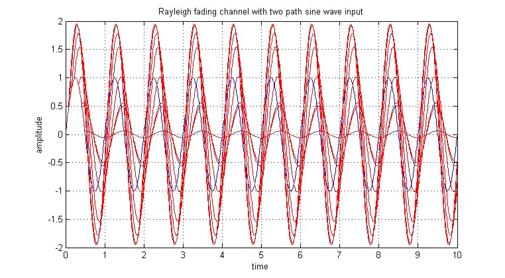

# Case: Wireless Channel Simulation and Measurement

## Channel Fading Simulation

Electromagnetic waves experience energy attenuation during propagation through space. In free space, there are no scattering, refraction, or reflection effects that cause energy loss. Therefore, the system loss expression in communication systems is given by:

$$
L_{f}=\frac{P_{t}}{P_{r}}=\left(\frac{4 \pi d}{\lambda}\right)^{2} G_{t} G_{r}
$$

where $\lambda$ is the signal wavelength, $P_t$ and $P_r$ are the transmit and receive powers; $d$ denotes the distance between transmitter and receiver, and $G_t$ and $G_r$ represent the antenna gains at the transmitter and receiver, respectively. Based on this equation, we can estimate the received signal strength and fading characteristics when the transmitted power, propagation distance, antenna gains, and signal wavelength are known.

```matlab
%-----------Parameters Setting------------
LightSpeedC=3e8;
BlueTooth=2400*1000000;%hz    
Zigbee=915.0e6;%hz    
Freq=BlueTooth;
TXAntennaGain=1;%db
RXAntennaGain=1;%db
PTx=0.001;%watt
sigma=6;%Sigma from 6 to 12 %Principles of communication systems simulation with wireless application P.548
mean=0;
PathLossExponent=2;%Line Of sight

%------------ FRIIS Equation --------------
% Friis free space propagation model:
%        Pt * Gt * Gr * (Wavelength^2)
%  Pr = --------------------------
%        (4 *pi * d)^2 * L

pr_set = [];
for Dref = 0:1:1000
    Wavelength=LightSpeedC/Freq;
    PTxdBm=10*log10(PTx*1000);
    M = Wavelength / (4 * pi * Dref);
    Pr0= PTxdBm + TXAntennaGain + RXAntennaGain - (20*log10(1/M));
    pr_set = [pr_set, Pr0];
end

figure;
fg = plot(pr_set);
set(fg,'Linewidth',2);
ylabel('RX Power (dBm)');
xlabel('Distance (m)');
grid on;
set(gca, 'XMinorGrid','on');
set(gca, 'YMinorGrid','on');

set(gcf, 'position', [600 500 500 320]);
set(gca, 'FontSize', 18, 'FontName', 'Arial', 'FontWeight', 'normal');
    
```

To consider the impact of noise on signals transmitted over the channel, we can superimpose Gaussian noise onto the received signal.

```matlab
% log normal shadowing radio propagation model:
% Pr0 = friss(d0)
% Pr(db) = Pr0(db) - 10*n*log(d/d0) + X0
% where X0 is a Gaussian random variable with zero mean and a variance in db
%        Pt * Gt * Gr * (lambda^2)   d0^passlossExp    (X0/10)
%  Pr = --------------------------*-----------------*10
%        (4 *pi * d0)^2 * L          d^passlossExp
% get power loss by adding a log-normal random variable (shadowing)
% the power loss is relative to that at reference distance d0
%  reset rand does influcence random
rstate = randn('state');
randn('state', DistanceMsr);
%GaussRandom=normrnd(0,6)%mean+randn*sigma;    %Help on randn
GaussRandom= (randn*0.1+0);
%disp(GaussRandom);
Pr=Pr0-(10*PathLossExponent* log10(DistanceMsr/Dref))+GaussRandom;
randn('state', rstate);
```

The final relationship between received signal strength and propagation distance is shown in the figure below:

<center>

</center>

<center>
<div style="color:orange; border-bottom: 1px solid #d9d9d9;
display: inline-block;
color: #999;
padding: 2px;">Fig. Free-space fading model simulation</div>
</center>

## Multipath Simulation

Wireless signals arriving at the receiving antenna via two or more paths will be superimposed at the receiver. Scattering of radio waves by the atmosphere, reflection and refraction by the ionosphere, as well as reflections from terrain features such as mountains and buildings, all contribute to multipath propagation.

When simulating multipath signals, we can calculate the energy attenuation and phase changes for each path based on their respective propagation delays:

```matlab
function sout = sim_multi_path(sig, delay, Fs)
    ts = 1 / Fs;
    
    % attenuation
    d = delay * 3e8;
    f = 470e6;
    PL = -147.56+20*log10(d*f);
    att = sqrt(10.^(-PL/10));
    att = att * 1e4;
    
    fprintf('Attenuation:');
    for a = att 
        fprintf(', %.6f', a); 
    end
    fprintf('\n');
    
    % interp
    factor = 100;
    sig = interp(sig, factor);
    its = ts / factor;
    
    % delay taps
    taps = round(delay / its);
    
    fprintf('Delay(taps of %d):',factor);
    for i = taps 
        fprintf(', %d', i); 
    end
    fprintf('\n');
    
    sout = [zeros(1, length(sig) + max(taps))];
    for i = 1:length(delay)
        sout(1:taps(i)+length(sig)) = sout(1:taps(i)+length(sig)) + att(i) * [zeros(1,taps(i)), sig*exp(1i*2*pi*rand)];
    end
    sout = sout(1:factor:end);
end
```

Below is an example calling the above multipath generation function to simulate the effects of multipath propagation:

```matlab
% generate multi-path signal
Fs = 1e6;         % sample rate   
t = 0:1/Fs:0.1;   % time
symb = exp(1i*2*pi*13e3*t);

delay = [1e3, 1.3e3, 1.5e3] / 3e8;
msymb = sim_multi_path(symb, delay, Fs);

snr = -10;
an = 1/10^(snr/20);
noise = an * randn(1, length(msymb));
msymb = msymb + noise;

figure; hold on
plot(real(symb));
plot(real(msymb));
```


<center>

</center>

<center>
<div style="color:orange; border-bottom: 1px solid #d9d9d9;
display: inline-block;
color: #999;
padding: 2px;">Fig. Simulation results of multipath superposition</div>
</center>

## Combined Fading Effects

Considering the combined effects of path loss (Path Loss), shadowing (Shadowing), and multipath fading (Narrowband Fading) on the received signal (as shown in the figure below). Path loss causes uniform and monotonic signal attenuation; shadowing leads to faster (compared to path loss) and abrupt signal drops; while fading induces rapid fluctuations (due to high frequency) and generally follows a zero-mean Gaussian distribution.
<center>

</center>

<center>
<div style="color:orange; border-bottom: 1px solid #d9d9d9;
display: inline-block;
color: #999;
padding: 2px;">Fig. Combined effects of path loss, shadowing, and narrowband fading</div>
</center>

<!-- ## Channel State Measurement
Measure H matrix based on known preamble

## Signal Recovery
Use preamble to measure channel parameters, and recover subsequent encoded signals accordingly -->