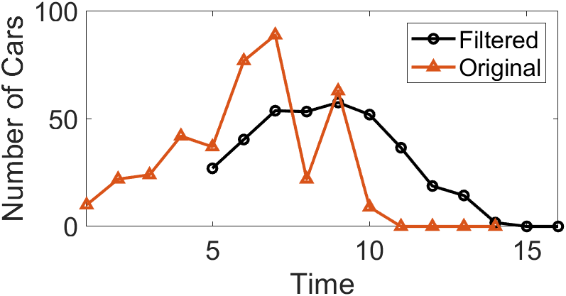

# Moving Average Filter

## Introduction
To understand filters, we use the widely adopted moving average filter as an illustrative example.  
Moving average is a common operation in data processing. In fact, it is a classic filter. Intuitively, the moving average filter is well-suited for reducing random noise—we perceive the filtered data as smoother.

Before introducing the moving average filter, let us pose two questions:  
1. Is the moving average filter a low-pass or high-pass filter, and why?  
2. Is the moving average filter a good filter, and why?  

It also preserves a sharp step response, making it the preferred filter for time-domain encoded signals. However, from a frequency-domain perspective, the moving average filter is the least suitable filter for frequency-domain encoded signals—it has almost no ability to separate one frequency band from another. Filters derived from the moving average include the Gaussian filter, Blackman filter, and cascaded moving average filters. These improved variants exhibit slightly better frequency-domain performance at the cost of increased computational time.

## Convolutional Implementation of the Moving Average

The moving average is likely familiar to most readers: an analytical method that computes the average over different subsets of data using a sliding window. It is widely applied in data analysis and financial statistics—for instance, analyzing stock prices, trading volumes, GDP, employment, or other macroeconomic time series. A key characteristic of the moving average is its ability to eliminate short-term fluctuations and highlight long-term trends or cycles. Next, we walk through a practical example to review the implementation of the moving average.

<!-- In fact, as the following discussion reveals, the moving average’s ability to suppress short-term fluctuations is fundamentally equivalent to filtering out high-frequency noise—i.e., the moving average effectively implements a low-pass filter on the input data. We next illustrate the relationship between the moving average and low-pass filtering via a concrete example. -->

<!-- - [ ] While examining the moving average filter, consider two questions: (1) Why is the moving average a filter, and how does it attenuate high frequencies? (2) How effective is the moving average filter, and are there better alternatives? (This point requires careful elaboration.) Starting from the moving average, explain filtering rigorously based on FFT and time/frequency domain concepts, and introduce typical filters along with their characteristics—meeting the needs of most users requiring filtering. -->

Consider a finite-length, nonzero input sequence. The moving average filter first defines a fixed-length sliding window. Using the data in the table below as an example, we apply a sliding window of length 5 to compute the average number of cars crossing a bridge per minute over five-minute intervals. Column 2 lists the actual number of cars crossing per minute; the moving average computation begins at the fifth entry, calculating the average of that value and the preceding four values (e.g., 27 in column 3). This average constitutes the first output of the moving average algorithm. The window then slides forward to compute the average of the next value and its preceding four values (e.g., the second output in column 3, 40.4), and so on, until all input values have participated in at least one averaging operation.

| Index | Cars Crossing in Past 1 Minute | Average Cars Crossing in Past 5 Minutes |
|-------|-------------------------------|------------------------------------------|
| 1     | 10                            | —                                        |
| 2     | 22                            | —                                        |
| 3     | 24                            | —                                        |
| 4     | 42                            | —                                        |
| 5     | 37                            | 27                                       |
| 6     | 77                            | 40.4                                     |
| 7     | 89                            | 53.8                                     |
| 8     | 22                            | 53.4                                     |
| 9     | 63                            | 57.6                                     |
| 10    | 9                             | 52                                       |

We can compute the moving average in MATLAB using the `movmean()` function:  
>`M = movmean(A,k)` returns an array composed of local means over `k`-point windows, where each mean is computed over a sliding window of length `k` containing adjacent elements of `A`. When `k` is odd, the window is centered at the current element. When `k` is even, the window is centered between the current element and its predecessor. When insufficient elements exist to fill the window, the window is automatically truncated at the endpoints, and the mean is computed only over the available elements within the truncated window. `M` has the same size as `A`.

By default, the `n`-th output of `movmean()` corresponds to a window centered at the `n`-th input element. Alternatively, the position of the `n`-th window relative to the input sequence can be explicitly specified. For example, `M = movmean(A,[kb kf])` computes the mean over a window of length `kb+kf+1`, which includes the current element, `kb` subsequent elements, and `kf` preceding elements. Below is the MATLAB code used to compute the moving average of vehicle counts:

```matlab
% Computes a moving average by sliding a window of length len_win.
din = [10 22 24 42 37 77 89 22 63 9 0 0 0 0];
len_win = 5;
dout = movmean(din,len_win);
% The kth output uses the kth input as the center of the window
dout = dout(ceil(len_win/2):end);
disp(dout);
% Display the Result of Slide Average
figure; hold on
plot(len_win + (0:length(dout)-1),dout,'-o','LineWidth',1.5,'Color','k');
plot(1:length(din),din,'-^','LineWidth',1.5);
xlim([1 len_win+length(dout)-1]);
legend('Filtered', 'Original');
set(gcf, 'Position', [800 800 550 300]);
xlabel('Time');
ylabel('Number of Cars');
set(gca, 'FontSize', 16);
box on
```

The result of computing the moving average using a sliding window is shown in the figure below. Many abrupt points originally present in the input data become significantly smoother after the moving average operation.  
<!-- **Intuitively, in a time series, abrupt points correspond to high-frequency components; thus, the moving average operation eliminates high-frequency components in the input sequence. By performing the moving average, we achieve the goal of attenuating high-frequency components while preserving low-frequency components—i.e., implementing a simple low-pass filter.** -->

<center>

</center>

<!--  -->
<center>
<div style="color:orange; border-bottom: 1px solid #d9d9d9;
display: inline-block;
color: #999;
padding: 2px;">Figure. Result of sliding-window averaging.</div>
</center>

In the above example, the first moving average output appears only at **time index 5**, after the first five input points have been received:  

$$
y_{avg}(5) = \frac{1}{5}[x(1)+x(2)+x(3)+x(4)+x(5)]
$$

For the more general case, the output $y_{avg}(n)$ at **time index n** can be expressed as:  

$$
y_{avg}(n) = \frac{1}{5}[x(n-4)+x(n-3)+x(n-2)+x(n-1)+x(n)]=\frac{1}{5}\sum_{k=n-4}^{n}x(k)
$$

From this equation, it is evident that each moving-window average computation is equivalent to summing all inputs within the window and dividing by the window length (as illustrated in the figure below).

<center>

</center>

<!--  -->
<center>
<div style="color:orange; border-bottom: 1px solid #d9d9d9;
display: inline-block;
color: #999;
padding: 2px;">Figure. Summation followed by averaging.</div>
</center>

If we apply the distributive property of multiplication and move the coefficient multiplication before summation, the moving-window average becomes a weighted sum of the input data. In this specific example, however, all input weights are identical (i.e., $\frac{1}{5}$).

<center>

</center>

<!--  -->
<center>
<div style="color:orange; border-bottom: 1px solid #d9d9d9;
display: inline-block;
color: #999;
padding: 2px;">Figure. Weighted summation.</div>
</center>

Clearly, the above moving average process is mathematically equivalent to a convolution operation whose kernel is a simple rectangular pulse: $1/5,1/5,1/5,1/5,1/5$.

## Noise Suppression and Window Selection

Judging solely from its implementation, many may question the practical effectiveness of the moving average filter, as it is exceedingly simple. Yet precisely because of its simplicity, it is often the first method attempted when encountering signal-processing problems. In practice, the moving average filter is not only highly effective for numerous applications but also optimal for certain common tasks—it reduces random white noise while preserving the sharpest possible step response.

The most critical parameter when using the moving average filter is the sliding window length—the length of the rectangular kernel used in convolution. Below is a practical MATLAB example demonstrating how varying window lengths affect the moving average performance.

```matlab
x = randn(1,500)*0.2 + [zeros(1,200), ones(1,100), zeros(1,200)];
figure;
    plot(x,'k','LineWidth',1.5);
    xlabel('Sample number');
    ylabel('Amplitude');
    set(gca, 'FontSize', 16);
    ylim([-1 2]);
    box on
    grid on
    
y1 = movmean(x,11);
figure;
    plot(y1, 'k','LineWidth',1.5);
    xlabel('Sample number');
    ylabel('Amplitude');
    set(gca, 'FontSize', 16);
    ylim([-1 2]);
    box on
    grid on
    
y1 = movmean(x,51);
figure;
    plot(y1, 'k','LineWidth',1.5);
    xlabel('Sample number');
    ylabel('Amplitude');
    set(gca, 'FontSize', 16);
    ylim([-1 2]);
    box on
    grid on
```

The original and filtered signals are shown in the figure below. Signal (a) contains a pulse buried in random noise. In (b) and (c), the smoothing effect of the moving average filter reduces the amplitude of random noise (an advantage), but simultaneously degrades edge sharpness (a disadvantage). As the sliding window length increases, random noise suppression improves, yet edge sharpness (i.e., transition speed of the step response) deteriorates. Nevertheless, among all linear filters potentially applicable, the moving average filter achieves the best random noise suppression for a given minimum acceptable edge sharpness. If noise reduction is defined as the square root of the number of points averaged, a 100-point moving average filter reduces noise amplitude by a factor of 10.

<center>

</center>

<!--  -->
<center>
<div style="color:orange; border-bottom: 1px solid #d9d9d9;
display: inline-block;
color: #999;
padding: 2px;">Figure. Effect of moving average filter with different sliding window lengths.</div>
</center>

To understand why the moving average filter is optimal for random noise suppression, imagine designing a filter constrained to a fixed edge sharpness. For example, suppose we require the step response’s rising edge to span no more than 11 samples. Under this constraint, the kernel length of any convolution-based filter (i.e., FIR filter) must not exceed 11 points. This leads to an optimization problem: how should the 11 kernel coefficients be chosen to minimize output noise? For random noise, each sample’s noise is independent; thus, assigning larger weights to any particular input sample provides no benefit. Optimal noise suppression is achieved when all input samples are treated equally—i.e., via the moving average.

## Frequency Response

Earlier, we stated that the moving average filter provides optimal random noise suppression in the time domain, yet performs poorly in frequency-domain band-separation tasks. First, we examine the frequency response of the moving average filter using a MATLAB simulation:

```matlab
%% Impulse Response of moving average filter
% Generating Impulse
din = zeros(1,1e4);
din(5e3) = 1;

% Impulse Response of moving average filter
dout = movmean(din,3);
z = fft(dout,100*length(dout));
figure; hold on
    plot(abs(z),'k','LineWidth',1.5);

dout = movmean(din,11);
z = fft(dout,100*length(dout));
    plot(abs(z),'--k','LineWidth', 1.5,'Color','#708090');
    
dout = movmean(din,31);
z = fft(dout,100*length(dout));
    plot(abs(z),'-.k','LineWidth', 1.5,'Color', '#2F4F4F');
    
xlabel('Frequency');
ylabel('Amplitude');
xlim([0 0.5*numel(z)]);
set(gca, 'FontSize', 16);
legend('3 point', '11 point', '31 point');
grid on
box on
```

The figure below shows the frequency response curves of moving average filters with different sliding window lengths. As the window length increases, the passband narrows and stopband attenuation strengthens—consistent with the time-domain observation that longer windows yield better noise suppression. Moreover, regardless of window length, the moving average filter exhibits a relatively wide transition band and poor stopband attenuation, indicating it is a poor-performing low-pass filter in the frequency domain.

<center>

</center>

<center>
<div style="color:orange; border-bottom: 1px solid #d9d9d9;
display: inline-block;
color: #999;
padding: 2px;">Figure. Frequency response of the moving average filter. Its wide transition band and poor stopband attenuation make it a suboptimal low-pass filter.</div>
</center>

Indeed, recall that convolution in the time domain equals multiplication in the frequency domain, and conversely, multiplication in the time domain equals convolution in the frequency domain. To determine the frequency response of the moving average filter, observe that it convolves the input signal with a rectangular window (e.g., $1/5,1/5,1/5,1/5,1/5$). Thus, computing the moving average’s frequency response involves first computing the Fourier transform of the rectangular window (via FFT), from which the frequency-domain effect of the moving average becomes apparent. The resulting frequency response is readily derived as:  
$$
H[f] = \frac{sin(\pi fM)}{Msin(\pi f)}
$$

> Refer to the Fourier transform section to understand how this expression is obtained.

The form of $H[f]$ matches that of the $sinc$ function, characterized by a slow roll-off in the transition band and insignificant stopband attenuation. Consequently, a pure moving average filter cannot effectively separate one frequency band from another. In summary, the moving average is an excellent smoothing filter (in the time domain) but a poor low-pass filter (in the frequency domain).

Given diverse signal characteristics and application requirements, no universal “perfect” filter exists that satisfies all applications.  
For example, the simple moving average—commonly used without recognizing its fundamental nature as a filter—works well for most time-domain signal restoration tasks, yet its frequency response is unsatisfactory (What is frequency response? You may never have considered this before, simply noticing its smoothing effect). It fails to effectively separate signals of differing frequencies. Conversely, Chebyshev filters excel at separating frequency bands in the frequency domain, but distort phase and amplitude significantly in the time domain. Therefore, digital signal processing engineers have designed numerous specialized filters to meet varied application demands. The remainder of this section introduces key filter performance metrics, characterizing filters separately in the time and frequency domains.

## Time-Domain Parameters

We typically characterize a filter’s time-domain behavior using its **step response**. The step response is the output produced when the input is a unit step signal (shown in the figure below). Since a step signal is the temporal integral of an impulse, for linear systems the step response equals the temporal integral of the impulse response. At this point, you may wonder: Why use the step response to describe time-domain filter behavior? The answer lies in how the human brain perceives and processes information: In time-domain analysis, the step response aligns naturally with how humans interpret signal content. For instance, if presented with an unknown signal and asked to analyze it, your subconscious first action is typically to partition the signal into regions sharing similar characteristics—some regions smooth, others exhibiting large-amplitude peaks or high noise levels—and then process each region accordingly. This process closely resembles the step function—the purest representation of a boundary between two distinct regions. It marks precisely when an event starts or ends, indicating that content on the left differs from content on the right. This matches how the human brain interprets time-domain information: a set of step functions partitions information into regions sharing similar features. Conversely, the step response is important because it describes how the filter affects boundaries between signal segments.

<center>

</center>

<center>
<div style="color:orange; border-bottom: 1px solid #d9d9d9;
display: inline-block;
color: #999;
padding: 2px;">Figure. Step signal.</div>
</center>

The utility of the step response for evaluating time-domain filtering performance can also be understood intuitively. In time-domain filtering, our primary objective is to restore signal fidelity—i.e., ensure the filtered signal reflects the original signal’s time-domain trend (including amplitude and phase). For example, when processing audio severely distorted by noise, we wish to suppress or eliminate isolated noise spikes while preserving consistency between neighboring samples. Conversely, if the audio content transitions abruptly—from piano music to a speech recording—we do not want the filtered output to mix or smear these two distinct segments. Hence, we desire a filter capable of detecting transitions between steady states (piano music → speech). The step signal represents the extreme case of such transitions: two steady states (amplitude = 0 or 1) switching instantaneously at a specific time. Using the step signal maximally tests a filter’s ability to preserve input signal trends. An ideal time-domain filter should eliminate anomalies in both steady states while minimizing mutual influence between them in the output.

Having established that the step response characterizes a filter’s time-domain behavior, what parameters of the step response quantify filter performance?

<center>

</center>

<center>
<div style="color:orange; border-bottom: 1px solid #d9d9d9;
display: inline-block;
color: #999;
padding: 2px;">Figure. Time-domain performance evaluation parameters for filters. The step response measures time-domain performance. Three parameters are critical: (1) Transition speed, as shown in (a) and (b); (2) Overshoot, as shown in (c) and (d); (3) Linear phase (determining symmetry between upper and lower halves of the step response), as shown in (e) and (f).</div>
</center>

1. **Transition speed**: Defined as the number of samples required for the step response’s output amplitude to rise from 10% to 90% of its final value. To accurately distinguish adjacent steady-state signals, the transition segment should be as short as possible—i.e., transition speed should be maximized. Figures (a) and (b) show step responses with different transition speeds; clearly, (a) better distinguishes the two signal states. The ideal filter has zero transition speed—i.e., instantaneous steady-state switching—but this is unattainable in practice due to noise, finite sampling rates, and aliasing avoidance.

2. **Overshoot**: Refers to amplitude fluctuations in the filtered signal—a fundamental distortion of time-domain information. Figures (c) and (d) illustrate overshoot in step responses. An ideal time-domain filter minimizes overshoot, as it alters sampled amplitudes.

3. **Linear phase**: Ideally, the upper half of the step response should be symmetric to the lower half, as shown in (f). Such symmetry ensures rising and falling edges appear identical. This symmetry is termed *linear phase*, because when the step response is symmetric about its midpoint, the frequency response’s phase is a straight line.

## Frequency-Domain Parameters

From a frequency-domain perspective, a filter permits certain frequencies to pass undistorted while completely blocking others. For an ideal digital filter, the **passband** is the frequency range where the frequency response equals 1—signals within this band pass undistorted. The **stopband** is the frequency range where the frequency response equals 0—signals here are fully blocked. Practical filters rarely achieve perfect stopband rejection. Analog filter design traditionally defines the cutoff frequency as the frequency where amplitude drops to 0.707 (i.e., −3 dB); digital filter specifications sometimes define cutoff as the frequency where amplitude is attenuated by 99%, 90%, 70.7%, or 50%. Additionally, real filters feature a **transition band** between passband and stopband frequencies, where attenuation lies between passband and stopband levels. Based on the frequency ranges they permit, filters are classified as low-pass, high-pass, band-pass, or band-stop, as shown below.

<center>

</center>

<center>
<div style="color:orange; border-bottom: 1px solid #d9d9d9;
display: inline-block;
color: #999;
padding: 2px;">Figure. Four frequency-domain filter types: (a) Low-pass filter; (b) Band-pass filter; (c) High-pass filter; (d) Band-stop filter.</div>
</center>

The frequency-domain magnitude characteristics of these four filter types are:  
- **Low-pass filter**: Permits low-frequency or DC components while suppressing high-frequency components, interference, and noise.  
- **High-pass filter**: Permits high-frequency components while suppressing low-frequency or DC components.  
- **Band-pass filter**: Permits signals within a specific frequency band while suppressing signals outside that band, including interference and noise.  
- **Band-stop filter**: Suppresses signals within a specific frequency band while permitting signals outside that band.

All four filter types share the capability to separate signal components of differing frequencies in the frequency domain. When designing or selecting a filter, three critical parameters must be considered:

1. **Roll-off rate**: To separate closely spaced frequencies, the filter must exhibit rapid roll-off, as shown in Figure (b).  

2. **Passband ripple**: To ensure passband frequencies pass unchanged, passband ripple must be minimized, as shown in Figure (d).  

3. **Stopband attenuation**: To adequately block stopband frequencies, strong stopband attenuation is required, as shown in Figure (f).  

<center>

</center>

<center>
<div style="color:orange; border-bottom: 1px solid #d9d9d9;
display: inline-block;
color: #999;
padding: 2px;">Figure. Parameters for evaluating frequency-domain performance. Shown frequency responses are for low-pass filters. Three critical parameters: (a) and (b) transition bandwidth; (c) and (d) passband ripple; (e) and (f) stopband attenuation.</div>
</center>

## Filter Classification

The table below summarizes classification of digital filters by application and implementation. Digital filters fall into three categories by application: time-domain, frequency-domain, and custom. As previously noted, time-domain filters are used when information is encoded in signal waveforms. Time-domain filtering enables operations such as smoothing, DC removal, and waveform shaping. Conversely, frequency-domain filters are appropriate when information resides in the frequency characteristics of sinusoids. Their objective is to separate one frequency band from another. Custom filters are employed when special actions are required—e.g., extracting specific pattern signals or matched filtering. From a frequency-domain perspective, custom filters are far more complex than the four basic responses (high-pass, low-pass, band-pass, and band-stop).

<center>

</center>

<center>
<div style="color:orange; border-bottom: 1px solid #d9d9d9;
display: inline-block;
color: #999;
padding: 2px;">Figure. Filter classification.</div>
</center>

Digital filters can be implemented via convolution or recursion. Convolution-based filters possess finite-length kernels, yielding finite-duration impulse responses—i.e., the current output depends only on a finite number of past inputs, and the response to an impulse eventually decays to zero. Such filters are termed Finite Impulse Response (FIR) filters. Recursively implemented filters compute the current output not only from the previous *N* inputs but also from prior outputs (via feedback paths), yielding infinite-duration impulse responses. These are termed Infinite Impulse Response (IIR) filters.