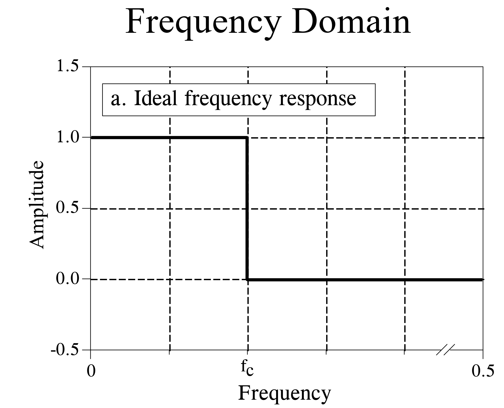
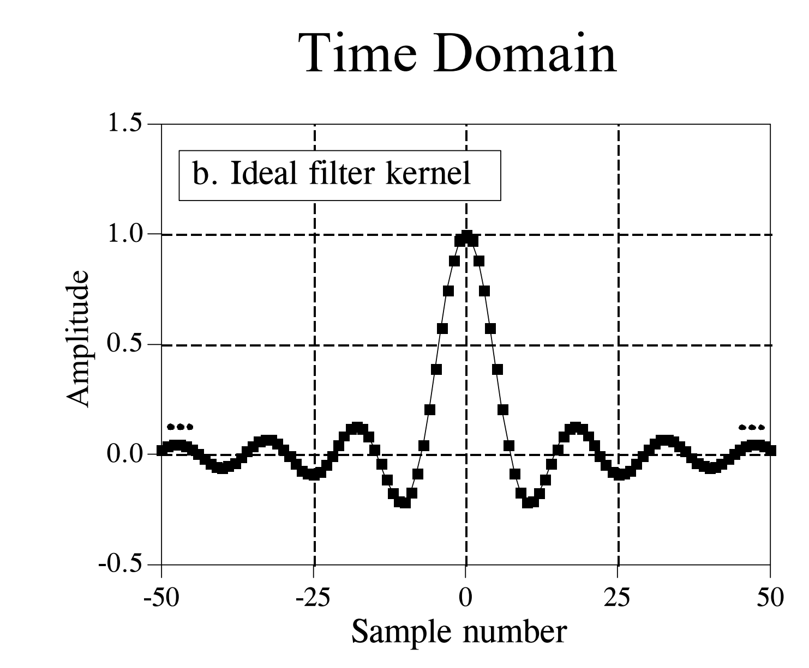
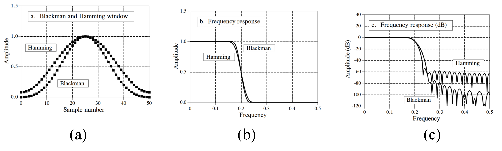
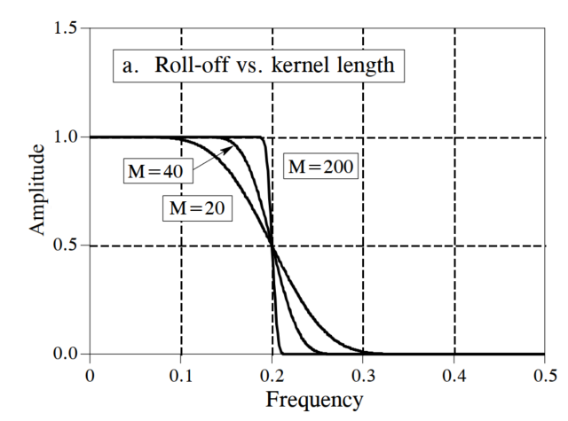

# FIR Digital Filters

## Introduction

Finite Impulse Response (FIR) filters are a class of digital filters, commonly abbreviated as FIR digital filters. Such filters exhibit a response to an impulse input that ultimately decays to zero—i.e., their impulse response is of finite duration—hence the name. FIR filters are implemented via convolution. As introduced earlier, the moving average filter is a special case of an FIR filter whose convolution kernel is the simplest rectangular pulse. In the previous section, we discussed that the primary purpose of the moving average filter is to recover time-domain signal waveforms; however, due to its poor frequency-domain response characteristics, the moving average filter cannot achieve precise frequency-domain signal separation. This section introduces the principles and design methods of FIR filters, and explains how to design appropriate FIR convolution kernels to separate and reconstruct signals in different frequency bands.

## FIR Filter Design Strategy

Since FIR filters are implemented via convolution, the core of filter design lies in constructing an appropriate convolution kernel (filter kernel) according to application requirements. For time-domain filtering, a rectangular-pulse kernel (i.e., moving average) can effectively recover time-domain signal waveforms and often satisfies basic time-domain filtering requirements. However, for frequency-domain filtering, a simple rectangular kernel is clearly insufficient: its frequency-domain response fails to meet the requirements for band separation. Therefore, the objective of this section is to explore how to design FIR convolution kernels capable of fulfilling frequency-domain filtering requirements.

Suppose we wish to design a low-pass filter to isolate the low-frequency components of a signal. The figure below illustrates the frequency-domain response of an ideal low-pass filter: signals below the passband cutoff frequency pass through undistorted, while signals above the cutoff frequency are completely suppressed—the transition band width is zero.

Figure. Ideal low-pass filter.

At this point, many readers may wonder: why must frequency-domain filtering be performed via convolution? Would it not be more direct to transform the signal into the frequency domain and simply zero out the frequency components in the stopband? Indeed, in applications where processing latency is not critical, such an approach may be feasible. In practice, however, acquired signals are always in the time domain. To apply frequency-domain filtering, one must first transform the signal into the frequency domain using the Fourier transform, adjust the energy at various frequencies, and then reconstruct the modified signal back into the time domain via the inverse Fourier transform. Achieving the desired filtering effect in this manner implicitly requires an infinitely long convolution kernel—an impossibility in practice. Moreover, repeated transformations between time and frequency domains introduce significant computational overhead, making real-time processing infeasible for continuously arriving signals. Since multiplication in the frequency domain is equivalent to convolution in the time domain, the standard practice in implementing FIR filters is to design a time-domain convolution kernel (filter impulse response) and directly filter the time-domain signal via convolution. Below, we describe how to design such time-domain convolution kernels.

The inverse Fourier transform (IFFT) of an ideal filter’s frequency response yields the ideal filter kernel (i.e., its time-domain impulse response). As shown in the figure below, the time-domain impulse response of an ideal low-pass filter is a $sinc$ function, typically expressed as $sin(x)/x$, with the explicit form:

$$
h[i] = \frac{sin(2\pi f_c i)}{i\pi}
$$

Convolution of this kernel with an input signal yields an ideal low-pass filter. However, the $sinc$ function extends from negative infinity to positive infinity—it is infinitely long. Although mathematically well-defined, such an infinite-length kernel poses a fundamental obstacle for digital computers, which inherently process only finite-length sequences.

Figure. Time-domain impulse response of an ideal low-pass filter.

To resolve this issue, we modify the $sinc$ function shown above in two ways: First, since computers can only handle a finite number of samples, we truncate the ideal low-pass filter kernel to $M$ points, selecting symmetrically about the main lobe during truncation, where $M$ is even. This truncation is equivalent to setting all kernel coefficients outside these $M$ points to zero. We then shift the entire sequence rightward to represent the filter kernel, so that its support spans from $0$ to $M$. The resulting truncated kernel is illustrated below:

Figure. Truncated sinc function used as a low-pass filter kernel.

Low-pass filtering is achieved by convolving this kernel with the input signal. How does this truncated kernel perform? The figure below shows its frequency-domain response. Due to time-domain truncation, the response deviates significantly from the ideal low-pass response: (1) passband amplitude exhibits pronounced ripples and severe distortion; (2) stopband suppression degrades, causing spectral leakage; and (3) the transition band widens substantially.

Figure. Frequency-domain response of the truncated sinc-based low-pass filter kernel.

This example demonstrates that desirable properties of ideal filters—such as distortionless passband transmission, complete stopband attenuation, and zero-width transition bands—are theoretically appealing but practically unattainable. Real-world implementations inevitably approximate ideal behavior, and our goal is to maximize this approximation using practical techniques. Beyond simple sinc truncation, alternative kernel design methods exist. Next, we introduce several kernel optimization techniques that enable FIR filters to closely approximate ideal performance.

Window functions effectively improve the practical filtering performance of FIR filters. Figure (a) below shows the Blackman window function. Multiplying the truncated filter kernel by a window function yields a new kernel, as shown in Figure (b).

Figure. Windowed filter kernel.

The purpose of windowing is to smooth the abrupt discontinuities at the edges of the truncated kernel, thereby improving the frequency-domain response. The figure below illustrates the improvement windowing brings to the filter’s frequency response: the passband becomes flat, and stopband attenuation improves markedly.

Figure. Frequency-domain response of the windowed filter.

In fact, researchers have developed numerous window functions to optimize FIR filter performance, most named after their developers in the early 1950s. Different windows possess distinct trade-offs: some minimize passband ripple but widen the transition band; others yield extremely narrow transition bands but provide poor stopband attenuation. Among all window functions, two are most commonly used in signal processing: the Hamming window and the Blackman window, whose mathematical expressions are:

$$
w[i] = 0.54 - 0.46cos(2\pi i/M)
$$

and

$$
w[i] = 0.42 - 0.5cos(2\pi i/M) + 0.08cos(4\pi i/M)
$$

respectively. The figure below shows the shapes of these two windows when $M=50$. In practice, choosing between them involves balancing competing parameters. As illustrated, the Hamming window achieves a 20% faster roll-off (i.e., narrower transition band) than the Blackman window. However, the Blackman window provides superior stopband attenuation: specifically, −74 dB versus −53 dB for the Hamming window. Though less apparent in the figure, the Blackman window’s passband ripple is only 0.02%, whereas the Hamming window’s is typically 0.2%. In many cases, the Blackman window is the preferred choice because slow roll-off is easier to manage than poor stopband attenuation. Ultimately, selection must be guided by specific application requirements and empirical validation.

Figure. Comparison of window function effects.

Beyond window selection, the length of the filter kernel (i.e., the value of $M$) also critically affects filter performance. The figure below illustrates how kernel length influences frequency-domain filtering. Longer kernels—i.e., those incorporating more sampled points—yield narrower transition bands but incur higher computational cost. Thus, selecting an appropriate kernel length is an essential engineering trade-off. Empirically, kernel length is often set to $M=F_s\times 4/BW$, where $F_s$ is the sampling frequency and $BW$ is the signal bandwidth. As emphasized repeatedly, practitioners must analyze each case individually and experiment extensively. Poor experimental results in research are often attributable not to flawed methodology, but to suboptimal data processing details—so meticulous attention to such details is imperative.

Figure. Effect of filter kernel length on filter performance.

Similar to low-pass filters, high-pass, band-pass, and band-stop filter kernels can be derived using identical design principles. By selecting appropriate window functions and kernel lengths, their performance can be optimized to fulfill customized filtering requirements.