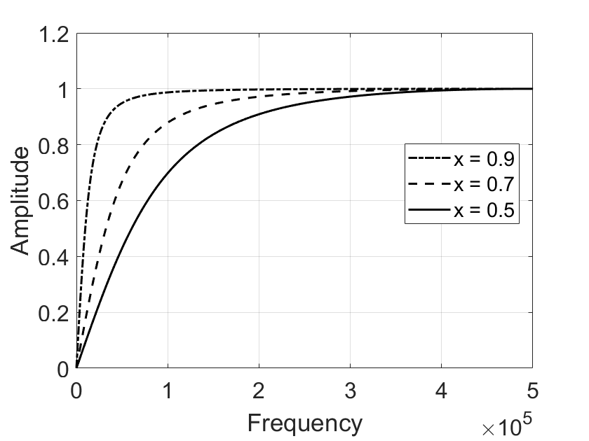
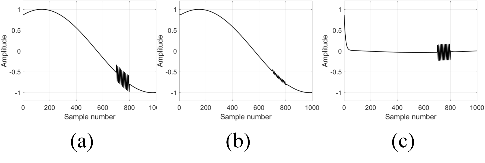

# IIR Digital Filters

## Introduction

In the previous section, we introduced FIR filters based on convolution. In fact, by designing an appropriate filter kernel, we can meet arbitrarily high filtering requirements. Achieving good filtering performance typically requires a longer filter kernel, which increases computational cost. In scenarios with limited computing resources, convolution-based filters may fail to meet application demands. To address this issue, researchers have found that recursive filters can achieve long impulse responses without performing long convolutions. Recursive implementation allows the impulse response to be infinitely long; hence, such filters are known as Infinite Impulse Response (IIR) filters. Recursive filters execute very quickly but offer less flexibility compared to convolution-based digital filters. This section introduces how IIR filters work and how to design simple IIR filters.

## Recursive Filter Design

In FIR filters, the output at each time step depends on a finite number of past inputs. Specifically, the output at time $n$ is obtained by convolving the input signal from time $n$ up to $M$ previous samples with the filter kernel:

$$
y[n] = a_0x[n] + a_1x[n-1] + a_2[n-2] + a_3x[n-3] + \cdots
$$

However, in practice, when computing the current output, we can use not only past input values but also previously computed output values, i.e., $y[n-1], y[n-2], \cdots$. Using this additional information, the algorithm takes the following form:

$$
\begin{aligned}
    y[n] = a_0x[n] &+ a_1x[n-1] + a_2[n-2] + a_3x[n-3] + \cdots\\
    &+b_1y[n-1] + b_2y[n-2] + b_3y[n-3] + \cdots
\end{aligned}
$$

In other words, each point in the output signal is computed by multiplying input values by coefficients "a", multiplying previously calculated output values by coefficients "b", and summing the products. The above equation is called a recursive equation, and filters using such equations are called recursive filters. The values "a" and "b" are referred to as the recursive coefficients of the filter. In practical implementations, usually no more than a dozen recursive coefficients are used, as exceeding this number may cause instability (e.g., unbounded growth or oscillation in the output). Recursive filters are valuable in engineering practice because they avoid lengthy convolutions. When considering the passage of an impulse function through a recursive filter—i.e., analyzing its impulse response—the output typically exhibits exponentially decaying sinusoidal oscillations. Since this impulse response is infinitely long, recursive filters are commonly called Infinite Impulse Response (IIR) filters.

The following code illustrates the implementation of a first-order IIR low-pass filter, where the current output $y[n]$ is computed using a single past output value $y[n-1]$.

```matlab
%% Impulse Response of single pole filter
% Generating Impulse
din = zeros(1,1e4);
din(5e3) = 1;

% IIR -- low pass
% Impulse Response 
x = 0.9;
dout = din;
for i = 2:numel(din)
    a0 = 1-x;
    b1 = x;
    dout(i) = a0 * din(i) + b1 * dout(i-1);
end
figure; hold on;
z = fft(dout,100*length(dout));
    plot(abs(z),'-.k','LineWidth',1.5);
    
x = 0.7;
dout = din;
for i = 2:numel(din)
    a0 = 1-x;
    b1 = x;
    dout(i) = a0 * din(i) + b1 * dout(i-1);
end
z = fft(dout,100*length(dout));
    plot(abs(z),'--k','LineWidth',1.5);
    
x = 0.5;
dout = din;
for i = 2:numel(din)
    a0 = 1-x;
    b1 = x;
    dout(i) = a0 * din(i) + b1 * dout(i-1);
end
z = fft(dout,100*length(dout));
    plot(abs(z),'k','LineWidth',1.5);

xlabel('Frequency');
ylabel('Amplitude');
xlim([0 0.5*numel(z)]);
ylim([0 1.2]);
set(gca, 'FontSize', 16);
legend('x = 0.9', 'x = 0.7', 'x = 0.5');
grid on;
box on;
```

The figure below shows the frequency-domain impulse response of a first-order low-pass IIR filter under different parameter settings. Due to the low filter order, the passband attenuation, stopband suppression, and transition bandwidth of the first-order IIR filter differ significantly from those of an ideal low-pass filter. Additionally, different parameters result in noticeable differences in passband width and stopband suppression.

<center>

</center>

<center>
<div style="color:orange; border-bottom: 1px solid #d9d9d9;
display: inline-block;
color: #999;
padding: 2px;">Fig. First-order low-pass IIR filter.</div>
</center>

The following MATLAB code demonstrates the implementation of a first-order high-pass IIR filter.

```matlab
%% Impulse Response of single pole filter
% Generating Impulse
close all;
din = zeros(1,1e4);
din(5e3) = 1;

% IIR -- high pass
% Impulse Response 
x = 0.9;
dout = din;
for i = 2:numel(din)
    a0 = (1+x)/2;
    a1 = -(1+x)/2;
    b1 = x;
    dout(i) = a0 * din(i) + a1 * din(i-1) + b1 * dout(i-1);
end
figure; hold on
z = fft(dout,100*length(dout));
    plot(abs(z),'-.k','LineWidth',1.5);
    
x = 0.7;
dout = din;
for i = 2:numel(din)
    a0 = (1+x)/2;
    a1 = -(1+x)/2;
    b1 = x;
    dout(i) = a0 * din(i) + a1 * din(i-1) + b1 * dout(i-1);
end
z = fft(dout,100*length(dout));
    plot(abs(z),'--k','LineWidth',1.5);
    
x = 0.5;
dout = din;
for i = 2:numel(din)
    a0 = (1+x)/2;
    a1 = -(1+x)/2;
    b1 = x;
    dout(i) = a0 * din(i) + a1 * din(i-1) + b1 * dout(i-1);
end
z = fft(dout,100*length(dout));
    plot(abs(z),'k','LineWidth',1.5);

xlabel('Frequency');
ylabel('Amplitude');
xlim([0 0.5*numel(z)]);
ylim([0 1.2]);
set(gca, 'FontSize', 16);
legend('x = 0.9', 'x = 0.7', 'x = 0.5');
grid on
box on
```

The figure below shows the frequency response of a first-order high-pass IIR filter under different parameter settings. Typically, the parameter $x$ must not exceed 1, otherwise the filter output may become unstable or divergent.

<center>

</center>

<center>
<div style="color:orange; border-bottom: 1px solid #d9d9d9;
display: inline-block;
color: #999;
padding: 2px;">Fig. First-order high-pass IIR filter.</div>
</center>

We now apply the first-order IIR filters implemented above to separate high-frequency and low-frequency components in a signal:

```matlab
%% Time domain filter performance
close all;
t = 0:1/1e3:1;
x = sin(pi/3 + 2*pi*0.6*t);
idx = 0.7:1/1e3:0.8;
x(round(idx * 1e3)) = 0.2*sin(2*pi*100*idx) + x(round(idx * 1e3));
figure;
plot(x,'k','LineWidth',1.5);
    
xlabel('Sample number');
ylabel('Amplitude');
xlim([0 numel(x)]);
ylim([-1.2 1.2]);
set(gca, 'FontSize', 16);
grid on
box on

din = x;
x = 0.9;
dout = din;
for i = 2:numel(din)
    a0 = 1-x;
    b1 = x;
    dout(i) = a0 * din(i) + b1 * dout(i-1);
end
figure; 
% z = fft(dout,100*length(dout));
    plot(dout,'k','LineWidth',1.5);
xlabel('Sample number');
ylabel('Amplitude');
xlim([0 numel(din)]);
ylim([-1.2 1.2]);
set(gca, 'FontSize', 16);
grid on
box on

x = 0.9;
dout = din;
for i = 2:numel(din)
    a0 = (1+x)/2;
    a1 = -(1+x)/2;
    b1 = x;
    dout(i) = a0 * din(i) + a1 * din(i-1) + b1 * dout(i-1);
end
figure; 
% z = fft(dout,100*length(dout));
    plot(dout,'k','LineWidth',1.5);
xlabel('Sample number');
ylabel('Amplitude');
xlim([0 numel(din)]);
ylim([-1.2 1.2]);
set(gca, 'FontSize', 16);
grid on
box on
```

From the time-domain perspective, the performance of the implemented low-pass and high-pass IIR filters is shown in the figures below. Figure (a) shows the original mixed signal containing both low-frequency and high-frequency components; Figure (b) shows the result after passing through a first-order low-pass IIR filter; Figure (c) shows the result after passing through a first-order high-pass IIR filter. It can be observed that first-order IIR filters can partially separate signals of different frequencies, but their performance still falls significantly short of ideal frequency-domain filters. In the next section, we will introduce more sophisticated IIR filter designs. By employing higher-order filters and appropriately designed parameters, superior frequency-domain filtering performance can be achieved.

<center>

</center>

<center>
<div style="color:orange; border-bottom: 1px solid #d9d9d9;
display: inline-block;
color: #999;
padding: 2px;">Fig. Time-domain filtering performance of first-order IIR filters.</div>
</center>