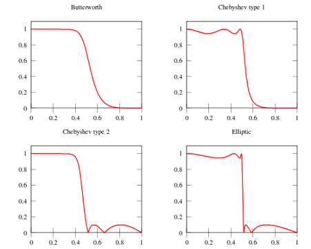
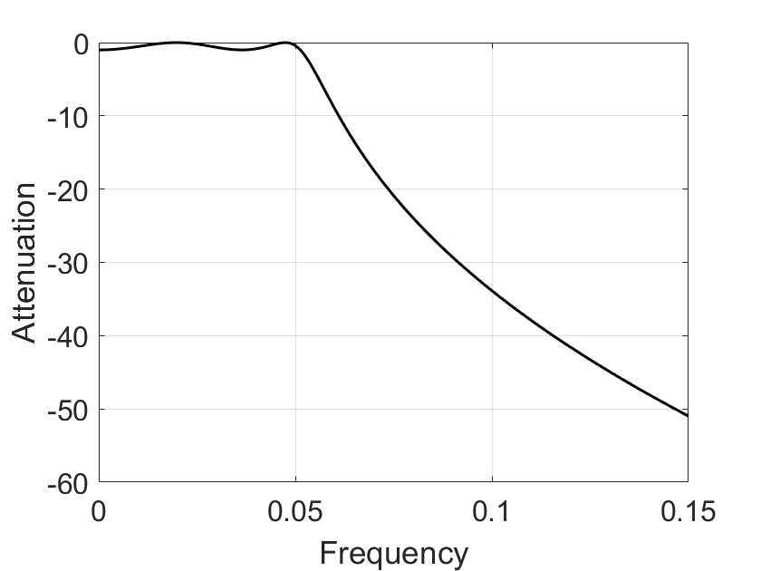

# Advanced Filter Design

## Introduction

This section introduces the usage of advanced IIR filters, using the Chebyshev filter as an example. Chebyshev filters are employed to separate one frequency band from another. As IIR filters, their primary advantage lies in low computational overhead; for most applications, their frequency-domain response is already sufficient. Chebyshev filters typically operate an order of magnitude faster than FIR filters of equivalent performance based on convolution, because they are implemented recursively rather than via convolution. Advanced IIR filter design is grounded in the z-transform. This chapter presents fundamental usage methods for advanced IIR filters such as Chebyshev filters, without delving into their underlying mathematical theory.

## Frequency-Domain Response of Filters

The Chebyshev response is a mathematical strategy that achieves steeper transition-band attenuation by permitting ripples in the frequency response. These strategies were first developed by the Russian mathematician Pafnuty Chebyshev in his work on Chebyshev polynomials. Filters implementing this mathematical strategy are therefore named Chebyshev filters. The figure below illustrates the frequency-domain response of a low-pass Chebyshev filter: when the allowable ripple ratios are set to 0%, 0.5%, and 20%, respectively, the Chebyshev filter exhibits different transition-band attenuation rates. A larger allowable ripple ratio yields a faster transition-band attenuation rate; thus, a trade-off must be made between passband ripple ratio and transition-band attenuation rate when using Chebyshev filters.

<center>

</center>

<center>
<div style="color:orange; border-bottom: 1px solid #d9d9d9;
display: inline-block;
color: #999;
padding: 2px;">Figure. Frequency-domain response of a Type-I Chebyshev filter.</div>
</center>

In practice, when the ripple ratio is set to 0%, the filter degenerates into a Butterworth filter. The above-described Chebyshev filter permits ripples only in the passband, while the stopband remains completely flat. However, if ripples are also allowed in the stopband, the transition band can attenuate even more rapidly. The former is conventionally termed a Type-I Chebyshev filter, whereas the latter is termed a Type-II Chebyshev filter. Another class of IIR filters—elliptic filters—also permits ripples in the stopband; elliptic filters provide the fastest transition-band attenuation for a given filter order, but are significantly more difficult to design.

As indicated above, different filter models and parameters affect filtering performance. Below are several key frequency-domain response parameters commonly considered during filter design and selection:

- **Center Frequency**: The center frequency $f_c$ of the filter’s passband, generally defined as $f_c = \sqrt{f_1 f_2}$, where $f_1$ and $f_2$ denote the left and right frequency points at which the insertion loss drops by $3\,\text{dB}$ or $6\,\text{dB}$. For narrowband filters, the center frequency is often taken as the frequency point of minimum insertion loss to compute the passband bandwidth.
- **Cutoff Frequency**: The rightmost frequency point of the passband for low-pass filters, or the leftmost frequency point of the passband for high-pass filters. It is conventionally defined at the $3\,\text{dB}$ or $6\,\text{dB}$ relative loss point. The reference baseline for relative loss is: DC insertion loss for low-pass filters, and insertion loss at a sufficiently high passband frequency (free of spurious stopbands) for high-pass filters.
- **Passband Bandwidth**: The spectral width required to be passed, denoted as $BW = f_2 - f_1$. Here, $f_1$ and $f_2$ are referenced to the insertion loss at the center frequency $f_c$.
- **Insertion Loss**: The attenuation introduced to the original signal in the circuit due to the insertion of the filter, characterized by the loss at either the center or cutoff frequency. If full-band insertion loss is required, it must be explicitly specified.
- **Ripple**: The peak deviation of insertion loss from its mean value curve within the $1\,\text{dB}$ or $3\,\text{dB}$ bandwidth (i.e., cutoff bandwidth).
- **Passband Ripple**: The variation in insertion loss across the passband. Within the $1\,\text{dB}$ bandwidth, the passband ripple equals $1\,\text{dB}$.
- **Passband Voltage Standing-Wave Ratio (VSWR)**: A critical metric quantifying how well signals are matched for transmission within the filter’s passband. Ideal matching corresponds to $\text{VSWR} = 1:1$; mismatch results in $\text{VSWR} > 1:1$. For a practical filter, the bandwidth satisfying $\text{VSWR} < 1.5:1$ is generally narrower than the passband bandwidth; its ratio to the passband bandwidth depends on the filter order and insertion loss.
- **Return Loss**: The ratio, expressed in decibels (dB), of input power to reflected power at a port, equaling $-20 \log_{10} |\Gamma|$, where $\Gamma$ denotes the voltage reflection coefficient. Return loss approaches infinity when all incident power is absorbed by the port.
- **Stopband Attenuation**: A key metric evaluating filter selectivity. Higher values indicate better suppression of out-of-band interference. Two common specifications exist: (1) required attenuation (in dB) at a specified out-of-band frequency $f_s$, computed as the attenuation at $f_s$; (2) the rectangularity factor—a metric characterizing how closely the filter’s amplitude-frequency response approximates an ideal rectangle. Higher filter orders yield greater rectangularity (i.e., $K$ closer to the ideal value of 1), albeit with increased design complexity.
- **Delay ($T_d$)**: The time required for a signal to traverse the filter, numerically equal to the derivative of the transmission phase function with respect to angular frequency: $T_d = -\frac{d\phi(\omega)}{d\omega}$.
- **Passband Phase Linearity**: A metric quantifying phase distortion introduced to signals transmitted within the passband. Filters designed according to linear-phase response functions exhibit excellent passband phase linearity.

<center>

</center>

<center>
<div style="color:orange; border-bottom: 1px solid #d9d9d9;
display: inline-block;
color: #999;
padding: 2px;">Figure. Parameters of filter frequency-domain response.</div>
</center>

For classical IIR filters—including Butterworth, Chebyshev, elliptic, and Bessel filters—each possesses distinct characteristics. For instance, the Butterworth filter exhibits an extremely flat response in the passband, whereas the elliptic filter aims to minimize transition-band width as much as possible. The figure below compares the frequency-domain response characteristics of several common filters.

<center>

</center>

<center>
<div style="color:orange; border-bottom: 1px solid #d9d9d9;
display: inline-block;
color: #999;
padding: 2px;">Figure. Frequency-domain responses of several common filters: Butterworth (top-left), Type-I Chebyshev (top-right), Type-II Chebyshev (bottom-left), elliptic (bottom-right).</div>
</center>

**Butterworth Filter**

- Characteristics: Maximally flat frequency response in the passband (no ripples), gradually decreasing to zero in the stopband.

A first-order Butterworth filter attenuates at $6\,\text{dB}$ per octave ($20\,\text{dB}$ per decade); a second-order filter attenuates at $12\,\text{dB}$ per octave; a third-order filter at $18\,\text{dB}$ per octave, and so on. The amplitude response of a Butterworth filter monotonically decreases with angular frequency and is the only filter whose amplitude-versus-angular-frequency curve retains identical shape regardless of order. For a Butterworth filter, increasing the order accelerates attenuation in the stopband while preserving the shape of the amplitude-versus-angular-frequency curve.

**Chebyshev Filter**

- Characteristics: Minimizes the error between the actual and ideal filter frequency response, but introduces amplitude ripples in the passband. Compared to the Butterworth filter, the Chebyshev filter exhibits faster transition-band attenuation but less flat amplitude-frequency characteristics.

Chebyshev filters exhibit equiripple behavior in either the passband or stopband. When the amplitude response is equiripple in the passband and monotonic in the stopband, it is called a Type-I Chebyshev filter; when the amplitude response is monotonic in the passband and equiripple in the stopband, it is called a Type-II Chebyshev filter. The choice between Type-I and Type-II depends on the specific application.

**Elliptic Filter**

- Characteristics: Equiripple in the passband (and either flat or equiripple in the stopband), achieving the fastest stopband attenuation.

**Bessel Filter**

- Characteristics: Equiripple in the passband, slow stopband attenuation—i.e., poorest amplitude-frequency selectivity. However, the Bessel filter provides optimal linear-phase characteristics.

The Bessel filter is a linear filter that maximizes group-delay flatness (i.e., linear phase response). Bessel filters are commonly used in audio crossover systems. Analog Bessel filters exhibit nearly constant group delay across the entire passband, thereby preserving the waveform of filtered signals. Bessel filters feature the flattest amplitude and phase responses. The phase response in the passband (typically the user’s region of interest) is nearly linear. Bessel filters can mitigate the inherent nonlinear phase distortion present in all IIR filters.

## Filter Implementation

When designing filters using Chebyshev or Butterworth methods, the impulse response is typically decomposed into sinusoids and decaying exponentials using mathematical tools such as the Laplace transform and the z-transform. This transformation essentially represents the system’s behavior as a ratio of two complex polynomials—the roots of the numerator are called zeros, and those of the denominator are called poles. Complex filter systems possess more poles and zeros than simple ones. Different filter designs correspond to distinct pole-zero configurations in the complex plane. Therefore, filter design usually begins by selecting pole and zero locations in the complex plane according to desired frequency-domain response specifications, then deriving appropriate recursive coefficients from these locations to implement the recursive filter. For example, the poles of a Butterworth filter lie on a circle in the complex plane, whereas those of a Chebyshev filter lie on an ellipse.

Understanding this design process requires substantial mathematical background. In practice, however, for most signal processing applications—and especially in coursework and IoT research—we rarely need to learn these principles from scratch (though understanding the underlying mathematics certainly aids comprehension; users may begin by applying the methods and later consult specialized textbooks for deeper study).  
Thus, the simplest method for implementing IIR filters is lookup-table-based design. Given required frequency-domain specifications—such as cutoff frequency, passband ripple ratio, stopband ripple ratio, and filter order—one can directly retrieve the closest matching table entry to obtain the recursive coefficients.

<center>

</center>

<center>
<div style="color:orange; border-bottom: 1px solid #d9d9d9;
display: inline-block;
color: #999;
padding: 2px;">Figure. Partial table of recursive coefficients for IIR filters.</div>
</center>

Lookup-table-based design suffers from two drawbacks: first, the available filter parameters in tables are limited, preventing arbitrary customization—only the nearest available entry can be selected; second, the lookup process itself is cumbersome and time-consuming. Fortunately, signal processing tools such as MATLAB provide direct access to classical filter implementations.

Below is the MATLAB workflow for designing a low-pass IIR filter:

**Chebyshev Filter**

1. Determine filter order $N$ and passband edge frequency:
    `[N, wp0] = cheb1ord(wp, ws, Rp, As,'s')`

2. Compute numerator and denominator polynomial coefficients of the filter transfer function:
    `[B, A] = cheby1(N, Rp, wp0, 's')`

3. Plot the frequency response of $H_a(s)$:
    Frequency sampling range: `wk = 0:ws/512:ws;`  
    Transfer function: `Hk = freqs(B, A, wk);`  
    Plot using loss function: `plot(wk/(2*pi), 20*log10(abs(Hk)))`

4. Transform the analog filter $H_a(s)$ from the $s$-plane to the $z$-plane to obtain the digital low-pass filter transfer function $H(z)$.

**Butterworth Filter**

1. Determine filter order $N$ and $3\,\text{dB}$ cutoff frequency:
    `[N, wc] = buttord(wp, ws, Rp, As, 's') % analog filter; use 'z' for direct digital filter design; wc is normalized to [0, 1]`
    `[B,A] = butter(N, Wn, 'high', 's') % design analog high-pass filter`
    `[B,A] = butter(N, Wn, 'stop', 's') % design analog band-stop filter`

2. Compute numerator and denominator polynomial coefficients of the filter transfer function:
    `[B, A] = butter(N, wc, 's')`

3. Plot the frequency response of $H_a(s)$:
    Frequency sampling range: `wk = 0:ws/512:ws;`  
    Transfer function: `Hk = freqs(B, A, wk); % freqs computes analog system response`
    Plot using loss function: `plot(wk/(2*pi), 20*log10(abs(Hk)))`

MATLAB code examples follow:

```matlab
%% Type-I Chebyshev Filter (Impulse Invariance Method)
% 1. Specify digital filter design specifications 
wp = 0.2*pi;   % rad, 
Ap = 1;        % dB, 
ws = 0.3*pi;   % rad;
As = 15;       % dB  
 
% 2. Convert digital specifications to analog equivalents using impulse invariance
T1 = 1;   
wp1 = wp/T1;
ws1 = ws/T1; 
 
% 3. Design analog filter using analog specifications
[N2,wp0] = cheb1ord(wp1, ws1, Ap, As, 's');
[B2, A2] = cheby1(N2, Ap, wp0, 's');
  
% 4. Convert analog transfer function to digital transfer function
wk = 0:ws/512:ws;  
[Bz, Az] = impinvar(B2, A2, 1/T1);
Hk = freqz(Bz, Az, wk); 
figure;
plot(wk/(2*pi), 20*log10(abs(Hk)), 'k', 'LineWidth', 1.5);
xlabel('Frequency');
ylabel('Attenuation');
set(gca, 'FontSize', 16);
grid on
box on
```

<center>

</center>

<center>
<div style="color:orange; border-bottom: 1px solid #d9d9d9;
display: inline-block;
color: #999;
padding: 2px;">Figure. Type-I Chebyshev filter (impulse invariance method).</div>
</center>

```matlab
%% Type-I Chebyshev Filter (Bilinear Transformation Method)
% 1. Specify digital filter design specifications
 
wp = 0.2*pi;    % rad, 
Ap = 1;         % dB, 
ws = 0.3*pi;    % rad;
As = 15;        % dB  
 
% 2. Convert digital specifications to analog equivalents using bilinear transformation
T2 = 2;
wp2 = (2/T2)*tan(wp/2);
ws2 = (2/T2)*tan(ws/2);
 
% 3. Design analog filter using analog specifications
 
[N2,wp0] = cheb1ord(wp2, ws2, Ap, As, 's');
[B2, A2] = cheby1(N2, Ap, wp0, 's'); 
 
% 4. Convert analog transfer function to digital transfer function
wk = 0:ws/512:ws;  
[Bz, Az] = bilinear(B2, A2, 1/T1);
Hk = freqz(Bz, Az, wk);
figure;
plot(wk/(2*pi), 20*log10(abs(Hk)), 'k', 'LineWidth', 1.5);
xlabel('Frequency');
ylabel('Attenuation');
set(gca, 'FontSize', 16);
grid on
box on
```

<center>

</center>

<center>
<div style="color:orange; border-bottom: 1px solid #d9d9d9;
display: inline-block;
color: #999;
padding: 2px;">Figure. Type-I Chebyshev filter (bilinear transformation method).</div>
</center>

```matlab
%% Butterworth Filter (Impulse Invariance Method)
% 1. Specify digital filter design specifications
 
wp = 0.2*pi;   % rad, 
Ap = 1;        % dB, 
ws = 0.3*pi;   % rad;
As = 15;       % dB  
 
% 2. Convert digital specifications to analog equivalents using impulse invariance
 
T1 = 1;   
wp1 = wp/T1;
ws1 = ws/T1;
 
% 3. Design analog filter using analog specifications
 
[N1,wc] = buttord(wp1, ws1, Ap, As, 's');
[B1, A1] = butter(N1, wc, 's');
 
 
% 4. Convert analog transfer function to digital transfer function
 
wk = 0:ws/512:ws;  
[Bz, Az] = impinvar(B1, A1, 1/T1);
Hk = freqz(Bz, Az, wk);   
figure;
plot(wk/(2*pi), 20*log10(abs(Hk)), 'k', 'LineWidth', 1.5);
xlabel('Frequency');
ylabel('Attenuation');
set(gca, 'FontSize', 16);
grid on
box on
```

<center>

</center>

<center>
<div style="color:orange; border-bottom: 1px solid #d9d9d9;
display: inline-block;
color: #999;
padding: 2px;">Figure. Butterworth filter (impulse invariance method).</div>
</center>

```matlab
%% Butterworth Filter (Bilinear Transformation Method)

% 1. Specify digital filter design specifications
wp = 0.2*pi;   % rad, 
Ap = 1;        % dB, 
ws = 0.3*pi;   % rad;
As = 15;       % dB 
 
 
% 2. Convert digital specifications to analog equivalents using bilinear transformation
T = 2;
wp2 = (2/T)*tan(wp/2);
ws2 = (2/T)*tan(ws/2);
 
% 3. Design analog filter using analog specifications
[N1,wc] = buttord(wp2, ws2, Ap, As, 's');
[B1, A1] = butter(N1, wc, 's'); 
 
 
% 4. Convert analog transfer function to digital transfer function
wk = 0:ws/512:ws;  
[Bz, Az] = bilinear(B1, A1, 1/T);
Hk = freqz(Bz, Az, wk); 
figure;
plot(wk/(2*pi), 20*log10(abs(Hk)), 'k', 'LineWidth', 1.5);
xlabel('Frequency');
ylabel('Attenuation');
set(gca, 'FontSize', 16);
grid on
box on
```

<center>

</center>

<center>
<div style="color:orange; border-bottom: 1px solid #d9d9d9;
display: inline-block;
color: #999;
padding: 2px;">Figure. Butterworth filter (bilinear transformation method).</div>
</center>

## References
- Digital Signal Processing — Design of IIR Digital Filters: https://blog.csdn.net/Qinlong_Stm32/article/details/84570524