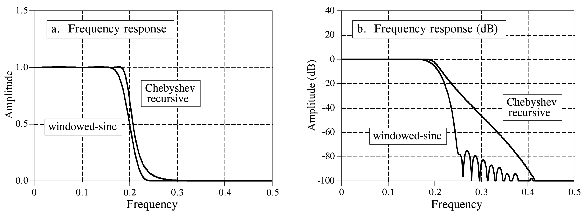
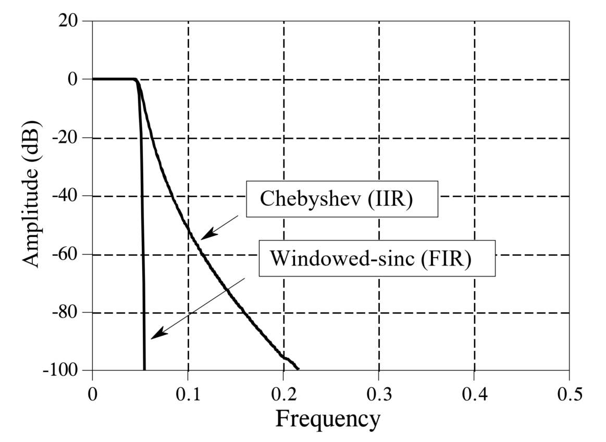
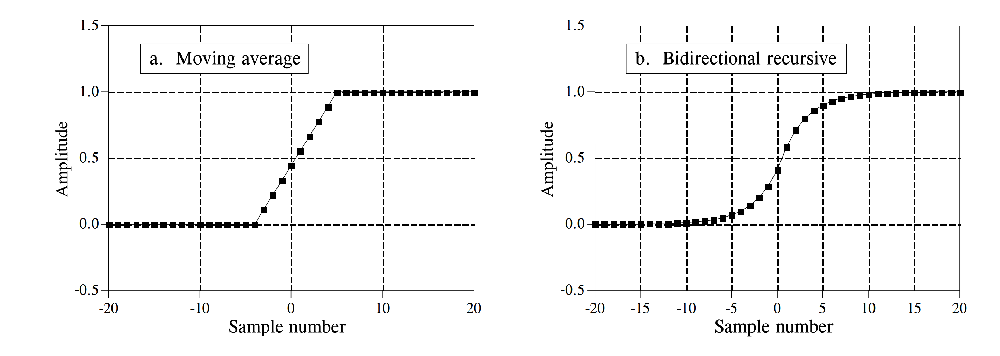
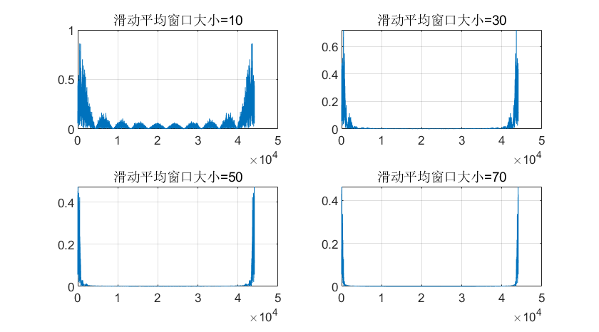
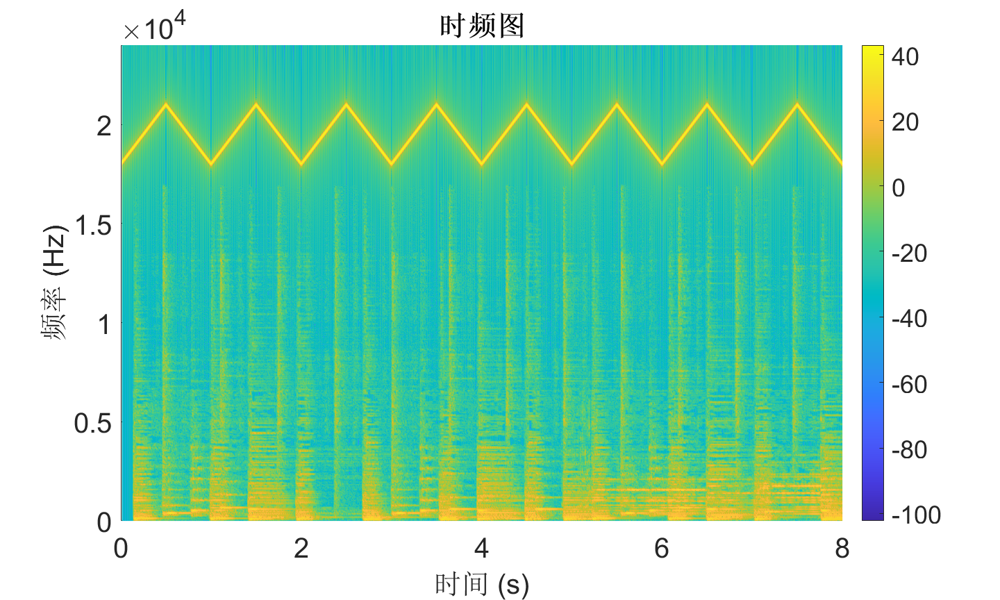
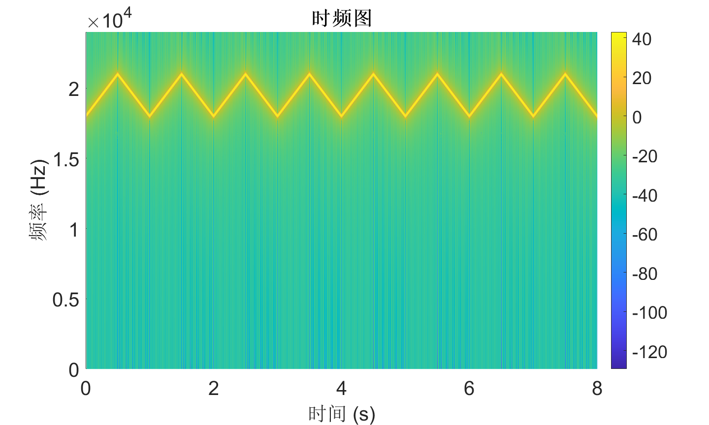

# Case Study: Filter Comparison and Selection

So far, we have introduced several types of digital filters, including moving-average filters, convolution-based FIR filters, recursive IIR filters, Chebyshev filters, and Butterworth filters. Faced with all these available options, how do we determine which filter to use in practice? The purpose of this section is to compare different filters in terms of performance, computational speed, and other practical metrics—and to explain how to select an appropriate filter based on application requirements. This is precisely what students most frequently care about during laboratory experiments.

## FIR Filters vs. IIR Filters

Both FIR and IIR filters can separate signal components belonging to one frequency band from those in another. The former achieves this by convolving the input signal with a windowed $sinc$ filter kernel; the latter implements separation via recursive computation. For the task of separating signals across distinct frequency bands, which type of digital filter is the better choice?

To answer this question, we constructed a sixth-order Chebyshev low-pass filter with 0.5% passband ripple and a 51-tap FIR filter, and compared their performance.

<center>

</center>

<center>
<div style="color:orange; border-bottom: 1px solid #d9d9d9;
display: inline-block;
color: #999;
padding: 2px;">Figure. Frequency-domain response comparison between a 51-point FIR filter and a sixth-order Chebyshev IIR filter.</div>
</center>

From the figure above, we observe that the convolution-based FIR filter transitions more rapidly from the passband to the stopband. Both filters exhibit excellent passband behavior, while the FIR filter shows more pronounced stopband ripples. Judging solely from these frequency-domain responses, the two filters appear quite similar; either suffices when only moderate performance is required. Next, we examine the respective performance limits of these two filters. The figure below shows their frequency-domain responses under optimal parameter configurations for maximum filtering performance. The IIR filter is a sixth-order Chebyshev filter with 0.5% passband ripple—the highest achievable order using single-precision floating-point arithmetic at a normalized cutoff frequency of 0.05. The FIR filter employs a 1001-point kernel formed by convolving a 501-point windowed-sinc kernel with itself. Clearly, when comparing ultimate filtering performance, the FIR filter dominates decisively! Even enhanced IIR implementations—such as increasing filter order, cascading multiple stages, or adopting double-precision arithmetic—cannot match the FIR filter’s performance.

<center>

</center>

<center>
<div style="color:orange; border-bottom: 1px solid #d9d9d9;
display: inline-block;
color: #999;
padding: 2px;">Figure. Frequency-domain response comparison between an FIR filter and a Chebyshev IIR filter under extreme parameter configurations.</div>
</center>

At this point, many students may wonder: since FIR filters demonstrably outperform IIR filters in frequency-domain filtering capability, should we simply default to FIR filters for all filtering applications? Not necessarily. In practice, beyond filtering accuracy, a critical consideration is computational speed. A carefully designed FIR filter can achieve excellent filtering performance—but only if you are willing to wait long enough for it to produce the desired output. Comparing execution speeds reveals that IIR filters typically run an order of magnitude faster than FIR filters offering comparable performance.

Therefore, in most real-world applications where ultra-high filtering precision is unnecessary, we prefer IIR filters due to their simpler structure, faster computation, and sufficient frequency-domain performance for the vast majority of use cases.

## Moving-Average vs. First-Order Recursive Filtering

In time-domain filtering scenarios, moving-average and first-order recursive filters are commonly used for waveform shaping. To compare their practical differences, we construct a 9-point moving-average filter and a first-order recursive filter. The figure below shows their step responses. In (a), the moving-average step response is linear—the fastest possible transition between two steady states. In (b), the recursive filter’s step response is smoother, which may be preferable for certain applications.

<center>

</center>

<center>
<div style="color:orange; border-bottom: 1px solid #d9d9d9;
display: inline-block;
color: #999;
padding: 2px;">Figure. Step responses of a 9-point moving-average filter and a first-order recursive filter.</div>
</center>

The figure also indicates that, in terms of time-domain filtering performance, these two filters are practically indistinguishable—selection between them is often a matter of personal preference (Is it *really* just preference? :)). However, when large-scale data filtering and programming complexity are considered, filter selection becomes a trade-off between development time and execution time. If minimizing development effort is prioritized—and slower execution is acceptable—for example, when filtering several thousand samples per operation, the entire program completes within seconds; thus, a recursive filter is usually preferred, as it simplifies coding and modification without significantly compromising speed. Conversely, if filtering hundreds of millions of samples is required, the moving-average filter should be selected—and optimized algorithmically to maximize computational efficiency.

## Practical Example: Audio Filtering

Filters enable us to retain or suppress specific frequency components within a signal—a common and indispensable operation in IoT signal processing. Many students understand the basic concepts but remain unfamiliar with hands-on implementation, especially lacking prior practical experience.

After grasping the underlying principles, we now demonstrate a real-signal filtering case study. Specifically, we present an audio noise-reduction program to illustrate how to design and implement a digital filter tailored to a particular functional requirement. We process an audio recording contaminated with high-frequency noise and apply a low-pass filter to suppress the noise, thereby achieving noise reduction.

Note: Real data incoming!

**Time-Domain Filtering**

In the time domain, moving-average filtering smooths out high-frequency noise-induced spikes while preserving the waveform characteristics of low-frequency components. Its primary tunable parameter is the window length. Below, we implement moving-average waveform shaping to suppress noise in the audio signal.

```matlab
clc; clear; close all; clear sound

% Load audio signal
[xr,fs] = audioread('Music.mp3');
xr=xr(:,1)'; 
noise = 0.01 * rand(1, numel(xr));
noise = highpass(noise, 500, fs);
xr = xr + noise;
figure; subplot(3,1,1); plot(xr); title('Original time-domain signal');
box on; grid on;

nfft = 1e4;
t = (0:numel(xr)-1)/fs;
fidx = (0:nfft-1)/nfft * fs;

% Spectrum of original noisy signal
z = fft(xr(1:nfft));
subplot(3,1,2); plot(fidx, abs(z));
grid on; box on;
title('Spectrum of original noisy signal');

% Suppress high-frequency noise using moving average
mwin = 100;
xr = movmean(xr, mwin);

% Spectrum of filtered signal
z = fft(xr(1:nfft));
subplot(3,1,3); plot(fidx, abs(z));
grid on; box on;
title('Spectrum of filtered signal');

sound(xr, fs);
```

<center>

</center>

<!--  -->
<center>
<div style="color:orange; border-bottom: 1px solid #d9d9d9;
display: inline-block;
color: #999;
padding: 2px;">Figure. Illustration of low-pass filtering effect using moving-average filtering.</div>
</center>

As shown, moving-average filtering significantly suppresses high-frequency components in the original audio waveform. However, simultaneously, signal energy within the useful audio band (0–1 kHz) is also attenuated—because the moving-average filter inherently attenuates frequencies even within its passband.

Next, we adjust the moving-window length (to values of 10, 30, 50, and 70) and plot the corresponding spectra to analyze how window length affects filtering performance.

```matlab
for mwin = [10,30,50,70]
    % Suppress high-frequency noise using moving average
    xr = movmean(xr, mwin);

    % Spectrum of filtered signal
    z = fft(xr(1:nfft));
    subplot(2,2,ceil(mwin/10/2)); plot(fidx, abs(z));
    grid on; box on;
    title(['Moving-average window size = ', num2str(mwin)]);
end
```

<center>

</center>

<!--  -->
<center>
<div style="color:orange; border-bottom: 1px solid #d9d9d9;
display: inline-block;
color: #999;
padding: 2px;">Figure. Comparison of low-pass filtering effects under different moving-window lengths.</div>
</center>

We observe that longer moving windows yield narrower passbands and stronger suppression of high-frequency noise. However, longer windows also cause greater attenuation—and thus more severe distortion—of useful passband signals.

**Bandpass Filtering**

In some cases, noise occupies both high- and low-frequency bands. Consequently, simple low-pass or high-pass filtering alone fails to deliver satisfactory noise reduction. Therefore, we require selective filtering of signals within a specified frequency band—i.e., bandpass filtering. A bandpass filter passes frequency components within a designated range while strongly attenuating components outside that range.

Below, we implement bandpass filtering to extract signal components from two frequency bands: 17–18 kHz and 20–21 kHz.

The most intuitive approach is frequency down-conversion: first shift the target band near 0 Hz, then apply low-pass filtering to suppress out-of-band components.

```matlab
% parameters
filename = 'res2.wav';

% read data
[y, Fs] = audioread(filename);

fft_plot(y, Fs, length(y), 'without filter');

t = (0:numel(y)-1) / Fs;
y = y .* cos(2*pi*-17e3*t); % Down-conversion method
y = lowpass(y, 1e3, Fs);
```

<center>

</center>

<center>
<div style="color:orange; border-bottom: 1px solid #d9d9d9;
display: inline-block;
color: #999;
padding: 2px;">Figure. Bandpass filtering effect.</div>
</center>

> Reflection: What is the principle behind down-conversion?

MATLAB also provides the `bandpass` function for direct bandpass filtering, enabling users to extract signals within user-specified frequency bands. Its internal logic closely mirrors the code above:

```matlab
% parameters
filename = 'res2.wav';

% read data
[y, Fs] = audioread(filename);
fft_plot(y, Fs, length(y), 'without filter');

% bandpass
figure;
bandpass(y, [17000, 18000], Fs);
figure;
bandpass(y, [20000, 21000], Fs);

function fft_plot(y, Fs, NFFT, plot_title)
    fx = (0:NFFT-1)*Fs/NFFT;
    ffty = fft(y, NFFT);
    m = abs(ffty);
    figure;
    plot(fx, m);
    title(plot_title);
    xlabel('f');
    ylabel('amplitude');
end
```

After mastering the basic principles and design methods of filters, this section uses a practical application case to explain how to utilize filters for signal processing tasks.

You can click the link below to download the corresponding audio file:
[Download Link](https://cloud.tsinghua.edu.cn/f/c56912db8f8440b7af69/?dl=1)

When playing this audio file, you will only hear a conventional musical melody. However, by plotting its spectrogram using the **Short-Time Fourier Transform (STFT)**, you will discover that this audio is actually a mixture of sounds from two different frequency bands.

```matlab
% Read the audio file
[y, Fs] = audioread('audio.wav');

% --------------------- STFT Parameter Settings ---------------------
win = hamming(1200);   % Window length: 1200
noverlap = 960;        % Number of overlaps: 960 (80% overlap)
nfft = 1200;           % FFT points match the window length

% --------------------- Compute STFT and Plot Spectrogram ---------------------
[S, f, t] = stft(y, Fs, 'Window', win, 'OverlapLength', noverlap, 'FFTLength', nfft);

% Plot spectrogram and adjust formatting
figure('Color','w', 'Position', [100, 100, 10*96, 6*96]); 
pcolor(t, f, 20*log10(abs(S)));
shading interp;
colorbar;
xlabel('Time (s)','FontSize',20);
ylabel('Frequency (Hz)','FontSize',20);
title('Spectrogram','FontSize',20,'FontWeight','bold');
ylim([0, Fs/2]);
xlim([0, 8]);

```

Within the frequency range perceptible to the human ear ($\leq 18000\text{Hz}$), the spectrogram displays features corresponding to the musical melody. However, in the **ultrasonic band** ($> 18000\text{Hz}$), there is a hidden signal with linearly changing frequencies that alternate between ascending and descending (chirps). Since this signal is in the ultrasonic range, it exceeds the range of human hearing; thus, only the normal music is audible. This technique of embedding ultrasonic signals into regular music can be applied to the **Internet of Things (IoT)** to achieve functions like inaudible communication and sensing.

So, how do we extract the usable ultrasonic signals from the mixed signal? This requirement can be met by designing and applying a filter.

The sampling rate of this audio signal is $48000\text{Hz}$, and the target signal is located above $20000\text{Hz}$. Therefore, we can design a **High-Pass Filter (HPF)** to complete the processing. The filtering code is as follows:

```matlab
% --------------------- Design High-Pass Filter ---------------------
% Key parameters
Fc = 17500;          % Cutoff frequency
Fs_filter = Fs;      
order = 8;           % Filter order

% Design a Butterworth high-pass filter
% The butter function returns filter coefficients [b, a]; 'high' specifies the type
[b, a] = butter(order, Fc/(Fs_filter/2), 'high'); 

% --------------------- filtfilt ---------------------
% Use filtfilt for forward + backward filtering to avoid phase distortion
y_filtered = filtfilt(b, a, y);

```



The `filtfilt` function is a commonly used **zero-phase filtering** function in signal processing. Its core function is to perform both forward and backward filtering: first, the signal passes through the designed filter in the forward direction, and then the result is passed through the same filter in reverse.

This approach ensures that the filtered signal has **zero phase shift** (avoiding phase distortion) and effectively doubles the filter's attenuation. It prevents phase distortion issues caused by single-direction filtering, making it especially suitable for signal processing scenarios with high requirements for phase fidelity, such as audio and vibration analysis.

The spectrogram of the signal after filtering is shown below:



As clearly seen in the spectrogram, the low-frequency signals have been completely removed. When playing the filtered audio, almost no sound can be heard, which validates that the low-frequency acoustic waves were effectively filtered out.