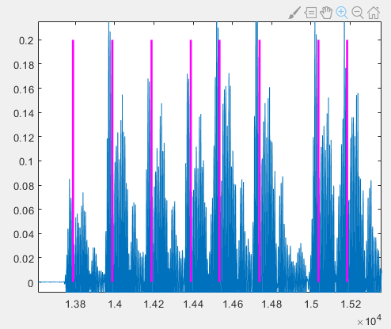

# Amplitude Modulation

Amplitude modulation (AM), also known as Amplitude-Shift Keying (ASK), is a modulation technique that encodes information by varying the amplitude of a carrier signal. The simplest form of AM is On–Off Keying (OOK), a commonly encountered data modulation scheme—for instance, RFID systems employ OOK for data modulation. In essence, OOK uses a fixed-frequency signal to represent “1”, and the absence of a signal to represent “0”. Such a signal segment used to represent a binary digit is called a **symbol**. Each modulation scheme defines its own set of symbols, where each symbol is a distinct waveform representing a specific binary value. In OOK, there are two symbols, each representing one bit. In other modulation schemes, a single symbol may represent multiple bits. In OOK, both symbols have identical durations. Below is an illustration of OOK modulation:

<center>

</center>
<center>
<div style="color:orange; border-bottom: 1px solid #d9d9d9; display: inline-block;color: #999;padding: 2px;">Fig. Amplitude Modulation</div>
</center>

From the figure, it is evident that transmitting data “1” corresponds to emitting a signal, whereas transmitting data “0” corresponds to emitting no signal. Thus, the receiver can distinguish between “0” and “1” based on whether a signal is received.

> Reflection: How does the receiver determine whether the received data is “0” or “1”?

To further improve the spectral efficiency of amplitude modulation, more amplitude levels can be introduced so that each symbol carries more bits—thereby increasing the information capacity per symbol:

<center>

</center>
<center>
<div style="color:orange; border-bottom: 1px solid #d9d9d9; display: inline-block;color: #999;padding: 2px;">Fig. Increasing amplitude levels improves coding efficiency</div>
</center>

For example, if the signal exhibits four distinct amplitude levels, each level can represent two bits; hence, more bits can be conveyed within the same time interval.

Introducing multiple amplitude levels brings additional challenges. In amplitude modulation, it is essential to ensure sufficient separation among symbol amplitudes; otherwise, decoding becomes unreliable due to ambiguity in distinguishing amplitude levels—especially under noisy conditions, where noise may further blur the distinctions among amplitudes. Therefore, theoretically, optimal amplitude levels should be selected according to the prevailing noise characteristics to guarantee robust wireless transmission.

This is precisely why real-world communication systems exhibit different optimal transmission rates under varying signal-to-noise ratios (SNRs). Another critical consideration is channel behavior: channel stability directly affects reliability. If the channel state changes dynamically—e.g., attenuating originally high-amplitude symbols—it may cause decoding errors.

The acoustic channel is particularly susceptible to such variations: changes in surrounding reflective environments induce significant channel fluctuations. One practical mitigation strategy is to reduce packet length. When packets are sufficiently short, the acoustic channel remains approximately constant over the duration of a single packet transmission. Indeed, standard communication models typically assume that the channel remains invariant during the transmission of a single packet—a condition referred to as *coherent* channel assumption.

> Reflection: After passing through the channel, the transmitted signal undergoes attenuation, and its absolute amplitude at the receiver is significantly altered. How can reliable demodulation still be achieved?

## Implementing OOK Using Acoustic Signals

Earlier, we demonstrated how to generate, transmit, and receive acoustic signals. Now, let us examine how acoustic signals can be used for data transmission. Throughout this book, data transmission is primarily implemented using acoustic signals rather than electromagnetic radio waves, because acoustic signals are more intuitive to process and can be generated and captured using readily available personal devices (e.g., smartphones).

First, we generate two symbols encoding “1” and “0”, respectively:

~~~matlab
% symbol 1
fm=100;                         % signal frequency
fs=fm*100;                      % sampling frequency
Am=1;
symbol_len=512;                 % symbol length
t=(0:1/fs:(symbol_len-1)/fs);
% symbol 1
smb1=Am*cos(2*pi*fm*t);         
% symbol 0
smb0 = zeros(1, symbol_len);
~~~

Next, we generate the baseband signal using the OOK encoding rule. The term *baseband signal* frequently appears in research papers and technical literature. Generally, a baseband signal refers to a signal before upconversion—i.e., it resides at low frequencies near zero Hz. Informally speaking, all encoding and decoding operations discussed so far occur in the baseband domain, prior to modulation onto a carrier.

When studying modulation and demodulation, one must first understand baseband modulation. Most academic papers focus on baseband modulation processes; upconversion to a carrier is a subsequent step. This explains terms like *baseband chip*, which performs encoding and modulation tasks prior to upconversion.

During actual transmission, the baseband signal is modulated onto a carrier, thereby shifting it away from the baseband.

~~~matlab
datas = [0, 1, 0, 0, 1, 0, 1, 1];
sig = [];
for data = datas
    if data == 0
        sig = [sig, smb0];
    else
        sig = [sig, smb1];
    end
end
~~~

We then modulate this baseband signal onto a carrier to obtain the final transmit signal:

> Reflection: In theory, the baseband-modulated signal already contains all the encoded data. Why is upconversion to a carrier necessary?

~~~matlab
% Carrier
fc=1000;                       % carrier frequency
t = 0:1/fs:(length(sig)-1)/fs;
carrier_wave = cos(2*pi*fc*t);
% Modulate baseband signal onto carrier
sig_carrier=sig.*carrier_wave;
~~~

After generation, the signal propagates from the transmitter to the receiver via the channel—for example, sound emitted by a smartphone travels through air and reflects off walls before reaching the receiver. The entire propagation path is abstracted as the *channel*. Here, we simulate channel transmission in MATLAB by adding white Gaussian noise (note: real-world channels also introduce multipath effects and other impairments):

~~~matlab
%% Channel transmission: add noise
sig_carrier = awgn(sig_carrier, 5);
~~~

> Note: Type ```help awgn``` in the MATLAB command window to view documentation for the ```awgn``` function; similarly for other functions.

Next, we implement the receiver-side processing.

To decode the data, note that the received signal resides on the carrier frequency—typically very high (e.g., 2.4 GHz for Wi-Fi). Direct demodulation of such high-frequency signals is generally avoided.

The first step is downconversion—i.e., shifting the signal back to baseband.

> Reflection: How can a carrier-frequency signal be shifted down to baseband?

To accomplish downconversion, multiply the received signal by a reference signal with identical frequency and phase, followed by low-pass filtering on a per-symbol basis to recover the baseband signal.

~~~matlab
sig_rec=sig_carrier.*carrier_wave;                % multiply by carrier
% Low-pass filtering
base_sig = [];
for i = 1:symbol_len:length(sig_rec)
    smb = sig_rec(i:i+symbol_len-1);
    % remove high-frequency components via low-pass filtering
    sig_baseband = BPassFilter(smb, 100, 10, fs);
    base_sig = [base_sig, sig_baseband];
end
~~~

Finally, threshold-based symbol detection recovers the transmitted bits:

~~~matlab
decode_datas = [];
thresh = 1;
for i = 1:symbol_len:length(base_sig)
    smb = base_sig(i:i+symbol_len-1);
    A = sum(abs(smb));
    if A > thresh
        decode_datas = [decode_datas, 1];
    else
        decode_datas = [decode_datas, 0];
    end
end
~~~

## Pulse-Interval Modulation

Pulse-interval modulation (PIM) encodes data by varying the time interval between successive pulses. Specific intervals correspond to predefined binary sequences. The simplest PIM scheme uses two distinct intervals—one short and one long—to represent “0” and “1”, respectively. During decoding, identifying the start time of each pulse suffices to compute inter-pulse intervals, enabling straightforward mapping to “0” or “1”.

<center>

</center>
<center>
<div style="color:orange; border-bottom: 1px solid #d9d9d9; display: inline-block;color: #999;padding: 2px;">Fig. Principle of Pulse Modulation</div>
</center>

Because PIM maps “0” and “1” to simple interval-length rules—and because pulse starts can be reliably detected via amplitude thresholds—the resulting encoding/decoding algorithm incurs minimal computational overhead.

A drawback of PIM is low coding efficiency: sufficient time separation between pulses is required.

> Reflection: Why must sufficient time separation be maintained?

Sufficient separation mitigates echo-induced interference from multipath propagation, preventing erroneous detection of subsequent pulses. To increase PIM data rate, two strategies may be employed.

The first strategy is to shorten symbol duration—both the inter-pulse interval and the pulse duration itself. Provided decoding accuracy is preserved, shorter symbols enable higher throughput within the same time interval.

<center>

</center>
<center>
<div style="color:orange; border-bottom: 1px solid #d9d9d9; display: inline-block;color: #999;padding: 2px;">Fig. Reducing pulse intervals and pulse duration improves coding efficiency</div>
</center>

The second strategy employs multiple interval lengths, allowing each symbol to carry more than one bit. As illustrated below, two interval lengths convey one bit per symbol; four interval lengths convey two bits; eight interval lengths convey three bits.

<center>

</center>
<center>
<div style="color:orange; border-bottom: 1px solid #d9d9d9; display: inline-block;color: #999;padding: 2px;">Fig. Multiple interval lengths</div>
</center>

However, interval-length diversity cannot be increased indefinitely. As the distinction between adjacent interval lengths diminishes, reliable discrimination becomes increasingly difficult. Furthermore, if symbol probabilities are non-uniform, Huffman coding principles can optimize PIM efficiency. For example, if “0” occurs more frequently than “1” in a message, assigning shorter intervals to “0” and longer intervals to “1” reduces total transmission time.

This section implements a simple wireless communication system based on PIM. Specifically, the system comprises a transmitter and a receiver. The transmitter accepts text input and outputs an audio file containing the modulated signal. This audio file is played via a smartphone or computer, and another device records the resulting acoustic signal. The receiver accepts the recorded audio file and outputs the decoded text.

By implementing the code below, readers can experience firsthand the practical aspects of signal transmission, including:
- Fundamental steps involved in real-world transmission,
- Practical challenges imposed by real environments—topics central to cutting-edge IoT research and publications—such as:
  - Detecting the start time of transmitted data,
  - Filtering out interference and noise from received signals,
  - Compensating for loudspeaker and microphone distortion,
  - Mitigating frequency offsets between transmitter and receiver devices (a particularly common and severe issue in low-cost IoT devices).

## Encoding

First, the input text must be converted into a binary string before modulation. We adopt $ASCII$ encoding, mapping each character to an 8-bit ASCII representation and concatenating them sequentially. Accordingly, we implement a function named ```string2bin```:

```matlab
function [ binary ] = string2bin( str )
% Convert string to binary string
ascii = abs(str);
L = length(ascii);
binary = zeros(L,8);
for i=1:L
    binary_str = dec2bin(ascii(i));
    binary_str_index = length(binary_str);
    for j = 8:-1:1
        if binary_str_index >0
            binary(i,j) = str2num(binary_str(binary_str_index));
        else
            binary(i,j) = 0;
        end
        binary_str_index = binary_str_index-1;
    end
end
binary = reshape(binary',[L*8,1]);
end
```

We use acoustic signals for communication. The sampling frequency is set to 48 kHz. Since most humans cannot hear sounds above 17 kHz or produce sounds below 17 Hz, our system transmits at 18 kHz—minimizing auditory interference while avoiding contamination from human speech. Pulse duration is set to 100 samples; given the 48 kHz sampling rate, the pulse duration equals $100/48000\approx 2.1ms$. Inter-pulse interval lengths (in samples) and their corresponding codewords are listed below:

Inter-pulse interval (samples) | Codeword  
------ | ------  
50 | 00  
100 | 01  
150 | 10  
200 | 11  

## Modulation

With the encoding rules defined, we now generate the acoustic signal from the input text.

First, generate the acoustic pulse: in PIM, we require a fixed-frequency (18 kHz), fixed-duration (100-sample) pulse:

~~~matlab
%%
fs = 48000;                         % sampling frequency
f = 18000;                          % tone frequency
time = 0.0025;                      % signal duration
t = 0:1/fs:time;                    % time vector
t = t(1:100);                       % extract first 100 samples
impulse = sin(2*pi*f*t);            % generate sinusoidal tone at frequency f
~~~

Next, generate silence segments for encoding:

~~~matlab
delta = 50;
pause0 = zeros(1,delta);      % encode 00
pause1 = zeros(1,2*delta);    % encode 01
pause2 = zeros(1,3*delta);    % encode 10
pause3 = zeros(1,4*delta);    % encode 11
~~~

Set the message string:

~~~matlab
str = 'Tsinghua University';
~~~

Call ```string2bin``` with the message string to obtain the binary representation, stored in variable ```message```:

~~~matlab
message = string2bin( str )'; % convert string to binary string
% Since our encoding maps each symbol to 2 bits, convert binary to quaternary
[~,m_Length] = size(message);
message4 = [];
for i = 1:m_Length/2
    % combine every two bits into one quaternary digit
    message4 = [message4,message(i*2-1)*2+message(i*2)];
end
~~~

Generate the modulated output signal:

~~~matlab
output = [];
% Append impulse and corresponding silence segment based on quaternary digit
for i = 1:m_Length/2
    if message4(i)==0
        output = [output,impulse,pause0];
    elseif message4(i)==1
        output = [output,impulse,pause1];
    elseif message4(i)==2
        output = [output,impulse,pause2];
    else
        output = [output,impulse,pause3];
    end
end
% Prepend and append silence to avoid playback distortion at signal edges
output = [pause3,output,impulse];
% Plot time-domain signal
figure(1);
plot(output);
axis([-500 17500 -3 3]);
% Write signal to audio file
audiowrite('message.wav',output,fs);
~~~

Some loudspeakers exhibit startup distortion during initial power-on (“cold start”). To bypass this transient, we prepend silence to the audio signal.

The resulting time-domain waveform is shown below, where the horizontal axis denotes sample index and the vertical axis denotes amplitude:

<center>

</center>
<center>
<div style="color:orange; border-bottom: 1px solid #d9d9d9; display: inline-block;color: #999;padding: 2px;">Fig. Time-domain waveform of encoded signal</div>
</center>

After generating the modulated audio file, store it on an Android smartphone and play it using a media player. Simultaneously, record the acoustic signal using another device and save it as “r.wav”. Since this is a basic modulation scheme, mono recording suffices for successful decoding.

## Demodulation

The following demodulation and decoding steps are implemented in the script ```decoding.m```. First, read the recorded audio file “r.wav” and plot the waveform:

~~~matlab
%% Read recorded audio data
[data, fs] = audioread('r.wav');
figure(1);
plot(data);
hold on;
~~~

<center>

</center>
<center>
<div style="color:orange; border-bottom: 1px solid #d9d9d9; display: inline-block;color: #999;padding: 2px;">Fig. Received acoustic signal</div>
</center>

As seen above, the recorded signal—after loudspeaker emission, air propagation, and microphone reception—differs noticeably from the original due to various channel-induced distortions and noise.

Before demodulation, recall the principle of PIM: data is encoded in inter-pulse intervals, so demodulation hinges on accurately estimating these intervals. Since pulse duration is fixed, detecting pulse onset times suffices.

How do we locate pulse onsets? In this implementation, we apply an energy-threshold method.

Using the Fourier transform, we estimate the strength of a target frequency component (18 kHz) within a time-windowed segment. By applying short-time Fourier transforms with a 100-sample window (matching the pulse duration), the 18-kHz spectral energy peaks only when the window aligns exactly with the pulse onset—because only then does the entire window contain pure 18-kHz signal. Otherwise, the window inevitably includes silent segments (zero-valued samples), reducing the computed spectral energy. According to Parseval’s theorem, spectral energy reflects time-domain energy at the corresponding frequency. Hence, maximum 18-kHz energy occurs precisely when the window begins at the pulse onset. Recording the 18-kHz energy across sliding windows enables identification of pulse onsets via local maxima.

<center>

</center>
<center>
<div style="color:orange; border-bottom: 1px solid #d9d9d9; display: inline-block;color: #999;padding: 2px;">Fig. Pulse signal and time-domain window</div>
</center>

Now perform demodulation. First, filter the recorded signal to suppress ambient noise and retain only the 18-kHz band:

~~~matlab
%% Filter recorded data
% Design a bandpass filter
hd = design(fdesign.bandpass('N,F3dB1,F3dB2',6,17500,18500,fs),'butter');
% Apply filter
data = filter(hd,data);
~~~

> Reflection: In practice, filtering is not strictly necessary in PIM. Can you explain why?

Next, apply a sliding-window Fourier transform to estimate 18-kHz energy across the signal:

~~~matlab
%% Sliding-window Fourier transform to estimate 18-kHz energy
f = 18000;                      % target frequency
[n,~] = size(data);             % signal length
window = 100;                   % window size
% Store 18-kHz energy for each window position
impulse_fft = zeros(n,1);	
for i= 1:1:n-window
    % Compute FFT over current window
    y = fft(data(i:i+window-1));
    y = abs(y);
    % Locate bin index corresponding to 18 kHz
    index_impulse = round(f/fs*window);
    % Account for possible frequency offset: take maximum over ±2 bins around target
    impulse_fft(i)=max(y(index_impulse-2:index_impulse+2));
end
% Plot 18-kHz energy vs. time
figure(2);
plot(impulse_fft);
~~~

The resulting 18-kHz energy profile is shown below:

<center>

</center>
<center>
<div style="color:orange; border-bottom: 1px solid #d9d9d9; display: inline-block;color: #999;padding: 2px;">Fig. 18-kHz energy across time windows</div>
</center>

Zooming in reveals a sawtooth-like pattern:

<center>

</center>
<center>
<div style="color:orange; border-bottom: 1px solid #d9d9d9; display: inline-block;color: #999;padding: 2px;">Fig. Local zoom of 18-kHz energy profile</div>
</center>

To locate pulse onsets accurately, we seek local maxima—but the raw sawtooth profile yields imprecise peak positions. Applying a moving-average filter smooths the curve. Here, we use an 11-sample window:

~~~matlab
% Moving average (mean filter)
sliding_window = 5;
impulse_fft_tmp = impulse_fft;
for i = 1+sliding_window:1:n-sliding_window
    impulse_fft_tmp(i)=mean(impulse_fft(i-sliding_window:i+sliding_window));
end
impulse_fft = impulse_fft_tmp;
% Plot smoothed energy profile
figure(2);
plot(impulse_fft);
hold on;
~~~

As shown below, smoothing effectively eliminates the sawtooth artifacts. The window size may be adjusted empirically.

<center>

</center>
<center>
<div style="color:orange; border-bottom: 1px solid #d9d9d9; display: inline-block;color: #999;padding: 2px;">Fig. Local zoom of smoothed 18-kHz energy profile</div>
</center>

In practice, smoothed peaks may lack strict monotonicity on either side. Thus, we detect *local maxima* instead of global maxima. A point is declared a local maximum if it exceeds all values within a symmetric 100-sample window centered at that point. To suppress spurious peaks arising from noise, we impose a minimum amplitude threshold: points below $0.3$ are discarded regardless of local shape.

~~~matlab
% Detect pulse onset positions (peak centers)
position_impulse=[];    % store peak indices
half_window = 50;
for i= half_window+1:1:n-half_window
    % peak detection with amplitude threshold
    if impulse_fft(i)>0.3 && impulse_fft(i)==max(impulse_fft(i-half_window:i+half_window))
        position_impulse=[position_impulse,i];
    end
end
~~~

As previously analyzed, peak positions correspond to pulse onsets. To verify, mark these positions on both the energy profile and the original time-domain waveform, and compute inter-pulse intervals:

~~~matlab
%% Mark pulse onsets and compute inter-pulse intervals
[~,N]= size(position_impulse);
% Store inter-pulse intervals
delta_impulse=zeros(1,N-1);
for i = 1:N-1
    % Mark onset on energy profile
    figure(2);
    plot([position_impulse(i),position_impulse(i)],[0,0.8],'m');
    % Mark onset on time-domain waveform
    figure(1);
    plot([position_impulse(i),position_impulse(i)],[0,0.2],'m','linewidth',2);
    % Compute interval (subtract pulse duration)
    delta_impulse(i) = position_impulse(i+1) -  position_impulse(i) -100;
end
~~~

The pulse onsets marked on the original time-domain waveform appear misaligned—as shown below—since magenta lines precede actual pulse starts.

<center>

</center>
<center>
<div style="color:orange; border-bottom: 1px solid #d9d9d9; display: inline-block;color: #999;padding: 2px;">Fig. Computed pulse onsets misaligned with true pulse starts in time domain</div>
</center>

However, these same positions align precisely with peaks in the 18-kHz energy profile:

<center>

</center>
<center>
<div style="color:orange; border-bottom: 1px solid #d9d9d9; display: inline-block;color: #999;padding: 2px;">Fig. Computed pulse onsets perfectly aligned with 18-kHz energy peaks</div>
</center>

Thus, the 18-kHz energy peaks do not coincide with true pulse onsets—an observation contradicting our initial theoretical expectation. To explain this, compare the original time-domain signal and the 18-kHz energy profile below. Clearly, the energy peak lags behind the true pulse onset:

<center>

</center>
<center>
<div style="color:orange; border-bottom: 1px solid #d9d9d9; display: inline-block;color: #999;padding: 2px;">Fig. 18-kHz energy peak does not coincide with pulse onset</div>
</center>

This lag arises from filtering effects. Replacing the original signal with the filtered version reveals that filter-induced roll-off weakens pulse edges relative to the center. Combined with multipath echoes, this causes the sliding-window FFT to yield maximum energy not at the pulse onset but slightly later.

<center>

</center>
<center>
<div style="color:orange; border-bottom: 1px solid #d9d9d9; display: inline-block;color: #999;padding: 2px;">Fig. 18-kHz energy profile and filtered acoustic signal</div>
</center>

If we skip filtering and apply sliding-window FFT directly to the raw signal, the energy peak aligns with the true pulse onset—as shown below—though the unfiltered energy profile exhibits greater fluctuation due to broadband noise.

<center>

</center>
<center>
<div style="color:orange; border-bottom: 1px solid #d9d9d9; display: inline-block;color: #999;padding: 2px;">Fig. 18-kHz energy peak aligned with pulse onset in raw signal</div>
</center>

Although filtering shifts the detected peak positions, both approaches successfully decode data. This is because decoding relies solely on *relative* inter-pulse intervals—not absolute onset positions. Provided all onsets shift by approximately equal amounts, inter-pulse intervals remain stable. Moreover, our encoding ensures sufficient separation between interval lengths to guarantee robust decoding.

## Decoding

Finally, decode data from inter-pulse intervals using the pre-defined mapping. Due to noise, measured intervals deviate slightly from nominal values. To enhance robustness, we accept intervals within ±10 samples of nominal values; otherwise, decoding fails. The tolerance threshold may be tuned based on channel and signal characteristics.

~~~matlab
%% Decoding
% Map intervals to quaternary digits (each symbol = 2 bits)
decode_message4 = zeros(1,N-1)-1;
for i = 1:N-1
    if delta_impulse(i) - 50 >-10 &&delta_impulse(i) - 50 <10
        decode_message4(i) = 0;
    elseif delta_impulse(i) - 100 >-10 &&delta_impulse(i) - 100 <10
        decode_message4(i) = 1;
    elseif delta_impulse(i) - 150 >-10 &&delta_impulse(i) - 150 <10
        decode_message4(i) = 2;
    elseif delta_impulse(i) - 200 >-10 &&delta_impulse(i) - 200 <10
        decode_message4(i) = 3;
    end
end
% Convert quaternary to binary
decode_message = zeros(1,(N-1)*2)-1;
for i = 1:N-1
    if decode_message4(i) == 0
        decode_message(i*2-1)=0;
        decode_message(i*2)=0;
    elseif decode_message4(i) == 1
        decode_message(i*2-1)=0;
        decode_message(i*2)=1;
    elseif decode_message4(i) == 2
        decode_message(i*2-1)=1;
        decode_message(i*2)=0;
    elseif decode_message4(i) == 3
        decode_message(i*2-1)=1;
        decode_message(i*2)=1;
    end
end
~~~

Having recovered the binary string, we now convert it back to readable text using a counterpart to ```string2bin```—namely, ```bin2string```:

~~~matlab
function [ str ] = bin2string( binary )
% Convert binary string to text
L = length(binary);
str = [];
binary = reshape(binary',[8,L/8]);
binary = binary';
for i=1:L/8
    s= 0;
    for j = 1:8
        s = s+2^(8-j)*binary(i,j);
    end
    str = [str,char(s)];
end
end
~~~

Finally, invoke ```bin2string```:

~~~matlab
% Decode binary string using ASCII mapping
str = bin2string(decode_message)
~~~

Running the full script yields the decoded message:

~~~matlab
>> decoding
str=
    'Tsinghua University'
>>
~~~

Thus, a complete, functional wireless communication system has been realized.

> Reflection  
> 1. Is the energy-threshold method applicable to other modulation schemes? If strong interference exists such that high-energy regions likely correspond to noise rather than signal, how should pulse onset be detected?  
> 2. In PIM, missing a single pulse due to noise causes all subsequent pulses to shift by one position, resulting in complete misalignment of the decoded bitstream beyond that point. How can this vulnerability be mitigated?  
> 3. This implementation uses pulse modulation. Could alternative modulation schemes—such as BPSK, QPSK, 8PSK, OQPSK, 64QAM, or OFDM—be substituted?