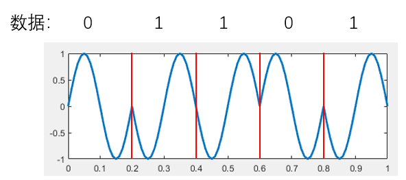
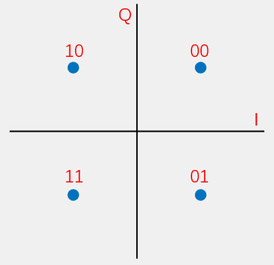
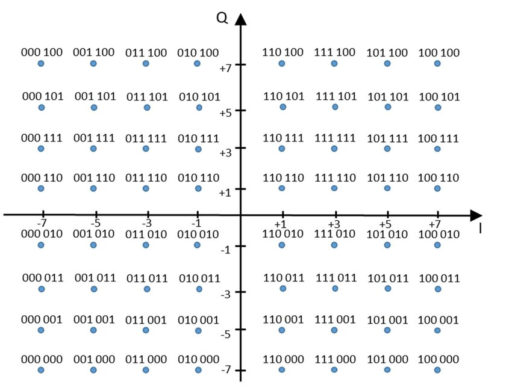

# Phase Modulation

Phase modulation, commonly referred to as phase-shift keying (PSK), encodes data by varying the phase of a carrier signal. Based on the number of distinct phases employed, PSK can be classified into binary PSK (BPSK), quadrature PSK (QPSK), 8-PSK, and so on.

You have likely heard of these modulation schemes before—but implementing them may still require some thought. The precise implementation details are often unfamiliar. This chapter focuses precisely on this topic, aiming to provide you with a complete understanding of the actual modulation and demodulation process.

When performing signal processing—or reading many research papers—you frequently encounter the concepts of the *I* (in-phase) and *Q* (quadrature) channels. For beginners, this concept can be difficult to grasp. Even experienced users—for example, those who routinely compute phase (and subsequently distance) from *I* and *Q* components in localization applications—may not fully appreciate their underlying meaning.

We use PSK as an example to explain the *I* and *Q* channels. To generate signals with different phases, the most direct approach is to vary the phase of a single sinusoidal waveform:  
$sin(2\pi f t + \phi)$,  
where $\phi$ denotes the signal’s phase. One could synthesize sine waves with distinct initial phases and use them for data transmission.

To generalize this concept, the widely adopted method for implementing PSK is *I/Q quadrature modulation*. Its principle is to encode two independent data streams onto two orthogonal carriers, modulate each stream separately, and then sum the resulting signals.  
First, due to the orthogonality of sine and cosine waveforms, the two component signals can be independently recovered at the receiver.  
Even without invoking orthogonality, consider simply adding the two signals: the resultant composite signal exhibits a controllable phase.  

How do we obtain a summed signal with a desired phase? Typically, we select the orthogonal basis signals as  
$sin(2\pi ft)$ and $cos(2\pi ft)$. By adjusting the amplitudes of the sine and cosine terms, we control the phase of the resultant sum. For instance,  
$\frac{\sqrt{2}}{2}sin(2\pi ft)+\frac{\sqrt{2}}{2}cos(2\pi ft)=sin(2\pi f t + \frac{\pi}{4})$ represents a signal with initial phase $\frac{\pi}{4}$,  
and  
$\frac{\sqrt{2}}{2}sin(2\pi ft)-\frac{\sqrt{2}}{2}cos(2\pi ft)=sin(2\pi f t - \frac{\pi}{4})$ represents a signal with initial phase $-\frac{\pi}{4}$.  
The scaling factor $\frac{\sqrt{2}}{2}$ ensures that the amplitude of the summed signal equals $1$. Thus, using two orthogonal carriers enables convenient and precise control over the output signal’s phase. At the transmitter, independent control of the *I* and *Q* amplitudes effectively generates signals with distinct phases.

How, then, do we compute the phase—and how do we use it to encode information? A straightforward mapping assigns distinct phases to distinct bit patterns. For example, dividing the phase circle into four equal intervals—0, $\pi/4$, $\pi/2$, and $3\pi/4$—allows representing the bit pairs 00, 01, 10, and 11, respectively. Each received phase thus conveys two bits.

How can we visualize this process more intuitively during signal transmission? We plot the *I*-channel amplitude on the horizontal axis and the *Q*-channel amplitude on the vertical axis, forming a point in the Cartesian plane. Plotting all possible (*I*, *Q*) amplitude combinations yields a set of discrete points—the **constellation diagram**, or simply **constellation**. Since PSK typically constrains the resultant signal amplitude to $1$, all constellation points lie on the unit circle.

Alternatively, let us reinterpret *I/Q* modulation from another perspective.

Disregarding phase modulation specifically, suppose we simultaneously modulate a signal using  
$sin(2\pi f t)$ and $cos(2\pi f t)$. Why are these two carriers suitable? Because they are orthogonal. We designate them as the *I* and *Q* channels. At the transmitter, we assign distinct amplitude pairs to these two channels; at the receiver, we analyze the composite signal to recover the original data.

Here, each (*I*, *Q*) pair corresponds to a point in the *I–Q* plane—the origin of the constellation diagram. Consequently, any point in the constellation diagram can serve as a symbol encoding data. The number of constellation points directly determines the number of bits encoded per symbol:

- 2 points → 1 bit per symbol (e.g., BPSK)  
- 4 points → 2 bits per symbol (e.g., QPSK)  
- 8 points → 3 bits per symbol (e.g., 8PSK)  

Using *n* constellation points enables encoding $\log_2 n$ bits per symbol. In theory, all *n* points can be uniquely resolved from the received signal. In practice, however, points are selected systematically—not arbitrarily.

Once constellation point positions are fixed, mapping to data becomes straightforward. For example:

- In BPSK, the two points are (*I*, *Q*) = (1, 0) and (−1, 0). We map (1, 0) to bit `1` and (−1, 0) to bit `0`. That is, the encoded data uses $I*sin(2\pi f t)+ Q*cos(2\pi f t) = 1*sin(2\pi f t)+ 0*cos(2\pi f t)=sin(2\pi f t)$ and $I*sin(2\pi f t)+ Q*cos(2\pi f t) = -1*sin(2\pi f t)+ 0*cos(2\pi f t)=-sin(2\pi f t)$. Hence, the receiver observes only $sin(2\pi f t)$ and $-sin(2\pi f t)$; decoding proceeds by estimating *I* and *Q*, then mapping to `1` or `0`.  
- In QPSK, the four points are (*I*, *Q*) = $(\frac{\sqrt{2}}{2}, \frac{\sqrt{2}}{2}), (-\frac{\sqrt{2}}{2}, \frac{\sqrt{2}}{2}), (\frac{\sqrt{2}}{2}, -\frac{\sqrt{2}}{2}), (-\frac{\sqrt{2}}{2}, -\frac{\sqrt{2}}{2})$. These encode two bits: e.g., $(\frac{\sqrt{2}}{2}, \frac{\sqrt{2}}{2})$ maps to `00`, $(-\frac{\sqrt{2}}{2}, \frac{\sqrt{2}}{2})$ maps to `10`, etc. Decoding again relies on estimating *I* and *Q*, then mapping to the corresponding bit pair.

> **Exercise**: How does the receiver compute the (*I*, *Q*) coordinates—i.e., the constellation point location—from the received signal?

## Relationship Between *I/Q* and Phase

From the above discussion, it is evident that *I* and *Q* directly determine the phase of the modulated signal. Moreover, the constellation diagram reveals that *I* and *Q* also affect the signal’s amplitude. So why are these schemes collectively termed *x*PSK—and why are they classified as *phase modulation*? In practice, signal processing and numerous publications compute the signal phase directly from *I* and *Q*. For instance, many hardware devices output decoded *I* and *Q* values, enabling immediate phase computation.

Let us now derive the precise relationship between *I/Q* and phase.

The modulated signal is expressed as  
$I*sin(2\pi f t) + Q* cos(2\pi f t)$ (notation may vary slightly across references), i.e.,  
$\sqrt{I^2 + Q^2}sin(2\pi f t + \arctan \frac{Q}{I})$. You are encouraged to verify this derivation yourself.  
Thus, the received signal’s phase is given by  
$\phi = \arctan \frac{Q}{I}$. For example:

- BPSK uses phases $sin(2\pi f t)$ and $-sin(2\pi f t)$, equivalent to $sin(2\pi f t)$ and $sin(2\pi f t + \pi)$, thereby mapping data onto phases 0 and $\pi$.  
- QPSK uses phases $sin(2\pi f t + \frac{\pi}{4})$, $sin(2\pi f t + \frac{3\pi}{4})$, $sin(2\pi f t + \frac{5\pi}{4})$, and $sin(2\pi f t + \frac{7\pi}{4})$, mapping data onto $\frac{\pi}{4}$, $\frac{3\pi}{4}$, $\frac{5\pi}{4}$, and $\frac{7\pi}{4}$.

> **Exercise**: How are constellation points decoded in BPSK, QPSK, etc.?

Understanding this process clarifies why conventional communication systems universally adopt *I/Q* representation. Many phase-based localization, tracking, and sensing techniques likewise compute phase directly from *I* and *Q*. Therefore, encountering *I/Q* should not cause concern. Later, we will introduce more advanced modulation schemes—including OFDM—yet the fundamental principle remains unchanged. Indeed, you can now design novel modulation schemes based on this core idea.

## BPSK

We begin with the simplest case: BPSK implementation. As introduced earlier, BPSK employs two signals with a phase difference of $\pi$:  
$sin(2\pi f t)$ and $sin(2\pi f t + \pi)$. These correspond to phases $sin(2\pi f t)$ and $-sin(2\pi f t)$, equivalent to $sin(2\pi f t)$ and $sin(2\pi f t + \pi)$, mapping data onto phases 0 and $\pi$.

<center>

</center>
<center>
<div style="color:orange; border-bottom: 1px solid #d9d9d9; display: inline-block;color: #999;padding: 2px;">Figure. Signals with phase 0 and phase π</div>
</center>

With these two symbols, we select the appropriate phase based on the input bit. Input `0` selects the 0-phase signal; input `1` selects the $\pi$-phase signal. The input bit sequence and corresponding BPSK-modulated waveform are shown below.

<center>

</center>
<center>
<div style="color:orange; border-bottom: 1px solid #d9d9d9; display: inline-block;color: #999;padding: 2px;">Figure. Modulated BPSK signal</div>
</center>

Thus, bits `0` and `1` are encoded onto two distinct waveforms:

| Data | Phase |
|------|--------|
| 0    | 0      |
| 1    | $\pi$ |

From the *I/Q* modulation perspective, the `0` symbol corresponds to $1*sin(2\pi ft)+0*cos(2\pi ft)$, and the `1` symbol corresponds to $-1*sin(2\pi ft)+0*cos(2\pi ft)$. Their constellation diagram is:

<center>

</center>
<center>
<div style="color:orange; border-bottom: 1px solid #d9d9d9; display: inline-block;color: #999;padding: 2px;">Figure. BPSK constellation diagram</div>
</center>

## QPSK

QPSK uses four distinct phases to encode information:  
$sin(2\pi f t + \frac{\pi}{4})$, $sin(2\pi f t + \frac{3\pi}{4})$, $sin(2\pi f t + \frac{5\pi}{4})$, and $sin(2\pi f t + \frac{7\pi}{4})$, mapping data onto phases $\frac{\pi}{4}$, $\frac{3\pi}{4}$, $\frac{5\pi}{4}$, and $\frac{7\pi}{4}$.

The corresponding *I/Q* constellation points are $(\frac{\sqrt{2}}{2}, \frac{\sqrt{2}}{2}), (-\frac{\sqrt{2}}{2}, \frac{\sqrt{2}}{2}), (\frac{\sqrt{2}}{2}, -\frac{\sqrt{2}}{2}), (-\frac{\sqrt{2}}{2}, -\frac{\sqrt{2}}{2})$.

Let $i$ and $q$ denote the two input bit streams. The *I/Q*-modulated signal is:

$$
s(t) = i*sin(2\pi ft) + q*cos(2\pi ft)
$$

The mapping between data, *I*, *Q*, the time-domain signal *s(t)*, and phase is:

| Data | *i* | *q* | *s(t)* | Phase |
|------|-----|-----|--------|--------|
| 00   | 1   | 1   | $sin(2\pi ft) + cos(2\pi ft) = \sqrt{2}sin(2\pi ft+\frac{\pi}{4})$ | $\frac{\pi}{4}$ |
| 01   | 1   | −1  | $sin(2\pi ft) - cos(2\pi ft) = \sqrt{2}sin(2\pi ft+\frac{7 \pi}{4})$ | $\frac{7 \pi}{4}$ |
| 10   | −1  | 1   | $-sin(2\pi ft) + cos(2\pi ft) = \sqrt{2}sin(2\pi ft+\frac{3 \pi}{4})$ | $\frac{3 \pi}{4}$ |
| 11   | −1  | −1  | $-sin(2\pi ft) - cos(2\pi ft) = \sqrt{2}sin(2\pi ft+\frac{5 \pi}{4})$ | $\frac{5 \pi}{4}$ |

Its constellation diagram is:

<center>

</center>
<center>
<div style="color:orange; border-bottom: 1px solid #d9d9d9; display: inline-block;color: #999;padding: 2px;">Figure. QPSK constellation diagram</div>
</center>

To ensure the output signal $s(t)$ has amplitude $1$, *I* and *Q* must be scaled by $\sqrt{2}$. Thus, the correct *I/Q* mapping is:

| Data | *I* | *Q* |
|------|-----|-----|
| 00   | $\frac{ \sqrt{2} }{2}$ | $\frac{ \sqrt{2} }{2}$ |
| 01   | $\frac{ \sqrt{2} }{2}$ | −$\frac{ \sqrt{2} }{2}$ |
| 10   | −$\frac{ \sqrt{2} }{2}$ | $\frac{ \sqrt{2} }{2}$ |
| 11   | −$\frac{ \sqrt{2} }{2}$ | −$\frac{ \sqrt{2} }{2}$ |

The figure below illustrates the *I* and *Q* baseband signals, the individually modulated carriers, and their superposition. The depicted *I* and *Q* data sequences are: $I= \{\frac{ \sqrt{2} }{2},-\frac{ \sqrt{2} }{2},\frac{ \sqrt{2} }{2},-\frac{ \sqrt{2} }{2},\frac{ \sqrt{2} }{2}\}$, $Q = \{ \frac{ \sqrt{2} }{2},\frac{ \sqrt{2} }{2},-\frac{ \sqrt{2} }{2},-\frac{ \sqrt{2} }{2},\frac{ \sqrt{2} }{2}\}$.

<center>

</center>
<center>
<div style="color:orange; border-bottom: 1px solid #d9d9d9; display: inline-block;color: #999;padding: 2px;">Figure. *I/Q* signals and modulated QPSK waveform</div>
</center>

During demodulation, orthogonality permits independent recovery of each channel via integration over one symbol period. For *I*-channel recovery:

$$
\begin{split}
\int_{0}^{\frac{1}{f}}(s(t)* sin(2\pi ft)) &=  \int_{0}^{\frac{1}{f}}((i* sin(2\pi ft) + q* cos(2\pi ft))*sin(2\pi ft)) \\
&=
\int_{0}^{\frac{1}{f}}(i*sin(2\pi ft)^2 +q*cos(2\pi ft)*sin(2\pi ft) \\
&=
\int_{0}^{\frac{1}{f}}(i*\frac{1-cos(4 \pi ft)}{2} +q*sin(4\pi ft)) \\
&=
\int_{0}^{\frac{1}{f}}i*\frac{1}{2} - \int_{0}^{\frac{1}{f}}i*\frac{cos(4 \pi ft)}{2}) +\int_{0}^{\frac{1}{f}}q*sin(4\pi ft)) \\
&=
\frac{i}{2} -0 + 0 \\
&=
\frac{i}{2}\\
\end{split}
$$

Demodulating the *Q* channel follows identically, substituting cosine for sine in the integrand.

In practice, channel noise causes the estimated coordinates $(i,q)$ to deviate from exact constellation points—landing instead near one of them. Thus, software implementations must identify the constellation point closest to $(i,q)$. This proximity-based decision confers inherent noise resilience.

## Implementing QPSK Using Audio Signals

Modulator:

```matlab
function Modulator(codes, fileName, sigSNR)
% Input parameters:
% codes: Binary data array to be modulated (0/1)
% fileName: Output audio file name (without extension)
% sigSNR: Simulated channel SNR (dB)
% Example usage:
% Modulator([1,1,0,0,1,0,1,0], 'data')
% Output:
% Generates 'data.wav' in the current directory
fs = 48000;
T = 0.025;
f = 1 / T;

% Pad with zero if length is odd (QPSK requires even-length bit strings)
cLen = length(codes);
if mod(cLen, 2) == 1
    codes = [codes, 0];
    cLen = cLen + 1;
end

% Generate I and Q carrier waveforms
sigI = sin(2 * pi * f * (0 : 1/fs : T - 1/fs));
sigQ = cos(2 * pi * f * (0 : 1/fs : T - 1/fs));

% Generate baseband signals and sum
sigL = length(sigI);
sig = zeros(1, sigL * cLen / 2);
for i = 1 : cLen / 2
    fI = (1 - 2 * codes(i * 2 - 1)) * sqrt(2) / 2;
    fQ = (1 - 2 * codes(i * 2)) * sqrt(2) / 2;
    sig((i - 1) * sigL + 1 : i * sigL) = fI * sigI + fQ * sigQ;
end

% Add AWGN noise to simulate channel
sig = awgn(sig, sigSNR, 'measured');
% Normalize peak amplitude to unity
sig = sig / max(abs(sig));

audiowrite([fileName, '.wav'], sig, fs);

end
```

Demodulator:

```matlab
function codes = Demodulator(fileName)
% Input parameter:
% fileName: Name of the modulated audio file (without extension)
% Output:
% codes: Demodulated binary array (0/1)
% Example usage (requires 'data.wav' in current directory):
% Demodulator('data')
% Output:
% Returns [1,1,0,0,1,0,1,0]
[sig, fs] = audioread([fileName, '.wav']);
sig = sig';
T = 0.025;
f = 1 / T;

% Generate I and Q carrier waveforms
sigI = sin(2 * pi * f * (0 : 1/fs : T - 1/fs));
sigQ = cos(2 * pi * f * (0 : 1/fs : T - 1/fs));

% Precompute four standard baseband waveforms (one per constellation point)
% Stored as a 4×sigL matrix
sigL = length(sigI);
sigMat = sqrt(2) / 2 * (...
    [1; 1; -1; -1] .* repmat(sigI, 4, 1) + ...
    [1; -1; 1; -1] .* repmat(sigQ, 4, 1));

cLen = 2 * length(sig) / sigL;
codes = zeros(1, cLen);

for i = 1 : cLen / 2
    seg = sig((i - 1) * sigL + 1 : i * sigL);
    % Correlate segment with each standard waveform (discrete inner product).
    % Larger correlation magnitude indicates higher similarity.
    [~, maxI] = max(sigMat * seg');
    codes(2 * i - 1) = maxI > 2;
    codes(2 * i) = mod(maxI, 2) == 0;
end

end
```

In the demodulator implementation, matrix operations compact the code and improve computational efficiency when generating reference waveforms. A more intuitive—but less efficient—alternative uses four separate variables for the four reference waveforms and computes correlations individually. When implementing this code, step-by-step debugging helps clarify each operation’s purpose.

Note: The audio file generated by `Modulator` constitutes the transmitted modulated signal. You may play this `.wav` file on a smartphone, record the playback using a microphone at the receiver, and feed the recorded audio into `Demodulator` for decoding. This entire procedure mirrors wireless electromagnetic transmission (e.g., Wi-Fi).

## 8PSK

Having understood BPSK and QPSK, grasping 8PSK becomes straightforward. Adding constellation points along the axes of the QPSK diagram yields the 8PSK constellation:

<center>

</center>
<center>
<div style="color:orange; border-bottom: 1px solid #d9d9d9; display: inline-block;color: #999;padding: 2px;">Figure. 8PSK constellation diagram</div>
</center>

To satisfy the constellation geometry, the *I/Q* mapping is:

| Data | *I* | *Q* |
|------|-----|-----|
| 000  | $-\frac{ \sqrt{2} }{2}$ | $-\frac{ \sqrt{2} }{2}$ |
| 001  | −1  | 0   |
| 010  | 0   | 1   |
| 011  | −$\frac{ \sqrt{2} }{2}$ | $\frac{ \sqrt{2} }{2}$ |
| …    | …   | …   |

As the number of constellation points increases, so does the information density per symbol: BPSK conveys 1 bit per symbol, whereas 8PSK conveys 3 bits. However, adjacent points grow closer, degrading noise immunity. A trade-off thus exists between data rate and robustness—requiring modulation selection tailored to the channel conditions.

Naturally, many other modulation schemes exist beyond these examples. For instance, Wi-Fi employs 64-QAM, selecting 64 points in the constellation to encode 6 bits per symbol. This raises two questions:

> How are these 64 points selected? Are they still constrained to a circle—and why?  
> Once selected, how is the modulated signal generated?  

To aid reflection, the 64-QAM constellation diagram is shown below. Consider its advantages and disadvantages.

<center>

</center>
<center>
<div style="color:orange; border-bottom: 1px solid #d9d9d9; display: inline-block;color: #999;padding: 2px;">Figure. 64-QAM constellation diagram</div>
</center>