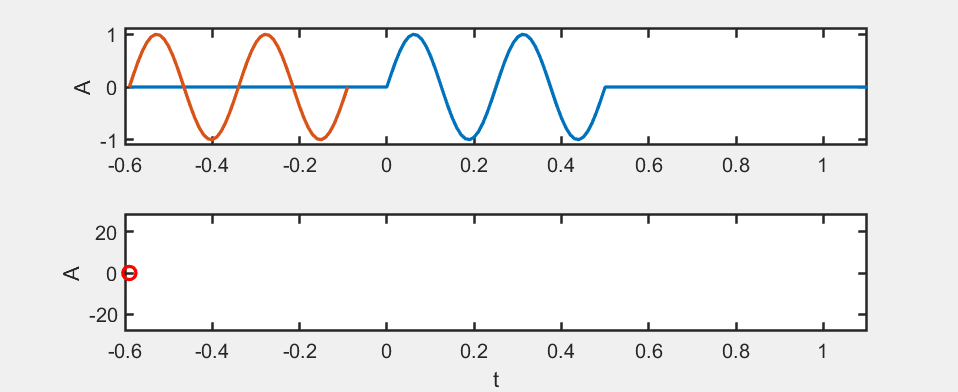
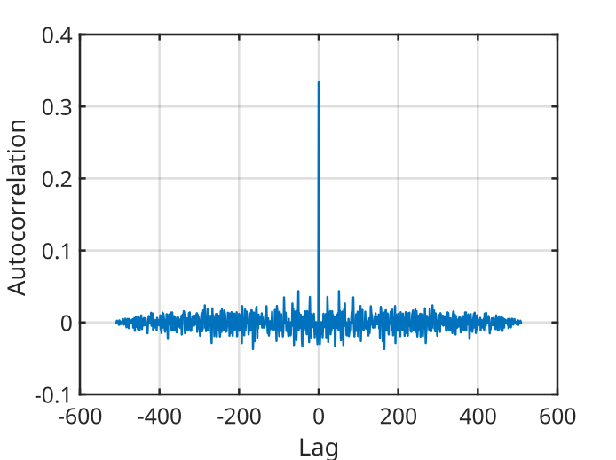
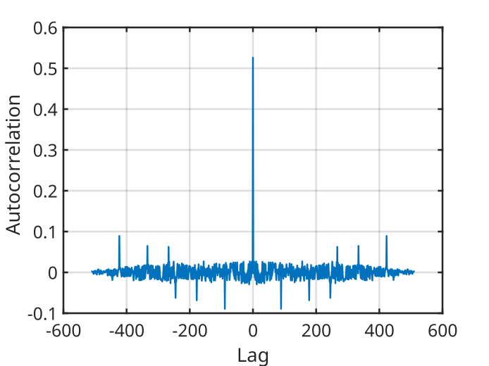
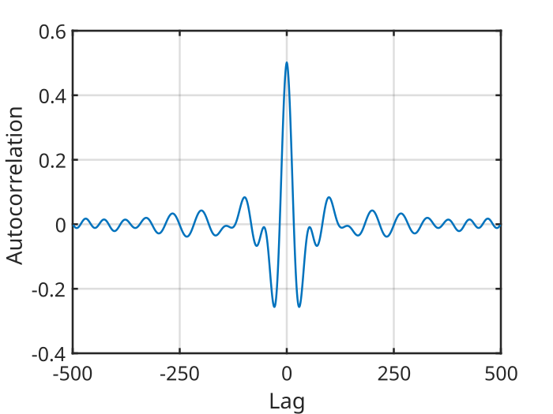
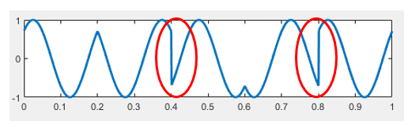
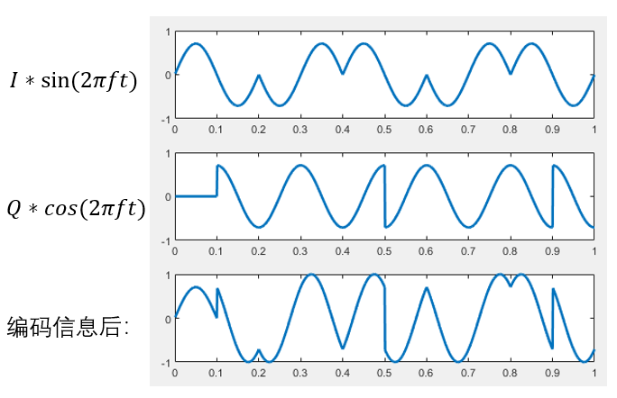
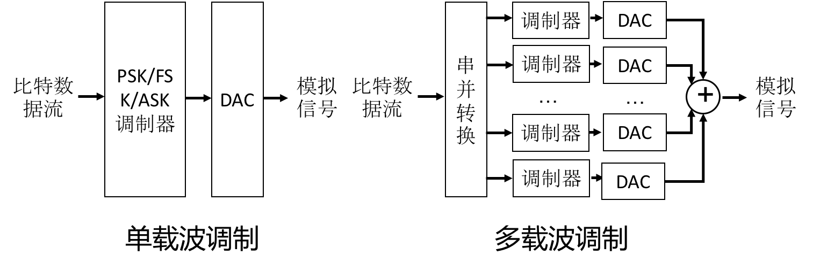

# Comprehensive Applications of Modulation Techniques

In wireless communication and sensing applications, the receiver usually needs to accurately detect and extract the signal transmitted by the sender in order to correctly decode the information. This process is referred to as **time synchronization** between the transmitter and the receiver. However, in most wireless communication and sensing scenarios, the transmitter and the receiver are not pre-synchronized in time, so the transmitted signal itself must be used to achieve time synchronization. The signal used for this purpose is called a **preamble**.

# Preamble

## Definition and Properties of a Preamble

In computer networks, a preamble is a signal used to synchronize data transmission between systems, ensuring that the receiver can correctly align and identify packets.

A preamble is crucial for maintaining efficient communication between network devices. Its key functions include:

- **Synchronization**: Ensuring that packets are properly aligned between systems.
- **Identification**: Helping the receiver identify packets.
- **Channel state detection**: Detecting the state and characteristics of the channel using a known signal.

A preamble must have good time-domain properties to enable precise time synchronization. This property is referred to as the **autocorrelation property**.

To better understand the autocorrelation property, we first introduce the autocorrelation function of a signal.

Assume a discrete-time signal is \( x[n] \). Its autocorrelation function is defined as

\[
R_{xx}[m] = E(x[m+n]x[n])
\]

where \( E(\cdot) \) denotes the mathematical expectation.
This function measures the similarity between different segments of the signal.

We use an animation to illustrate the computation of the autocorrelation function:

<center>

</center>

For the autocorrelation function, when \( m = 0 \), it reaches its maximum value, which corresponds to signal alignment. Therefore, the autocorrelation function can be used to achieve time synchronization.

To achieve more accurate time synchronization, a preamble should satisfy the following properties:

- When the preamble signal is aligned (\( m = 0 \)), the autocorrelation function has a maximum value.
- When the preamble signal is misaligned (\( m \neq 0 \)), the autocorrelation function is close to zero.

## Time Synchronization Using a Preamble

Given a preamble signal \( x[n] \) and a received signal \( y[n] \), time synchronization can be achieved by computing their **cross-correlation function**, defined as

\[
R_{xy}[m] = E(x[m+n]y[n])
\]

Due to the good autocorrelation property of the preamble signal, when the preamble signal and the received signal are aligned in time, the cross-correlation function reaches its maximum. Therefore, the time at which the cross-correlation function attains its maximum corresponds to the signal arrival time.

## Preamble Design

Extensive research has been conducted on the design of preambles. In this section, we introduce several representative preamble signals.

It should be noted that preamble signals designed for binary sequences and those designed for continuous functions are different. Here, we focus on preambles designed for continuous functions.

## Pseudorandom Signals

One of the simplest signals that can be used as a preamble is a pseudorandom signal generated using a random function.

```matlab
N = 128;
signal = rand(1,N)*2-1;
```

Its autocorrelation function is shown below:

<center>

</center>

It can be observed that pseudorandom signals have good autocorrelation properties and can be used as preambles.

However, pseudorandom signals generated using random functions lack regular structure. Many structured pseudorandom sequences have been proposed in existing research. One example is the **Zadoff–Chu (ZC) sequence**.

The ZC sequence is a complex-valued pseudorandom sequence defined as

\[
ZC[n] = \exp\left(j\pi\frac{u n (n + cf + 2q)}{N}\right)
\]

where \( N \) is the sequence length, \( u \) and \( n \) are integers satisfying \( 0 \le u,n < N \), and \( u \) is relatively prime to \( N \).
\( cf = N \bmod 2 \), and \( q \) is a positive integer.

The real part of this sequence can be used as the preamble signal:

\[
\Re(ZC[n]) = \cos\left(\pi\frac{u n (n + cf + 2q)}{N}\right)
\]

The autocorrelation function of this signal is shown below:

<center>

</center>

This signal can also serve as a preamble and is easier to generate.

Although pseudorandom signals have good autocorrelation properties, their frequency spectra typically occupy the entire bandwidth. In practice, it may be necessary to limit the bandwidth of the preamble to avoid noise or interference with other frequency bands. In such cases, bandwidth-limited preamble signals must be designed.

## Linear Frequency Modulated Signals

A linear frequency modulated (LFM) signal, also known as a **chirp signal**, has a frequency that varies linearly with time and can be expressed as

\[
x(t) = \cos\left(2\pi\left(f_{\min} t + \frac{1}{2}\frac{B}{T} t^2\right)\right)
\]

where \( f_{\min} \) is the minimum frequency, \( B \) is the bandwidth, and \( T \) is the signal duration.

The following code computes the autocorrelation function of an LFM signal:

```matlab
%% Generate signal
N = 500; fs = 20000;
t = 0:1/fs:(N-1)/fs;
fmin = 100; fmax = 500; B = fmax - fmin;
T = N/fs;
signal = cos(2*pi*(fmin*t + 0.5*(B/T)*t.^2));

%% Compute autocorrelation function
% Lag values (m)
lags = -(N-1):(N-1);
autocorr = zeros(1,2*N-1);
for m = lags
    if m < 0
         autocorr(m+N) = sum(signal(1:N+m).*signal(-m+1:N))/N;
    else
         autocorr(m+N) = sum(signal(m+1:N).*signal(1:N-m))/N;
    end
end

% Plot
plot(lags,autocorr,'lineWidth',1.5)
```

The resulting autocorrelation function is:

<center>

</center>

It can be seen that under limited bandwidth, the LFM signal exhibits good autocorrelation properties and can serve as a preamble for wireless communication and sensing.

> [!TIP]
> **Think:** In practical scenarios, how do frequency offset, phase offset, or multipath effects influence the preamble signal and the cross-correlation function?

# Integrated Modulation Methods

Amplitude modulation, frequency modulation, and phase modulation are the three most basic modulation methods. By modifying or combining these three methods, more efficient and noise-resilient modulation schemes can be developed. This section introduces modulation schemes derived from these basic methods, including pulse interval modulation, OQPSK, QAM, and OFDM.

## Pulse Interval Modulation

Pulse interval modulation encodes data using the time interval between two adjacent pulses. Specific interval lengths are used to represent particular binary sequences. The simplest form uses two interval lengths—a long interval and a short interval—to represent “0” and “1,” respectively. During decoding, the starting time of each pulse is detected, and the interval between pulses is measured to determine whether it represents “0” or “1.”

```
Figure. Principle of pulse modulation
```

Since pulse interval modulation uses a simple rule to encode “0” and “1” as different interval lengths, decoding can be performed by detecting pulse start times and measuring their intervals. This approach has very low computational complexity.

However, pulse interval modulation has low coding efficiency because sufficient time must be reserved between pulses.

Consider why sufficient time spacing is required.

Leaving sufficient spacing prevents echoes caused by multipath effects from interfering with the detection of the next pulse. To improve the data rate of pulse modulation, two approaches can be considered.

The first approach is to shorten the code length, either by reducing the interval between pulses or by shortening the pulse duration itself. Under the condition that decoding accuracy is maintained, more data can be transmitted within the same time.

```
Figure. Reducing pulse interval and pulse duration improves coding efficiency
```

The second approach is to use multiple interval lengths so that each symbol carries more information. As shown below, when two interval lengths are used, each symbol carries 1 bit; when four interval lengths are used, each symbol carries 2 bits; when eight interval lengths are used, each symbol carries 3 bits.

```
Figure. Using multiple interval lengths
```

Of course, the number of interval lengths cannot be increased indefinitely. As the difference between interval lengths becomes smaller, it becomes more difficult to distinguish them during decoding. Furthermore, if different symbols occur with different probabilities, the efficiency of pulse interval modulation can be further improved using **Huffman coding**. For example, if the number of “0”s in a file is greater than the number of “1”s, using a shorter interval to represent “0” and a longer interval to represent “1” can reduce the total transmission time.

## OQPSK

Examining the constellation diagram of QPSK, we observe that the phase transitions between symbols `00` and `11`, and between `10` and `01`, are all $\pi$. Such transitions cause abrupt phase changes in the modulated signal, as highlighted by the red circles in the figure below:

<center>

</center>
<center>
<div style="color:orange; border-bottom: 1px solid #d9d9d9; display: inline-block;color: #999;padding: 2px;">Figure. Phase inversions of π occur in QPSK modulation.</div>
</center>

These phase discontinuities are undesirable in practical systems, as they often lead to implementation difficulties—e.g., when passing through a low-pass filter, such phase inversions induce large amplitude fluctuations, thereby degrading decoding reliability.

To address this issue, Offset Quadrature Phase Shift Keying (OQPSK) is employed. OQPSK builds upon the I/Q structure of QPSK but introduces a half-symbol-period delay to the Q-channel relative to the I-channel. Consequently, transitions in the I- and Q-channels never occur simultaneously, limiting the maximum phase change to $\frac{\pi}{2}$.

The figure below illustrates the baseband I- and Q-signals of OQPSK, the two independently modulated signals, and their superimposed result.

<center>

</center>
<center>
<div style="color:orange; border-bottom: 1px solid #d9d9d9; display: inline-block;color: #999;padding: 2px;">Figure. I/Q baseband signals and the resulting modulated OQPSK waveform.</div>
</center>

## QAM

Previously discussed modulation schemes—BPSK, QPSK, and 8PSK—feature increasing numbers of constellation points. Can we extend this progression further, e.g., to 16PSK?

If 16 points are uniformly distributed on the unit circle, the angular spacing between adjacent points becomes smaller than in 8PSK, resulting in reduced noise immunity. Reconsidering the constellation diagram geometrically: interpreting it in polar coordinates, the argument (angle) of a point represents the signal’s phase, while its radial distance from the origin corresponds to the signal’s amplitude. To increase the minimum Euclidean distance between adjacent constellation points, we must relax the constraint that all points lie on the unit circle. This necessitates **combining amplitude and phase modulation**, known as Quadrature Amplitude Modulation (QAM). In contrast to BPSK, QPSK, or 8PSK—where signal amplitude remains constant—QAM permits simultaneous variation of both amplitude and phase.

The figure below shows constellation diagrams for 16-QAM, 32-QAM, and 64-QAM:

<center>

</center>
<center>
<div style="color:orange; border-bottom: 1px solid #d9d9d9; display: inline-block;color: #999;padding: 2px;">Figure. Constellation diagrams for 16-QAM, 32-QAM, and 64-QAM.</div>
</center>

QAM further increases the information content per symbol, thereby enhancing spectral efficiency.

> Exercise: Based on prior implementations of BPSK and QPSK, how would you implement a QAM algorithm?

## OFDM

Orthogonal Frequency Division Multiplexing (OFDM) is a widely adopted modulation technique in IEEE 802.11 standards. Protocols including 802.11a, 802.11g, 802.11n, and 802.11ac all employ OFDM—indeed, OFDM has been instrumental in dramatically increasing Wi-Fi data rates. Thus, OFDM is a technology intimately tied to everyday life, operating continuously around us.

You may have noticed that earlier modulation schemes—including BPSK, QPSK, 8PSK, and QAM—all operate on a *single* carrier frequency, i.e., $f$. To further improve transmission efficiency, a natural idea is to utilize *multiple* frequencies, each carrying independent data modulated via BPSK, QPSK, 8PSK, or QAM. Provided the receiver can separate and decode each frequency component individually, the aggregate data rate clearly increases. This is precisely the core principle of OFDM, where the “O” stands for *orthogonal*: multiple orthogonal subcarriers are used so that their superimposed waveforms do not interfere with one another.

To elucidate OFDM’s underlying principle, we first introduce **Multi-Carrier Modulation (MCM)**. OFDM is a specific class of MCM.

In MCM, the data stream is partitioned across multiple frequencies: the serial bit stream is split into parallel substreams, each assigned to a distinct subcarrier for transmission. The following figure contrasts MCM with conventional single-carrier modulation:

<center>

</center>
<center>
<div style="color:orange; border-bottom: 1px solid #d9d9d9; display: inline-block;color: #999;padding: 2px;">Figure. Comparison of single-carrier and multi-carrier modulation principles.</div>
</center>

As shown, single-carrier modulation transmits only one signal, whereas MCM transmits multiple non-overlapping signals simultaneously—each occupying a distinct frequency band.

Intuitively, the simplest method to separate these signals at the receiver is to use bandpass filters. However, in practice, such an approach is unnecessary. A key requirement for effective filtering is minimal inter-carrier interference (ICI); thus, judicious selection of subcarrier frequencies constitutes a critical design challenge in MCM.

> Exercise: How should subcarrier frequencies be selected in MCM to minimize mutual interference?

A straightforward approach is to maximize the frequency separation between adjacent subcarriers—reducing interference at the cost of spectral inefficiency.

OFDM proposes an alternative solution. Let the time-domain expression of the $k$-th subcarrier be $m$, where $\phi_m(t)=e^{j2\pi f_m t}$ denotes the frequency of the $k$-th subcarrier. To minimize interference between any two distinct subcarriers, we require them to be *orthogonal*. But what does orthogonality between two frequencies mean?

This concept is abstract: orthogonality ensures that during demodulation, signals corresponding to different subcarriers remain decoupled. Formally, we define orthogonality over one symbol duration $f_m$ as zero inner product between the two corresponding sinusoidal waveforms. We now explain why this property guarantees interference-free superposition. Let

$$
\int_0^{T_c}e^{j2\pi f_i t}(e^{j2\pi f_j t})^*dt=\int_0^{T_c}e^{j2\pi (f_i-f_j) t}dt=\frac{sin(\pi \Delta f T_c)}{\pi \Delta f}e^{j\pi \Delta f T_c}=0
$$

where $m$. From this equation, orthogonality requires $T_c$, where $\Delta f = f_i-f_j$ is a positive integer—i.e., the frequency difference between any two subcarriers must be an integer multiple of $\Delta f = \frac{n}{T_c}$. Hence, we can design subcarrier frequencies such that adjacent subcarriers differ by exactly $n$—this is precisely the subcarrier spacing adopted in OFDM. If the lowest-frequency subcarrier is set to $\frac{1}{T_c}$, then all subcarrier frequencies become integer multiples of $\frac{1}{T_c}$.

To deepen understanding of “orthogonality,” refer to the figure below:

<center>

</center>
<center>
<div style="color:orange; border-bottom: 1px solid #d9d9d9; display: inline-block;color: #999;padding: 2px;">Figure. Subcarrier orthogonality in OFDM.</div>
</center>

Each subcarrier has symbol duration $\frac{1}{T_c}$, so their spectra vanish at intervals of $\frac{1}{T_c}$. When subcarriers spaced by $T_c$ are superimposed, their spectral samples at adjacent subcarrier frequencies exhibit no mutual interference—for instance, the spectra of subcarriers 2 and 3 both equal zero at $\frac{1}{T_c}$.

## OFDM Implementation

Thus, OFDM can be implemented as follows: generate multiple orthogonal subcarriers; apply a conventional modulation scheme (e.g., BPSK or QPSK) to each subcarrier; and sum the resulting waveforms to produce the final OFDM signal.

Here, we demonstrate a simplified OFDM transceiver using QPSK-modulated baseband signals and four orthogonal subcarriers. For code simplicity, channel noise injection is omitted.

Modulator:

```matlab
function OFDMmodulator(codes, fileName)
% Input arguments:
% codes: Binary data sequence to modulate (array of 0s and 1s)
% fileName: Local filename for saving the generated signal
% Example usage:
% OFDMmodulator([1,1,0,0,1,0,1,0], 'data')
% Output:
% Generates 'data.wav' in the current directory
fs = 48000;
T = 0.025;
N = 4;    % Number of OFDM subcarriers
f = (1 : N)' / T;

% Pad input length to nearest multiple of 8 (4 subcarriers × 2 bits per QPSK symbol)
cLen = length(codes);
L = 2 * N;
add0 = mod(cLen, L);
if add0 ~= 0
    codes = [codes, zeros(1, L - add0)];
    cLen = cLen + L - add0;
end

% Generate I and Q basis signals
sigI = sin(2 * pi * f * (0 : 1/fs : T - 1/fs));
sigQ = cos(2 * pi * f * (0 : 1/fs : T - 1/fs));

% Generate baseband signals and sum
sigL = size(sigI, 2);
sig = zeros(N, sigL * cLen / L);
for i = 1 : cLen / L
    fI = (1 - 2 * codes(i * L - 7 : 2 : i * L))' * sqrt(2) / 2;
    fQ = (1 - 2 * codes(i * L - 6 : 2 : i * L))' * sqrt(2) / 2;
    sig(:, (i - 1) * sigL + 1 : i * sigL) = fI .* sigI + fQ .* sigQ;
end

% Sum all four subcarrier signals
sig = sum(sig, 1);
% Normalize peak amplitude to unity
sig = sig / max(abs(sig));

audiowrite([fileName, '.wav'], sig, fs);

end
```

The transmitter can play the modulated audio—feasible directly on smartphones—and the receiver captures it via microphone recording. Demodulation is then performed using the algorithm below, mirroring real-world wireless communication.

Demodulator:

```matlab
function codes = OFDMdemodulator(fileName)
% Input argument:
% fileName: Filename of the modulated signal file
% Output:
% codes: Demodulated binary sequence (array of 0s and 1s)
% Example usage (requires 'data.wav' in current directory):
% OFDMdemodulator('data')
% Output:
% Returns [1,1,0,0,1,0,1,0]
[sig, fs] = audioread([fileName, '.wav']);
sig = sig';
T = 0.025;
N = 4;
f = (1 : N)' / T;
L = 2 * N;

% Generate I and Q basis signals
sigI = sin(2 * pi * f * (0 : 1/fs : T - 1/fs));
sigQ = cos(2 * pi * f * (0 : 1/fs : T - 1/fs));
sigL = size(sigI, 2);
sigI = reshape(sigI', 1, sigL, N);
sigQ = reshape(sigQ', 1, sigL, N);

% Precompute standard baseband waveforms for the four QPSK constellation points,
% stored in a 4×sigL×N array (rows = constellation points, pages = subcarriers)

sigMat = sqrt(2) / 2 * (...
    [1; 1; -1; -1] .* repmat(sigI, 4, 1, 1) + ...
    [1; -1; 1; -1] .* repmat(sigQ, 4, 1, 1));

cLen = L * length(sig) / sigL;
codes = zeros(1, cLen);

for i = 1 : cLen / L
    seg = repmat(sig((i - 1) * sigL + 1 : i * sigL), N, 1);
    % Compute correlation (discrete inner product) between received segment and each reference waveform.
    % Larger correlation magnitude indicates higher similarity.
    [~, maxI] = max(sum(sigMat .* seg, 2), [], 1);
    codes(i * L - 7 : 2 : i * L) = maxI(:)' > 2;
    codes(i * L - 6 : 2 : i * L) = mod(maxI(:)', 2) == 0;
end

end
```

Similar to QPSK, the demodulator constructs standard baseband waveforms using multidimensional arrays. Compare this implementation against single-carrier QPSK and identify the code segments exploiting subcarrier orthogonality to reinforce your conceptual understanding of OFDM.

If the above MATLAB implementation were ported to smartphones—leveraging built-in speaker playback and microphone recording—it would readily form a functional acoustic wireless communication system. Many cutting-edge research papers and applications on audio-based data transmission build upon this foundation—for example, dedicated studies on acoustic OFDM. Here, we present the core methodology directly. With this understanding, you are encouraged to experiment hands-on.

Note: For pedagogical clarity, the provided OFDM implementation differs slightly from industrial practice. Specifically, it explicitly generates orthogonal sinusoidal subcarriers, applies modulation per subcarrier, and sums the results.

In reality, OFDM modulation avoids explicit sine-wave generation. Instead, the Inverse Fast Fourier Transform (IFFT) maps data symbols onto subcarrier coefficients, directly synthesizing the time-domain waveform. At the receiver, the Fast Fourier Transform (FFT) extracts subcarrier coefficients for demodulation.

For details on FFT/IFFT implementation, refer to the Fourier Analysis chapter.

- Transmitter: Given transmitted data $c_k$ and basis $x[n] = \frac{1}{N}\sum_{k=0}^{N-1} c_k e^{j2\pi \frac{k}{N}n}.$, the time-domain signal $x[n]$ is generated. This signal exhibits two key properties:
  - It comprises multiple orthogonal frequency components: $e^{j2\pi \frac{k}{N}n}$
  - Each orthogonal frequency’s coefficient encodes information—e.g., $c_k = I_k + Q_k*j$.
- Receiver: Upon receiving the signal, Fourier analysis (via FFT) recovers the subcarrier coefficients $c_k$, enabling reconstruction of $I_k$ and $Q_k$ and subsequent data demodulation.

> Based on this core principle, attempt implementing OFDM yourself and reflect on the advantages of this approach.

Of course, a production-grade OFDM implementation involves additional complexities—e.g., cyclic prefix insertion, channel estimation, and error correction. Once the fundamentals are grasped, however, these extensions become significantly easier to understand. We strongly encourage you to implement a complete OFDM system end-to-end—you will gain substantial insight. With the foundational knowledge presented here, rest assured: implementing OFDM is far less daunting than it may initially appear.

## References and Further Reading

1. *Signals and Systems (Second Edition)*
