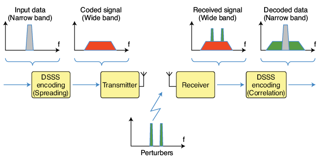
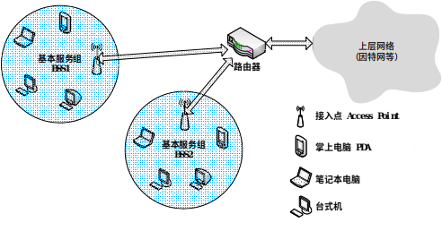

# Introduction

Having mastered the underlying modulation and demodulation technologies, what remains is to implement the various wireless transmission protocols required for the Internet of Things (IoT) scenarios based on this suite of technologies. This section focuses on wireless protocols, with the assumption that readers already have a solid understanding of wired protocols from their studies in computer networks.

Based on the diverse requirements of IoT applications, the wireless protocols used in the IoT can be broadly categorized into four types, distinguished by transmission power consumption and communication range. First are the long-range, high-rate transmission protocols, typified by cellular network communication technologies such as 3G, 4G and 5G—these are the mainstream technologies currently used for mobile communications. Second are the short-range, high-rate transmission technologies including WiFi and Bluetooth, which cover a communication range of tens to hundreds of meters. Widely adopted in household and daily scenarios, the first two categories are the wireless protocols most commonly used by general users, and they align with the core characteristics and requirements of traditional network applications. Third are the short-range, low-power transmission technologies such as ZigBee, RFID and Bluetooth Low Energy (BLE) in traditional IoT systems. As newly developed technologies for the IoT, they support low-rate data transmission over short distances. Fourth are the long-range, low-power transmission technologies. Most of the first three types of technologies demand a relatively high signal-to-noise ratio (SNR) and have poor obstacle penetration capability, making them unable to achieve long-range, low-power transmission in complex environments. Low-Power Wide-Area Network (LPWAN) technologies fill this technical gap: they enable long-range communication (from several kilometers to tens of kilometers) at an extremely low power consumption and support communication under ultra-low SNR conditions.

In IoT communications, communication range, data rate and power consumption form a trilemma—these three performance metrics are generally difficult to optimize simultaneously. Trade-offs must be made according to specific requirements in practical design. For example, WiFi prioritizes a high data rate, with appropriate compromises on communication range and power consumption. Similarly, the mobile communication technologies used in cell phones give priority to communication range and data rate, relaxing the requirements for power consumption. In essence, the fundamental underlying technologies and their inherent limitations remain unchanged. On the one hand, researchers and engineers design wireless communication technologies tailored to different scenarios, such as WiFi, Bluetooth and 5G. On the other hand, they strive to push the performance of existing technologies to approach their theoretical limits under given technical constraints.
# Wi-Fi

Today, Wireless Local Area Network (WLAN) technology—commonly known as Wi-Fi—is one of the most important means for people to access the Internet in daily life. A Wi-Fi network provides Internet connectivity to numerous users within a defined area (e.g., homes, campuses, restaurants, airports) via one or more compact access points (APs). Prior to the IEEE’s standardization of the IEEE 802.11 specification for WLANs, many incompatible proprietary WLAN standards existed. This fragmentation forced users to install different types of network interface cards (NICs) depending on location—for instance, installing one NIC type to connect in a restaurant (Area A), then replacing it with another to connect in an office (Area B). Beyond wasting time and increasing hardware costs, overlapping coverage areas among heterogeneous protocols caused severe radio interference, degrading overall network performance. To unify and standardize WLAN behavior, the IEEE has developed the IEEE 802.11 family of standards since the 1990s.

## 1. Brief History of IEEE 802.11

As shown in Table 1, differences among IEEE 802.11 variants primarily lie in their physical-layer characteristics—including operating frequency bands, modulation schemes, and channel spacing. Two primary frequency bands are used in IEEE 802.11:
- The 2.4–2.485 GHz ISM band, and
- The higher-frequency 5.1–5.8 GHz band.

Because the 2.4–2.485 GHz band is unlicensed and shared with microwave ovens, cordless phones, and wireless sensor networks, it tends to suffer from higher noise and interference. In contrast, the 5.1–5.8 GHz band is more susceptible to line-of-sight propagation constraints and multipath effects, limiting its effective indoor coverage range. Different modulation schemes support varying data rates; in noisy or weak-link environments, reducing the bit rate per symbol interval helps ensure error-free transmission. Below we summarize key physical-layer features across the IEEE 802.11 protocol family.

**Table 1. Comparison of IEEE 802.11 Protocols**

| IEEE 802.11 Protocol | Release Year | Frequency Band (GHz) | Maximum Data Rate | Modulation Scheme |
|----------------------|--------------|-----------------------|---------------------|-------------------|
| IEEE 802.11-1997     | 1997         | 2.4                   | 2 Mbps              | DSSS              |
| IEEE 802.11a         | 1999         | 5                     | 54 Mbps             | OFDM              |
| IEEE 802.11b         | 1999         | 2.4                   | 11 Mbps             | DSSS              |
| IEEE 802.11g         | 2003         | 2.4                   | 54 Mbps             | DSSS or OFDM      |
| IEEE 802.11n         | 2009         | 2.4 / 5               | 100 Mbps            | OFDM              |
| IEEE 802.11ac        | 2014         | 5                     | 866.7 Mbps          | OFDM              |
| IEEE 802.11ax        | 2019         | 2.4 / 5               | 9608 Mbps           | OFDMA             |

- **(1)** The original IEEE 802.11-1997 standard, released in June 1997, employed Direct Sequence Spread Spectrum (DSSS) in the 2.4–2.485 GHz band, supporting data rates of 1 Mbps and 2 Mbps.

- **(2)** In September 1999, IEEE 802.11a and IEEE 802.11b were released concurrently.
  - IEEE 802.11a adopted Orthogonal Frequency Division Multiplexing (OFDM) in the higher-frequency 5.1–5.8 GHz band, achieving up to 54 Mbps. Due to its higher operating frequency, its indoor coverage range is somewhat smaller.
  - IEEE 802.11b used High-Rate DSSS (HR-DSSS) in the 2.4–2.485 GHz band, supporting up to 11 Mbps.
  Notably, IEEE 802.11a and IEEE 802.11b are mutually incompatible.

- **(3)** Released in June 2003, IEEE 802.11g adopted the same OFDM modulation as IEEE 802.11a, retaining its maximum data rate of 54 Mbps. Simultaneously, it operated in the same 2.4–2.485 GHz band as IEEE 802.11b and maintained backward compatibility with IEEE 802.11b devices—though coexistence with legacy devices reduces the effective throughput of the 802.11g network.

- **(4)** Released in October 2009, IEEE 802.11n extended OFDM with Multiple-Input Multiple-Output (MIMO) antenna technology, enabling up to 100 Mbps. It supports both the 2.4–2.485 GHz and 5.1–5.8 GHz bands.

- **(5)** Released in January 2014, IEEE 802.11ac introduced multi-user MIMO (MU-MIMO), wider RF bandwidth (up to 160 MHz), and higher-order modulation (up to 256-QAM), positioning itself as the natural successor to IEEE 802.11n.

Despite significant physical-layer differences, all IEEE 802.11 standards share identical upper-layer architectures and medium access control (MAC) protocols. For instance:
- The MAC layer universally employs Carrier Sense Multiple Access with Collision Avoidance (CSMA/CA);
- Data frame structures at the data link layer are standardized;
- Both infrastructure (base station–based) and ad hoc (peer-to-peer) network topologies are supported.

We will now examine these commonalities in detail.

After reading the above content—and encountering a cascade of technical terms—you may feel overwhelmed. Don’t worry: in the following chapters, you’ll implement many of these techniques hands-on, thereby gaining deep, intuitive understanding of foundational communication concepts.

Note the table above: OFDM is the predominant modulation technique used in Wi-Fi. DSSS (Direct Sequence Spread Spectrum) is literally translated as *direct sequence spread spectrum*. While many network terminology translations are accurate and intuitive, others are less so. For example, *routing* is conventionally translated as “routing,” but “path-finding” would arguably convey its meaning more directly—e.g., “routing algorithm” → “path-finding algorithm.” Though the term “routing” is now widely accepted, beginners often find “path-finding” more immediately comprehensible.

Most technical terms are direct English-to-Chinese translations. When learning, start by interpreting them literally—you’ll often deduce their meaning accurately.
“Direct sequence spread spectrum” literally means expanding the signal’s frequency spectrum using a predefined sequence before transmission. Two natural questions arise: *How does sequence-based spreading work? Why spread the spectrum at all?*
If you have substantial exposure to communications engineering, you’ll frequently encounter the concept of *spreading*. Simply put, before transmitting raw bits, the bit sequence is expanded into a longer sequence—each element of which is called a *chip*. As illustrated below, one bit maps to multiple chips; modulation/demodulation is then performed on these chips—not the original bits. This is the core idea behind DSSS. Indeed, recall that CDMA uses a closely related principle. As shown in the figure, spreading is mathematically equivalent to multiplying the original data sequence by a spreading code.

Figure. Illustration of DSSS (Direct Sequence Spread Spectrum)

So why does DSSS achieve spectral spreading—and what benefits does it provide?

From the figure below, we observe that after spreading, the originally narrowband signal occupies a much wider bandwidth during transmission—consuming more spectrum. Intuitively, occupying more spectrum makes the signal inherently more robust against narrowband interference. For example, if narrowband noise occurs at some frequency, only a portion of the spread spectrum is affected—not the entire signal. At the receiver, how do we mitigate the impact of such partial interference? Typically, we *despread* the received signal—i.e., concentrate the energy of the desired data back into its original narrowband form (note: spreading occurs at the transmitter; despreading at the receiver). Crucially, this process also spreads the interfering signal—thereby reducing its peak power density. Hence, DSSS achieves interference resilience.

How do we realize energy concentration for the desired signal—and simultaneous spreading of interference—at the receiver? The answer is straightforward: multiply the received signal by the *same* spreading code used at the transmitter. If the spreading code is designed such that its autocorrelation yields unity (i.e., $ \mathbf{c} \cdot \mathbf{c} = 1 $), the original bit sequence can be perfectly recovered.

For example, suppose the original bit is \( b \), and the spread version is \( b \cdot \mathbf{c} \), where \( \mathbf{c} \) denotes the spreading code vector. Modulation/demodulation proceeds on \( b \cdot \mathbf{c} \). During despreading, the received signal \( r = b \cdot \mathbf{c} + n \) is multiplied by \( \mathbf{c} \), yielding \( r \cdot \mathbf{c} = b (\mathbf{c} \cdot \mathbf{c}) + n \cdot \mathbf{c} \). By selecting \( \mathbf{c} \) such that \( \mathbf{c} \cdot \mathbf{c} = 1 \), we recover \( b \).

Note that CDMA operates identically: distinct transmitters employ orthogonal spreading codes (i.e., \( \mathbf{c}_i \cdot \mathbf{c}_j = 0 \) for \( i \neq j \)); thus, multiplying the composite received signal by \( \mathbf{c}_i \) recovers only user \( i \)’s data without interference from others. We’ll elaborate on CDMA later—but for now, reflect on the DSSS diagram: many communication techniques share similar conceptual foundations.

Figure. Effect of DSSS Spreading

## 2. Star-Network Topology

Within the IEEE 802.11 architecture, the most fundamental building block is the Basic Service Set (BSS), comprising one base station (called an Access Point or AP in IEEE 802.11) and multiple wireless clients. As shown in Figure 2, each circular region represents a BSS. Each AP connects to the upper-layer public network (e.g., the Internet) via wired infrastructure—typically switches or routers.

Figure. WLAN Architecture

<!-- Figure 2. WLAN Architecture -->

Each AP broadcasts one or more Service Set Identifiers (SSIDs). On Windows systems, right-clicking the “Wireless Network Connection” icon in Control Panel → Network Connections → opens a menu; selecting “View Available Wireless Networks” lists all detectable APs and their SSIDs. AP administrators also assign a specific frequency channel for communication. IEEE 802.11b/g operates in the 2.4–2.485 GHz band (85 MHz total bandwidth), dividing it into 11 overlapping channels. Non-overlapping channels must be separated by at least four intermediate channels. For instance, channels 1, 6, and 11 are mutually non-overlapping. Thus, deploying three APs on channels 1, 6, and 11 in a classroom ensures interference-free operation. However, adding a fourth AP—say, on channel 9—will interfere with APs on channels 6 and 11.

## 3. Medium Access Control (MAC) Protocol

Earlier sections described modulation/demodulation techniques for point-to-point communication—e.g., between a device and an AP. But when multiple devices share the same wireless medium, collisions become inevitable due to the broadcast nature of radio transmission.

Resolving such contention falls to the Medium Access Control (MAC) layer—the subject of this subsection.

Similar to earlier terminology, “Medium Access Control” is a literal translation: *medium* refers to the shared communication channel; *access* denotes how devices gain usage rights to transmit. Here, “access” could equally be rendered as “use”—which may enhance clarity (though “access” remains standard, e.g., in security contexts like “access control”). Fundamentally, access control regulates *when*, *in what order*, and *under what priority* multiple devices may use the channel. This objective has spawned numerous MAC protocols—some emphasizing fairness, others prioritizing critical traffic, and still others balancing priority with fairness. Consequently, MAC protocol design remains a central research topic in networking—especially in wireless networking. Whenever you encounter a novel network paradigm—or conduct research atop one—revisiting MAC design is always a productive first step. Later, we’ll discuss emerging domains such as wireless sensor networks and LPWANs, where we ourselves have conducted extensive MAC protocol research.

Specifically in Wi-Fi, each AP may serve multiple clients, and multiple APs may coexist within a given area. Consequently, two or more clients may attempt to transmit simultaneously on the same channel—causing mutual interference and packet loss. To coordinate channel access, IEEE 802.11 adopts Carrier Sense Multiple Access with Collision Avoidance (CSMA/CA). CSMA dictates that a node first listens to the channel before transmitting; if the channel is busy, transmission is deferred. CSMA/CA adds a further precaution: even if the channel appears idle, the node waits a random backoff interval before transmitting—thereby reducing collision probability.

Although Ethernet also uses CSMA, its MAC protocol differs significantly from IEEE 802.11’s:

- First, wireless links suffer higher bit-error rates due to interference and fading. Hence, IEEE 802.11 mandates link-layer acknowledgment (ACK) and retransmission mechanisms. Ethernet, with its highly reliable wired links, does not enforce such mechanisms.

- Second, Ethernet employs Carrier Sense Multiple Access with Collision Detection (CSMA/CD): a node transmits immediately upon detecting an idle channel, while simultaneously monitoring for collisions. Upon detecting a collision, it aborts transmission and retries after a random delay. IEEE 802.11 avoids CSMA/CD for two main reasons:

  - **(1)** Collision detection requires full-duplex capability (simultaneous transmission and reception). In wireless systems, transmitted signal power vastly exceeds received signal power—making collision-detection hardware prohibitively expensive.

  - **(2)** Even with full-duplex radios, path loss and the hidden-terminal problem prevent reliable detection of *all* possible collisions.

In IEEE 802.11, once a client begins transmitting a frame, it continues until the entire frame is sent—regardless of collisions. Without CSMA/CD, uncoordinated full-frame transmissions in multi-client environments severely degrade aggregate throughput—especially for long frames, where collision probability rises sharply. To mitigate this, IEEE 802.11’s CSMA/CA mechanism employs a series of strategies…
