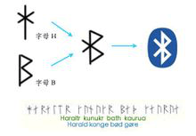
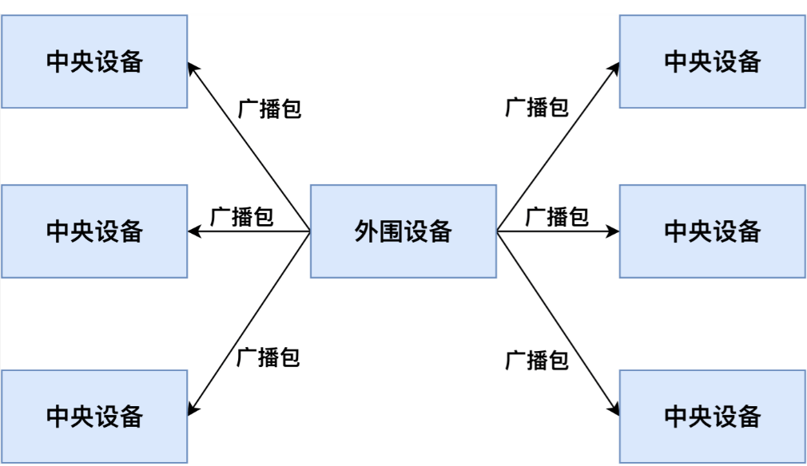
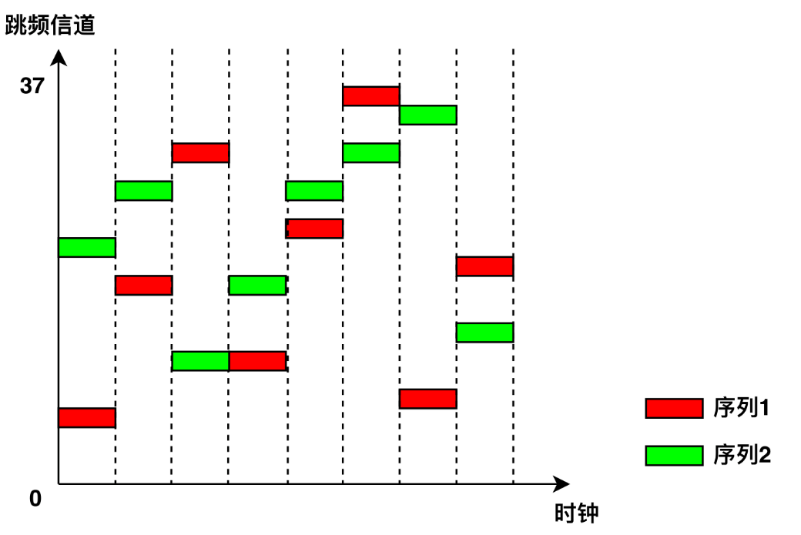
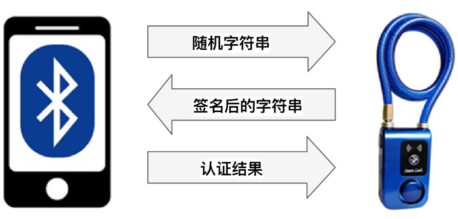
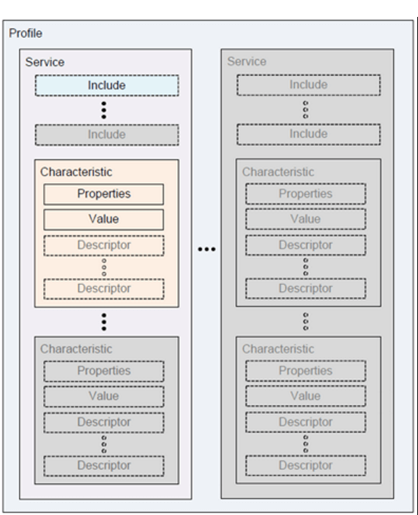

# Bluetooth

WiFi is suitable for short-range, high-bandwidth transmission scenarios and has been widely adopted in data communication between computers and mobile phones.  
With the development of the Internet of Things (IoT), an increasing number of devices require network connectivity, yet their bandwidth demands are relatively low. For instance, data transmission from wearable devices such as smartwatches and fitness bands does not require high throughput. To address such short-range, low-bandwidth communication needs, the Bluetooth protocol was developed.

Thus, we return to our earlier point: technological constraints exist—our task is to leverage technology effectively to meet diverse application requirements.

## 1. Background of Bluetooth

The name "Bluetooth" originates from Harald Blatand, a 10th-century Danish king whose name translates to "Harold Bluetooth" in English. In 1994, Ericsson, a Swedish telecommunications company, developed a new type of short-range wireless communication technology aimed at establishing a standard for wireless communication among personal devices within a Personal Operating Space (POS). POS typically refers to the space within approximately 10 meters around a user, where the user may be stationary or moving. During the preparatory phase of the industry alliance, a compelling name was needed to represent this advanced technology. After a night of discussions on European history and future wireless technologies, some members proposed naming it after King Blatand. The king had united present-day Norway, Sweden, and Denmark—just as this emerging technology would unify coordination across different industrial sectors such as computing, mobile communications, and automotive industries. Thus, the name was chosen.

The Bluetooth logo was originally designed by a Scandinavian company when the commercial association was announced. The logo preserves the traditional characteristics of the name, incorporating the ancient Norse runes for "Hagall" (ᚼ), which visually resembles both an asterisk and a "B"—elements that can be discerned upon close inspection of the logo.

Figure. Bluetooth Logo

Bluetooth technology is maintained by the Bluetooth Special Interest Group (SIG). Founded in 1998, the organization includes international communication giants such as Ericsson, IBM, Intel, Toshiba, and Nokia. In March 1998, Bluetooth became the IEEE 802.15.1 standard. The physical layer of Bluetooth uses frequency-hopping spread spectrum modulation, operating in the 2.402 GHz–2.480 GHz band, with typical data rates reaching about 1 Mbps. In Bluetooth communication, devices assume one of two roles: master or slave. A single device can switch between these roles. One master device can simultaneously communicate with up to seven slave devices. At any given time, the master can send information to any individual slave or use broadcast mode to transmit data to multiple slaves simultaneously. With advancements leading to Bluetooth 5.0, data rates have exceeded 100 Mbps, meeting the demands of modern applications. Additionally, to support low-power connectivity requirements in IoT applications, Bluetooth introduced a Low Energy version—BLE (Bluetooth Low Energy).

The introduction of Bluetooth technology immediately attracted global attention and was named one of the "Top Ten Hottest New Technologies of the Decade" by *Network Computing* magazine in the United States. It was hailed as a solution to replace wired connections—"ending the cable nightmare"—enabling true freedom of movement. Indeed, Bluetooth has found widespread use across various domains including mobile devices (phones, PDAs), personal computers, and wireless peripherals (e.g., Bluetooth headsets, mice, keyboards, GPS units, medical devices, and gaming platforms like PS3 and Wii).

Bluetooth 4.0, released by the Bluetooth SIG on July 7, 2010, is an upgraded version of traditional Bluetooth, integrating three modes: High Speed, Classic Bluetooth, and Bluetooth Low Energy (BLE). These modes serve distinct application needs—high-speed data exchange, general communication and device connection, and low-bandwidth device connectivity, respectively.

Bluetooth 5.0, introduced by the Bluetooth Technology Alliance in 2016, enhances performance and efficiency for low-power devices and introduces positioning capabilities based on Angle of Arrival (AoA) and other techniques. We will discuss Bluetooth-based positioning in more detail later.

Bluetooth® is a wireless technology standard enabling short-range data exchange between fixed devices, mobile devices, and personal systems using UHF radio waves in the ISM band (2.4–2.485 GHz). Bluetooth Low Energy (BLE), introduced in Bluetooth 4.0, targets emerging applications such as healthcare products, wearables, and smart home devices. Compared to Classic Bluetooth, BLE significantly reduces power consumption and cost while maintaining comparable communication range.

Typically, Classic Bluetooth is used in applications requiring stable, high-frequency data transmission—such as Bluetooth headsets, speakers, mice, etc.—while BLE is commonly employed in devices with low data volume and infrequent transmissions, such as fitness trackers, smartwatches, and medical sensors like heart rate monitors. Using BLE greatly extends standby time for these devices.

Due to significant simplifications in communication and data access control procedures compared to Classic Bluetooth, BLE generally offers weaker security. In recent years, numerous security vulnerabilities in BLE devices have been reported.

## 2. Exploring BLE Workflow

Next, we analyze the main workflow of BLE communication to help readers understand how Bluetooth connections are established and data transferred. This also clarifies key technical aspects of BLE, such as how frequency hopping is implemented.

In a complete BLE communication session, two roles are required: the **Central Device** and the **Peripheral Device**. The peripheral device typically holds the data—for example, a fitness tracker or a smart lock. The central device acts as the data requester—such as a smartphone or tablet. The central device establishes a connection with the peripheral, then reads/writes data to synchronize information or sends control commands to change the device's state.

Figure 2.1 illustrates the workflow of a full BLE communication cycle. When a peripheral device starts operating, it continuously broadcasts undirected advertising packets so that central devices can discover it. Upon receiving an advertisement, a central device may send a connection request to establish a BLE link. After accepting the request, the peripheral and central devices negotiate a shared frequency-hopping sequence and establish a connection. Subsequently, they use this hopping sequence to exchange data packets. Once connected, the central device may choose to encrypt communications or perform authentication to access protected data on the peripheral. Then, it can issue read/write requests to interact with specific data. If the central device meets the encryption and authentication requirements, the peripheral executes the requested operation and returns the corresponding data. After communication ends, either device can terminate the connection, after which the peripheral resumes broadcasting.

We will explore each step in greater detail in subsequent sections.

Figure. BLE Device Workflow

### 2.1 Advertising Mode

BLE operates in the same ISM frequency band (2.400–2.4835 GHz) as Classic Bluetooth. While Classic Bluetooth uses 79 channels of 1 MHz width, BLE uses 40 channels of 2 MHz width [35]. When a peripheral device begins operation, it continuously transmits advertising packets over channels 37, 38, and 39 to allow central devices to discover and connect to it. These advertising packets contain the peripheral’s MAC address, manufacturer information, and its connectability status—indicating whether it accepts incoming connection requests. Connectability can be configured via the Generic Access Profile (GAP) [36]. Most BLE devices are connectable because they need to establish connections for data synchronization or command reception.

As shown in Figure 2.2, all central devices within BLE range can receive the peripheral’s advertising packets. Typically, central devices identify different peripherals using the MAC address and manufacturer data in the advertisements, allowing them to select a target for connection. Once a connection is established between a central and a peripheral device, the peripheral stops broadcasting, preventing other centrals from connecting to it.

Figure. Network Topology in Advertising Mode

### 2.2 Establishing Connection

After receiving an advertising packet, a central device can send a connection request (CONN_REQ packet) to initiate a connection. Like Classic Bluetooth, BLE employs frequency-hopping across the remaining 37 data channels. For reliable communication, both devices must agree on a common hopping sequence. The central device sends a CONN_REQ packet containing hopping parameters such as hop interval, hop increment, MAC addresses, and initial CRC value. Upon receiving this packet, the peripheral computes the agreed-upon hopping sequence, enters the connected state, and stops advertising. Both devices then follow the same hopping pattern to transmit data packets on synchronized channels. Frequency hopping ensures that multiple BLE devices in proximity do not interfere with each other, enhancing overall system stability (as illustrated in Figure 2.3).

Figure. Illustration of BLE Frequency Hopping

To maintain the connection, both central and peripheral devices periodically exchange empty “heartbeat” packets even when no actual data is being transmitted. If either side fails to receive a heartbeat packet within a specified timeout period (due to channel interference or transmitter failure), the connection is terminated, and the peripheral resumes advertising.

### 2.3 Encrypting Data Packets

BLE provides data encryption to prevent eavesdropping. To initiate encryption, the central device first sends an encryption request packet (LL_ENC_REQ). If the peripheral accepts the request, it responds with an LL_ENC_RSP packet; otherwise, it replies with an LL_REJECT_IND to deny the request. Upon acceptance, both devices begin negotiating a shared encryption key—a process known as pairing.

Because BLE devices often have limited input/output capabilities, generating keys through user interaction is challenging. Therefore, BLE defines several pairing methods tailored to different device capabilities:

- **Just Works**: Devices negotiate a key by exchanging wireless packets without user authorization. No confirmation is required on either device. This method imposes no special I/O requirements.
- **Numeric Comparison**: Both devices generate and display a 6-digit number for the user to compare and confirm. This method requires both devices to have output capability. Users verify the correct pairing partners and confirm (e.g., by pressing a button on a fitness band).
- **Passkey Entry**: One device (e.g., the peripheral) generates and displays a random 6-digit number. The user inputs this number into the other device (e.g., the central). The key is locally derived using this number. Even if the pairing process is intercepted, attackers cannot derive the key without knowing the 6-digit code. This method requires one device with output capability and another with input capability.
- **Out-of-Band (OOB)**: Devices exchange additional information via an external channel such as NFC. This information serves as input for key generation. Both devices must support OOB pairing.

During pairing, the central and peripheral first exchange their I/O capabilities—indicating whether they have input mechanisms (like keyboards) or output mechanisms (like screens). Based on mutual capabilities, they select the pairing method offering the highest security level. After successful pairing, both devices use the generated key to encrypt data transmissions. Once paired, devices do not need to repeat the pairing process in subsequent connections.

### 2.4 Authentication

In BLE, authentication verifies the legitimacy of the central device. Unlike encryption, the BLE specification [37] does not define standardized authentication mechanisms but recommends that manufacturers implement authentication at the application layer. Similar to web application authentication, the central and peripheral should first negotiate credentials (e.g., username/password equivalents). In subsequent connections, the central device presents these credentials to prove its identity.

Due to differences among manufacturers, various BLE devices implement different authentication schemes. For example, in the Mi Band 1 fitness tracker, the band and smartphone negotiate a random string as the credential during the first connection. In later sessions, the smartphone writes this credential to the band for authentication. In a certain smart lock model, the lock and smartphone generate a random key as the credential during initial pairing. On subsequent connections, the lock sends a random string to the smartphone, which signs it using the pre-shared key and returns the signed result. The lock then verifies whether the signature matches the stored credential (as shown in Figure 2.4).

Figure. Authentication Process in a Smart Lock

### 2.5 Reading and Writing Data

On peripheral devices, data is stored according to the Generic Attribute Profile (GATT) [38]. GATT defines a hierarchical data structure (shown in Figure 2.5), where the **Characteristic** is the smallest unit of data storage. Each characteristic contains the following attributes:

- **UUID**: Unique identifier of the characteristic.
- **Handle**: Address used to access the characteristic.
- **Properties**: Allowed operations—can be read-only, write-only, or read/write.
- **Secure**: Access control policy. Possible values include:
  - No Security (NS): No restrictions.
  - Encryption Required (ER): Communication must be encrypted.
  - Authentication Required (AR): Central device must be authenticated.
  - Encryption and Authentication Required (EA): Both encryption and authentication are required.
  If a characteristic requires encryption, the central device must establish encrypted communication before reading or writing. If authentication is required, the central must pass authentication before accessing the data.
- **Value**: The actual data stored in the characteristic.

Figure. GATT Data Structure Definition

Characteristics are fundamental data units in peripherals, with meanings defined by the manufacturer. For example, in a fitness tracker, battery level, activity logs, step count, and heart rate are stored in separate characteristics. Table 2.1 lists sample characteristics. Any central device connected to a peripheral can directly read the Handle, UUID, and Properties of characteristics; however, access to the Value field is controlled by the Secure attribute.

Table 2.1 Example GATT Characteristics

Handle | UUID | Properties | Secure | Value  
-------|------|------------|--------|-------
0x01   | UUID1 | read only | NS     | 2  
0x02   | UUID2 | write only | NS    | 0x180A  
0x03   | UUID3 | read/write | ER    | 36.43  
0x04   | UUID4 | read/write | AR    | 0  
0x05   | UUID5 | read/write | EA    | 22  

If a characteristic is readable (Properties = read-only or read/write), the central device can send a read request packet (see Figure 2.6), including an opcode and the target characteristic's handle. If the central satisfies the Secure requirements, the peripheral responds with the Value. If a characteristic is writable (Properties = write-only or read/write), the central sends a write request packet (see Figure 2.7), including opcode, handle, and the value to write. If access conditions are met, the peripheral updates the characteristic’s Value accordingly. For example, a smartphone might send a read request to retrieve health data from a fitness band or issue a write request to modify its operational mode.

Figure. Read Packet Format

Figure. Write Packet Format

Table 2.2 shows how a peripheral responds to read/write requests from different central devices under varying security policies. A characteristic with no security requirement (NS) responds to all requests. A characteristic requiring encryption (ER or EA) only responds to encrypted connections, returning an "Encryption Insufficient" error to unencrypted attempts. Authentication checks behave similarly.

Table 2.2 Access Control for BLE Characteristics

Security Requirement | Unencrypted & Unauthenticated | Encrypted & Unauthenticated | Unencrypted & Authenticated | Encrypted & Authenticated  
---------------------|-------------------------------|------------------------------|------------------------------|----------------------------
NS                   | Response                    | Response                     | Response                     | Response                  
ER                   | Error Code                  | Response                     | Error Code                   | Response                  
AR                   | Unknown Result              | Unknown Result               | Response                     | Response                  
EA                   | Error Code                  | Unknown Result               | Error Code                   | Response                  

## References

1. Jiliang Wang, Feng Hu, Ye Zhou, Hanyi Zhang, Zhe Liu, Yunhao Liu. "BlueDoor: Breaking the Secure Information Flow via BLE Vulnerability", ACM MOBISYS 2020.