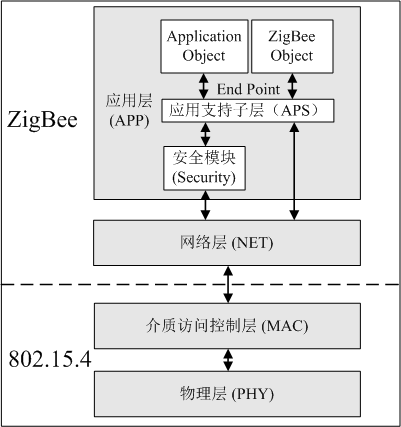
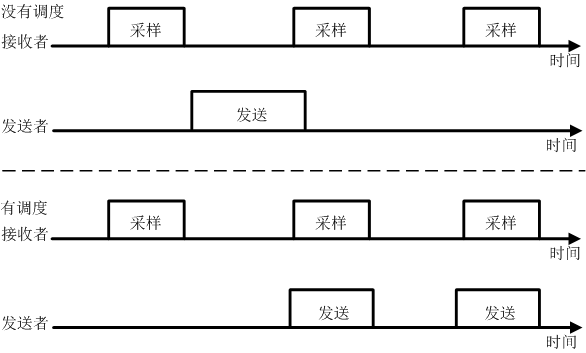

# IEEE 802.15.4/ZigBee

Building further upon protocols such as WiFi and Bluetooth, the ZigBee protocol gradually emerged to meet the needs of self-organizing networks. Its main characteristics include short-range, low-power communication, and support for various networking forms—such as mesh networking—enabled by upper-layer protocols.

Nowadays, however, ZigBee's distinguishing features are less prominent. Bluetooth has also evolved to support low-power transmission and mesh networking capabilities.

ZigBee was the first protocol I studied when beginning my research journey, and it is one I have investigated extensively. As a starting point for studying IoT protocols, I believe ZigBee is an excellent choice: it is not overly complex, its technical components are manageable, open-source implementations exist, and there are abundant explanatory documents, recent papers, and ongoing research available.

## 1. Origin of the ZigBee Protocol

The name "ZigBee" originates from the zigzag dance of honeybees. When bees discover a flower patch, they communicate the location and other information about the new food source to their peers through a special physical movement known as the "waggle dance"—sometimes referred to as the ZigBee dance. Through this behavior, bees form a communication network within the hive.

ZigBee, also known as the IEEE 802.15.4 standard, aims to create low-power, low-complexity, low-data-rate, self-organizing short-range wireless communication networks similar to bee colonies. It provides a unified standard for low-speed interconnection among devices within personal or home environments.

## 2. Characteristics of the ZigBee Protocol

ZigBee is a wireless communication technology that operates in three frequency bands: 2.4 GHz (globally popular), 868 MHz (popular in Europe), and 915 MHz (popular in the US). These bands offer maximum data rates of 250 kbit/s, 20 kbit/s, and 40 kbit/s, respectively. As expected, the data rates are relatively low because ZigBee was originally designed for applications with modest data rate requirements.

Its transmission range varies between 10 and 180 meters (typically no more than 60 meters indoors and 180 meters outdoors). As a wireless communication technology, ZigBee has a low data rate and a transmit power of only 1 mW. Combined with sleep mode operation, this results in very low power consumption. It is estimated that ZigBee devices can operate for 6 months to 2 years on just two AA batteries. In practice, actual battery life depends heavily on application scenarios—for instance, frequent data transmissions or dense network deployments (think about why) will significantly reduce operational duration. Much of my prior research focused on optimizing energy consumption to the greatest extent possible.

Originally designed for low cost due to its modest data rate requirements, this advantage has diminished over time as newer technologies have advanced rapidly.

Typical device discovery delay is 30 ms, wake-up from sleep mode takes 15 ms, and active device channel access delay is 15 ms.

ZigBee employs Carrier Sense Multiple Access with Collision Avoidance (CSMA/CA) to avoid competition and collisions during data transmission. If you wish to understand CSMA/CA implementation, reviewing the corresponding code section is highly recommended—it greatly deepens comprehension.

ZigBee ensures data packet integrity using Cyclic Redundancy Check (CRC), supports authentication and authorization, and uses the AES-128 encryption algorithm. Security attributes can be flexibly configured per application.

## 3. ZigBee Protocol Stack

Wireless sensor networks (WSNs), as a typical application of the Internet of Things (IoT), have received widespread attention in recent years. Due to the low power consumption, low complexity, and self-organizing capabilities of the IEEE 802.15.4/ZigBee communication protocol, it was among the earliest wireless communication standards adopted in WSNs and remains one of the most well-known in this domain. Given the similarities between sensor networks and IoT, WSN protocols provide valuable insights for designing IoT communication protocols.

Similar to the Internet protocol architecture, we introduce the IEEE 802.15.4/ZigBee protocol from the perspective of a protocol stack, covering the Physical Layer, Medium Access Control (MAC) Layer, Network Layer, Transport Layer, and Application Layer—corresponding to five layers of the Open Systems Interconnection (OSI) model. Specifically, IEEE 802.15.4 defines specifications for the Physical and MAC layers: the Physical Layer includes the radio transceiver and low-level control modules, while the MAC sublayer provides higher layers with service interfaces for accessing the physical channel. ZigBee builds on top of these two layers, defining specifications for the Network, Transport, and Application layers.

Fig. 802.15.4/ZigBee Architecture

<!-- Figure 6: 802.15.4/ZigBee Architecture -->

- **Physical Layer**:  
Responsible for managing the radio transceiver, channel selection, energy detection, signal detection, and utilization.  
The Physical Layer specifies usable frequency bands. As of 2006, the 802.15.4 standard primarily used three frequency bands:  
  - 868.0–868.6 MHz (single channel, mainly used in Europe),  
  - 902–928 MHz (10 channels in North America, expandable to 30),  
  - 2.4–2.4835 GHz (globally used, 16 channels).  
Additional frequency bands have since been added based on regional demands and application contexts.  
802.15.4 uses Direct Sequence Spread Spectrum (DSSS) technology (recall what DSSS is—if forgotten, refer back to [TODO]).

- **Medium Access Control (MAC) Layer**:  
The MAC layer primarily uses Carrier Sense Multiple Access with Collision Avoidance (CSMA/CA).  
This method is similar to that used in 802.11: before transmitting, the system listens to the medium to detect whether the same channel is in use. If no carrier is detected, indicating an idle channel, the system proceeds directly to data transmission.  
If a carrier is detected, the system waits for a random backoff period (defined by the protocol) before rechecking the channel.  
While this approach simplifies protocol design and implementation, it affects bandwidth efficiency—especially evident in large-scale self-organizing networks where issues like the hidden terminal problem become pronounced, reducing communication efficiency and channel utilization.

**Table 3 Power Consumption of Modules in a Typical Wireless Sensor Network Node**

Device|State|Current
----------|----------|----------
CPU|Active|1.8mA
 |Idle|54.5$\mu$A
On-chip flash|Programming|3mA
 |Erasing|3mA
Radio transceiver|Transmitting (TX, 0dBm)|17.4mA
 |Receiving/listening (RX)|19.7mA
 |Idle|21$\mu$A

To save energy, additional mechanisms can be introduced in ZigBee.

Table 3 shows the current drawn by different components of a typical wireless sensor node under various operating states. It reveals that a significant portion of energy consumption comes from the radio transceiver module—particularly during data transmission and reception. A radio transceiver typically operates in three states: transmitting, listening, and idle. As shown in Table 3, major energy consumption occurs during transmission, listening, and reception, with comparable energy usage across these states. Even when no data is being sent or received, nodes must continuously listen to the channel to detect incoming packets. This constant monitoring leads to energy waste known as *idle listening*. Note that *idle listening* and *idle state* are distinct concepts: idle listening refers to the node actively listening but receiving no data—thus wasting energy; whereas the idle state means the node physically disables certain hardware functions to achieve lower power consumption. Research indicates that idle listening constitutes a major portion of total energy consumption in wireless sensor nodes. Therefore, minimizing idle listening is a critical consideration for any wireless communication protocol aiming to serve sensor networks and other low-power applications.

In practice, the MAC layer can implement Low Power Listening (LPL) via *sampling listening*. Sampling listening allows the radio transceiver to avoid continuous listening. Instead, it periodically samples the channel state. During non-sampling periods, the radio module enters an idle state, thereby reducing energy wasted on prolonged idle listening. This is analogous to a guard who previously had to stand at the gate continuously watching for visitors, but now sleeps intermittently and checks only periodically. The drawback is that when a sender transmits data, the receiver may not be in listening mode and thus might miss the message. A common solution is to extend the sender’s transmission duration. Suppose the receiver has a sampling interval of T; if the sender keeps transmitting for at least duration T, the receiver will eventually sample the channel during that window and successfully receive the data. Figure 7 illustrates the operational modes of sender and receiver in sampling listening. Alternatively, scheduled communication can be used: sender and receiver synchronize so that transmission occurs precisely during the receiver’s sampling window, as illustrated in Figure 7.

Fig. Operation Modes of Sender and Receiver in Sampling Listening

<!-- Figure 7: Operation Modes of Sender and Receiver in Sampling Listening -->

- **Network Layer**:  
The Network Layer plays a crucial role between the MAC Layer and the Application Layer, enabling application data to reach its final destination via the MAC Layer.

Key functions of the ZigBee Network Layer include routing, discovery of new nodes and paths, and determining which subnetwork a node belongs to.

The basic routing protocol used in ZigBee is Ad hoc On-Demand Distance Vector (AODV) routing.

In AODV, when a source node needs to find a path to a destination node, it broadcasts a Route Request (RREQ) to all its neighbors. Upon receiving the RREQ, each neighbor rebroadcasts it to its own neighbors, continuing until the message reaches the destination node.

Once the destination receives the route request, it sends back a unicast Route Reply (RREP) along the reverse path taken by the RREQ—from destination to source—establishing a valid route. The source node can then use this path to send data to the destination.

Importantly, in AODV, routes are established only on demand—that is, only when a node has data to send.

This contrasts with traditional Internet routing protocols, where every router maintains a routing table listing paths to various destinations or network regions, updated periodically.

Such a fixed-table approach suits the relatively stable topology of the Internet and the powerful processing and storage capabilities of routers, matching the high-performance demands of Internet applications.

However, in self-organizing networks, topologies are often dynamic and node resources (especially memory) are severely limited. Maintaining fixed routing tables would incur excessive overhead in both storage and update operations.

> There are numerous development cases involving the ZigBee protocol. I have written related code and published papers on this topic. Readers may refer to implementations in systems like TinyOS for deeper understanding. We will not elaborate further on specific examples here.