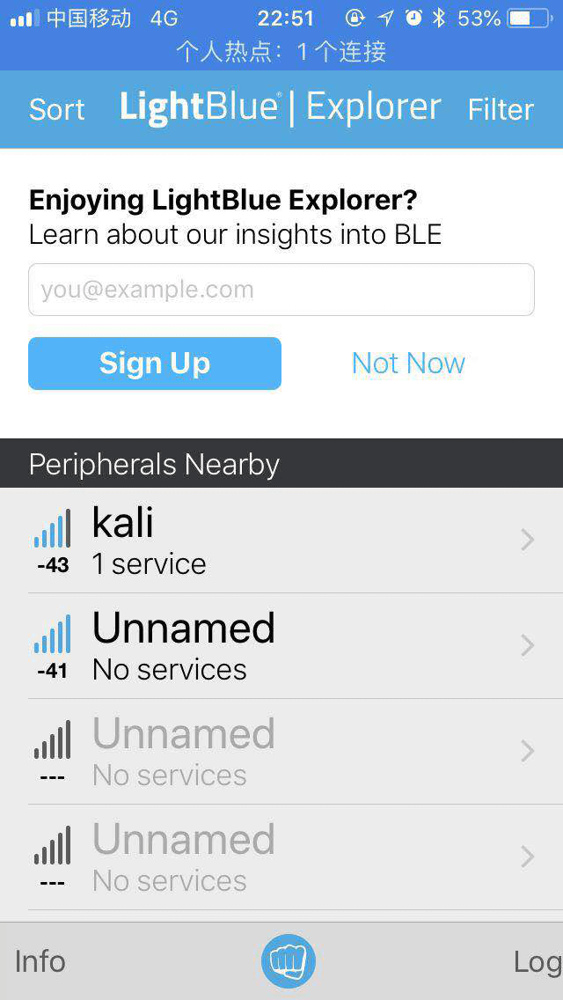

# Bluetooth Experiment


## 1. BLE Sniffing

**Principle of BLE Sniffing:** BLE communication consists of advertising packets and connection data packets. Since advertising packets are transmitted over public advertising channels, any device within radio range can receive them. Therefore, BLE sniffing typically refers to capturing connection data packets. Connection data packets are transmitted over frequency-hopping channels; without knowledge of the hopping sequence, sniffing is infeasible. However, all hopping parameters are included in the connection request packet sent by the central device during connection establishment. Once this packet is captured, a sniffer tool can compute the hopping sequence and subsequently capture connection data packets on the hopping channels. Consequently, BLE sniffing tools must begin operation *before* the central and peripheral devices establish a connection.

Commonly used BLE sniffing tools include:

- **Smartphones or Bluetooth adapters for sniffing:** Low cost; capable of capturing only advertising packets; limited information coverage.
- **USB Dongles for sniffing:** Lower cost; capable of monitoring both advertising and connection packets; supports only Bluetooth Low Energy (BLE); Windows-only compatibility.
- **Ubertooth One for sniffing:** Supports monitoring across all Bluetooth versions; includes advanced features such as data encryption/decryption.

## 2. BLE Communication Spoofing

**Advertising Packet Spoofing:** In BLE communication, the central device identifies distinct peripherals based on received advertising packets. If an attacker broadcasts using another peripheral’s advertising packet, the central device may mistakenly identify the attacker as the legitimate peripheral and initiate a connection with it.

**Connection Data Packet Spoofing:** Since BLE peripherals accept connection requests from *any* central device, an attacker can proactively initiate a connection to a peripheral and access its data.

## 3. Experiment I: Discover Nearby BLE Devices and Build a Beacon Node

**Experiment Objective:**  
Enable students to discover nearby Bluetooth devices, understand BLE advertising behavior, and construct a functional BLE beacon node.

**Background Knowledge:**  
Beacons are small devices that transmit signals using Bluetooth 4.0 (BLE). Leveraging BLE’s advertising channel, they broadcast undirected data payloads of up to 128 bits, with an effective range of several meters and battery lifetimes extending up to three years.

iBeacon and Eddystone are two widely adopted beacon data format standards. iBeacon was introduced earlier by Apple; Eddystone, developed by Google, offers broader functionality.

**Experimental Procedure:**

- (1) Install a mobile application (iOS: LightBlue; Android: BLE Debugger) to scan for nearby BLE devices and analyze the parameters contained in advertising packets.


<center>
<div style="color:orange; border-bottom: 1px solid #d9d9d9;
display: inline-block;
color: #999;
padding: 2px;">Figure. Application User Interface</div>
</center>

- (2) Use the BlueZ protocol stack on Linux to configure the computer as a BLE advertising beacon node. Execute the following commands on the Linux system:

    ```shell
    $ hciconfig hci0 up                              # Enable the Bluetooth interface
    $ hcitool -i hci0 cmd 0x08 0x000A 01            # Enable advertising mode
    $ hcitool -i hci0 cmd 0x08 0x0008 1a 02 01 06 03 03 aa fe 12 16 aa fe 10 00 03 62 6C 6F 67 2E 67 74 77 61 6E 67 01 00 00 00 00 00  # Customize advertising payload
    ```

- (3) Install eBeacon or Eddystone Validator on a smartphone to verify the beacon node’s operational status.


<center>
<div style="color:orange; border-bottom: 1px solid #d9d9d9;
display: inline-block;
color: #999;
padding: 2px;">Figure. Beacon Node Status</div>
</center>

## 4. Experiment II: Understanding BLE Communication Workflow and Sniffing Methodology

**Experiment Objective:**  
Establish communication between a smartphone and a Xiaomi Mi Band while simultaneously capturing the traffic using a USB Dongle. This enables students to comprehend the BLE communication workflow and gain hands-on experience with sniffing tools.

**Background Knowledge:**  
Common BLE sniffing tools include:

- **USB Dongle:** Chip manufacturers integrate BLE chips into USB modules to simplify developer debugging.
- **nRF51822:** A USB Dongle specifically designed for low-power Bluetooth sniffing.

**Experimental Procedure:**

- (1) Distribute one USB Dongle to each student and guide them to install the corresponding sniffer driver and Wireshark on their computers.
- (2) The teaching assistant places the smart band into advertising mode; students use their USB Dongles to begin sniffing and lock onto the target Xiaomi Mi Band.


<center>
<div style="color:orange; border-bottom: 1px solid #d9d9d9;
display: inline-block;
color: #999;
padding: 2px;">Figure. Locking onto the Target Device</div>
</center>

- (3) The teaching assistant connects the smartphone to the smart band and performs various operations. Using captured Wireshark traces, explain in detail the BLE advertising phase, connection establishment, authentication, and characteristic read/write procedures.


<center>
<div style="color:orange; border-bottom: 1px solid #d9d9d9;
display: inline-block;
color: #999;
padding: 2px;">Figure. Advertising Mode and Connection Establishment Process</div>
</center>

- (4) The teaching assistant reads/writes specific data on the band; students locate those data fields within the Wireshark trace.

<!-- Figure 2.3: Device Data Read/Write Process -->

## 5. Experiment III: Eavesdropping on a Smart Door Lock’s Unlock Password

**Experiment Objective:**  
Simulate a smart door lock’s unlocking procedure using scripts, enabling students to perform BLE password sniffing with a USB Dongle and experience a real-world BLE attack scenario.

**Rules:**

- (1) Assume a BLE-controlled smart door lock exists nearby. Its owner intermittently transmits an unlock key to open the door. Attempt to recover the unlock key via BLE sniffing and compromise the door!
- (2) The door lock’s MAC address is unknown. The lock alternates between advertising and connected modes. The key format is: `KEY{xxxxxx}`. Good luck!

**Experimental Procedure:**

- (1) The teaching assistant initiates the unlocking process using the `gate.py` script and a Bleno-simulated door lock; students use their USB Dongles to sniff and capture the unlock key.
- (2) After the exercise concludes, the teaching assistant conducts a debriefing session, highlighting common pitfalls and challenges encountered during the sniffing process.

## 4.4. Experiment IV: Designing a Custom BLE Device

**Experiment Objective:**  
Students design and implement both a BLE central and a peripheral device to deepen their understanding of BLE communication workflows and spoofing principles. (A dedicated class session may be scheduled for student presentations of their designs.)

**Requirements:**  
Design a Bluetooth device, define its business logic, and accordingly construct its advertising and connection data packets. Implement a companion connection script to interact with the device. (Recommended implementation stack: Bleno + BluePy.)

Upon completion, submit the device implementation, source code for the connection script, and accompanying documentation. The documentation must clearly describe the device’s functionality and operational workflow.

**Example:**  
Xiao Ming implements a temperature sensor using Node.js. The sensor supports user authentication, temperature storage, and configurable display units. Upon connection, the device requires the user to write a predefined string to the authentication characteristic handle before granting access to temperature or unit data. Upon successful authentication, users may read the temperature characteristic—where the device computes and returns the value according to the configured unit—or write to the unit characteristic to switch between display units (e.g., Celsius, Fahrenheit).

**Reference Implementation:**  
https://github.com/noble/bleno/tree/master/examples

## References

1. Jiliang Wang, Feng Hu, Ye Zhou, Hanyi Zhang, Zhe Liu, Yunhao Liu. "BlueDoor: Breaking the Secure Information Flow via BLE Vulnerability", ACM MOBISYS 2020.