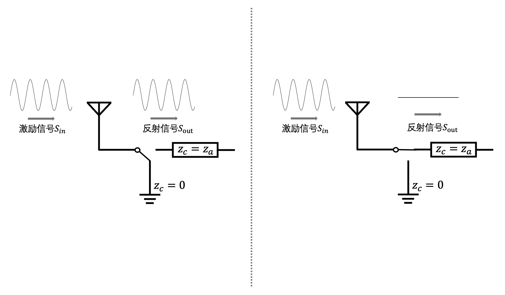

# Origin of Backscatter  
In the 1940s, a covert listening device known as *The Great Seal Bug* (also called the “Golden Lip Bug”) was deployed. Its construction was remarkably simple: it consisted of an antenna tuned to a specific frequency band and a resonant cavity connected to that antenna. Sound waves in the air impinged upon the cavity, causing it to vibrate. This vibration induced mechanical deformation, which altered the cavity’s capacitance—thereby modulating the amplitude, phase, and other characteristics of the incident electromagnetic wave (analogous to conventional modulation techniques). At the receiver, the reflected electromagnetic wave could then be demodulated to recover the acoustic signal captured by the cavity. Notably, because the device required no power supply, it operated undetected for seven years inside the U.S. Ambassador’s office at the U.S. Embassy in Moscow before being discovered and removed. *The Great Seal Bug* was passive and relied entirely on external excitation signals—making it widely regarded as the precursor to modern backscatter technology.

<center>

</center>

<center>
<div style="color:orange; border-bottom: 1px solid #d9d9d9;
display: inline-block;
color: #999;
padding: 2px;">Figure. The covert listening device *The Great Seal Bug*</div>
</center>

# Fundamental Principles of Backscatter  

Backscatter communication—also referred to as backscattering communication—differs fundamentally from conventional wireless communication methods. Most traditional communication systems are *active*: the transmitter generates its own electromagnetic carrier wave and modulates information onto it. In contrast, backscatter communication is *passive*: the transmitter does not generate a carrier wave but instead communicates by reflecting ambient or dedicated electromagnetic waves emitted by another device. During reflection, the backscattering node deliberately alters certain characteristics of the reflected signal—such as amplitude, phase, or frequency—to encode information.

For example, in a backscatter system, a backscatter tag can toggle its antenna between two states: full absorption and full reflection. Consequently, the amplitude of the reflected signal varies accordingly—enabling amplitude-based encoding of data bits.

To gain deeper insight into how a backscatter tag switches between these two states—and thereby modulates the amplitude of the reflected signal—we introduce the fundamental physical principles underlying backscatter communication in this chapter.

When an electromagnetic wave propagates and encounters a boundary between two media with different impedances, part of the wave is reflected and part is absorbed, depending on the impedance mismatch. Thus, by dynamically switching the antenna’s impedance, one can control the amplitude and phase of the reflected wave—enabling data transmission.

Backscatter technology eliminates the need for a dedicated power source to generate the carrier wave during communication. As a result, power consumption is extremely low—reducing RF device power requirements by several orders of magnitude. In some implementations, no dedicated power supply is needed at all; instead, energy harvested from the ambient environment suffices for operation. These attributes make backscatter highly advantageous for numerous IoT applications.

Assume the incident excitation signal at the backscatter tag is $S_{in}$. Then the reflected signal $S_{out}$ can be expressed as:

$$
S_{out} = \frac{Z_{a}-Z_{c}}{Z_{a}+Z_{c}}S_{in}
$$

where $Z_{a}$ and $Z_{c}$ denote the antenna impedance (typically $50\Omega$) and the impedance of the circuit connected to the antenna, respectively.

For instance, suppose we configure the tag’s $Z_{c}$ to switch between 0 and $Z_{a}$. In hardware implementation, this corresponds to switching the impedance value connected to $S_{1}$ in Figure 5. Substituting $Z_{a}=0$ and $Z_{a}=Z_{c}$ into the above equation yields $S_{out}=S_{in}$ (here, $S_{in}$ denotes the previously mentioned continuous-wave, CW) and $S_{out}=0$. The receiver can thus determine baseband logic levels (high/low) by detecting the amplitude of the reflected signal.

<center>

</center>

<center>
<div style="color:orange; border-bottom: 1px solid #d9d9d9;
display: inline-block;
color: #999;
padding: 2px;">Figure. Controlling reflected-signal amplitude via impedance switching</div>
</center>

## Frequency-Shift-Based Backscatter  

We can also shift $S_{in}$ away from the frequency band occupied by $S_{out}$ using *frequency shifting*. This enables the receiver to suppress interference from other frequency bands via a simple bandpass filter.

Next, we illustrate a common frequency-shift technique used in backscatter systems—namely, Frequency-Shift Keying (FSK)—to demonstrate how frequency shifting operates in practice. Suppose the switch $S_{1}$ toggles between two states at a frequency $f_{0}$. This is equivalent to multiplying $S_{in}$ by a square-wave sequence $\{0, 1, 0, 1, \ldots, 0, 1\}$, i.e., a square wave of frequency $f_{0}$ $S_{square}(f_{0}t)$. Ignoring higher-order harmonics and approximating the square wave as a cosine wave $cos(f_{0}t)$ at the same fundamental frequency, we obtain:

$$
\begin{equation}
  \begin{split}
	S_{out} &= S_{square}(f_{0}t) \cdot S_{in}\\
	& \approx cos(f_{0}t) \cdot S_{in}\\
  & = \frac{1}{2}(e^{j2 \pi f_{0}t}+e^{-j2 \pi f_{0}t})S_{in}
  \end{split}
\end{equation}
$$

From this expression, it is evident that the backscattered signal $S_{out}$ consists of the excitation signal $S_{in}$ upshifted and downshifted by $f_{0}$. If the backscatter tag selects $f_{0}$ according to the data bit to be transmitted, the receiver can detect the frequency offset between the excitation signal and $S_{out}$ to decode the FSK-modulated data.

Readers are encouraged to run the following MATLAB code to understand how $S_{in}$ undergoes frequency shifting and how the receiver recovers the backscatter signal.

```matlab
% Note: The following code assumes baseband frequency shifting directly. 
% In practical communication systems, upconversion and downconversion 
% operations are required at the transmitter and receiver, respectively. 
% These are omitted here for clarity and conceptual simplicity.

t = (1 : 1024)/128e3;
s_in = exp(1j*2*pi*100e3*t);
% Generate excitation signal s_in as a single-tone signal

s_backscatter_bit0 = cos(2*pi*16e3*t);
s_backscatter_bit1 = cos(2*pi*32e3*t);
% Tag controls the switch at different frequencies to transmit "0" or "1"

s_out_bit0 = s_in .* s_backscatter_bit0;
s_out_bit1 = s_in .* s_backscatter_bit1;
% Tag multiplies s_in with frequency-specific signals to produce s_out

figure;
hold on
plot(abs(fftshift(fft(s_out_bit0))));
plot(abs(fftshift(fft(s_in))));
hold off
figure;
hold on
plot(abs(fftshift(fft(s_out_bit1))));
plot(abs(fftshift(fft(s_in))));
hold off
% Plot spectra for transmitted "0" and "1" (i.e., signals shifted by different frequencies)
```

> Reflection: Besides encoding data via distinct frequency shifts, backscatter can also employ Phase-Shift Keying (PSK) by varying the *initial phase* of $S_{square}$—simultaneously performing frequency shifting and phase modulation. How is this realized?