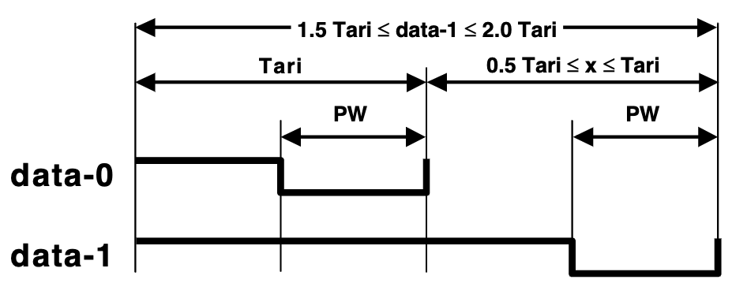
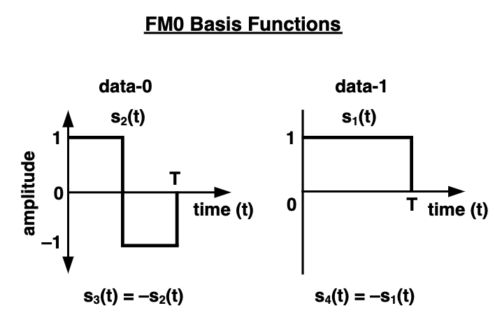
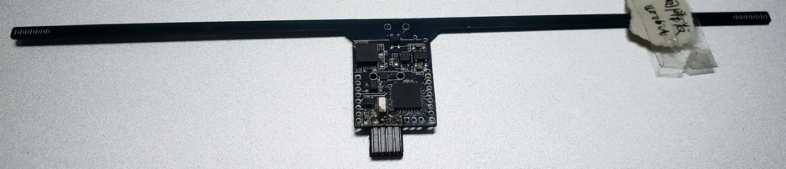

# RFID

RFID (**R**adio **F**requency **ID**entification, Radio-Frequency Identification) — as its name suggests — is a technology that uses radio-frequency techniques for identification. Specifically, RFID technology employs an RFID reader to perform non-contact information exchange with an RFID tag via radio-frequency signals. Based on the exchanged information, the RFID reader can identify the identity of the object embedded with the RFID tag.

An RFID system primarily consists of tags, antennas, and readers (where the reader typically integrates a transmitter, receiver, and microprocessor). Each RFID tag stores a unique electronic code used to identify the target object. When an RFID tag enters the scanning zone of an RFID reader, it receives the reader’s radio-frequency signal and, powered by the induced current, transmits the identifier stored in its chip. Based on the backscatter principle, the RFID tag modulates the data it intends to send onto the reflected signal after receiving the RF signal.

RFID tags feature simple structures, small sizes, and require no battery power supply; thus, they can be embedded into objects of various shapes and materials. Their physical forms include labels, cards, buttons, and more. Billions of RFID tags are widely deployed in applications such as inventory management, smart logistics, asset tracking, and indoor positioning.

## RFID Protocol Standards

RFID standards cover multiple aspects, including physical characteristics, air-interface specifications, encoding rules, reader protocols, test and application guidelines, and security protocols. Currently, the primary global standardization bodies for RFID are ISO/IEC and EPCglobal. Below, using the EPCglobal Class-1 Generation-2 (Gen2) standard as an example, we briefly introduce key concepts related to the RFID physical layer and MAC layer.

The RFID reader communicates commands such as `Query` to tags using PIE (Pulse Interval Encoding) combined with ASK (Amplitude Shift Keying). As reviewed in earlier chapters, in PIE encoding, a “0” is represented by a short high-level pulse followed by a short low-level pulse, whereas a “1” is represented by a long high-level pulse followed by a short low-level pulse. An RFID tag employs an envelope detector to recover the baseband signal consisting of alternating high/low levels, and determines the duration of each high-level pulse to decode the command sent by the reader. Subsequently, the reader emits a single-frequency continuous wave (**C**ontinuous **W**ave, CW), which serves both as the wireless power source for the tag and as the carrier for the tag’s baseband signal.

Figure. PIE Encoding

The tag uses FM0 encoding and ASK modulation to load data onto the CW signal transmitted by the reader. In FM0 encoding, every new symbol begins with an inversion (1→0 or 0→1); a “0” is encoded by performing an additional inversion at the midpoint of the symbol, while a “1” remains unchanged throughout the entire symbol duration. During ASK modulation, the tag uses the reader’s CW signal as the carrier and cannot actively control signal amplitude. Instead, the tag switches its antenna between full absorption and full reflection states, causing the reflected signal’s amplitude to toggle between minimum and maximum values. Thus, the baseband signal is carried on the amplitude of the reflected signal. Since the tag only needs to control a single RF switch, its power consumption is extremely low — the induced current from the CW is sufficient to power it.

Figure. FM0 Encoding

To prevent collisions among tags, RFID employs a MAC-layer protocol based on slotted ALOHA. Suppose several tags enter the reading range of a given reader. The basic procedure is as follows:

* The reader sends a `Query` command containing parameter **Q** (default value: 4). Both the reader and all tags start timing simultaneously.
* Upon receiving the `Query` command, each tag first randomly selects a 16-bit number **handle**, then randomly chooses a value **slot_time** from the interval $[0,...,2^{Q}-1]$.
* If **slot_time = 0**, the tag immediately replies with its randomly selected **handle**; if **slot_time ≠ 0**, the tag waits until its timer reaches **slot_time**, then replies with **handle**.
* After $2^{Q}$ time slots (slots), the reader counts how many **handle**s it received per slot. For those slots where no collision occurred (i.e., exactly one **handle** was received), the reader sequentially sends `ACK_handle`. Upon receiving `ACK_handle`, the corresponding tag returns its payload data (e.g., its EPC number), while other tags remain idle until they receive their respective `ACK_handle` from the reader.

## Computationally Capable RFID — WISP

Traditional RFID tags can only transmit their identifier. To enable RFID tags to perform more complex computations — even environmental sensing tasks — researchers introduced the concept of *computationally capable RFID*. The most well-known implementation is the Wireless Identification and Sensing Platform (WISP), jointly initiated by Intel Corporation and the University of Washington. WISP tags require no dedicated battery, are compatible with commercial RFID readers, and integrate an ultra-low-power microcontroller. Developers can write firmware tailored to specific tasks, enabling WISP tags to execute complex operations beyond the capabilities of conventional RFID tags. Moreover, WISP integrates sensors such as temperature and accelerometer modules, allowing it to sense its surrounding environment.

Figure. WISP Tag

To conduct RFID-related experiments and applications using WISP, you will need the following tools: a WISP tag and an RFID reader (e.g., Impinj R420 or Impinj R1000); an MSP-FET430UIF debugging tool; and the Code Composer Studio (CCS) integrated development environment. Once these tools are acquired, working with WISP generally involves the following steps:  
1) Download the official WISP firmware from [this link](https://github.com/ransford/sllurp) (the firmware implements C1G2 RFID protocol control and processing);  
2) Connect the WISP tag to the MSP-FET430UIF debugger and develop or modify its firmware within CCS;  
3) Configure the RFID reader hardware, including antenna, network, and power settings;  
4) Use either `sllurp` (a Python library officially recommended for WISP) or Impinj’s ItemTest application to configure the RFID reader in software and perform read tests.

Readers interested in further exploring computationally capable RFID development with WISP may refer to the [WISP Wiki](https://sites.google.com/uw.edu/wisp-wiki/home) for detailed documentation.