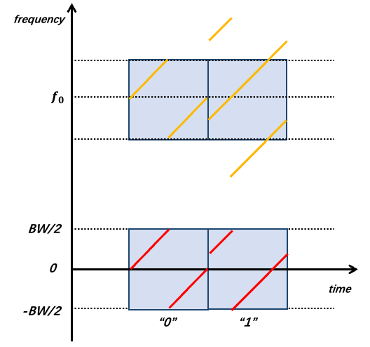

# New Forms of Backscatter: From WiFi to LoRa

RFID systems require dedicated readers to transmit excitation signals, which occupy licensed or dedicated frequency bands. With the advancement of backscatter communication technology, a key research direction is to leverage existing ambient RF signals—such as WiFi, Bluetooth, and LoRa—as excitation sources.

<!-- For example, widely deployed ambient LoRa signals can be exploited to enable long-range, high-concurrency backscatter communication. The designed tags do not actively generate carrier signals and require no battery for carrier generation; instead, they perform long-range backscatter communication by harvesting ambient RF energy—the maximum achieved range reaches 2 km. -->

Below, we first introduce the fundamentals of WiFi-based backscatter systems, followed by an overview of backscatter systems leveraging different ambient signal sources.
Conventional WiFi devices operate normally, transmitting standard 802.11b data packets. A backscatter tag frequency-shifts these packets and generates a new 802.11b packet in a shifted frequency band. A receiver captures both the original and the shifted packets simultaneously across two frequency bands. By comparing the contents of the two packets, the receiver recovers the data encoded by the tag.

To understand the principle behind HitchHike communication, we begin with a brief introduction to the 802.11b standard; interested readers may consult relevant references for further details. 802.11b is a relatively early WiFi protocol: at 1 Mbps, each symbol is represented by either the positive or negative Barker sequence. Conceptually, this can be expressed as: $bit_0=barker(t)$, $bit_1 = barker(t) \cdot e^{j\pi}$. Suppose the incident excitation signal is $S_{in}(t)=\left \{ barker(t)\; or \; barker(t) \cdot e^{j\pi} \right \} \cdot e^{j2\pi f_{c}t}$??. Using frequency shifting, we multiply $S_{in}(t)$ by a square wave. As introduced earlier, this square wave can be approximated by a cosine wave $cos(f_{0}t)$. However, controlling only the frequency of this cosine wave is insufficient. At the end of the previous section, we asked you to consider how to simultaneously shift both frequency *and* phase during frequency translation—this technique is now applied here. While using a square wave for frequency shifting, we control the ordering of {0,1} bits to encode phase shifts: for instance, the sequences {0,1,0,1,0,1,...} and {1,0,1,0,1,0,...} differ in phase by $\pi$. Interested readers may examine their phase spectra via Fourier transform. Therefore, the cosine wave $cos(f_{0}t)$ must be expressed as $cos(f_{0}t+\varphi)$. Here, we set $\varphi= 0 \; or \; \pi$, and the tag uses a fixed frequency $f_{0}$, encoding bit “1” or “0” via these two distinct phase states. Thus, we obtain:

$$
  \begin{split}
	S_{out}(t) &= S_{in} \cdot cos(f_{0}t+\varphi)\\
  & = \frac{1}{2} S_{in}\cdot e^{j2 \pi f_{0}t} \cdot e^{j\varphi} + \frac{1}{2} S_{in}\cdot e^{-j2 \pi f_{0}t} \cdot e^{j\varphi}
  \end{split}
$$

We focus only on the up-converted component $f_{0}$ (the down-converted component can be filtered out by a bandpass filter at the receiver). Hence:

$$
\begin{equation}
  \begin{split}
	S_{out}^{upper}(t) &= \frac{1}{2} \left \{ barker(t)\; or \; barker(t) \cdot e^{j\pi} \right \} \cdot e^{j\varphi} \cdot e^{j2\pi (f_{c}+f_{0})t}\\
  \end{split}
\end{equation}
$$

> Why do these distinct spectral components arise? Refer to our paper [1].

Next, the receiver performs down-conversion to obtain the baseband signal (for readers unfamiliar with this concept, please review the prior section on wireless modulation/demodulation):

$$
\begin{equation}
  \begin{split}
	2*baseband\left \{S_{out}^{upper}(t) \right \} &=  \left \{ barker(t)\; or \; barker(t) \cdot e^{j\pi} \right \} \cdot e^{j\varphi} {\cdot e^{j2\pi (f_{c}+f_{0})t}}\\
	&=  \left \{ barker(t)\; or \; barker(t) \cdot e^{j\pi} \right \} \cdot e^{j\varphi}
	 \left(\varphi= 0 \; or \; \pi\right)
  \end{split}
\end{equation}
$$

As shown above, the resulting baseband signal is simply the original positive or negative Barker code, pointwise multiplied—or not multiplied—by $e^{j \pi}$. Clearly, it remains a valid positive or negative Barker sequence, and thus can be correctly decoded by a conventional receiver. Then, symbol-by-symbol comparison suffices: if the backscattered symbol has the same sign as the original symbol, then $\varphi=0$; otherwise, $\varphi=\pi$. In other words, performing an XOR operation between the two decoded symbol streams recovers the backscattered data. The elegance of this method lies in its dual capability: (i) enabling data encoding onto the reflected signal, and (ii) ensuring compatibility with legacy receivers—no specialized hardware is required.

Beyond this approach, numerous backscatter systems have been proposed based on newer WiFi standards and Bluetooth Low Energy (BLE). However, most such systems suffer from short communication ranges—typically around 20 meters—limiting applicability to only a narrow subset of IoT use cases. Consequently, extending the communication range of backscatter systems has become a prominent research frontier. To achieve longer ranges, researchers have turned to low-power wide-area network (LPWAN) protocols such as LoRa. Integrating backscatter with LoRa dramatically increases achievable communication distance. Next, we present several LoRa-based backscatter communication systems.

LoRa employs linear chirp spread spectrum (CSS) modulation. Its fundamental modulation symbol is a linear chirp—a signal whose instantaneous frequency increases linearly over time—and the chirp’s starting frequency encodes the transmitted data. Using ambient LoRa signals as excitation, data can be encoded via frequency shifting of the incident signal. To transmit bit “0”, two antennas jointly shift the incident signal by $f_{0}$ (using the method introduced in the previous subsection: toggling switch $S_{1}$ to multiply $S_{in}$ by a square wave approximated as a cosine signal). To transmit bit “1”, one antenna shifts the incident signal by $f_{0}+\frac{BW}{2}$, while the other shifts it by $f_{0}-\frac{BW}{2}$, where $BW$ denotes the LoRa signal bandwidth. As illustrated in the figure, the backscatter tag transmits bits “0” and “1”. We then compare the signals across four time windows. Windows 1 and 2 contain LoRa symbols sharing the same starting frequency; Window 3 corresponds to the overlapping region of two lighter-colored windows, whereas Window 4 starts at a different frequency. Accordingly, after decoding and performing FFT on each window, the peak positions for Windows 1 and 2 coincide, while those for Windows 3 and 4 differ by exactly $\frac{BW}{2}$. Thus, the receiver can separately capture the excitation and backscattered signals in two frequency bands, and decode each symbol by checking whether their respective FFT peaks align—thereby recovering the backscattered data. Further technical details are available in the PLoRa paper.

Figure. PLoRa encoding of “0” and “1”

Notably, the property that peak positions either coincide or differ by $\frac{BW}{2}$ is independent of the excitation signal’s starting frequency. Especially when transmitting “1”, the two distinct frequency shifts applied across the two antennas precisely reconstruct, within each time window, a complete chirp whose starting frequency differs from the original by $\frac{BW}{2}$. This forms the theoretical foundation enabling PLoRa to utilize ambient LoRa signals as excitation—and crucially, ensures robustness across real-world deployments where ambient LoRa signals exhibit varying starting frequencies.

Additionally, other LoRa-based backscatter techniques exist. For instance, certain approaches modulate ambient single-tone continuous-wave (CW) signals—akin to RFID carriers—into full LoRa packets directly at the tag. These methods are also referred to as LoRa backscatter in literature; however, unlike PLoRa, their excitation source is not ambient LoRa but rather a CW signal. To understand this process, recall the formula introduced in the previous subsection: $S_{out} = \frac{Z_{a}-Z_{c}}{Z_{a}+Z_{c}}S_{in}$. By varying $Z_{c}$, we scale $S_{in}$ by different coefficients, rewriting the expression as $S_{out} = k(t)\cdot S_{in}$. In conventional implementations, $k(t)$ is a square wave switching between 0 and 1, i.e., $k(t)=\{0,1,0,1,...,0,1\}$, where the durations of “0” and “1” are fixed. To synthesize a chirp, the authors instead design $k(t)$ as a sequence where the “0” and “1” durations progressively shorten—for example: $k(t)=\{0,0,0,0,1,1,1,1,0,0,0,1,1,1,0,0,1,1,0,1\}$. As depicted in the figure, a constant-duration square wave merely shifts the excitation signal by a fixed frequency offset (as in the prior subsection); in contrast, a progressively narrowing square wave induces an increasing instantaneous frequency shift—yielding a backscattered signal resembling a chirp (right side of Figure n). Through finer-grained control of the frequency-shift rate, backscatter tags can generate highly continuous chirps with arbitrary starting frequencies—signals fully compatible with commercial LoRa gateways.

In the preceding discussion, square waves were approximated as cosine waves. In reality, a square wave contains odd-order harmonics $1，3，5,\ldots,2n+1$ (students unfamiliar with this concept should revisit Chapter 5 on Fourier analysis—hence the emphasis on foundational material earlier in this text). Moreover, as analyzed in the previous subsection, a square wave also produces a negative-frequency component, manifesting in the spectrum as symmetric upper and lower sidebands—i.e., the excitation signal is simultaneously up- and down-shifted by the same amount, generating mirrored spectral replicas. Consequently, real-world spectra contain not only the desired backscattered signal but also abundant harmonic and mirror components, consuming substantial spectral resources.

LoRa backscatter systems address harmonic and mirror suppression using multi-level impedance switching. First, consider how to shift a signal $S_{in}$ upward by a fixed frequency *without* generating mirror images or harmonics. Previously in $S_{out} = k(t)\cdot S_{in}$, $k(t)$ was a binary sequence switching between 0 and 1. However, circuit impedances are complex-valued; by connecting distinct complex impedances $Z_{c}$, $k(t)$ becomes a sequence switching among multiple complex values. Assume $k(t)=\{1,1j,-1,-1j,...\}$ and switch among these four values at rate $f_{0}$. Then $k(t)$ decomposes as:

$$
k(t)=\frac{2 \sqrt{2}}{\pi}\sum^{\infty}_{n=0}\frac{1}{2n+1}e^{j2\pi (2n+1)f_{0}t}
$$

Note that since $k(t)$ previously used only two values $\{0,1\}$, it generated only real-valued single-frequency signals of the form $cos(f_{0}t)$, possessing both upper and lower sidebands (corresponding to up- and down-shifting). Now, by synthesizing a complex-valued single-frequency signal of the form $e^{j2\pi f_{0}t}$, we obtain a purely analytic signal containing *only* the upper sideband—thus achieving unidirectional up-shifting.

However, eliminating the lower sideband alone does not suppress harmonics: $k(t)$ still contains odd-order harmonics, as indicated by $e^{j2\pi (2n+1)f_{0}t}$. To resolve this, the authors employ more impedance levels. Recall the earlier example where a square wave $S_{square}(f_{0}t)$ approximates a cosine $cos(f_{0}t)$: using only two levels $\{0，1,...\}$ is inherently “coarse.” Increasing the number of levels—e.g., using sequence $\{0,\frac{1}{2},1,\frac{1}{2},...\}$ (see Figure x [TODO: insert figure])—yields a waveform increasingly resembling a pure cosine $cos(f_{0}t)$. Readers may verify via Fourier series expansion that this higher-resolution approximation eliminates the third harmonic.

Generalizing this idea to complex signals, our objective is no longer to approximate a cosine $cos(f_{0}t)$, but rather to synthesize a complex exponential rotating uniformly around the origin in the complex plane: $e^{j2\pi f_{0}t}$. Earlier, we partitioned the unit circle into four points, switching among four impedances. Partitioning the circle into more points yields a switching sequence increasingly resembling the target vector $e^{j2\pi f_{0}t}$. In this work, the authors employ eight distinct impedances to approximate $e^{j2\pi f_{0}t}$, thereby suppressing the 3rd, 5th, 7th, and 9th harmonics (higher-order harmonics are absent due to finite switching delays between impedance states).

Ultimately, this methodology enables pure single-frequency up-shifting without mirror images or harmonics. By rapidly cycling through the eight impedance states, the tag reflects a clean, harmonic-free chirp signal. Using this technique, backscatter communication range is significantly extended: with the tag located only 5 m from a single-tone source, its backscattered signal remains detectable by a LoRa gateway up to 2.8 km away.

<!-- [TODO] Include additional backscatter works, along with other interesting related technologies and applications. I’ll compile them shortly—please remind me to follow up! Implementation code will also be added. Let’s go! -->

## Reference Papers
1. Jinyan Jiang, Zhenqiang Xu, Jiliang Wang. "Long-Range Ambient LoRa Backscatter with Parallel Decoding", ACM MobiCom 2021.
2. LoRa backscatter paper
