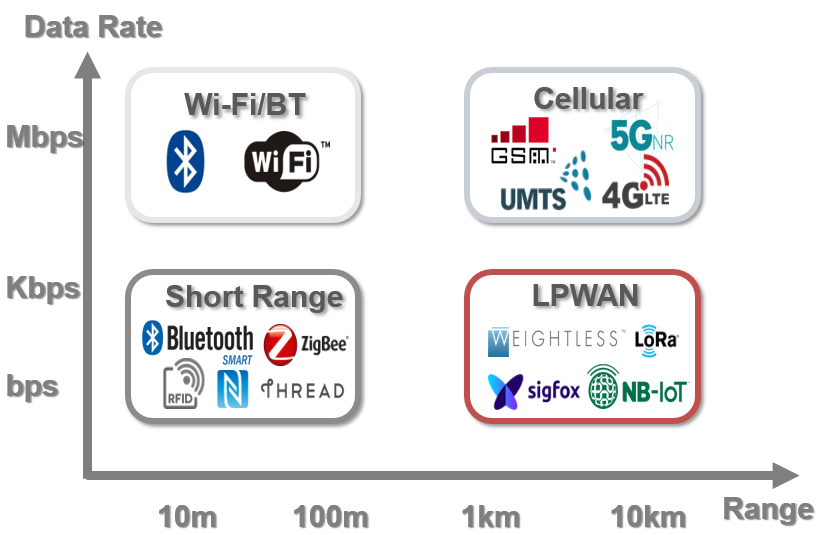

Having studied the modulation and demodulation techniques introduced earlier, readers can now begin to understand how the network protocols we commonly use are constructed from the ground up. What remains is to implement various wireless transmission protocols required in IoT scenarios based on this series of underlying technologies.

According to differing application requirements in IoT, wireless protocols used in IoT can be broadly categorized into four classes—classified primarily by transmission energy consumption and communication distance:

- **Class 1: Long-range, high-rate protocols**  
  Representative examples include cellular network technologies such as 3G, 4G, and 5G. These constitute the mainstream mobile communication technologies deployed today.

- **Class 2: Short-range, high-rate protocols**  
  Examples include Wi-Fi and Bluetooth. These operate over distances ranging from tens to hundreds of meters and are widely adopted in home environments and everyday applications. The first two classes represent the most commonly used network protocols for general users and align well with the primary characteristics and requirements of traditional networking applications.

- **Class 3: Short-range, low-power protocols**  
  Examples include ZigBee, RFID, and Bluetooth Low Energy (BLE)—technologies that emerged recently in the context of traditional IoT deployments. They provide short-range, low-data-rate communication.

- **Class 4: Long-range, low-power protocols**  
  The first three classes generally require relatively high signal-to-noise ratios (SNR) and exhibit limited penetration through physical obstructions, making them unsuitable for long-range, low-power communication in complex environments. Low-Power Wide-Area Network (LPWAN) technologies fill this technological gap: LPWAN enables long-distance transmission (e.g., several kilometers to tens of kilometers) at extremely low power consumption and supports reliable communication even under extremely low SNR conditions.

In IoT communications, communication distance, data rate, and power consumption form an “impossible triangle”: simultaneously optimizing all three is fundamentally challenging. Practical system design therefore involves trade-offs based on application requirements—for instance, Wi-Fi prioritizes high data rates while relaxing constraints on communication distance and power consumption. Similarly, cellular technologies used in smartphones prioritize communication distance and data rate, accepting higher power consumption.

Thus, the underlying technologies—and their inherent limitations—remain unchanged. On one hand, researchers and engineers continue developing new wireless communication technologies tailored to diverse application scenarios (e.g., Wi-Fi, Bluetooth, 5G); on the other hand, they strive to push existing technologies toward their theoretical limits.

Detailed descriptions of Wi-Fi and cellular network protocols are widely available in numerous textbooks; hence, this book will not reiterate them. Instead, this chapter focuses on LoRa and RFID protocols.

# Low-Power Wide-Area Networks (LPWAN)

As previously discussed, Wi-Fi serves short-range, high-bandwidth applications; BLE and ZigBee serve short-range, low-bandwidth applications. Existing wireless technologies collectively provide foundational connectivity solutions for diverse application scenarios.

Earlier, we identified three main categories of protocols:

- **Class 1**: Long-range, high-rate protocols—exemplified by cellular technologies such as 3G, 4G, and 5G—the standard technologies underpinning modern mobile communications.
- **Class 2**: Short-range, high-rate protocols—such as Wi-Fi and Bluetooth—operating over distances of tens to hundreds of meters, predominantly deployed in residential and daily-use contexts. These two classes represent the most frequently encountered network protocols for end users and satisfy the principal features and requirements of conventional network applications.
- **Class 3**: Short-range, low-power protocols—such as ZigBee, RFID, and BLE—widely adopted in traditional IoT systems. Collectively, these three classes demand relatively high SNR and offer limited obstacle penetration, rendering them incapable of supporting long-range, low-power communication in complex environments. LPWAN technologies bridge this gap: LPWAN achieves long-distance transmission (e.g., several kilometers to tens of kilometers) at ultra-low power consumption and maintains operational capability even at extremely low SNR.

LPWAN effectively addresses deficiencies in existing IoT connectivity methods, forming a critical infrastructure for large-scale IoT deployment. Consequently, LPWAN has attracted extensive attention both domestically and internationally and has become a frontier area of research and practical application.

LPWAN (Low-Power Wide-Area Network) refers to a class of networks characterized by ultra-low power consumption, long communication range, and massive device connectivity—ideally suited for the “Internet of Everything” vision of IoT. LPWAN is not a single technology but rather an umbrella term encompassing a family of diverse low-power wide-area networking technologies, as illustrated below. Among them, LoRa employs spread-spectrum modulation, whereas NB-IoT utilizes narrowband modulation—two representative LPWAN technologies.

Figure. Overview of LPWAN Technologies

Figure. Classification of Wireless Technologies

The above figure compares wireless communication technologies along two dimensions: data rate and communication range. It is evident that LPWAN fills a critical gap left by conventional communication technologies (e.g., Wi-Fi, Bluetooth, 4G/5G), namely, long communication range, low energy consumption, and low data rate.

Although LPWAN offers relatively low data rates, it still satisfies the communication requirements of most IoT applications. Its ultra-low power consumption is precisely why it has gained widespread adoption.

In early research, three primary technologies provided data transmission services for IoT systems:

- **Short-range wireless networks**, represented by Bluetooth, ZigBee, and Z-Wave. These technologies impose low power requirements but suffer from limited coverage and constrained data rates—making them suitable only for short-range, low-bandwidth applications.
- **Traditional wireless local area networks (WLANs)**, governed by the IEEE 802.11 protocol suite—most notably, the widely used Wi-Fi standard. These typically cover short ranges (tens to hundreds of meters), mainly indoors or within homes, and suit high-bandwidth, short-range applications.
- **Cellular networks**, including GSM and LTE. These support long-range, high-bandwidth communication and are ideal for bandwidth-intensive or mobile applications.

To address the shortcomings of the above technologies in concrete IoT deployments, Low-Power Wide-Area Networks (LPWAN) have evolved as a connectivity solution optimized for large-scale IoT applications. LPWAN combines the low-power advantage of short-range wireless networks with the extensive coverage of cellular networks—offering broad geographical reach and minimal energy consumption.

Therefore, LPWAN represents the optimal connectivity choice for low-power IoT devices distributed across wide geographic areas. In LPWAN deployments, such devices may be arbitrarily placed or freely mobile, enabling diverse smart-city applications—including smart metering, home automation, wearable electronics, logistics tracking, and environmental monitoring. These applications involve infrequent exchanges of small data volumes.

LPWAN application domains extend beyond smart transportation, industrial plants, agriculture, and mining. Due to unique design features absent in conventional cellular or short-range wireless technologies—e.g., lower power consumption than cellular networks and broader coverage than short-range wireless—LPWAN typically operates reliably at significantly lower SNR, thereby enabling robust connectivity even in complex physical environments.

Existing LPWAN technologies can be classified, according to operating frequency bands, into two major categories: licensed-band and unlicensed-band technologies.

- **Licensed-band technologies**, led by the 3rd Generation Partnership Project (3GPP), include NB-IoT (Narrowband IoT). NB-IoT leverages existing cellular infrastructure hardware, requiring only software/firmware upgrades. Primary investment comes from telecom operators and associated equipment vendors.
- **Unlicensed-band technologies**, by contrast, feature rapid proliferation across non-telecom ICT vendors. Key representatives include LoRa and SigFox, both operating in the ISM (Industrial, Scientific, and Medical) band—a globally designated spectrum open for industrial, scientific, and medical use without licensing or fees. Deployment requires only compliance with regulatory emission power limits (typically <1 W) and avoidance of interference with other bands.

## LoRa

LoRa stands for *Long Range Communication*. Narrowly defined, LoRa denotes a physical-layer modulation scheme—a chirp spread-spectrum (CSS) technique developed by Semtech Corporation. It achieves a receiver sensitivity of −148 dBm, trading low data rates (0.3–50 kbps) for extended communication range (up to 3 km in urban settings, 15 km in suburban/rural areas) and ultra-low power consumption (battery-powered nodes can operate for up to 10 years under specific conditions).

From a systems perspective, LoRa also refers to a network architecture comprising end-nodes, gateways, network servers, and application servers. LoRa defines functional roles and responsibilities of each component and specifies how data flows and aggregates throughout the system.

From an application standpoint, LoRa delivers a low-cost, low-power, long-range data transmission service for IoT applications. For example, using only 10 mW RF output power, LoRa supports line-of-sight transmission exceeding 25 km—enabling numerous wide-area, low-power IoT deployments.

The remainder of this section introduces LoRa top-down, covering its applications, system architecture, and physical-layer modulation techniques.

It should be noted that research on LoRa has grown substantially. Many studies—even peer-reviewed papers—claim to “use LoRa” or “be LoRa-based,” yet often incorporate only minor aspects of LoRa. Some merely adopt CSS modulation; others may simply employ linearly frequency-ramped signals (e.g., FMCW-based works) and loosely associate themselves with LoRa. None of these qualify as implementations of the canonical LoRa protocol.

## LoRa Applications

As a widely deployed LPWAN technology, LoRa provides a reliable connectivity solution for low-power IoT devices.

As shown in the figure below, compared with traditional WLANs such as Wi-Fi, Bluetooth, and ZigBee, LoRa achieves significantly longer communication distances—effectively expanding network coverage. Compared with cellular networks, LoRa incurs substantially lower hardware deployment costs and enables much longer node lifetimes: individual LoRa nodes can operate continuously for several years on battery power alone. LoRa’s defining attributes—low data rate, long range, and low power consumption—make it especially well-suited for communication with outdoor sensors and other IoT devices.

Figure. Comparison of LPWAN with Other Wireless Communication Technologies

Given LoRa’s substantial advantages in coverage distance and deployment cost, large-scale LoRa deployments have proliferated globally in recent years. Applications span smart metering (e.g., water and electricity meters), smart cities, intelligent transportation data acquisition, and wildlife monitoring. For instance, integrating LoRa communication modules with conventional water-quality sensors enables remote monitoring of drinking-water quality over distances of tens of kilometers during transport. In the Netherlands’ KPN project, engineers deployed LoRa gateways extensively to achieve full LoRa network coverage, providing communication support for smart transportation, precision agriculture, and intelligent street lighting.

## LoRa Architecture

The prevailing LoRa architecture comprises end-nodes, gateways, and servers, as illustrated below.

Communication between LoRa end-nodes and gateways occurs via single-hop direct links. At the physical layer, this link uses Chirp Spread Spectrum (CSS) modulation; at the MAC layer, LoRaWAN is typically employed. We will detail the CSS modulation mechanism later.

Upon receiving a packet, the gateway decodes the signal and forwards the decoded payload to the network server via conventional TCP/IP. Interactions between the network server and gateways still adhere to the LoRaWAN protocol.

The network server aggregates data from multiple gateways, filters duplicate packets, performs security checks, and routes payloads to appropriate application servers based on content—using TCP/IP and SSL for transport and encryption.

Figure. LoRa Network Architecture

## LoRaWAN

Recall that LoRa end-nodes transmit data to LoRa gateways primarily using CSS modulation. In practice, many end-nodes concurrently transmit to the same gateway. As discussed earlier, coordinating such multi-access transmissions necessitates a MAC protocol. In LoRa networks, the predominant MAC protocol is the open-source LoRaWAN.

LoRaWAN is a MAC-layer protocol proposed by the LoRa Alliance atop LoRa’s physical-layer encoding technology and maintained by the alliance. Its initial specification (v1.0) was released in June 2015. LoRaWAN defines connection standards between end-nodes and gateways, and between gateways and servers, establishing LoRa’s star-topology network structure. Constrained by end-node cost and energy budgets, current LoRaWAN implementations rely almost exclusively on pure ALOHA: nodes transmit without prior carrier sensing—i.e., CSMA/CA is not used—and instead select random transmission times.

> Consider: Why was this design chosen? What consequences does it entail?

1) LoRaWAN’s simplicity reduces node energy consumption, extending operational lifetime.  
2) Carrier sensing is technically challenging for LoRa signals due to their extremely low SNR. Traditional carrier sensing relies on signal strength detection—but LoRa signals may reside *below* the noise floor, rendering them undetectable and thus precluding effective collision avoidance. Recent work by Prof. Mo Li’s group at Nanyang Technological University aims to develop carrier-sensing–based MAC protocols for LoRa networks—readers are encouraged to follow their progress.  
3) Given LoRa’s large coverage radius, dense node deployments are common. Employing CSMA/CA would severely degrade network efficiency—this can be verified analytically. Moreover, hidden-terminal and exposed-terminal effects would further impair performance.  

Because LoRaWAN lacks sophisticated collision-avoidance mechanisms, packet collisions—especially in large-scale networks—are inevitable. To enable practical deployment, this issue must be addressed. Our research team approached it from an alternative angle: *Can colliding packets still be decoded?* This led to our work on concurrent decoding of LoRa packets [2–5], which we welcome discussion on.

> Why is CSMA/CA inefficient in LoRa networks?

LoRaWAN defines the communication protocol and system architecture, and manages all devices’ operating frequencies, data rates, and transmission power.

Under LoRaWAN control, all network devices operate asynchronously and transmit only when data is available.

For diverse application scenarios, LoRaWAN defines three end-node operation classes: Class A (ALOHA), Class B (Beacon), and Class C (Continuously Listening):

- **Class A** provides low-power uplink communication. Nodes in Class A may initiate uplink transmissions at any time and open exactly two downlink receive windows immediately after each uplink transmission—during which they listen for acknowledgments (ACKs) from the gateway. Gateways cannot initiate connections to Class A nodes; when idle, nodes enter deep sleep—making Class A the most energy-efficient mode.  
- **Class B** enables periodic synchronization between nodes and gateways. Gateways periodically broadcast beacon frames to maintain time alignment between nodes and gateways.  
- **Class C** provides continuous bidirectional connectivity: nodes remain perpetually awake, resulting in the highest power consumption.

Among these, Class A is mandatory for all LoRa networks and is the most widely used. Their design reflects a pragmatic balance among flexibility, availability, and energy efficiency: Class A maximizes energy savings but sacrifices flexibility (e.g., downlink traffic depends entirely on uplink timing); Class C consumes the most power but offers maximum scheduling flexibility for both uplink and downlink.

Figure. LoRaWAN: Class A, B, and C

## References
1. https://lora-alliance.org/about-lorawan/  
2. Shuai Tong, Zilin Shen, Yunhao Liu, Jiliang Wang. "Combating Link Dynamics for Reliable LoRa Connection in Urban Settings", ACM MobiCom 2021.  
3. Zhenqiang Xu, Pengjin Xie, Jiliang Wang. "Pyramid: Real-Time LoRa Collision Decoding with Peak Tracking", IEEE INFOCOM 2021.  
4. Shuai Tong, Jiliang Wang, Yunhao Liu. "Combating Packet Collisions Using Non-Stationary Signal Scaling in LPWANs", ACM MOBISYS 2020.  
5. Zhenqiang Xu, Shuai Tong, Pengjin Xie, Jiliang Wang. "FlipLoRa: Resolving Collisions with Up-Down Quasi-Orthogonality", IEEE SECON 2020.  
6. Shuai Tong, Zhenqiang Xu, Jiliang Wang. "CoLoRa: Enable Multi-Packet Reception in LoRa", IEEE INFOCOM 2020.