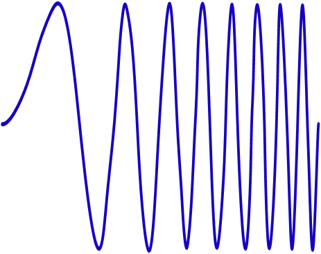
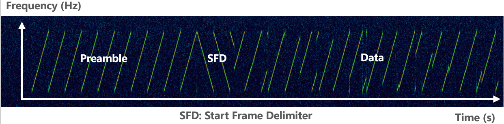
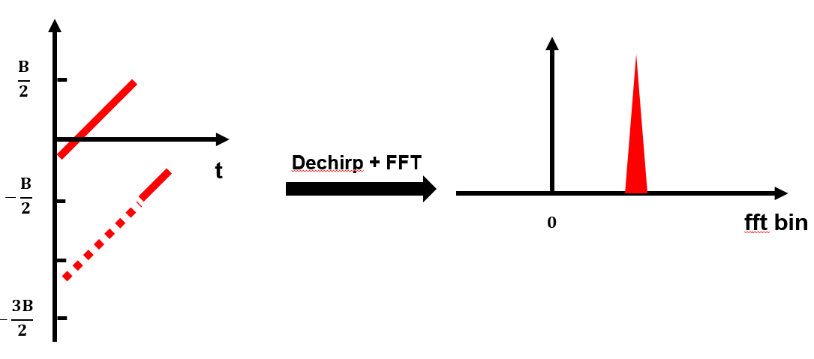
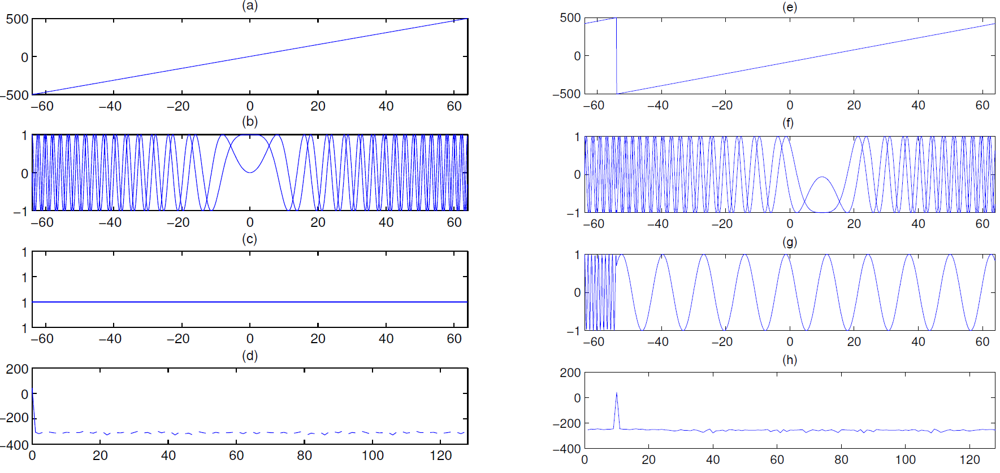

# LoRa Communication

In this section, we introduce the fundamental principles of LoRa communication—including modulation, demodulation, encoding, and decoding—with emphasis on physical-layer protocol analysis. Finally, we demonstrate LoRa communication using acoustic waves as the transmission medium. For higher-layer protocols (e.g., LoRaWAN), numerous external resources and open-source implementations are available for further study [1][2]. Unless otherwise specified, “LoRa” in the following discussion refers exclusively to the LoRa physical layer. Building upon the previously covered concepts of modulation and demodulation, readers will deepen their understanding of IoT communication.

It should be noted that the LoRa physical layer is a proprietary commercial protocol; its complete specification has not been publicly disclosed. Consequently, existing LoRa implementations [3][4][5] are largely based on reverse engineering. Moreover, many of these implementations—including those used in academic research—exhibit suboptimal performance. To address this, we have conducted rigorous, verifiable reverse engineering of LoRa and open-sourced two complete, high-fidelity codebases. Our implementations achieve performance and coding/decoding capabilities comparable to commercial LoRa chips.

The MATLAB version is intended for prototyping and offline operation, while the C++ implementation built on the GNU Radio platform delivers real-time, high-performance LoRa processing. We hope these two repositories will significantly aid learning and research into LoRa. In the future, we plan to open-source an FPGA-based hardware implementation of LoRa encoding and decoding.

MATLAB version LoRaPHY: [https://github.com/jkadbear/LoRaPHY](https://github.com/jkadbear/LoRaPHY)  
GNU Radio version gr-lora: [https://github.com/jkadbear/gr-lora](https://github.com/jkadbear/gr-lora)

**Related paper introduction in** [7]: Zhenqiang Xu, Pengjin Xie, Jiliang Wang. "Pyramid: Real-Time LoRa Collision Decoding with Peak Tracking", IEEE INFOCOM 2021.

Before diving into LoRa, please follow along to first grasp its core principles. Then, we will present a complete LoRa communication system implemented over acoustic waves—offering an intuitive, hands-on illustration. With this foundation, you can proceed to explore real-world LoRa communication using the provided open-source code.

> While studying LoRa, please pay special attention to *how its design enables long-range, low-power transmission*. This aspect is frequently overlooked in current research—leading many works claiming to be “LoRa-based” to completely lose LoRa’s defining characteristics.

## LoRa Modulation and Demodulation

This section introduces LoRa modulation and demodulation—the process of converting between physical waveforms and bit-level data.

LoRa employs Chirp Spread Spectrum (CSS) linear frequency-sweep modulation, wherein the instantaneous frequency sweeps linearly across the entire bandwidth. This grants strong interference resilience and robustness against multipath fading and Doppler effects. The fundamental communication unit in LoRa is the *linear chirp*: a signal whose frequency increases (or decreases) linearly with time. A chirp with frequency increasing over time is called an *upchirp*; one with decreasing frequency is a *downchirp*. The following two figures illustrate an upchirp in the time domain and time–frequency domain, respectively:

<center>

</center>
<center>
<div style="color:orange; border-bottom: 1px solid #d9d9d9;
display: inline-block;
color: #999;
padding: 2px;">Fig. Time-domain chirp waveform. Horizontal axis: time; vertical axis: signal amplitude.</div>
</center>

<!-- <center>

</center>
<center>
<div style="color:orange; border-bottom: 1px solid #d9d9d9;
display: inline-block;
color: #999;
padding: 2px;">Fig. Time–frequency representation of a chirp. Horizontal axis: time; vertical axis: frequency.</div>
</center> -->

<center>

</center>
<center>
<div style="color:orange; border-bottom: 1px solid #d9d9d9;
display: inline-block;
color: #999;
padding: 2px;">Fig. Time–frequency representation of an upchirp. Horizontal axis: time; vertical axis: frequency.</div>
</center>

How does a chirp encode data? LoRa encodes information by cyclically shifting the chirp in the frequency domain: different starting frequencies represent distinct data symbols. As shown below, dividing the bandwidth *B* into four equal segments defines four possible starting frequencies, corresponding to the bit patterns `00`, `01`, `10`, and `11`. The chirp sweeping from the lowest to the highest frequency—as depicted in Fig. (a)—is termed the *basic upchirp*. Thus, at the receiver, determining the starting frequency directly yields the encoded bit pattern.

<center>

</center>
<center>
<div style="color:orange; border-bottom: 1px solid #d9d9d9;
display: inline-block;
color: #999;
padding: 2px;">Fig. LoRa cyclic frequency-shift encoding. When SF = 2, four symbols encode `00`, `01`, `10`, and `11`.</div>
</center>

LoRa defines a parameter *SF* (Spreading Factor), defined as  

$$ 
2^{SF} = B \cdot T.
$$

Given bandwidth *B*, a larger *SF* implies a longer chirp duration *T*.  
*SF* controls the trade-off between data rate and receiver sensitivity: larger *SF* yields lower data rates but supports longer communication distances. Typically, the number of possible starting frequencies per chirp is $2^{SF}$.

When receiving a LoRa signal using a software-defined radio (SDR) and visualizing its time–frequency spectrogram, it appears approximately as follows:

<center>

</center>
<center>
<div style="color:orange; border-bottom: 1px solid #d9d9d9;
display: inline-block;
color: #999;
padding: 2px;">Fig. Time–frequency spectrogram of a LoRa packet.</div>
</center>

A complete LoRa packet comprises three parts: preamble, SFD (Start Frame Delimiter), and data payload. The preamble consists of 6–65,535 basic upchirps plus two additional chirps identifying the network ID. Next comes 2.25 basic downchirps serving as the SFD, marking the start of the data segment. The subsequent data segment contains chirps encoding the user data.

LoRa demodulation essentially recovers the chirp’s starting frequency. The standard approach is to multiply the received baseband upchirp signal pointwise with a downchirp—a process known as *dechirping*. Dechirping concentrates the chirp’s energy into a single frequency bin and is one key reason for LoRa’s noise immunity and long-range capability.

After dechirping, performing an FFT (Fast Fourier Transform) on the resulting signal yields a prominent peak in the frequency domain; the index of this peak corresponds to the starting frequency, thereby yielding $SF$ bits. For an upchirp sampled at a rate exceeding the bandwidth *B*, two peaks appear; summing them coherently enhances peak height and improves estimation accuracy. The next two figures illustrate the demodulation process for basic and non-basic upchirps, respectively.

<center>

</center>
<center>
<div style="color:orange; border-bottom: 1px solid #d9d9d9;
display: inline-block;
color: #999;
padding: 2px;">Fig. Demodulating a basic upchirp.</div>
</center>

<center>

</center>
<center>
<div style="color:orange; border-bottom: 1px solid #d9d9d9;
display: inline-block;
color: #999;
padding: 2px;">Fig. Demodulating a non-basic upchirp.</div>
</center>

We now formalize the above process mathematically.

An upchirp starts at the lowest frequency and linearly increases to the highest frequency over time. Conversely, a downchirp starts at the highest frequency and linearly decreases to the lowest. The difference between highest and lowest frequencies equals LoRa’s bandwidth $B$. Let the lowest frequency of the basic upchirp be $f_0=-\frac{B}{2}$, the highest frequency be $f_1=\frac{B}{2}$, and the chirp duration be $T$. Its instantaneous frequency is then $f(t)=f_0+kt$, where $k=\frac{BW}{T}$ denotes the sweep rate. Integrating this linear frequency over time yields a quadratic phase term $\phi(t) = 2\pi (f_0 t + \frac{1}{2}kt^2)$. Hence, the basic upchirp is expressed as:

$$
C(t)=e^{j2\pi(f_0+\frac{1}{2}kt) t}
\tag{1}
$$

> Reflection: Why does the frequency expression contain negative values? What is their physical meaning?

To embed data, LoRa first multiplies the basic upchirp by a fixed-frequency offset component, yielding a shifted signal $C(t)e^{j2\pi \Delta ft}$. Subsequently, all spectral components above $f_1$ are cyclically frequency-shifted down to $f_0$—as illustrated in Fig. (e). Defining $2^{SF}$ distinct offset frequencies allows encoding up to $SF$ bits.

In demodulation, dechirping and FFT are performed. For each received upchirp symbol in the packet, LoRa multiplies it with the basic downchirp. Analogous to the upchirp, the basic downchirp is expressed as:

$$
C^*(t)=e^{j2\pi(f_1-\frac{1}{2}kt) t}
$$

When $f_0 = -f_1$, $C^*(t)$ is the complex conjugate of $C(t)$, so their product is a pure-tone signal whose frequency equals the encoded chirp’s frequency offset:

$$
C^*(t)\cdot C(t)e^{j2\pi \Delta ft}=e^{j2\pi \Delta ft}
$$

Applying FFT to $e^{j2\pi \Delta ft}$ transforms the time-domain signal into a frequency-domain peak; the bin index of this peak directly indicates the encoded data.

The complete LoRa demodulation flow is illustrated below, showing both basic and non-basic upchirp cases. Row 1: time–frequency spectrogram; Row 2: time–amplitude waveform; Row 3: time–amplitude waveform after multiplication with downchirp; Row 4: FFT magnitude spectrum. Note the peak at bin 0 in the left column.

<center> 

</center>
<center>
<div style="color:orange; border-bottom: 1px solid #d9d9d9;
display: inline-block;
color: #999;
padding: 2px;">Fig. LoRa demodulation flow.</div>
</center>

Next, we demonstrate LoRa modulation signal generation via a concrete MATLAB example:

At the physical layer, LoRa modulates all signals into chirps. MATLAB’s built-in `chirp()` function can generate chirp waveforms directly, or one may manually construct the time-varying phase according to Eq. (1). The following code shows how to manually construct the chirp phase based on LoRa PHY parameters:

```matlab
function s = chirp(SF, BW, Fs)
    T = 2^SF/BW;        % Chirp duration
    t = 0:1/Fs:T;       % Sampling instants
    k = BW / T;         % Sweep rate (linear)
    phase = 2*pi*(-BW/2 + 0.5*k*t) .* t;      % Time-varying chirp phase
    s = cos(phase);
end
```

LoRa encodes data by applying cyclic frequency shifts to the chirp waveform. Note that the chirp generated above is real-valued; typically, baseband signals are represented in complex form. The following MATLAB code generates a modulated chirp signal:

```matlab
function symb = chirp_gen(code_word, SF, BW, Fs)
    
    nsamp = Fs * 2^SF / BW;        % Number of samples per chirp
    t = (0:nsamp-1)/Fs;            % Time vector for one chirp
    
    % I/Q traces
    f0 = -BW/2; % Start frequency
    f1 = BW/2;  % End frequency
    chirpI = chirp(SF, BW, Fs);
    chirpQ = -chirpI;
    mchirp = complex(chirpI, chirpQ);
    mchirp = repmat(mchirp,1,2);
    clear chirpI chirpQ

    % Frequency shift for encoding
    time_shift = round((2^SF - code_word) / 2^SF * nsamp);
    symb = mchirp(time_shift+(1:nsamp));
end
```

During LoRa signal demodulation, the receiver first performs dechirping—converting the time-varying-frequency chirp into a constant-frequency tone. Then, an FFT concentrates the signal energy in the frequency domain, producing a sharp spectral peak. The following code demonstrates the dechirping and FFT steps:

```matlab
function [fft_res,freq_pwr] = chirp_dchirp_fft(symb, nfft, SF, BW, Fs)

    % Parameters
    DEBUG = true;         % Debug flag
    dn_chirp = conj(chirp_gen(0, SF, BW, Fs))
    
    target = zeros(1, numel(dn_chirp));
    sig_ed = numel(target);
    if (sig_ed > numel(symb))
        sig_ed = numel(symb);
    end
    target(1:sig_ed) = symb(1:sig_ed);
    
    % Dechirp
    de_samples = target .* dn_chirp;
    
    if DEBUG
        fprintf('\n [de-chirp & FFT] init phase %.2f', angle(de_samples(100)));
        figure; plot(real(de_samples)); title('de-chirp & FFT');
    end

    % FFT over first chirp length    
    fft_res = fft(de_samples, nfft);
    
    freq_pwr = abs(fft_res);
end
```

Because cyclic frequency shifting may produce a starting frequency equal to the original minus *BW*, when the sampling rate exceeds *BW*, two non-overlapping spectral peaks arise—one at the original frequency $f_0$ and another at $Fs-BW+f_0$. Therefore, if the receiver’s sampling rate exceeds *BW*, the two peaks must be coherently summed in the frequency domain to concentrate the full chirp energy. To maximize summation gain, we search over all possible relative phase offsets between the two peaks and select the one yielding the largest resultant peak magnitude.

```matlab
function out_rst = chirp_comp_alias(rz, over_rate)
    % over_rate = Fs / BW;
    nfft = numel(rz);
    target_nfft = round(nfft / over_rate);
    cut1 = rz(1:target_nfft);
    cut2 = rz(end-target_nfft+1:end);
    
    comp = 0;
    mx_pk = -1;
    step = 1/16;
    for i = 0:step:1-step            
        tmp = cut1 + cut2 * exp(1i*2*pi*i);
        if max(abs(tmp)) > mx_pk
            mx_pk = max(abs(tmp));
            out_rst = tmp;
            comp = 2*pi*i;
        end
    end
end
```

To process a received signal, the receiver must first detect whether a LoRa preamble is present—indicating a valid LoRa packet. Commercial LoRa chips perform cross-correlation between the received signal and a reference preamble. Alternatively, packet detection can be achieved by segmenting the received signal, performing dechirping and FFT on each segment, and checking for consecutive, identical-frequency peaks.

```matlab
% Detect repeated peaks in datain
function [frame_sign, frame_st] = frame_detect2(datain, prb_len, SF, BW, Fs)
    nsamp = Fs * 2^SF / BW;
    
    % Data too short for preamble
    frame_sign = false;
    frame_st = -1;
    if length(datain) < prb_len * nsamp
        return;
    end
    
    nfft = nsamp * 4;
    nwins = floor(length(datain) / nsamp);
    res_ft = zeros(1, nwins);
    
    % Peak location per window
    for i = 1:nwins
        symb = datain((i-1)*nsamp + (1:nsamp));
        rz = chirp_dchirp_fft(symb, nfft);
        rz = chirp_comp_alias(rz, Fs/BW);
        
        fidx = (0:numel(rz)-1) / numel(rz) * 2^SF;
        [ma, I] = max(abs(rz));
        res_ft(i) = fidx(I);
        
        fprintf("window[%d] peak at %.1f, with height of %d\n", i, fidx(I), ma);
    end

    % Search for prb_len consecutive identical peaks
    for i = 1 : nwins-prb_len
        pks = res_ft(i:i+prb_len-1);
        disp(round(pks));
        if prb_len == 8
            [~, I] = max(abs(pks - mean(pks)));
            if I == 1 || I == 8
                tmp = pks;
            else
                tmp = [pks(1:I-1), pks(I+1:end)];
            end
        else
            tmp = pks;
        end
        if max(abs(tmp - mean(tmp))) < 2
            fprintf("frame detected!\n");
            frame_sign = true;
            frame_st = round(nsamp - mean(pks)/2^SF * nsamp) + (i-1)*nsamp;
            return;
        end
    end
end
```

Important notes:
1. The above demodulation method is only one of several possibilities. Some research works instead decode by observing frequency evolution in the time domain (consider what fundamental limitations such an approach might entail).
2. Many practical details remain unaddressed here—for instance, optimizing demodulation fidelity and precisely estimating frequency. Please refer to paper [6] and the codebase [LoRaPHY](https://github.com/jkadbear/LoRaPHY) for deeper exploration.

Next, we address signal synchronization—specifically, mitigating Carrier Frequency Offset (CFO) and Time Offset (TO). Suppose a transmitted chirp sweeps from 470 MHz to 470.5 MHz; at the receiver, the observed sweep may shift to 470 MHz + $\delta$ to 470.5 MHz + $\delta$ due to clock mismatches between transmitter and receiver—this is CFO. Additionally, misalignment between the receiver’s sampling window and the chirp symbol boundaries introduces TO. The figure below illustrates four demodulation outcomes under combinations of CFO presence/absence and window alignment/misalignment.

<center>

</center>
<center>
<div style="color:orange; border-bottom: 1px solid #d9d9d9;
display: inline-block;
color: #999;
padding: 2px;">Fig. CFO cancellation using up–down chirp alignment [6].</div>
</center>

> Based on the above figure, reflect on how to accurately estimate both TO and CFO simultaneously. If unfamiliar, consult our paper [6].

MATLAB implementation for time/frequency synchronization using upchirp/downchirp alignment ([TODO: finalize code]):

```matlab
function [outsig, t_offset,f_offset] = frame_sync(frame_sig, DEBUG, SF, BW, Fs)
    nsamp = Fs * 2^SF / BW;
    nfft = nsamp * 10;
    
    up_pre = frame_sig(5*nsamp + (1:nsamp));
    down_pre = frame_sig(11*nsamp + (1:nsamp));
    over_rate = Fs / BW;
    
    % Dechirp
    rz = chirp_dchirp_fft(up_pre,nfft);
    rz = chirp_comp_alias(rz, over_rate);
    up_az = abs(rz);
    [~,peak_i] = max(up_az);
    up_freq = peak_i/nfft * Fs;
    
    dcp = down_pre .* Utils.gen_symbol(0);
    rz = fft(dcp, nfft);
    rz = chirp_comp_alias(rz, over_rate);
    down_az = abs(rz);
    [~,peak_i] = max(down_az);
    down_freq = peak_i/nfft * Fs;
    
    if DEBUG
        fprintf('[up-chirp] freq = %.2f\n[down-chirp] freq = %.2f\n', up_freq, down_freq);
        figure;
        subplot(2,2,1);
            Utils.spectrum(up_pre);title('spectrum of up');
        subplot(2,2,2);
            Utils.spectrum(down_pre);title('spectrum of down');
            
        f_idx = (0:nfft-1)/nfft*Fs;
        subplot(2,2,3);
            plot(f_idx(1:numel(up_az)), up_az); title('FFT of up'); xlim([0 BW]);
        subplot(2,2,4);
            plot(f_idx(1:numel(down_az)), down_az); title('FFT of down'); xlim([0 BW]);
    end
    
    % Calculate CFO
    f_offset = (up_freq + down_freq) / 2;
    if abs(f_offset) > 50e3
        if f_offset < 0
            f_offset = f_offset + BW/2;
        else
            f_offset = f_offset - BW/2;
        end
    end
    
    % Calculate Time Offset
    t_offset = round((up_freq - f_offset) / BW * nsamp);
    if t_offset > nsamp/2
        t_offset = t_offset - nsamp;
    end
    
    sig_st = t_offset;
    if sig_st < 0
        frame_sig = frame_sig(-sig_st:end);
        sig_st = 0;
    end
    
    outsig = frame_sig(sig_st+1:end);
end
```

## LoRa Encoding and Decoding

This section covers LoRa encoding and decoding—the conversion between natural binary representations of starting frequencies and the actual packet data. This is a purely bit-to-bit transformation; thus, understanding one direction suffices for full comprehension.

Consider the decoding process: how do we convert FFT bin indices into decoded data? LoRa requires the following sequential steps:
1. Gray coding  
2. Diagonal interleaving  
3. Hamming decoding  
4. Data whitening  
5. Header decoding  
6. CRC checksum verification  

Below, we use [LoRaPHY](https://github.com/jkadbear/LoRaPHY) to demonstrate generating a standards-compliant LoRa signal:

```matlab
rf_freq = 470e6;    % Carrier frequency—used primarily for sampling frequency offset (SFO) correction; negligible in simulation
sf = 9;             % Spreading factor
bw = 125e3;         % Bandwidth: 125 kHz
fs = 1e6;           % Sampling rate: 1 MHz

phy = LoRaPHY(rf_freq, sf, bw, fs);
phy.has_header = 1;         % Explicit header mode
phy.cr = 1;                 % Code rate = 4/8 (1:4/5, 2:4/6, 3:4/7, 4:4/8)
phy.crc = 1;                % Enable payload CRC
phy.preamble_len = 8;       % Preamble: 8 basic upchirps

% Encode 4 bytes [1 2 3 4]
symbols = phy.encode((1:4)');
fprintf("[encode] symbols:\n");
disp(symbols);

% Baseband modulation
sig = phy.modulate(symbols);

% Plot spectrogram
LoRaPHY.spec(sig, fs, bw, sf);
```

<center>

</center>
<center>
<div style="color:orange; border-bottom: 1px solid #d9d9d9;
display: inline-block;
color: #999;
padding: 2px;">Fig. Generated LoRa packet.</div>
</center>

Now, let us decode the generated LoRa signal:

```matlab
% Demodulate
[symbols_d, cfo] = phy.demodulate(sig);
fprintf("[demodulate] symbols:\n");
disp(symbols_d);

% Decode
[data, checksum] = phy.decode(symbols_d);
fprintf("[decode] data:\n");
disp(data);
fprintf("[decode] checksum:\n");
disp(checksum);
```

Output:
> [demodulate] symbols: 481 177 417 33 97 73 249 401 181 91 299 379 9 2 1 1 1 64  
> [decode] data: 1 2 3 4 119 16  
> [decode] checksum: 119 16  

We now detail each step’s implementation.

**LoRa Symbol Encoding**

LoRa uses Chirp Spread Spectrum (CSS) encoding, where each transmitted symbol is a chirp. LoRa regulates data rate and communication range via the spreading factor *SF*, defined as  

$$2^{SF} = B\cdot T$$  

where *B* is the chirp’s sweep bandwidth and *T* is its duration.

A baseband basic upchirp is expressed as  

$$
e^{j2\pi \left(-\frac{B}{2}+\frac{B}{T}t\right)t}
$$  

Its frequency sweeps linearly from −*B*/2 to +*B*/2 over time *T*. LoRa encodes *SF* bits per symbol by cyclically shifting a basic upchirp.

**LoRa Physical-Layer Encoding Process**

- Hamming encoding (header: 2.5 effective bytes; CRC optional)  
- Byte-wise whitening  
- Byte-wise shuffling  
- Interleaving maps bytes to *SF*-bit symbols (8 bits/byte → *SF* bits/symbol)  
- Gray decoding (Gray code → binary code)  

The physical-layer header always occupies the first 8 chirp symbols.

**LoRa Physical-Layer Packet Symbol Count**

$$
 P + MP + 8 + \max\left(\left\lceil\frac{2n-SF+7+4CRC-5IH}{SF-2DE}\right\rceil\cdot \frac{4}{CR}, 0\right)
 $$

- *n*: number of payload bytes  
- *P*: number of preamble symbols (6–65,536; typically 6)  
- *MP*: mandatory preamble symbols (2 network-ID chirps + 2.25 conjugate symbols—for alignment; e.g., if all other symbols are upchirps, these 2.25 are downchirps)  
- *DE* = 1 (LowDataRateOptimize) if chirp period *T* = 2^SF/*B* > 16 ms; otherwise *DE* = 0  
- For *B* = 125 kHz: *DE* = 0 for *SF* = 7/8/9/10; *DE* = 1 for *SF* = 11/12  
- *CRC* = 1 indicates CRC validation enabled; *CRC* = 0 indicates disabled  
- *IH* = 0 indicates explicit header; *IH* = 1 indicates implicit header  
- *CR* ∈ $\frac{4}{5},\frac{4}{6},\frac{4}{7},\frac{4}{8}$  

**Derivation of Symbol Count Formula**

Let *PPM* = *SF* − 2*DE*, representing bits per symbol.

As explained earlier, excessively long chirps render LSBs unreliable; hence, subtract 2*DE*.  
Hamming encoding reflects the coding rate: e.g., 4/7 means using a (7,4) Hamming code.  
Encoding is block-wise: 4 symbols expand to $\frac{4}{CR}$ symbols.  
An *n*-byte payload contains 8*n* bits, requiring $\left\lceil\frac{8n}{4PPM}\right\rceil\cdot \frac{4}{CR}$ symbols—constituting the main term.  
Whitening, shuffling, and Gray coding preserve byte count and thus do not affect symbol count.  
Interleaving affects symbol count only when remaining bytes cannot fill $\frac{4}{CR}$ symbols.  
Remaining symbols originate from the header.

The LoRa header contains: 8 bits for packet length, 8 bits for header CRC, 3 bits for coding rate (*CR*), 1 bit indicating payload CRC presence, and 4 reserved bits—totaling 2.5 bytes.  
The protocol mandates that the 8 symbols immediately following the SFD encode the header, with *SF* − 2 effective bits per symbol and coding rate $\frac{4}{8}$.  
After header encoding, $\frac{4(SF - 2) - 2.5*8}{8} = 0.5SF - 3.5$ bytes remain available for payload data.  
If payload CRC is enabled, it consumes 2 bytes.  
Additionally, in implicit-header mode, the 2.5-byte header overhead is omitted (though the protocol still reserves these 8 symbols).  
Thus, excluding the initial 8 symbols, there remain $\max\left(\left\lceil\frac{8(n - 0.5SF + 3.5 + 2CRC - 2.5IH)}{4PPM}\right\rceil\cdot \frac{4}{CR}, 0\right)$ symbols (max prevents negative values).  
Adding preamble and SFD yields the final result.

**LoRa Physical-Layer Decoding Example**

Consider a demodulated LoRa packet with *SF* = 7, *CR* = 4/5, *BW* = 125 kHz, transmitting 4 bytes: `0x11`, `0x10`, `0x10`, `0x01`. After removing preamble, sync word, and SFD, the received data symbols are:  
`29 49 97 1 29 17 61 101 0 102 75 86 84 26 86 50 32 89`.  
These integers denote FFT bin indices (range $0\sim 2^{SF}-1$).

**Header Extraction**

First, LoRa applies an unusual operation (currently a bug in rpp0/gr-lora; awaiting whitening-bytes update?)—subtracting 1 modulo $2^{SF}$ from all values, yielding:  
`28 48 96 0 28 16 60 100 127 101 74 85 83 25 85 49 31 88`.

Header information resides in the first 8 values and uses *CR* = 4/8. Right-shifting each value by 2 bits (discarding LSBs) gives:  
`7 12 24 0 7 4 15 25`.  
Then apply Gray encoding (`BinaryToGray`): e.g., `7` in binary is `00000111`, so `7 ^ (7 >> 1)` = `00000111 ^ 00000011` = `00000100`. Repeat for all values.

```C
// https://en.wikipedia.org/wiki/Gray_code
/*
 * This function converts an unsigned binary
 * number to reflected binary Gray code.
 *
 * The operator >> is shift right. The operator ^ is exclusive or.
 */
unsigned int BinaryToGray(unsigned int num)
{
    return num ^ (num >> 1);
}

/*
 * This function converts a reflected binary
 * Gray code number to a binary number.
 * Each Gray code bit is exclusive-ored with all
 * more significant bits.
 */
unsigned int GrayToBinary(unsigned int num)
{
    unsigned int mask = num >> 1;
    while (mask != 0)
    {
        num = num ^ mask;
        mask = mask >> 1;
    }
    return num;
}
```

Since only 5 bits are effective per value, we obtain:  
`00100 01010 10100 00000 00100 00110 01000 10101`.  
Arrange these left-to-right into a 5×8 table ((*SF*−2) × 4/*CR*), with MSB at bottom. Then extract 8 bits diagonally—red, green, blue, orange, black—as shown. Note LSB-to-MSB ordering left-to-right, yielding:  
`00000000 10110100 10100011 00000000 11000110`. This is *deinterleaving*.


After obtaining 5 bytes, apply shuffling per permutation `(6, 1, 2, 3, 5, 4, 7, 8)`. Bit positions are numbered LSB=1 to MSB=8. This permutation fixes bits 5, 7, 8 and cyclically left-shifts the rest. E.g., for `<span style="color:red">1</span><span style="color:red">0</span>1<span style="color:red">1</span>0100`, red bits stay, black bits rotate left → `<span style="color:red">1</span><span style="color:red">0</span>0<span style="color:red">1</span>1001`. This is *deshuffling*.

Applying to all bytes yields:  
`00000000 10011001 10000111 00000000 11001100`.  
Next, *dewhitening*: XOR with a fixed sequence. During header decoding, this sequence is all zeros—so no effect. Append `00000000` to the header.

Finally, *CR* determination via Hamming decoding. Each byte contains 8 effective bits (4/*CR*), of which only 4 are data bits. How to extract them while leveraging Hamming’s error-correction capability? Given limited byte size, lookup-table decoding is feasible.

```matlab
hamming84_dec_gentab = [
    00, 00, 00, 00, 00, 00, 03, 03, 00, 00, 05, 05, 14, 14, 07, 07, ...
    00, 00, 09, 09, 02, 02, 07, 07, 04, 04, 07, 07, 07, 07, 07, 07, ...
    00, 00, 09, 09, 14, 14, 11, 11, 14, 14, 13, 13, 14, 14, 14, 14, ...
    09, 09, 09, 09, 10, 10, 09, 09, 12, 12, 09, 09, 14, 14, 07, 07, ...
    00, 00, 05, 05, 02, 02, 11, 11, 05, 05, 05, 05, 06, 06, 05, 05, ...
    02, 02, 01, 01, 02, 02, 02, 02, 12, 12, 05, 05, 02, 02, 07, 07, ...
    08, 08, 11, 11, 11, 11, 11, 11, 12, 12, 05, 05, 14, 14, 11, 11, ...
    12, 12, 09, 09, 02, 02, 11, 11, 12, 12, 12, 12, 12, 12, 15, 15, ...
    00, 00, 03, 03, 03, 03, 03, 03, 04, 04, 13, 13, 06, 06, 03, 03, ...
    04, 04, 01, 01, 10, 10, 03, 03, 04, 04, 04, 04, 04, 04, 07, 07, ...
    08, 08, 13, 13, 10, 10, 03, 03, 13, 13, 13, 13, 14, 14, 13, 13, ...
    10, 10, 09, 09, 10, 10, 10, 10, 04, 04, 13, 13, 10, 10, 15, 15, ...
    08, 08, 01, 01, 06, 06, 03, 03, 06, 06, 05, 05, 06, 06, 06, 06, ...
    01, 01, 01, 01, 02, 02, 01, 01, 04, 04, 01, 01, 06, 06, 15, 15, ...
    08, 08, 08, 08, 08, 08, 11, 11, 08, 08, 13, 13, 06, 06, 15, 15, ...
    08, 08, 01, 01, 10, 10, 15, 15, 12, 12, 15, 15, 15, 15, 15, 15];
```

E.g., `10011001` = decimal 153 → table entry 153 (0-indexed) = `04` (decimal) = `0100` (binary).

Thus, we obtain: `0000 0100 0011 0000 0110 0000`. This constitutes 2.5 effective bytes (the appended zero is padding), matching the full header content (larger *SF* leaves residual bytes for payload). Bit packing order: first 4 bits → upper nibble, last 4 bits → lower nibble. Aligning yields: `00000100 00110000 01100000`. Referencing the LoRa header structure:

```C
typedef struct __attribute__((__packed__)) loraphy_header {
    uint8_t length;           // Payload length in bytes
    uint8_t crc_msn : 4;      // Header CRC, most significant nibble
    uint8_t has_mac_crc : 1;  // Indicates presence of MAC-layer CRC
    uint8_t cr : 3;           // Coding rate used for this packet
    uint8_t crc_lsn : 4;      // Header CRC, least significant nibble
    uint8_t reserved : 4;     // Reserved bits
} loraphy_header_t;
```

Decoding yields: length = first byte `4`, *CR* = top 3 bits of second byte `001` → 4/5.

**Payload Decoding**

Payload decoding parallels header decoding, with key differences:
* Payload *CR* is determined by the header—in this example, 4/5  
* Unlike the header, payload symbols do not universally discard the two LSBs; instead, truncation occurs only when *T* = 2^SF/*B* > 16 ms  
* Payload whitening sequence differs from header’s  
* Payload bit packing order: first 4 bits → lower nibble, last 4 bits → upper nibble  
* Residual bits from header decoding may feed into payload decoding  

Note: For *CR* = 4/5 or 4/6, direct bit extraction replaces Hamming table lookup (4/7 corrects 1 bit; 4/5 and 4/6 detect errors only).

In this example, *CR* = 4/5. In `100<span style="color:red">1</span>1<span style="color:red">0</span><span style="color:red">0</span><span style="color:red">1</span>`, red bits (positions 1, 2, 3, 5) are data bits; others are parity.

Thus, payload decoding yields: `04 30 60 11 10 10 1 82 D3`, where `82 D3` is the payload CRC. Due to block-wise decoding, residual random bytes may appear.

Having understood the full decoding pipeline, we can engineer transmissions to yield desired symbols (though checksums remain uncontrollable). For *CR* = 4/5, the first 7 whitening bytes are `ff ff 2d ff 78 ff 30`. To transmit 4 bytes $x_i=x_i^8x_i^7x_i^6x_i^5x_i^4x_i^3x_i^2x_i^1$ $(i=1, 2, 3, 4)$, the interleaving table becomes:


where $y_i^j$ denotes parity bits for the high/low nibbles of byte $i$.

From this table, any of the first 4 symbols can be freely modified. E.g., to set the first payload symbol to `0`: subtract 1 → `1111111`, Gray-encode → `1000000`, assign to $x_4^1\overline{x_3^5}x_3^1\overline{x_2^5}x_2^1\overline{x_1^5}\overline{x_1^1}$, set $x_1^1=1, x_1^5=1, x_2^1=0, x_2^5=1, x_3^1=0, x_3^5=1, x_4^1=1$, and transmit `0x11`, `0x10`, `0x10`, `0x01`.

## LoRa Communication via Acoustic Waves

In this section, we implement LoRa communication over acoustic waves. We generate audio in MATLAB, play it via smartphone (transmission), record it using another smartphone (reception), and finally decode the recorded signal on a computer.

At the transmitter, raw data is first modulated into a baseband signal—a low-frequency waveform with limited propagation range. Achieving practical communication distance would impose stringent antenna requirements. Hence, the standard practice is to upconvert the baseband signal onto a high-frequency carrier—a process termed *upconversion*. The resulting RF signal propagates through a channel (e.g., air or water) and is captured by the receiver.

The receiver performs the inverse operations: *downconversion* to recover the baseband signal, followed by demodulation and decoding to retrieve the original data.

RF transmission typically requires dedicated transceivers. Here, we simulate this process acoustically—choosing sound because smartphones can readily play and record audio, enabling accessible experimentation.

<center>

</center>
<center>
<div style="color:orange; border-bottom: 1px solid #d9d9d9;
display: inline-block;
color: #999;
padding: 2px;">Fig. Communication flow.</div>
</center>

**Transmitter**

Due to smartphone sampling-rate constraints, signal bandwidth must be modest: here, *BW* = 2 kHz, *Fs* = 48 kHz, *SF* = 7 bits ⇒ $2^{SF}=128$ symbols.  
Next, generate chirps and baseband LoRa signals—encoding three `6`s, prefixed with zeros to extend signal duration and avoid missing the active portion during recording. Encoding implementation may vary.

```matlab
fc = 16e3;           % Carrier frequency—used for SFO correction; negligible at transmitter
sf = 7;              % Spreading factor
bw = 2e3;            % Bandwidth: 2 kHz
fs = 48e6;           % Sampling rate: 48 kHz
Nchirp = 2^sf/bw*fs; % Samples per chirp

phy = LoRaPHY(fc, sf, bw, fs);
phy.has_header = 1;         % Explicit header mode
phy.cr = 1;                 % Code rate = 4/8 (1:4/5, 2:4/6, 3:4/7, 4:4/8)
phy.crc = 1;                % Enable payload CRC
phy.preamble_len = 8;       % Preamble: 8 basic upchirps

% Encode three 6s
symbols = phy.encode([6, 6, 6]);
sig = phy.modulate(symbols);

zs = zeros(1, Nchirp*5);
chirp_sound = cat(2, zs, sig);      % Baseband signal
```

Then upconvert: multiply the baseband signal’s real part by a cosine carrier and its imaginary part by a sine carrier (with sign inversion), summing the results for the real-valued transmitted signal. Here, the carrier frequency is $f_c = 16$ kHz.

```matlab
t = (0:length(chirp_sound)-1)/fs;
car_chirp_sound = real(chirp_sound).*cos(2*pi*fc*t)+imag(chirp_sound).*sin(-2*pi*fc*t);
```

Note: Simulating RF, we use I/Q components represented as a complex signal—but the physical channel carries only the real part. Why?

Finally, save the generated signal as a `.wav` audio file for playback:

```matlab
audiowrite('chirpSound.wav', car_chirp_sound, fs, 'BitsPerSample', 16);
```

**Receiver**

Record using a smartphone, then decode the acquired `.wav` file. Use `audioread` to load data and sampling rate. WAV files are typically stereo; use only one channel.

```matlab
[recv_sound, fs] = audioread('chirpSound_recv.wav');
recv_sound = recv_sound(:,1);
```

Step 1: Bandpass filtering to suppress out-of-band noise. See the filtering chapter if unfamiliar.

```matlab
recv_sound_bf = BPassFilter(recv_sound, 18e3, 4e3, fs)
```

Step 2: Downconversion and low-pass filtering to extract the baseband signal. Revisit the filtering chapter if needed.

```matlab
%% Downconvert: extract low-frequency baseband from high-frequency signal
real_chirp_sound = recv_sound_bf.*cos(2*pi*fc*t);
imag_chirp_sound = recv_sound_bf.*sin(-2*pi*fc*t);
%% Low-pass filter
real_cs = BPassFilter(real_chirp_sound, 3e3, 2e3, fs);
imag_cs = BPassFilter(imag_chirp_sound, 3e3, 2e3, fs);
rec_chirp_sound = real_cs + 1j*imag_cs;
```

`BPassFilter` implementation:

```matlab
% Design bandpass filter using window method—optimized for isolating a single center frequency
% data: input signal; centerFre: center frequency; offsetFre: bandwidth; sampFre: sampling rate
function y = BPassFilter(data, centerFre, offsetFre, sampFre)
    % Design Type-I bandpass filter
    M = 0 ;    % Filter order (must be even)
    Ap = 0.82; % Passband ripple
    As = 45;   % Stopband attenuation
    Wp1 = 2*pi*(centerFre - offsetFre)/sampFre;  % Lower passband edge
    Wp2 = 2*pi*(centerFre + offsetFre)/sampFre;  % Upper passband edge

    % Rectangular window
    N = ceil(3.6*sampFre/offsetFre); % Filter order using rectangular window; 3dB cutoff at midpoint
    M = N - 1;
    M = mod(M,2) + M ; % Ensure Type-I (even-order)

    % Impulse response indices
    h = zeros(1,M+1);  % Initialize impulse response
    for k = 1:(M+1)
        if (( k -1 - 0.5*M)==0)
            h(k) = Wp2/pi - Wp1/pi;
        else
            h(k) = Wp2*sin(Wp2.*(k - 1 - 0.5*M))/(pi*(Wp2*(k -1 - 0.5*M))) - Wp1*sin(Wp1*(k - 1 - 0.5*M))/(pi*(Wp1*(k -1 - 0.5*M)));
        end
    end
    y = filter(h,1,data);
end
```

Step 3: Decoding. First, align the signal—locate the approximate interval containing the signal (optional due to preamble). Apply moving-window averaging to suppress transient energy spikes.

```matlab
A = movmean(abs(rec_chirp_sound), mwin);
thresh = (max(A) - min(A))/3 + min(A);
inds = find(A > thresh);  % Indices where signal exceeds threshold
cut_rec_cs = rec_chirp_sound(inds(1):(inds(end)+Nchirp));  % Extract signal segment

% Demodulate
[symbols_d, cfo] = phy.demodulate(cut_rec_cs);
fprintf("[demodulate] symbols:\n");
disp(symbols_d);

% Decode
[data, checksum] = phy.decode(symbols_d);
fprintf("[decode] data:\n");
disp(data);
fprintf("[decode] checksum:\n");
disp(checksum);
```

<!-- ### 4.1 Warm-up Experiment

**Experiment Content:**  
In this lab, run the provided code to experience LoRa encoding/decoding and acoustic communication.

**Procedure:**  
- Unzip course materials. Observe directory structure:


<center>
<div style="color:orange; border-bottom: 1px solid #d9d9d9;
display: inline-block;
color: #999;
padding: 2px;">Fig. Course materials.</div>
</center>

The `code` folder contains `genSound.m` (sound generation) and `anaSound.m` (sound analysis). The `receiver app` folder holds `music.apk` (Android app for sending/receiving audio). Pre-recorded audio files `m.wav` and `o.wav` are included.

- Generate sound: Open MATLAB, navigate to `code`, run `genSound.m`. A file `chirpSound.wav` appears—this is the LoRa chirp audio.

- Install `music.apk` and begin recording. This Android app’s interface is shown below.


<center>
<div style="color:orange; border-bottom: 1px solid #d9d9d9;
display: inline-block;
color: #999;
padding: 2px;">Fig. Application interface.</div>
</center>

Tap “Start Recording” to begin; tap “Stop Recording” to save the file (path shown below button).

- Transmit sound: Play `chirpSound.wav` on any device (phone/computer). `music.apk` can also play it, though native players suffice. “Chirp” is named for its birdcall-like sound—test it!

- Decode sound: Transfer the recorded audio to your computer, run `anaSound.m` in MATLAB to analyze and output decoded data. You should see `666`.


<center>
<div style="color:orange; border-bottom: 1px solid #d9d9d9;
display: inline-block;
color: #999;
padding: 2px;">Fig. Decoding result.</div>
</center>

Remember to update file paths. Two pre-recorded files are provided—you can decode them directly without transmission, but experiencing the full workflow is recommended. -->


<!--  - (1) Try generating chirp signals in MATLAB and plotting time/frequency-domain waveforms to verify correctness.

Hint: Use MATLAB’s built-in `chirp()` or the mathematical expression `2*pi*f*t + k*pi*t^2`.  
For plotting, refer to course-provided code examples.

  - (2) Try encoding data onto generated chirps, design a decoder, and validate functionality.

Hint: Follow LoRa’s cyclic frequency-shift encoding or devise your own scheme.  
Decoder code is available in course materials. -->

> Reflection  
> 1. Compare communication range and signal energy between sinusoidal and LoRa chirp audio signals.  
> 2. How can LoRa chirp signals be extended further? What optimization methods exist? Try implementing them.

## LoRa Network Deployment

Using real LoRa nodes and gateways, we can build a functional LoRa network.  
A LoRa network comprises three components: nodes, gateways, and servers. Thus, deployment involves implementing each component:

* Node application firmware—this textbook provides implementations for SX1278 and SX1268 platforms.  
* Gateway service.  
* LoRa server.

We now elaborate on each component.

- **Node Application Implementation**

    Reference code is available [here](https://github.com/Lora-net/LoRaMac-node). Clone locally using `git clone`; the code targets VS Code.

    First, configure the development environment: install CMake, GNU ARM Toolchain, and OpenOCD. Requirements are detailed [here](https://github.com/Lora-net/LoRaMac-node/blob/develop/Doc/development-environment.md).

    To adapt the code to custom hardware, modify hardware-dependent sections. Begin by creating a new board definition in the `boards` folder—named `Handsome` here. Required file structure is shown below. Hardware modifications focus on MCU and radio drivers; copy similar existing implementations. Crucially, `board-config.h` defines pin mappings.

    <center>
    
    </center>
    <center>
    <div style="color:orange; border-bottom: 1px solid #d9d9d9;
    display: inline-block;
    color: #999;
    padding: 2px;">Fig. Node code and application code directories.</div>
    </center>

    After defining the board, create a corresponding application under `app` (right panel above). Debugging begins with UART print statements. To compile, modify `CMakeLists.txt`—it governs build configuration. Locate or generate the appropriate `CMakeLists.txt`, referencing existing boards (e.g., add `Handsome` board similarly to `LoRaMote`).

   **Flashing the Firmware**

    1. Install flashing utility  

    Download the official STM32 flasher (modified) from http://download.thulpwan.top/stm32flash.zip ???, extract, and compile/install via `make && make install`. Verify with `stm32flash -h`.

    2. Flash the binary  

    Download http://download.thulpwan.top/abp01-sf12-4863-classA.bin and flash to node:

    ```bash
    stm32flash -w abp01-sf12-4863-classA.bin -v -g 0 /dev/tty.SLAB_USBtoUART
    ```

    `/dev/tty.SLAB_USBtoUART` is the Mac serial port; Linux uses `/dev/ttyUSB0`.

- **Gateway Service Deployment**

   Commercial gateways often include pre-installed LoRaWAN firmware. Alternatively, build your own gateway service. Gateway code comprises hardware control (`LoRa_gateway`) and packet forwarding (`packet_forwarder`).  
   Reference repositories: [LoRa_gateway](https://github.com/Lora-net/lora_gateway) and [packet_forwarder](https://github.com/Lora-net/packet_forwarder).

    Clone both, then compile each separately. This produces `./reset_lgw.sh` in `lora_gateway` and `lora_pkt_fwd` in `packet_forwarder/lora_pkt_fwd`. Run sequentially: `./reset_lgw.sh start`, then `./lora_pkt_fwd`.

    Critical configuration files: `global_conf.json` and `local_conf.json` in `packet_forwarder/lora_pkt_fwd`. These configure gateway parameters—especially enabling server discovery. `global_conf.json` sets frequency bands; `local_conf.json` configures cloud server addresses.  
    CN470 band allocation:

    Channel Group | Channel | Start Freq (MHz) | End Freq (MHz) |
    -|-|-|-
    | 0 | 0–7 | 470.3 | 471.7 |
    | 1 | 8–15 | 471.9 | 473.3 |
    | 2 | 16–23 | 473.5 | 474.9 |
    | 3 | 24–31 | 475.1 | 476.5 |
    | 4 | 32–39 | 476.7 | 478.1 |
    | 5 | 40–47 | 478.3 | 479.7 |
    | 6 | 48–55 | 479.9 | 481.3 |
    | 7 | 56–63 | 481.5 | 482.9 |
    | 8 | 64–71 | 483.1 | 484.5 |
    | 9 | 72–79 | 484.7 | 486.1 |
    | 10 | 80–87 | 486.3 | 487.7 |
    | 11 | 88–95 | 487.9 | 489.3 |

    In `ChannelsMask`, bytes read *left-to-right* correspond to *decreasing* channel frequencies. E.g., final `ChannelsMask` = `0x00FF` → Channel Group `10`; `0xFF00` → Channel Group `11`.  
    <mark>Note: The gateway may require multiple restarts to initialize successfully.</mark>

- **LoRa Server Deployment**

    Detailed setup instructions are available [here](https://www.loraserver.io/).  
    A LoRa server comprises three services: LoRa Gateway Bridge, LoRa Server, and LoRa Application Server.  
    Readers may use our lab’s hosted server: https://loraserver.thulpwan.top/.  
    Register, log in, create an application (select any service-profile; leave payload codec blank), and submit.  
    Then create a node: ensure `device EUI` is unique and matches your node firmware. Select `test-abp` for `device-profile`, disable frame-counter validation, and submit.  
    Enter node configuration—generate or manually specify keys (ensure uniqueness and consistency with node firmware). For simplicity, set the last four keys identically.  
    Launch node, gateway, and server. Messages from the ABP-configured node should appear on both gateway and server dashboards.  
    To verify reception, navigate to the LoRa Server dashboard, click any application, then click “Integration” on the third row. Create an HTTP integration—URLs may be identical or differentiated by IP/domain. Submit to receive uplink data in the application.

## References
1. https://github.com/Lora-net/LoRaMac-node  
2. https://github.com/brocaar/chirpstack-network-server  
3. https://github.com/rpp0/gr-lora  
4. https://github.com/BastilleResearch/gr-lora  
5. https://www.epfl.ch/labs/tcl/resources-and-sw/lora-phy  
6. Shuai Tong, Zilin Shen, Yunhao Liu, Jiliang Wang. "Combating Link Dynamics for Reliable LoRa Connection in Urban Settings", ACM MobiCom 2021.  
7. Zhenqiang Xu, Pengjin Xie, Jiliang Wang. "Pyramid: Real-Time LoRa Collision Decoding with Peak Tracking", IEEE INFOCOM 2021. [PDF code]  
8. Shuai Tong, Jiliang Wang, Yunhao Liu. "Combating Packet Collisions Using Non-Stationary Signal Scaling in LPWANs", ACM MOBISYS 2020. [PDF]  
9. Zhenqiang Xu, Shuai Tong, Pengjin Xie, Jiliang Wang, "FlipLoRa: Resolving Collisions with Up-Down Quasi-Orthogonality", IEEE SECON 2020  
10. Shuai Tong, Zhenqiang Xu, Jiliang Wang. "CoLoRa: Enable Multi-Packet Reception in LoRa", IEEE INFOCOM 2020. [PDF]  
11. Shuai Tong, Zilin Shen, Yunhao Liu, Jiliang Wang. "Combating Link Dynamics for Reliable LoRa Connection in Urban Settings", ACM MobiCom 2021.  
12. Jinyan Jiang, Zhenqiang Xu, Jiliang Wang. "Long-Range Ambient LoRa Backscatter with Parallel Decoding", ACM MobiCom 2021.